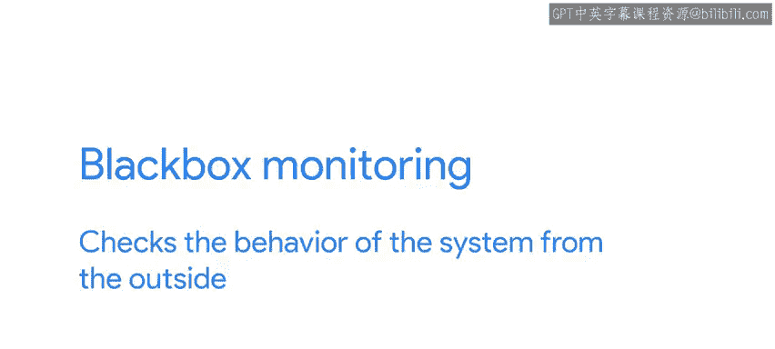

#  160：入门监控 📊


在本节课中，我们将要学习监控的基本概念、重要性以及如何为云服务设置有效的监控。我们将探讨需要收集哪些指标、如何收集它们，以及如何利用这些数据确保服务稳定运行。

---

正如我们在之前的视频中提到，一旦我们的服务在云端运行，我们需要确保服务不仅持续运行，而且行为符合预期，能够快速可靠地返回正确结果。确保这一切的关键在于建立良好的监控和告警规则。

在接下来的几节中，我们将概述监控和告警的概念与技术，并进行实际演示。让我们开始吧。

## 什么是监控？👀

要了解我们的服务表现如何，我们需要对其进行监控。监控让我们能够查看系统的历史和当前状态。

我们如何知道状态是什么？我们将检查一系列不同的**指标**。这些指标告诉我们服务是否按预期运行。虽然有些指标是通用的，例如实例使用了多少内存，但其他指标则特定于我们想要监控的服务。

## 关键监控指标 📈

以下是您需要关注的一些关键指标类型：

*   **通用指标**：例如 CPU 使用率、内存使用量、磁盘 I/O。这些指标反映了基础设施的健康状况。
*   **服务特定指标**：这些指标根据您的服务类型而有所不同。例如：
    *   对于**网站**，您需要检查 HTTP 响应码。例如，`404` 表示页面未找到，`5xx` 范围（如 `501` 或 `503`）的代码表示服务器端在处理请求时出错。
    *   对于**电子商务网站**，您会关心成功完成的交易数量与失败的交易数量。
    *   对于**邮件服务器**，您需要知道发送了多少封邮件以及有多少封邮件被卡住。

您需要根据想要监控的服务，确定所需的指标。

## 收集与存储指标 💾

上一节我们介绍了需要关注的指标类型，本节中我们来看看如何收集和处理这些指标。

一旦我们决定了要关心哪些指标，我们该如何处理它们？我们通常会将它们存储在**监控系统**中。

市场上有许多不同的监控系统。一些系统，如 **AWS CloudWatch**、**Google Cloud Monitoring** 或 **Azure Monitor**，由云提供商直接提供。其他系统，如 **Prometheus**、**Datadog** 或 **Nagios**，可以跨供应商使用。

将指标获取到监控系统有两种主要方式：

*   **拉取模型**：监控基础设施定期查询我们的服务以获取指标。Prometheus 是这种模型的典型代表。
*   **推送模型**：我们的服务需要定期连接到监控系统以发送指标。许多基于代理的监控工具采用这种方式。

## 使用仪表板分析数据 📊

无论我们如何将指标输入系统，我们都可以基于收集的数据创建**仪表板**。

这些仪表板显示指标随时间的变化趋势。我们可以查看单个特定指标的历史记录，将当前状态与上周或上个月进行比较。或者，我们可以同时查看两个或多个指标的进展，以检查一个指标的变化如何影响另一个指标。

例如，假设现在是周一早上，您注意到您的服务接收的流量比平时少得多。您可以查看过去几周的数据，看看周一早上是否总是流量较少，或者是否有某些故障导致您的服务无响应。

又或者，如果您发现过去几天实例使用的内存一直在增加，您可以检查这种增长是否伴随着另一个指标（如接收的请求数量或传输的数据量）的类似增加。这可以帮助您判断是存在需要修复的内存泄漏，还是仅仅是服务受欢迎程度增长的预期结果。

**专业提示**：您应该只存储您关心的指标，因为在系统中存储所有这些指标会占用空间，而存储空间是需要成本的。

## 白盒监控 vs. 黑盒监控 ⚫️⚪️

当我们从系统内部收集指标时，例如服务当前使用的存储空间量或处理请求所需的时间，这被称为**白盒监控**。白盒监控从内部检查系统的行为。我们知道我们想要跟踪的信息，并且我们负责使其可被跟踪。

例如，如果我们想跟踪对数据库进行了多少次查询，我们可能需要添加一个变量来进行计数。

```python
# 示例：简单的白盒监控计数器
query_count = 0
def execute_query(sql):
    global query_count
    query_count += 1  # 内部计数
    # ... 执行数据库查询 ...
```

相反，**黑盒监控**从外部检查系统的行为。这通常通过向服务发出请求，然后检查实际响应是否与预期响应匹配来完成。我们可以用它来进行非常简单的检查，以了解服务是否在线，并验证服务是否可以从您的网络外部响应；或者我们可以用它来查看世界不同地区的客户端从系统获得响应需要多长时间。

## 设置告警规则 🚨



好了，监控真的很酷，但谁愿意整天盯着仪表板，试图弄清楚是否出了问题？幸运的是，我们不必这样做。相反，我们可以设置**告警规则**，在出现问题时通知我们。这是确保系统可靠性的关键部分，我们将在下一节课中学习如何操作。

---

**本节课总结**：在本节课中，我们一起学习了监控的基础知识。我们了解了为什么监控对云服务至关重要，探讨了需要收集的通用和特定服务指标，介绍了指标收集的拉取和推送模型，并学习了如何使用仪表板分析数据趋势。最后，我们区分了从内部检查系统的白盒监控和从外部测试服务的黑盒监控。下一节，我们将深入探讨如何设置告警规则，让系统在出现问题时主动通知我们。