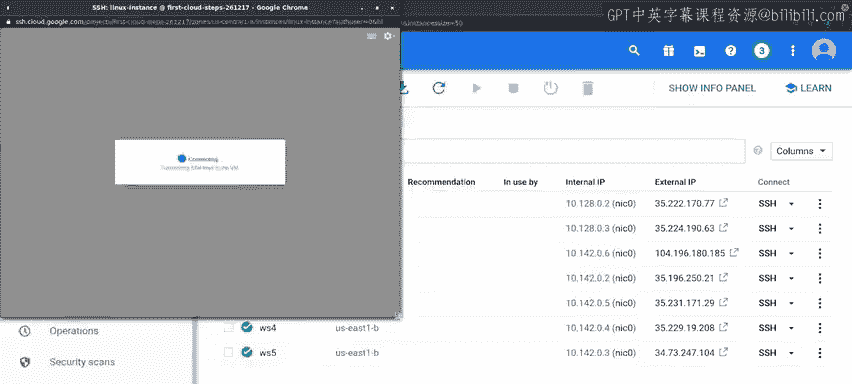
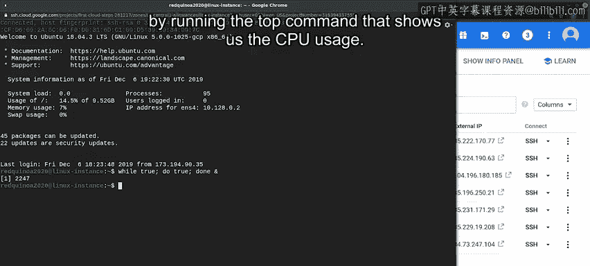
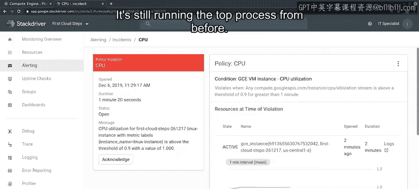

#  163：GCP基础监控 📊


在本节课中，我们将学习如何在Google Cloud Platform中监控虚拟机实例，并基于收集到的指标创建警报。我们将使用GCP内置的监控工具Stackdriver，了解其核心功能，并实践配置一个CPU使用率警报。

---

## 概述

上一节我们介绍了如何在GCP控制台创建虚拟机。本节中，我们来看看如何利用云服务商提供的工具来监控这些持续运行的虚拟机，并基于监控指标创建警报。

我们将使用名为**Stackdriver**的监控工具，它是GCP整体服务的一部分。首次激活此系统后，需要一段时间才能开始从所有机器收集指标，因此我们已提前将其激活。

## 访问监控控制台

当我们首次打开监控控制台时，会看到系统的概览。目前，这个面板看起来很空，但我们可以配置此仪表板，以显示我们认为最有用的图表。

让我们进入实例仪表板。

在这里，我们看到实例列表。我们可以点击每个实例，查看Stackdriver收集到的关于它们的监控信息。

## 查看核心监控指标

监控系统通过三个基本指标，为我们提供了每个实例的简明概览：
*   CPU使用率
*   磁盘I/O
*   网络流量

根据我们想在虚拟机上运行的服务，我们可以自定义这些仪表板以显示不同的指标。

如果内置的指标不够用，你还可以创建自己的指标并将其添加到这里。

## 配置警报策略

现在，我们想了解如何设置警报，以便在系统行为异常时通知我们。

为此，我们将创建一个新的警报策略。

要设置新警报，我们必须配置触发警报的条件。完成此操作后，我们还可以配置希望如何收到问题通知，并添加希望通知中包含的任何文档。

### 配置触发条件

如前所述，警报条件与特定指标相关。我们希望当某个指标表明实例出现问题时收到通知。

在本示例中，我们将配置一个警报，当某个实例的CPU使用率超过90%时触发。

以下是配置步骤：
1.  首先，我们选择要监控**GCE VM实例**，即我们当前正在运行的实例。
2.  然后，选择**CPU使用率**指标。

选择指标后，我们会看到所有当前运行实例的收集值图表。

我们可以选择为此条件的数据添加额外的过滤器和分组。例如，我们可以选择仅查看某些实例，通过它们的区域、地区或名称进行筛选。

如果你想为生产环境使用的实例和测试或开发环境使用的实例设置单独的警报，这会很有用。

此外，我们还可以为数据选择一个聚合器。当你收集的指标关乎整个系统而不仅仅是单个实例时，这些聚合器非常有用。例如，如果你正在检查系统生成的错误响应数量，你会希望汇总所有实例的错误。

根据我们如何过滤、分组和聚合数据，最终会得到一系列不同的时间序列。我们将使用这些值来决定是否应触发警报。

### 设置触发阈值

下一步是选择有多少个不同的时间序列需要违反条件才能触发警报。我们可以选择当一个、某些或所有不同的时间序列违反条件时触发警报。

对于此示例，我们将配置警报在任何实例的CPU使用率超过90%时触发，因此我们选择**任何时间序列违反**。

现在，我们将设置触发条件：如果值在**一分钟**内持续高于90%，则触发警报。

## 配置通知方式

好的，我们已经设置了条件。现在，我们可以选择在警报触发时希望如何接收通知。

目前，我们可以使用的唯一通知类型是电子邮件。要使用其他可用的渠道类型，我们需要在个人资料中配置它们。

对于此示例，电子邮件即可。刚开始使用警报时，使用电子邮件可能没问题，但最终你会希望配置其他方法。

我们已经配置了警报以发送电子邮件。

## 添加警报文档

现在，我们可以为警报添加额外的文档。

此文档旨在帮助响应警报的人员理解他们需要做什么来解决问题。当团队中有许多人一起工作，且并非每个人都了解所有事情时，在此处包含良好的文档可能非常重要。

包含良好文档的警报更容易处理，并有助于更快地使服务恢复健康状态。

对于我们的示例，我们将添加一条消息，说明处理此警报的人员应使用 `top` 命令检查实例。

## 保存警报策略

最后，我们需要为警报策略命名，我们将其称为 **CPU**，然后保存它。

太好了！现在我们已经设置好了警报。我们可以放松一下，知道如果出现问题，我们将是第一个知道的。



## 演示警报触发



在本演示的最后部分，我们想展示警报触发时会发生什么。

为此，我们将在其中一个实例中启动一个进程，通过创建一个无限循环来占用所有可用的CPU。

我们将回到主控制台，通过SSH连接到名为 `linux-instance` 的虚拟机，然后创建一个永不结束的 `while` 循环。

```bash
while true; do echo "Looping..."; done
```

现在，我们的循环正在运行并占用所有可用CPU。我们可以通过运行 `top` 命令来检查这一点，该命令会显示CPU使用情况。

我们看到有一个 `bash` 命令几乎占用了100%的可用CPU。我们的实验正在运行。

## 理解警报延迟

请记住，我们之前说过，我们希望条件持续一分钟才触发警报，所以它不会立即触发。在处理警报时，通常使用1、5甚至10分钟的时间窗口。

我们不希望因为一个只持续几秒钟然后消失的小峰值而收到警报。我们希望在实际需要关注的问题出现时收到警报。

我们选择的时间窗口大小取决于我们正在检查的指标、预期峰值的持续时间以及许多其他因素。在测试警报时，调整我们希望条件持续为真的时间是很正常的。

如果你经常收到关于那些无需你干预即可自行消失的条件的通知，你可能会选择将时间窗口设置得更大。反之，如果你在需要关注的条件出现时收到通知太晚，你可能会选择将时间窗口设置得更小。

## 查看触发的警报

好的，我们已经让足够的时间过去了。让我们看看我们的警报怎么样了。

我们看到有一个**未解决的事件**，这是一种对问题进行分组的方式。警报摘要为我们提供了大量关于当前情况的信息。我们可以点击 **CPU** 链接以获取更多信息。

此页面显示了触发此事件警报的指标。它显示了触发警报的阈值以及指标的当前值。它还显示了我们输入的文档，并允许我们创建注释。我们可以使用这些注释来跟踪在事件期间所做的工作。



## 解决问题并验证恢复

现在，让我们停止占用实例所有CPU的进程。之前的 `top` 进程仍在运行。

让我们按 `Q` 退出。现在，无限循环正在我们控制台的后台运行。

我们可以通过输入 `fg` 使其在前台运行，然后按 `Ctrl+C` 取消它。

好的，现在我们已经停止了进程。让我们用 `top` 检查一下，确认它不再占用所有CPU。很好，`bash` 进程不再占用所有CPU时间了。

再过一分钟，我们之前看到的警报将停止触发。

## 总结

本节课中，我们一起学习了如何在云中监控一批运行的实例。我们基于指标创建了一个警报，并验证了警报的触发。当然，使用这些工具我们还可以做更多事情。我们将在接下来的阅读材料中为你提供更多信息的指引。之后，还有一个小测验来检查你是否理解了所有内容。