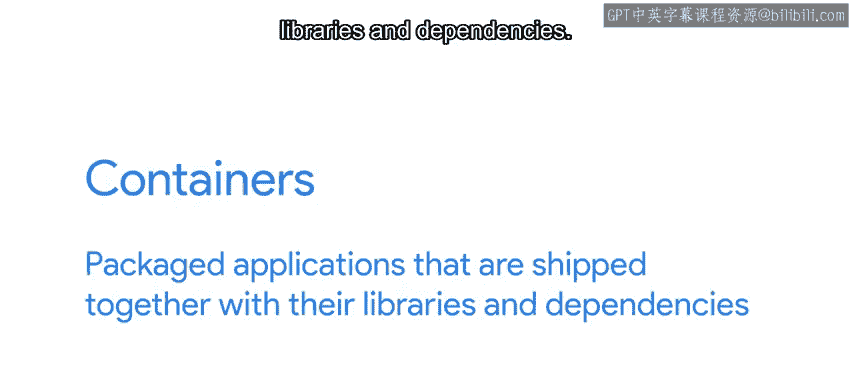

#  165：确定故障来源 🔍

在本节课中，我们将学习如何在云服务环境中确定故障的来源。当服务出现问题时，我们需要判断问题是出在我们自己的代码上，还是云服务提供商的基础设施上。我们将探讨几种实用的排查方法。

---

当我们在云端托管服务时，我们需要放弃对所用基础设施的部分控制权。

这在尝试找出服务问题的根本原因时可能尤为明显，因为我们不知道故障是由我们自身的错误还是由提供商方面的错误引起的。

那么在这种情况下我们能做什么呢？提供商方面的问题往往局限于特定的地理区域。

如果你看到奇怪的问题，并且完全不知道可能发生了什么，你可以尝试在另一个区域启动你的服务，并检查故障是否也在那里发生。

如果它在其他区域运行正常，那么很可能是云基础设施存在问题，你应该向你的提供商提出这个问题。

如果它在其他区域也失败，那么很可能是你的系统存在问题。

类似地，如果你看到与资源使用相关的问题，你可以尝试在不同的机器类型上运行相同的系统，并检查其在那里的行为表现。

例如，如果你的服务处理传入请求花费的时间太长，通过将你的服务切换到更强大的机器上，你可能会提高整体性能。

我们多次提到的另一个选项是对最近发生变化的组件进行回滚。

将你所有的基础设施作为代码存储在版本控制系统中，将使你能够访问系统中每个组件的变化历史。

在设置服务时，你应该确保能够部署和回滚每个单独的组件。

想象一下，你收到一个警报，说你应用程序中的Web服务器使用的内存比以前多得多。

你不知道原因，但你知道几天前部署了一个新版本。通过回滚到上一个版本，你可以验证该更改是否是问题的根源。

如果回滚后服务器运行正常，你可以调查具体的更改，并尝试找出它们为何使用如此多内存的原因。

如果回滚后服务器仍然使用大量内存，这意味着还有其他问题。

在之前的视频中，我们简要提到了在云端运行服务时一个流行的选项：容器。

容器是打包的应用程序，与其库和依赖项一起交付。

每个应用程序都在一个单独的容器中执行，完全独立于在同一台机器上运行的任何其他应用程序。

容器化应用程序的一个巧妙特性是，你可以将同一个容器部署到本地工作站、本地运行的服务器或不同供应商提供的云基础设施上。

这在试图理解故障是在代码中还是在基础设施中时，会非常有帮助。你只需将容器部署到其他地方，并检查其行为是否相同。

使用容器时，典型的架构是拥有许多处理服务不同部分的小型容器。

这意味着整个系统可能变得非常复杂，当某个部分出现故障时，可能很难确定问题来自哪里。

在容器世界中解决问题的关键是确保你拥有来自系统所有部分的良好日志，并且你可以在必要时为每个应用程序启动测试实例以进行尝试。

接下来，我们将讨论一些可以在云中使用的工具，以从服务中断中恢复。