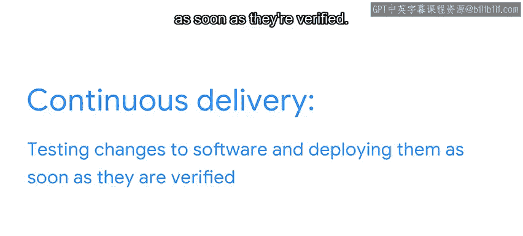

#  167：什么是 DevOps？🤔

在本节课中，我们将要学习 DevOps 的概念。DevOps 是一种结合了软件开发（Dev）与 IT 运维（Ops）的工作方式，旨在缩短系统开发生命周期，并以高质量的软件实现持续交付。

## 概述

软件并非凭空产生。开发像 Microsoft Office 这样的应用程序，远不止是编写代码。它涉及一个复杂的协作过程，需要确保软件功能完善、运行稳定，并能与其他系统交互。这个从构思到交付的完整过程，被称为软件开发生命周期。

上一节我们介绍了软件开发的复杂性，本节中我们来看看 DevOps 如何优化这一过程。

## 什么是 DevOps？

DevOps 是 **Development**（开发）和 **Operations**（运维）的组合词。它描述了软件开发生命周期中，除了编写代码之外的各个步骤。

在过去，程序员完成软件开发后，IT 运维团队会创建测试参数、测试应用程序，确保其符合预期。之后，软件会被刻录到 CD、包装并部署到商店供用户购买。更新和新版本也需要经历同样的漫长流程。

然而，时代已经改变。现代的软件开发生命周期速度更快，持续时间更长。DevOps 实践正是为了适应这种变化。

## DevOps 的核心方面

DevOps 方法论包含许多环节，其中两个重要方面是：**持续集成** 和 **持续交付**。正是这两个方面，使得 DevOps 成为高效 CI/CD 流水线的必要组成部分。

以下是这两个核心概念的详细说明：

**持续集成** 意味着程序员始终致力于改进应用程序，更新和优化被持续地集成到软件中。其核心思想是频繁地将代码变更合并到共享的主干分支，并通过自动化构建和测试来快速发现集成错误。

**持续交付** 意味着对软件的任何更改都会经过测试，一旦验证通过，就会立即部署给用户或服务器。这确保了软件可以随时可靠地发布。

## DevOps 的价值

尽管 DevOps 实践相对较新，但 IT 部门和软件工程团队已将其视为其 CI/CD 流水线基础设施的必要组成部分。

对于像你这样的程序员而言，DevOps 领域也提供了额外的职业机会，因为许多 DevOps 工作都需要编程技能。

## 总结

本节课中我们一起学习了 DevOps 的关键要点。

我们首先定义了**软件开发生命周期**，它是一个包含各类人员、职责和技能的复杂过程。

接着，我们探讨了 **DevOps**，它描述了编码之外的软件开发生命周期步骤。

DevOps 的两个重要方面是：
*   **持续集成**：不断向软件添加更新和改进。
*   **持续交付**：测试软件变更并在验证后立即部署。

DevOps 实践能带来更快的软件交付速度、更好的团队协作以及更高的系统可靠性。所有这些都是在快速演进的软件应用世界中取得成功的关键。😊

---

接下来，你可以阅读关于持续集成、交付和部署之间关系的更多内容。我们下次再见。