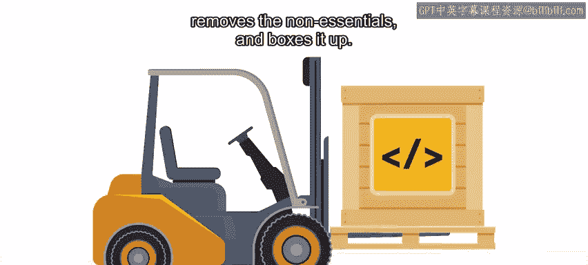
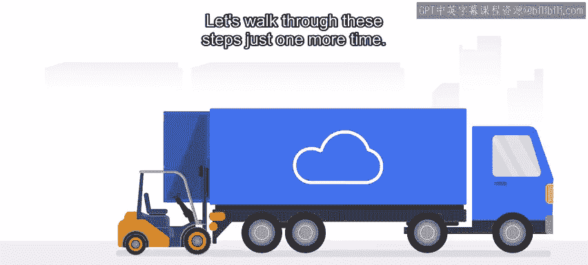

#  168：从编码到云端 🚀


## 概述

在本节课中，我们将学习软件从初始编码到部署至云端的完整过程。这是DevOps实践中的第一阶段，我们将了解程序员和DevOps团队在此过程中的职责与协作。

---

## 从编码到云端的四个步骤

上一节我们介绍了DevOps的基本概念。本节中，我们来看看软件从编码到部署上云的具体步骤。这个过程通常包含四个关键阶段。

以下是这四个步骤的详细说明：

1.  **程序员完成代码**：程序员在本地机器上完成软件的初始编码工作。
2.  **容器化代码**：通常由程序员负责，将代码及其依赖项打包成容器（如Docker镜像），并移除所有敏感信息。
3.  **DevOps团队接收容器**：DevOps团队通过工具（如Docker或Kubernetes）接收准备好的容器及其制品。
4.  **部署至云端**：DevOps团队使用适当的安全凭证，将容器部署到云服务器上。

---

## 深入理解每个步骤

### 第一步：完成编码



程序员在本地开发环境中编写和测试软件代码。这是所有后续工作的起点。

### 第二步：容器化与清理



此步骤的核心是准备一个干净、可移植的部署单元。关键在于**移除所有敏感信息**，例如密码、API密钥等。这些信息不应以明文形式存在于源代码中。

云服务商通常提供密钥管理服务，允许应用程序在云端运行时以变量的形式动态调用这些敏感信息。此步骤可由内部程序员完成，或在接收外部程序员代码后由内部工程师处理。

容器化的一个简单示例是创建一个Dockerfile：
```dockerfile
FROM python:3.9-slim
WORKDIR /app
COPY . .
RUN pip install -r requirements.txt
CMD ["python", "app.py"]
```

### 第三步：交接容器

DevOps团队从开发侧接收已容器化的应用包。这标志着职责从开发转向运维。

### 第四步：云端部署

DevOps团队利用自动化工具和云平台提供的安全认证，将容器部署到预定的云环境（如测试、生产环境）中。

---

## 总结

本节课中，我们一起学习了软件“从编码到云端”的完整流程。我们了解到，这个过程始于程序员完成编码，经过容器化清理后交由DevOps团队，最终安全地部署到云服务器。这个过程是CI/CD（持续集成/持续部署）管道的重要组成部分，尤其随着无服务器技术的发展，它正变得愈发高效。下一节，我们将探讨软件上云后的“从预发布到生产”阶段。