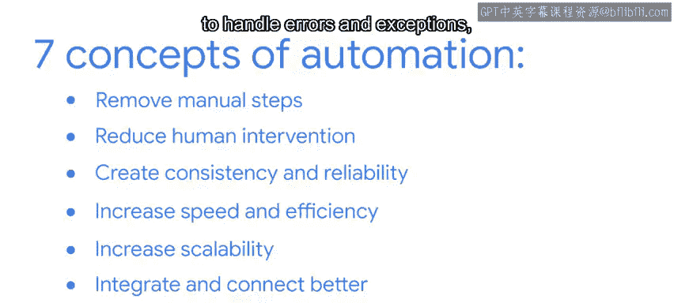

#  169：谷歌《用Python进行IT自动化办公》第52课 - 自动化 🚀

## 概述

在本节课中，我们将学习软件开发中**自动化**的核心概念及其在持续集成（CI）和持续部署/交付（CD）流程中的关键作用。我们将探讨自动化如何通过减少人工干预、提高效率与可靠性来优化现代软件开发生命周期。

---

在遥远的过去，软件开发生命周期在软件发布并交付给向最终用户销售的商店后就结束了。然后开发者会重新开始。作为最终用户，你不仅需要购买软件，还需要购买下一个版本，以及2.0版和后续版本。

如今，软件开发的速度持续加快。更新和新版本频繁出现，并且同样频繁地交付给那些始终连接到电脑、平板电脑和手机的用户。换句话说，软件开发生命周期并不会因为软件发布而停止。开发会通过持续集成（CI）和持续部署或交付（CD）不断向前推进，迭代进行。

这个CI/CD流水线始终有任务在进行中，每一行需要集成的新代码也必须经过审查、测试和推送。它必须在全球的云服务器上复制和部署。

正如你所知，软件开发生命周期是一个复杂且资源密集的过程。CI/CD只会加剧这一点。每一个独立的任务都需要代码、监控和处理，尤其是对于CI而言。

**自动化**是一种编程功能，它使得持续且通常是重复的例程能够规模化、捕获错误并减少人工干预的需求。它通过以编程方式专注于并运行每个任务来减少错误，有效地将它们与其他任务以及人为错误隔离开来。

自动化是DevOps的一种迭代方法。要实现自动化，你需要识别流程中的必要步骤，并创建具有正确函数和循环的代码，以便每次都以相同的方式运行它。任何CI自动化设置的核心部分都包括一个版本控制系统、构建服务器和自动化测试框架。

例如，假设你刚刚完成一个更新。你将新版本保存到构建服务器，服务器会识别出新版本。一旦识别，服务器会自动测试新代码的通信能力。

以下是持续集成自动化的七个关键概念。

首先介绍第一个概念。

**移除手动步骤**。这个概念如其字面意思，用自动化流程取代重复、耗时的人力工作。

接下来是第二个概念。

**减少人工干预的需求**。一旦设置完成，自动化任务或系统可以独立运行，从而解放IT人员去处理其他工作。

现在来看第三个概念。

**一致性与可靠性**。自动化消除了潜在的人为错误，因此任务能够一致地运行。

然后是第四个概念。

**速度与效率**。自动化消除了人类的局限性和干扰，因此任务运行得更快、更顺畅。

接着是第五个概念。

**可扩展性**。自动化任务更容易扩展，因为它们可以被复制。它们不需要重新配置来处理更大的负载。

第六个概念是集成能力。

自动化任务可以与现有的系统、工具和工作流程集成并连接。

最后是第七个概念。

**错误处理**。自动化系统可以被设计来处理错误和异常，要么通过启动恢复系统，要么通过警报记录并标记给人工操作员。

---

## 总结

本节课中，我们一起学习了**自动化**在软件开发中的核心作用。自动化是一种编程功能，它使得持续例程能够规模化、捕获错误并减少人工干预的需求。要实现自动化，你需要识别流程中的适当步骤，并创建具有正确函数和循环的代码，以便每次都以相同的方式运行。

自动化重复性任务并移除手动任务是实现持续集成的关键。它能提高代码质量、减少集成问题，并实现更快的发布周期。自动化是构建顺畅CI/CD流水线的必要条件，而CI/CD流水线是软件开发生命周期的重要组成部分。

请记住，自动化使得DevOps和程序员能够更轻松地协作创建软件和更新。在接下来的课程中，我们将继续深入探讨CI/CD。