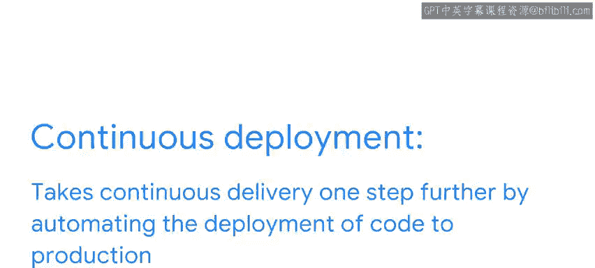

#  170：持续交付与持续部署 🚀

在本节课中，我们将学习持续交付（Continuous Delivery）与持续部署（Continuous Deployment）这两个关键的软件开发实践。它们是CI/CD流程中的“CD”部分，旨在帮助团队更快速、更可靠地发布软件。

---

上一节我们介绍了持续集成（CI），它关注代码的自动构建与测试。本节中，我们来看看如何将经过测试的代码自动交付和部署给用户。

你可以将持续交付和持续部署比作一条**汽车装配线**。假设你是一家汽车制造商，希望尽可能快地生产新车。采用装配线方法，你可以将制造过程分解为一系列步骤，每个步骤由不同的工人完成，汽车从一个步骤传递到下一个步骤，直到完成。这使你能够快速高效地生产汽车。

类似地，**持续交付和持续部署就是软件部署的“装配线”**。

*   **持续交付**：自动化新软件的构建、测试和打包过程。这使得你可以快速高效地向客户发布新功能和错误修复。
*   **持续部署**：在持续交付的基础上更进一步，自动化将代码部署到生产环境的过程。这意味着新功能和错误修复一旦准备就绪，无需任何人工干预即可自动发布给客户。这同时减少了**交付周期**——即从开发完成到用户获得更新之间的时间。

总而言之，持续交付和持续部署是两种帮助团队更频繁、更可靠地交付软件的开发实践。

---

## 持续交付详解 🔄

持续交付是一种软件开发实践，它自动化软件的构建、测试和部署流程。对代码的每一次更改都会被构建、测试并打包以待部署。这意味着团队可以随时通过“按下一个按钮”来发布新版本的软件。

对于需要频繁且可靠发布软件的团队来说，持续交付是一个很好的选择。它是自动化基础设施和云资源的结合，确保更新能交付到相应用户的计算机和云服务器。

以下是持续交付的工作流程：

1.  **代码变更**：开发人员对代码进行更改。
2.  **自动构建与测试**：代码被自动构建和测试。
3.  **打包**：如果代码通过所有测试，则被打包以备部署。
4.  **部署到预演环境**：代码被部署到预演环境进行额外测试。
5.  **部署到生产环境**：随后，代码被部署到生产环境。
6.  **用户可用**：新版本的软件对用户可用。

这个过程对代码的每一次变更都会重复执行，从而实现“随时可发布”。

---

## 持续部署详解 ⚡

持续部署是持续交付的延伸，它在自动化软件构建、测试和打包过程的基础上，进一步自动化将代码部署到生产环境的过程。

这意味着团队可以在新功能或错误修复准备就绪后，立即将其发布给客户。对于在CI/CD方面经验丰富且需要非常频繁发布软件的团队，持续部署是一个理想的选择。

它可以帮助团队自动化整个发布流程，并尽可能快地将新功能和错误修复交付给用户或客户。

---

## 核心回顾与总结 📝

我们刚才涵盖了很多内容，让我们快速回顾一遍：

*   **持续交付**：定义为自动化交付流水线的实践，以确保软件可以随时发布到生产环境。它是每当代码变更时，发布软件更新、补丁和新版本的过程。
*   **持续部署**：在持续交付的基础上，取消了手动批准步骤。一旦变更通过了所有测试，它就会**自动部署到生产环境**。

持续交付和持续部署可以帮助软件开发团队更快速、更高效地向客户发布新功能和错误修复。这有助于团队保持领先地位，并更快地满足其用户和客户的需求。

在本节课中，我们一起学习了持续交付与持续部署的概念、工作流程以及它们为软件开发团队带来的价值。理解并实施这些实践，是构建高效、自动化软件交付能力的关键一步。