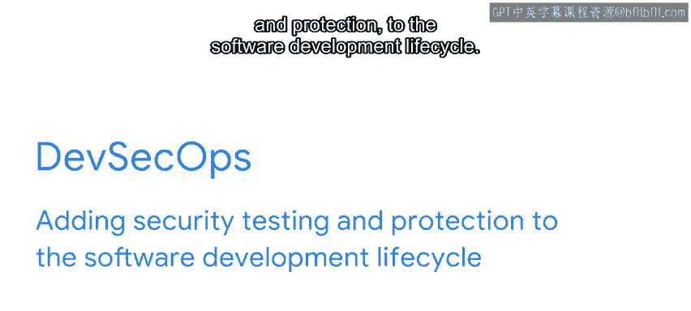
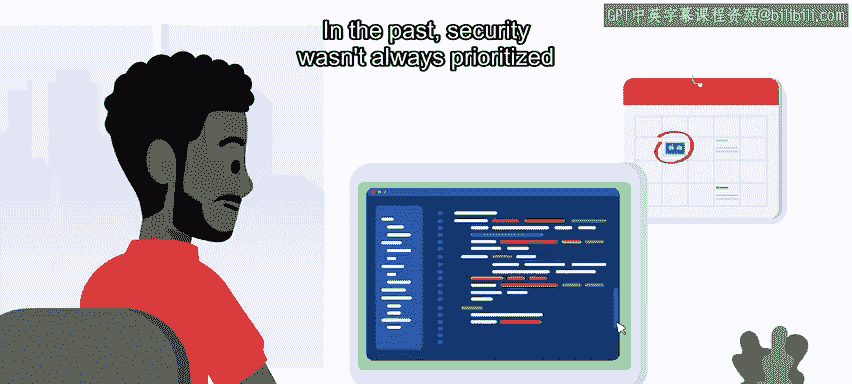
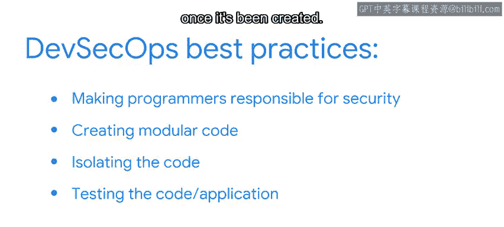

#  171：DevSecOps 🛡️

在本节课中，我们将学习什么是DevSecOps，以及它如何融入CI/CD流水线。我们将探讨其核心概念、实践方法以及它对Python程序员的影响。

---

## 什么是DevSecOps？

在之前的视频中，我们讨论了开发运维（DevOps），并将其描述为软件开发与IT部门协作的一种方式。

本节中，我们来看看另一个IT职能——DevSecOps，以及它如何融入CI/CD流水线。但首先，让我们定义DevSecOps是什么。

DevSecOps本质上是**在软件开发生命周期中添加安全测试与保护**。它结合了开发、安全和运维，并将其应用于CI/CD流水线，且从流程早期就开始介入。

---

## 为何使用DevSecOps？

简短的回答是：为了**速度与效率**。

更详细的解释是：CI/CD中的软件开发速度极快，必须依赖自动化来处理某些流程，例如安全测试和持续部署。这可能会引入安全风险。

过去，安全并不像今天这样被优先考虑。通常是先开发软件，之后再考虑安全。你可能已经从新闻中看到足够多的安全故障和漏洞事件，从而意识到——正如软件开发人员所认识到的那样——事后补救安全问题的效果并不理想。

---

## DevSecOps的实践方法

DevSecOps是一种在软件开发流程早期引入安全措施和测试的流程。这通常被称为**左移安全**。

作为一名Python程序员，DevSecOps将影响你开发和交付代码的方式。除了在打包到Docker文件前清理代码外，DevSecOps还将大部分初始安全责任转移到了开发软件的编程人员身上。

以下是DevSecOps的一些最佳实践：

*   **程序员负责安全**：你需要负责编写安全的代码。
*   **编写小型模块化代码**：代码应更小、更模块化，并使用安全扫描工具（如静态应用程序安全测试，即SAST）进行测试。
*   **隔离代码**：代码本身也更隔离，这通过使用经过定期不安全代码测试的、受信任的、受支持的库，来限制对外部数据库和其他资源的访问。
*   **测试应用程序**：应用程序组装完成后，会使用动态应用程序安全测试（DAST）等扫描器进行测试。

实际上，DevSecOps从业者是**网络安全倡导者**，他们与程序员和IT专业人员作为一个大型协作团队合作，共同推动以安全为中心的文化。他们的角色是在流程中任何有需要的地方添加和测试安全性，并验证代码及最终应用程序在整个持续开发过程中是安全的。

---

## 核心目标与总结

DevSecOps的关键目的是**将安全实践整合到软件开发生命周期的全过程**，从协作环境中的代码开发，到自动化及持续的安全测试。它是速度与安全在软件开发生命周期旅程中交汇的地方。

总而言之，DevSecOps的核心是**将安全“内建”于整个开发流程的代码中**，以确保应用程序在设计上就是安全的。这在版本控制、更新以及整个持续集成和持续交付过程中也是如此。

本节课中，我们一起学习了DevSecOps的概念。记住，DevSecOps是在软件开发生命周期中添加安全测试和保护的过程，并且要从一开始就“内建”安全。