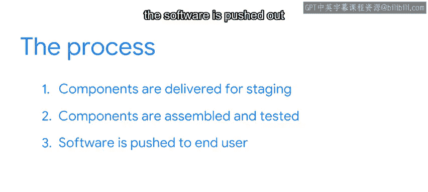

#  172：从暂存环境到生产环境 🚀

在本节课中，我们将学习软件开发生命周期中，代码在完成“从编码到云端”流程后，如何从**暂存环境**过渡到**生产环境**。我们将明确这两个核心环境的概念、区别以及整个部署流程。

---

## 概述

上一节我们介绍了“从编码到云端”的流程，它涵盖了软件开发的初始阶段，包括程序员编写代码、移除敏感信息以及为DevOps团队将代码容器化以便交付到云端。

本节中，我们来看看后续的关键步骤：从暂存环境到生产环境。这是确保软件安全、稳定地交付给最终用户的重要环节。

---

## 核心概念定义

首先，我们需要明确两个关键术语：**暂存**和**生产**。

### 暂存环境

**暂存**是为生产环境准备软件的过程。与“从编码到云端”类似，暂存是一种IT战略和DevOps方法，而非纯粹的编程活动。

在暂存环境中，我们指定构建步骤和测试。软件的所有组件在此处被组装和测试，通常还包括一些最终用户的Alpha和Beta测试。当软件处于此环境时，我们通常称其处于**开发中**。

### 生产环境

**生产**意味着软件（无论是应用程序、新版本、补丁还是更新）在真实场景中被使用，这个真实场景就称为**生产环境**。

生产环境是软件经过暂存阶段的大量测试后，从云服务器实际推送给最终用户的地方。软件开发团队确信软件能在生产环境中安全、稳定地运行，这意味着它不会崩溃或泄露信息。

---

## 流程详解：从暂存到生产

我们可以将“暂存到生产”的过程想象成一个履行和仓储配送中心。

以下是该流程的主要步骤：

1.  **接收与检查**：在暂存阶段，软件以独立的容器（如Docker文件）形式从开发者和DevOps团队处接收，并上传至云端进行检查、测试和组装。

2.  **内部与外部测试**：接下来，完整的应用程序会在内部进行测试，并邀请外部Beta测试者参与，以验证其运行是否符合开发者的设计预期。

3.  **问题反馈与迭代**：如果测试未通过，DevOps团队可能需要修改部分代码并重新提交，暂存流程会像新项目一样重新开始。

4.  **环境一致性**：暂存环境的这一部分在测试资源、软件配置和数据监控方面，与真实的生产环境非常相似。测试模拟了最终用户将如何操作软件，确保没有明显的错误或意外。

---

## 暂存与生产的关键区别

两者环境设置相似，但有一个重大区别：

在暂存环境中使用的代码和依赖项发布到外部世界**之前**，必须确保**专有代码**（如API密钥）已被移除，并且所有**调试工具**均已关闭。

这样做的目的是避免对性能产生负面影响或带来潜在的安全风险。

---

## 流程回顾与总结

现在，让我们简要地回顾一下整个流程。

在“从编码到云端”流程结束时，软件的所有组件都已交付到用于暂存的相应云服务器。

在暂存环境中，所有组件被组装和测试，软件处于**持续集成/持续部署**的开发流程中。

最后，在生产环境中，软件从云服务器推送给最终用户。

---

## 总结

本节课中，我们一起学习了从暂存环境到生产环境的完整流程。

“从暂存到生产”是**持续集成/持续部署**流水线中，每个应用程序、更新和版本在软件开发生命周期内都必须经历的部分。

这个过程使得应用程序能够更快地被创建和更新，以满足最终用户的需求。随着技术的演进和改进，“从暂存到生产”的流程只会运行得越来越快。