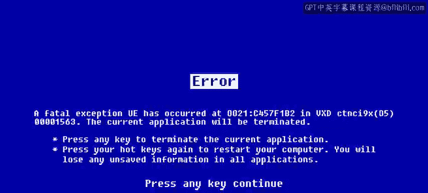

#  174：调试策略

## 概述

在本节课中，我们将学习如何通过缩小范围和隔离问题来定位导致程序运行缓慢的根本原因。我们将探讨代码审查的价值，并介绍一些实用的调试策略。

---

## 缩小范围与隔离问题

上一节我们介绍了调试的基本概念。本节中，我们来看看如何通过缩小问题范围来定位根本原因。

我们看到，通过**缩小范围**和**隔离问题**，可以引导我们找到程序运行缓慢的根本原因。

## 代码审查的价值

在定位问题之后，理解他人对代码的审视也至关重要。以下是代码审查能带来的好处：

*   代码审查能指出我们可能未曾注意到的问题。

## 利用Python进行调试

当你处理代码时，Python会提供强大的工具来帮助你。虽然教学Python有时会让我开一些愚蠢的玩笑，但工具本身是严肃而高效的。

接下来，我们将探讨更多可用于定位问题根本原因的实用策略。

Python为你提供了强大的调试能力。回顾一下，我们已经涵盖了许多内容。

---

## 总结

本节课中，我们一起学习了调试的核心策略：通过**缩小范围**和**隔离问题**来定位缺陷。我们还了解了**代码审查**的重要性，并认识到Python内置工具对调试过程的强大支持。掌握这些方法将帮助你更高效地解决编程中遇到的性能问题。