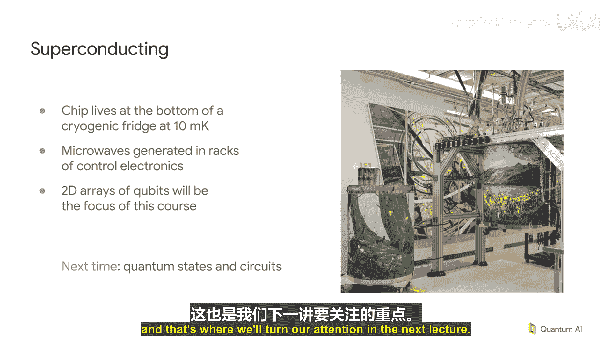

# 002：什么是量子计算机？🔬

在本节课中，我们将探讨“什么是量子计算机”这个问题。答案并非唯一，因为量子计算仍是一个活跃的研究领域，存在多种不同的技术路径。我们将简要介绍几种主要的技术方案，并了解它们各自的特点与挑战。

上一节我们概述了量子计算的基本概念，本节中我们来看看几种具体的量子计算机实现技术。

## 主要量子计算技术概览

以下是当前正在研究中的几种主要量子计算技术。请注意，这只是一个选择性的介绍。

*   **D-Wave 量子退火技术**：这是谷歌早期涉足量子硬件时采用的技术。它采用一种特殊的量子计算方式，其重点不在于高相干性或精确的量子态操控，而在于通过大量耦合器对众多量子比特施加约束，让系统“退火”至一个尽可能满足所有约束的状态。本质上，它是一个优化器。然而，这种方法的挑战在于，目前尚不清楚如何对其应用量子纠错。随着系统规模扩大，它需要更低的温度和更精密的控制，其可扩展性存在根本性疑问。

*   **离子阱技术**：这是一种完全不同的方法。它利用电磁阱（通常在表面电极上）来囚禁单个离子原子，并使用这些离子的内部能级作为量子比特进行计算。操纵这些量子比特可以使用微波或激光。离子系统基于原子能级，具有非常纯净的物理特性，因此能实现目前所有方案中保真度最高的量子门操作。其主要挑战在于运算速度，以及能否构建一个包含大量离子、激光或微波源的超高真空系统并使其协同工作。目前，这类系统的规模通常不大。

*   **中性原子技术**：这种技术也使用原子，但是中性原子。其优势在于可以用激光阱来囚禁原子，无需复杂的电极结构。原子被随机捕获后，可以移动它们以形成密集的阵列。由于无需物理硬件来固定量子比特，这类系统目前可以实现较大的量子比特数量（数百个）。与离子阱类似，其主要挑战在于速度。此外，在许多方案中，测量信息会导致原子离开阱，需要持续加载新原子，这是该技术迈向更大规模需要解决的技术难题。

*   **光量子技术**：这种方法基于光子。在光子芯片上，可以概率性地产生单光子并将其纠缠起来，从而构建更大的量子态。其核心思想是，如果有足够多的光源和路由方式，能够将成功的操作组合起来，同时丢弃失败的操作，原则上就可以构建出用于量子计算的大规模量子态。该技术的挑战在于需要快速路由光子、实现快速反馈切换，并且必须克服光子损耗问题，以免阻碍大尺度量子态的构建。

*   **量子点技术**：这种方法利用被束缚的单个电子来编码量子信息。英特尔和全球许多实验室都在推进此项研究。其挑战主要在于扩展性。量子点非常小（电子间距在数百纳米量级），要构建实用的量子计算机，至少需要二维量子比特阵列，而目前的研究设备尚不支持。在没有二维阵列的情况下，单个量子比特的失效可能导致整个系统被分割成无法通信的独立部分，从而无法实现容错。

*   **超导量子比特技术**：这是谷歌目前重点研究的方向。它在硅片上制作超导电路，可以将其类比为一个可调谐频率的“吉他弦”谐振器。基态和第一激发态分别代表 |0⟩ 和 |1⟩。与许多其他使用微观粒子（如电子、原子）的方案不同，超导量子比特的电路尺寸较大（量子比特中心距约1毫米），肉眼可见，这说明了“量子”并不总意味着“微小”。然而，它确实意味着“极冷”：为了可靠地存储量子信息，系统的热能必须远小于 |0⟩ 和 |1⟩ 之间的能隙，这需要将温度降至约10毫开尔文，因此需要复杂的低温制冷系统。此外，制造工艺（如约瑟夫森结的厚度控制）直接影响量子比特的性能，提高芯片良率、延长相干时间、实现高保真度量子门是研发的重点。

## 量子计算机的全貌

需要强调的是，量子芯片本身远不是一台完整的量子计算机。一台量子计算机包含整个系统：低温冰箱、布线、以及驱动量子比特状态变化的微波电子设备（通常安装在机柜中）。这对于我们讨论的所有技术都是共通的：量子计算并不“小”，它通常需要一整套庞大的设备才能使整个系统工作。我们课程关注的核心——量子比特及其状态——只是整个装置中极小的一部分，但也是我们将花费主要篇幅讨论的内容。

本节课中我们一起学习了多种量子计算实现技术，包括D-Wave退火、离子阱、中性原子、光量子、量子点以及超导量子比特。我们了解了它们的基本原理、优势以及面临的主要挑战，例如扩展性、速度、退相干和制造工艺等。下一讲，我们将把注意力转向对这些量子比特可以进行的具体操作。