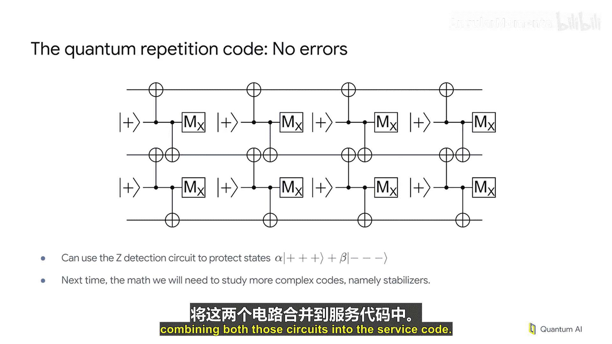

# 005：量子纠错实践 - 比特翻转与相位翻转的检测


在本节课中，我们将学习如何构建用于量子纠错的量子电路。我们将从基础概念开始，逐步构建能够检测比特翻转和相位翻转错误的电路结构，并理解如何通过测量结果来定位和纠正这些错误。

## 电路基础回顾

上一节我们介绍了量子电路和可能发生的错误。本节中，我们将具体构建用于量子纠错检测的电路结构。

以下是理解后续内容所需掌握的基础电路示例，请确保你理解这些电路的输出和测量结果。

```python
# 示例：基础量子电路
# 输入 |0> 态，经过哈达玛门后测量
circuit = QuantumCircuit(1)
circuit.h(0)
circuit.measure_all()
```

测量结果应为：
*   输入 |0> 态，输出为 0 或 1（等概率）。
*   输入 |+> 态，输出恒为 0。
*   输入 |-> 态，输出恒为 1。

一个有用的定义是 **X基测量**，记作 **Mx**。它是在标准测量前施加一个哈达玛门变换，用于检测量子态是处于 |+> 态还是 |-> 态。

## 构建错误检测电路

现在，让我们构建一个更接近实际量子纠错应用的电路，用于重复检测错误。

这是一个简单的电路，它虽然不能保护逻辑量子态，但非常适合作为讨论的起点。


在这个电路中：
*   顶部的量子比特是我们想要保护的数据量子比特。
*   底部的量子比特是重复制备和测量的辅助量子比特。

### 电路功能分析

在无错误发生时，该电路会持续输出测量结果 **0**。这告诉我们没有错误发生。

如果发生错误，情况将发生变化。让我们看看错误如何影响电路。

**情况一：数据量子比特发生比特翻转错误**
一个比特翻转错误发生在数据量子比特上。当这个错误传播时，它会翻转所有未来的测量结果。数据量子比特变为 |1> 态，这将在测量结果中反映出来。**检测错误的关键在于测量流的变化**——从一串 0 变为一串 1。这是我们将反复使用的一个通用特征：错误会导致辅助量子比特测量流发生变化。

**情况二：辅助量子比特发生测量错误**
这不是数据量子比特错误，而是辅助量子比特本身的错误。我们的数据仍然完好无损，但测量结果出错了。它本应是 0，但错误在其发生前翻转了它，导致出现一个孤立的错误值。这是一个**测量错误**的示例。

请记住这两种情况：
*   当测量流发生变化时，那是**数据量子比特错误**。
*   当出现一个孤立的异常值时，那是**测量错误**。

## 增强电路：保护量子态

之前的电路完全是经典的，无法保护任何量子态。当我们开始使用单个辅助量子比特来保护两个数据量子比特时，我们可以做更多事情。

例如，我们可以输入形式为 **A|00> + B|11>** 的量子态。这个电路可以检测两个数据量子比特是否处于相同的状态。具体来说，在无错误的情况下，这两个量子比特状态相同，测量结果仍为 0，表示“是的，它们相同”。

这还不足以进行实际的纠错，因为当错误发生时，我们不知道是哪一个量子比特出错了，但它足以将讨论推进到下一步。

## 定位错误：增加电路规模

为了能够实际定位错误发生的位置，我们需要复制并扩展上述电路。

现在我们拥有三个数据量子比特和两个辅助量子比特，这足以实际定位错误发生的位置。

### 检测器与奇偶性

如前所述，我们真正关心的是**一个给定的测量结果是否与其前一次测量结果相同**。如果相同，则未在附近检测到错误；如果不同，则在附近检测到错误。

从技术上讲，绿色圆圈包围的两个测量结果构成了一个**检测器**。如果它们相同，则未检测到错误；如果它们不同，则检测到错误。

在这个电路中存在许多检测器。**每一对连续的测量结果都是一个检测器**。需要注意的是，重要的不是单个测量结果的具体值，而是该集合的**奇偶性**——即该集合中“1”的个数是奇数还是偶数。

### 引入错误并观察

现在，让我们引入一些错误，看看会发生什么。

首先，你会注意到现在有一个检测器具有**奇数奇偶性**，这就是**检测事件**的定义。当你得到的奇偶性与预期不符时，你就有一个检测事件，并需要将其高亮显示。

如果同样的比特翻转错误发生在不同位置，现在你可以看到我们获得了有助于定位该错误的有用信息。
*   此位置的比特翻转错误会被这两个检测器同时检测到。
*   此位置的比特翻转错误会触发两个检测事件，它在这里开始，然后向上和向下传播，触发这两条线上未来测量值的变化，从而在此处和此处都产生检测事件，帮助我们定位错误一定发生在这两个检测器共享的数据量子比特上。

错误也可能发生在其他位置。例如，比特翻转发生在此处，导致它在这个辅助量子比特上比在下面这个辅助量子比特上更早被检测到。同样，检测事件的模式帮助我们定位错误发生的位置。
*   当检测事件彼此相邻时，我们知道错误发生在电路的这一部分。
*   当检测事件呈对角线排列时，我们知道错误一定发生在这两个门之间。

我们现在从一个足够大的电路中获得了非常有用的信息，可以实际定位错误的位置。我们甚至可以获得更多信息，因为这两个门之间的时间间隔比这里的间隔短。我们可以说，检测事件呈对角线排列的可能性低于并排排列的一对检测事件。所有这些都可以用来帮助我们找出错误可能发生的位置。

## 解码与纠错

那么，这些信息如何帮助我们呢？

我们可以回溯，查看我们的电路，查看每一个可能发生错误的位置，计算出每一个可能的错误是如何被检测到的，并汇总出导致每一种特定检测事件模式的总概率。

明确地说，这里的这条线代表了每一个可能的错误，即触发此处这个确切检测事件的所有可能错误的总概率。线条的粗细旨在表示总概率。特别是，发生在此部分电路中、导致此检测器的所有错误的总概率，大于发生在此部分电路中、导致此处和此处检测事件的所有错误的总概率，这赋予了这条线更细的外观，意味着更低的概率。

通过系统地在电路中的每个可能位置插入每一个可能的错误，我们可以构建一个所有可能的检测事件结果的图，图中的边具有与底层电路中所有错误总概率成比例的粗细或权重。

### 最小权重完美匹配

现在，假设我们运行一个实验并观察到一组特定的测量结果模式。我们将做什么？

首先，我们将在任何具有连续不同测量结果对的地方构建所有检测事件。这就是检测事件。让我们先高亮显示它们。

接下来，我们将处理这些信息。我们将使用**最小权重完美匹配**算法。我们将搜索一组具有最小权重的边，将我们所有的检测器两两配对，或者配对到附近的边界。

可能存在多种可能性。例如，我本可以选择这里的这条对角边和下面的这条边界边。这仍然是一个两条边的解决方案。但是，与测量失败相关的这些边，以及与此部分中任何位置错误相关的这条边，可能性更高。因此，它们将具有较低的权重，并被优先选择。这是一个更好的猜测。

需要强调的是，这并不意味着底层真实的错误不可能是在这个点发生一个错误，以及在这里发生另一个错误。因此，总是存在一些失败的可能性。你只是通过选择最可能的选项来最大化猜对的可能性。

一旦你做出了选择，你就可以说，基于现有证据，我相信错误一定发生在这里。然后，你可以将这些错误传播通过电路来纠正测量结果。

### 纠错能力的限制

在这个特定的例子中，如果我们有两个错误，例如，假设顶部的数据量子比特和中间的数据量子比特都发生了错误，这对于这个电路的解码来说就太多了。这两个错误会双重翻转这个测量结果，意味着它变得不可检测。而这里的这个错误会翻转底部的这个测量结果。我们将认为，仅凭一个检测事件，错误一定发生在这里，从而做出错误的判断，这将导致一个逻辑错误。

因此，这是一个**距离为3的代码**的例子。它最多能处理 **距离-1** 个 X 错误，在这种情况下是 1 个错误。所以，如果你有稀疏分布的单错误，这个代码不会失效。然而，当我们遇到错误的组合或成对错误时，它就会失败，你会猜错，从而破坏你的数据，计算也就结束了。

随着代码规模变大，即我们不断向下复制这个电路，增加代码距离，需要在从上到下的任何给定路径上对齐的错误数量线性增长。由于这些错误是独立的，你在这样一条线上至少获得一半位置发生错误的概率呈指数衰减。因此，通过线性增加资源，你可以指数级地抑制逻辑错误的概率。

## 相位翻转错误的检测

现在，让我们看看我们刚刚研究内容的一个轻微变体——同一种电路，但设计用于检测相位翻转。

这是一个结构的例子，它允许你将 Z 错误放在电路中的任何位置并进行检测。目前我们将在此暂停，下次我们将把这两种电路结合到表面码中。



## 总结


本节课中，我们一起学习了量子纠错的核心实践步骤。我们从基础电路开始，构建了能够检测比特翻转错误的简单结构，并理解了通过测量流的变化和检测事件的模式来定位错误。我们介绍了检测器、奇偶性的概念，以及如何使用最小权重完美匹配算法进行解码。最后，我们了解了代码距离的概念及其对纠错能力的意义，并简要提及了检测相位翻转错误的电路变体。这些是构建更复杂、更强大的量子纠错代码（如表面码）的基础。