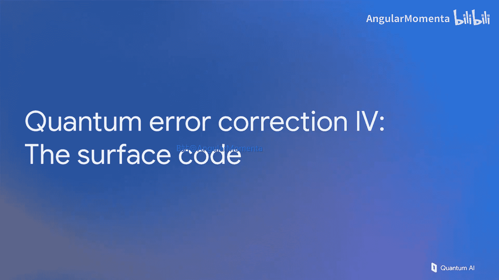

# 007：表面码详解

在本节课中，我们将深入学习表面码，这是一种重要的量子纠错码。我们将探讨其稳定子表示、逻辑操作、错误检测电路的设计原则，以及如何在表面码上进行基本的计算操作，如初始化和测量。

## 稳定子表示的必要性

上一节我们介绍了稳定子的概念，以及如何用一组稳定子来表示一个复杂的量子态。在之前的例子中，量子态并不复杂。但在本节讨论表面码时，稳定子表示法变得至关重要。

回顾一下，我们讨论了三种表示量子态的方法：显式态向量表示、稳定子列表表示，以及用图形表示的同一组稳定子。我们偏爱图形方法，因为它能让我们直观地展示表面码。

这是一个最小的非平凡表面码：九个数据量子比特排列成正方形，上面覆盖着X和Z稳定子的棋盘格图案。

## 为何选择图形表示

我们为何偏爱图形表示而非其他形式？让我们来看看原因。

如果用稳定子列表来表示这个码，数学表达式已经相当冗长。如果用态向量来表示，情况会更糟。这个态是通过将所有数据量子比特初始化为零态，然后测量所有稳定子来制备逻辑态的结果。态本身取决于测量值，实际上很难处理。

然而，了解它可以被写下来，并且明确地看到如何进行逻辑操作，这至少是有益的。例如，我们可以翻转这条垂直线上的量子比特，这将产生一个新的态，即我们的逻辑1态。这不是从逻辑0到逻辑1的唯一方法。

## 逻辑操作与拓扑性质

在讨论其他方法之前，我们先简化一下符号。目前，我们的逻辑X算符是翻转这条垂直线上的量子比特。但它同样可以是这条线，只要它从上边界延伸到下边界。这条X算符链与所有Z稳定子对易，这意味着它在每个深色格子上恰好接触两个点（或偶数个点）。因此，它是一个完全有效的逻辑X算符。这就是为什么它被称为拓扑码：它的许多性质只取决于我们是否使用一条X算符链从一个地方连接到另一个地方（这里是从上边界到下边界），而不取决于这条链形状的具体细节。

我们可以对逻辑Z做同样的事情，它被证明是一条从左到右的物理Z算符链。这里有一个接触中间行的例子，但同样，这不是唯一的方法。

一旦我们接受可以使用连接上下边界的任意X算符链作为逻辑X，使用连接左右边界的任意Z算符链作为逻辑Z，并且不需要具体讨论接触了哪些量子比特，那么我们就可以进一步省略量子比特的编号。这非常有帮助，因为这样我们就可以开始讨论更大的晶格，而不会被符号淹没。

## 边界与对易关系

我们可以更进一步，甚至抑制棋盘格图案本身，只关注顶部有一个X边界（X算符链可以在此终止），底部有相同类型的边界。左右两侧则是Z边界，即Z算符链可以终止的地方。

现在可以看到，给定一条从上到下的任意线，如果我们画一条从左到右的任意线，它必须与那条线相交奇数次。如果直接相交，那就是一次。如果绕过去再回来，或者再绕一次，那就是额外的两次，所以总是奇数次相交。逻辑Z和逻辑X算符总是在奇数个位置上相交，这意味着它们反对易。这正是我们需要的性质，以确保逻辑X和逻辑Z是有效的逻辑算符。

## 错误检测电路

好了，以上就是表面码的稳定子。我们最近花了一些时间讨论如何检测稳定子的值，这里写下了那些具体的电路。例如，下面这个电路的形式最接近我们之前讨论的受控A门，其中A是XXXX。这些是受控非门或受控X门。

这是该电路的显式表示，它将告诉我们在这个位置，这四个相邻量子比特的X算符是处于+1还是-1本征态。

然而，这里有一个问题：这些电路测量我们处于哪个本征态，原则上我们可以用它们来检测错误。但门的顺序呢？我们有很多可能的选择，有没有一个首选顺序？

## 错误在电路中的传播

在讨论顺序之前，我们需要了解错误如何通过电路传播。假设这个量子比特上有一个比特翻转错误，我想知道经过CNOT门后，这个比特翻转错误看起来像什么。我们可以通过在其前面放置一个恒等操作和两个CNOT门来计算，然后算出这组门等价于什么。答案是两个比特翻转。因此，比特翻转通过CNOT门的控制端传播会导致两个比特翻转。类似地，相位翻转通过CNOT门的目标端传播会导致两个相位翻转。这一点很重要，所以我们需要小心安排门的顺序，以免这种复制过程带来危险。

## 电路顺序的影响

让我们明确地看一下：Z错误可以变成成对的错误，比特翻转错误也可以变成成对的比特翻转错误。我们不希望这破坏我们的码。我们希望所有的错误都是沿着逻辑算符路径随机独立的。例如，如果我们安排的电路可能将单个错误变成沿着这条线的两个错误，那将是很糟糕的。

这里有一个明确的糟糕例子。我们以相位翻转错误为例，构建了一个最后接触这两个量子比特的电路。这意味着测量量子比特上的单个错误可能变成数据量子比特上的两个相关错误。现在，只需要两个随机事件就会导致一条非常接近逻辑算符的错误链，这会混淆我们的解码器，导致错误的纠正。解码器会认为你一定是这边只有一个错误，这将破坏我们的数据，导致数据丢失。

这没有达到我们期望的性能水平。这是一个距离为5的码。如果你计算这个正方形从一角到另一角的量子比特数量，你会发现每个方向有五个量子比特。它应该需要五个错误才能无法检测地从逻辑0变为逻辑1，或者至少需要三个独立错误才能走到一半并混淆解码器，使其引入错误的纠正。这是错误的电路顺序，无法达到那种性能水平。

## 正确的电路顺序

相反，这个电路中最后接触的两个量子比特必须将相位翻转错误传播到与我们的逻辑算符垂直的方向上，这一点非常重要。之前我们看到当它们平行时会发生什么：码距会降低，需要更少的错误就能破坏码。在这里，我们保持了码距。技术上，仍然需要等于（码距+1）/2个错误来破坏一个距离为5的码，在这个例子中是3个。每次我们将码距增加2，这个数字就增加1。这对于两种类型的错误都成立，不仅仅是相位翻转需要将其电路安排为将错误传播到与逻辑算符垂直的方向，我们的比特翻转电路也必须如此安排，使其最后两个门接触的量子比特是垂直的。这为我们的操作顺序布局设定了一个约束，以保留我们精心构建的码的全部强度。

## 并行电路排序

一旦我们遵循这个约束，我们可以找到与完美并行应用这些操作一致且不会严重传播错误的排序。这里有一个这样的排序示例，它是完全并行的。你会注意到，每个数据量子比特总是被不同时间序列的门接触。在这里共享一个对应时间步的编号是不合法的，所以这是一个有效的排序。

还有一个技术约束：你必须能够说出这些稳定子中哪一个在任何邻居之前被测量。如果你看这个，你会发现1-2门比2-4门早。所以这个稳定子比它的邻居更早被测量（在最近邻的意义上）。这也是一个重要的性质，当你环绕这个棋盘时，你会发现它总是满足的：总是可以告诉一对相邻的稳定子哪一个先被测量，即使从某种意义上说它们是同时测量的，门的顺序给了你这种判断能力。

## 基本计算操作

好了，现在我们有了一个不会严重传播错误、可以完美并行实现的电路。那么，让我们开始做一些不仅仅是检测错误的事情。如何进行一些基本的计算？比如初始化和测量一个表面码。

如果我们想制备逻辑0态，实际上你已经看到了一个例子。你只需将所有数据量子比特初始化为|0>，然后开始测量所有稳定子，就会得到逻辑0。类似地，如果你想要逻辑+态，只需将每个数据量子比特物理初始化为|+>。

在测量方面，如果你想以逻辑Z基测量量子比特（即询问它是处于逻辑0还是逻辑1态），那么就以常规方式测量所有物理量子比特，询问每一个是|0>还是|1>。

最后，如果你想以逻辑X基测量那个逻辑量子比特（即它是处于|+>态还是|->态），你可以简单地以物理X基测量每个数据量子比特，然后进行常规测量。

这些是最简单的逻辑操作：初始化和测量，都可以在两种基下进行。

## 内存操作与三维电路

如果我们想做一点内存操作，不仅仅是初始化后立即测量，而是在中间实际运行多轮错误检测，我们最终会得到一个看起来像这样的电路。这只是表面码的一个切片，因为讨论整个表面码的完整电路在幻灯片上写出来太复杂了。让我们把它看作表面码的一个代理，并检查它是否按预期工作。

如果我们专注于检测比特翻转的电路（即测量Z稳定子的电路），那么在开始时，如果你想运行一个完整的电路，会有一个单独的测量来告诉我们关于错误的信息。因为我们期望在没有错误的情况下，这个测量返回结果0。幻灯片上的这个电路与我们之前讨论的关键区别在于初始的状态准备轮。现在，我们不需要将这个测量与之前的测量进行比较，因为一开始就没有之前的测量，我们已经期望它是0。所以它本身就是一个检测器。

进入电路的主体部分，我们又回到了之前讨论的情况：我们将每个测量与之前的测量进行比较，那是一个检测器。还有一个新的情况：最后一轮测量。在这里，我们将把数据的直接物理测量与之前的测量进行比较。这两个测量是Z稳定子的直接测量，因为我们单独测量每个量子比特，我们可以取这两个测量的奇偶性，这将告诉我们是否处于+1或-1本征态。如果它们相等，我们就得到了+1本征态；如果不相等，我们就测量到了-1本征态。这意味着，如果我们取所有这三个测量的奇偶性，它本身就是一个检测器：在没有错误的情况下应该是偶数，如果附近有错误，它将是奇数。

## 三维电路与解码

让我们简要地看一下表面码三维电路的一小部分，并强调没有什么不同，只是更复杂。你通常会使用软件进行这种分析，而不是在纸或幻灯片上，但原理没有不同。你仍然从根本上拥有一个由初始化、CNOT门和测量组成的电路。你有传播并触发检测事件的错误。从根本上讲，你将使用所有这些信息，构建一个现在是三维的图，其中边的权重代表导致该边（即端点处的检测事件）的所有错误过程的总概率。然后，当你运行实际实验时，你将把这些检测事件挂在这个图上，在图上进行最小权重完美匹配，以找出最能解释观察到的检测事件的最可能的底层错误。

因此，即使是距离为5的码（如幻灯片所示，5x5个数据量子比特加上另外24个测量量子比特），这也是一个49量子比特的电路。如果我们真的想运行这个电路，分析其输出，并研究它的性能，我们将需要一些相当先进的工具。这将是下一个视频的主题。

## 总结与延伸

在结束本节之前，请注意，如果你对计算的更多细节感兴趣，我们只讨论了表面码中的内存操作。这里有几个参考文献，将带你了解在表面码上执行CNOT门和其他更复杂的多量子比特和单量子比特逻辑操作的细节。

无论如何，下次我们将讨论用于分析表面码的高级工具，特别是在内存的背景下，你仍然可以学到很多东西。

本节课中，我们一起深入学习了表面码。我们了解了其基于稳定子的表示方法，以及如何利用图形简化理解。我们探讨了逻辑X和Z算符的拓扑性质，它们由连接边界的算符链定义。我们重点讨论了错误检测电路的设计，特别是门的顺序必须确保错误传播方向与逻辑算符垂直，以维持码距。我们还学习了在表面码上进行初始化、测量和内存操作的基本方法。最后，我们了解到分析表面码性能需要将其视为三维电路并使用图匹配算法进行解码。表面码是实现容错量子计算的一个强大工具。