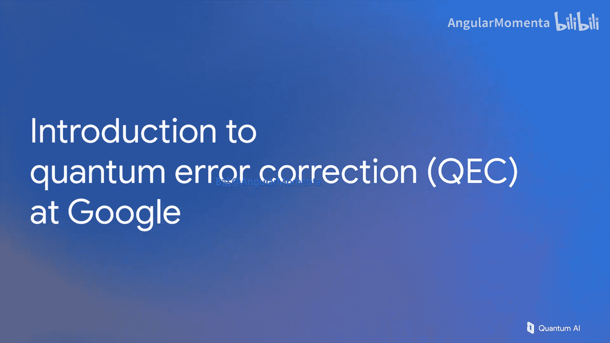
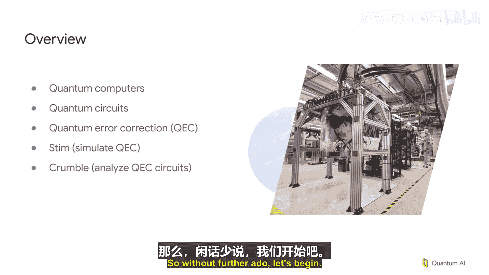

# 001：量子纠错入门

欢迎来到谷歌的量子纠错入门课程。我是Must Fowler。我在这个领域已经工作了超过20年，很高兴能为大家讲解这门课程的内容。

在开始之前，我想感谢几位为此课程做出贡献的人。Dave、Abe和August都帮助塑造了这门课程并推动了它的启动。同时，制作团队的Jessica、Iva和Es也帮助打磨了最终的成果。

## 课程概述

在本课程中，我们将学习量子纠错的核心概念与实践。课程将从基础硬件开始，逐步深入到量子电路理论和纠错技术，最终介绍用于大规模模拟和计算的先进工具。

## 课程内容结构

上一节我们介绍了课程的整体目标，本节中我们将详细看看课程的具体安排。以下是课程将涵盖的主要模块：

1.  **量子计算机硬件概述**：首先，我们将概览各种量子计算机硬件。目前存在多种多样、非常奇特且有趣的硬件平台。我们将从这里开始，确保大家对人们正在尝试构建的设备有一个良好的基础认识。
2.  **量子电路理论**：在硬件基础之上，我们将学习量子电路的理论。这部分内容会进展得比较快，但会从最基础开始讲解。因此，即使你之前没有接触过这个领域，在经过几次内容重复学习后，也希望你能跟上课程后续的进度。
3.  **量子纠错基础**：有了前面的基础，我们将进入量子纠错部分。我们将逐步构建用于检测错误的基本电路，并讲解如何处理这些信息的经典计算过程。我们将层层递进，学习你可能尚未听过的概念，如稳定子码。
4.  **大规模电路模拟器**：为了处理大规模量子电路并快速返回结果，我们将介绍先进的模拟器。具体来说，我们会讲解ST，这是我们用于量子纠错电路的最先进模拟器。
5.  **复杂计算管理工具**：最后，我们将介绍Crumble。这个工具帮助我们管理在受量子纠错保护的数据上进行计算的复杂性。

## 总结

本节课中，我们一起学习了谷歌量子纠错入门课程的整体框架和目标。我们从感谢贡献者开始，然后概述了课程将涵盖的五个核心部分：硬件基础、电路理论、纠错原理、模拟工具以及计算管理工具。接下来的课程将逐一深入这些主题。