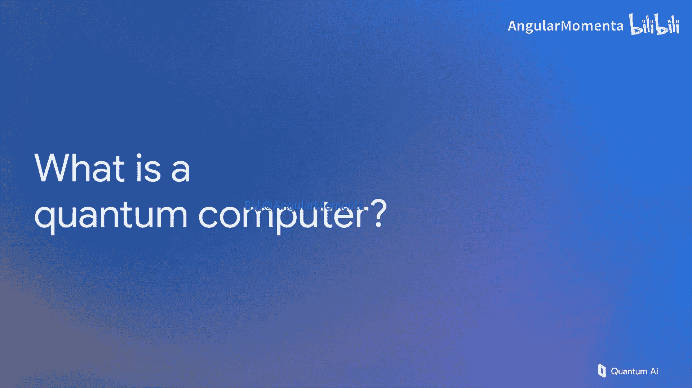
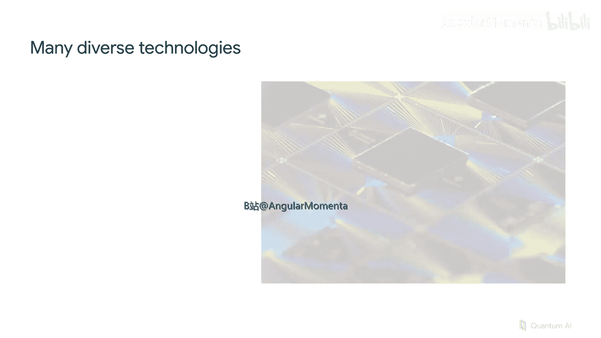
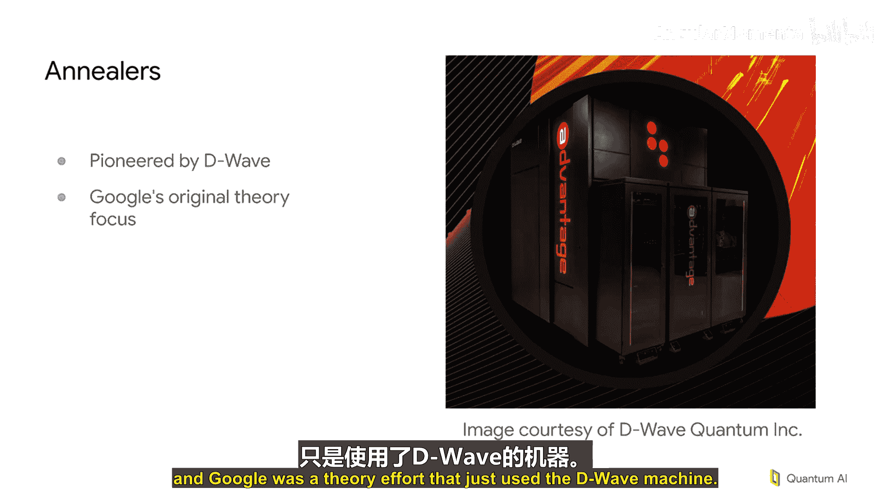

# 002：什么是量子计算机？🔬

在本节课程中，我们将探讨“什么是量子计算机”这个问题。我们将了解到，量子计算机并非单一的技术，而是一个活跃的研究领域，包含多种不同的物理实现方案。我们将逐一介绍几种主流的量子计算技术，并分析它们各自的原理、优势与挑战。

## 量子计算技术概览

上一节我们介绍了量子计算的基本概念，本节中我们来看看几种具体的物理实现技术。需要强调的是，这是一个选择性的介绍，并非全部技术。

以下是几种主要的量子计算技术方案：

1.  **D-Wave系统（量子退火）**：这是谷歌早期涉足量子硬件的起点。其核心并非高相干性的量子比特操控，而是通过大量耦合器对众多量子比特施加约束，让系统**弛豫**到尽可能满足所有约束的状态。本质上，它是一个**优化器**。其挑战在于，目前没有已知的方法为此方案实施量子纠错。随着系统规模增大，需要更低的温度和更精确的控制，其可扩展性存疑。
2.  **离子阱**：利用电磁阱（通常在表面电极上）捕获单个离子原子，并使用离子的内部能级状态进行计算。其优势是基于原子能级，拥有极纯净的物理特性，因此能实现**保真度极高**的量子门操作。主要挑战在于速度和规模，目前系统通常只有几十个离子，且需要复杂的激光或微波控制系统。
3.  **中性原子**：使用激光阱捕获中性原子，无需实体电极。原子被概率性地捕获后，可移动以形成密集的阵列。这种技术能实现**数百个量子比特**的规模，一些最大规模的量子实验即基于此。挑战包括操作速度，以及在某些方案中，测量会导致原子丢失，需要持续补充新原子。
4.  **光量子**：基于光子芯片，概率性地产生单光子并纠缠它们以构建更大的量子态。原理上，通过足够多的光源和路由，丢弃失败案例，可以构建用于量子计算的大规模量子态。挑战在于需要快速路由光子、克服光子损耗，并实现快速的光开关。
5.  **量子点**：通过电极阵列囚禁单个电子，利用电子状态编码数据。这是英特尔等机构重点投入的方向。挑战在于**扩展性**。量子点尺寸极小（纳米级），目前研究设备尚难以形成二维阵列。没有二维阵列，单个量子比特的失效可能导致系统被分割成无法通信的部分，难以实现容错。
6.  **超导量子比特（谷歌重点方向）**：在硅片上刻蚀超导电路，其行为类似可调谐的谐振器（如吉他弦）。基态和第一激发态分别代表 |0⟩ 和 |1⟩。挑战在于需要抑制电路进入更高的能级（|2⟩, |3⟩ 等），这些态对计算无用。此外，超导量子比特**尺寸较大**（毫米级），但需要极低温（约10毫开尔文）运行以保持量子态。制造工艺中，约瑟夫森结的特性对电路性能极为敏感，导致芯片**良率**是重大挑战。

## 超导量子比特的深入与系统构成

现在让我们更详细地看看超导量子比特技术。一个可工作的超导量子比特芯片只是起点。一个完整的量子计算机系统包括：**低温冰箱**、复杂的**布线**以及驱动量子比特状态变化的**微波电子学系统**（通常占据整个机架）。

这提醒我们，对于所有讨论过的量子技术，一个普遍的事实是：**量子计算机并不“小”**。它通常需要一整套庞大而精密的设备来使核心的量子比特正常工作。我们课程后续将聚焦的核心——量子态——只是整个庞大装置中极小的一部分。

## 总结

本节课中我们一起学习了量子计算机的多种物理实现路径。从D-Wave的量子退火，到离子阱、中性原子、光量子、量子点，最后到谷歌重点研究的超导量子比特，我们看到了每种技术独特的原理、当前的成就与面临的主要挑战（如扩展性、速度、纠错和制造良率）。我们也认识到，一个实用的量子计算机是一个复杂的系统工程，而不仅仅是那个承载量子比特的芯片。在下一讲中，我们将把注意力转向对这些量子比特可以进行的具体操作。