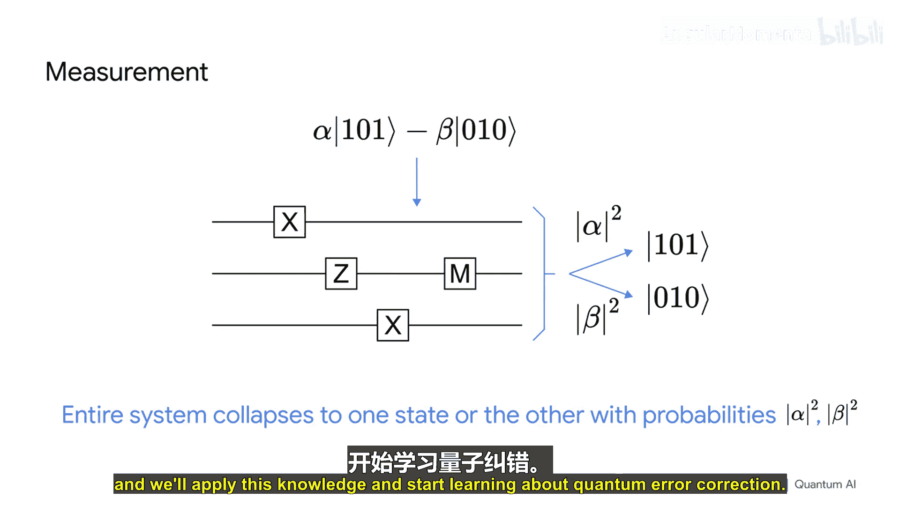

# 003：量子态与量子电路

在本节课中，我们将学习量子计算的基础：量子态和量子电路。我们将暂时抛开所有硬件细节，专注于理解量子比特的表示方式、量子态的数学描述以及如何通过量子门来操作它们。这是学习量子纠错的重要前提。

## 量子态：量子计算机的“0”和“1”

上一节我们介绍了课程背景，本节中我们来看看量子计算的基本存储单元——量子态。

在经典计算机中，我们使用比特（0或1）和比特串来存储信息。量子计算机则使用量子比特。一个由n个量子比特组成的系统，其状态不是简单的0或1字符串，而是由**2^n个复数**来描述。每个复数对应系统所有可能经典状态（如000， 001， ...， 111）的“振幅”。

例如，一个3量子比特系统有8种可能状态，其量子态可以表示为：
`|ψ⟩ = α₀|000⟩ + α₁|001⟩ + α₂|010⟩ + α₃|011⟩ + α₄|100⟩ + α₅|101⟩ + α₆|110⟩ + α₇|111⟩`
其中每个α都是一个复数。

这些振幅的物理意义是：测量系统时，得到某个特定经典状态（如`|101⟩`）的概率等于该状态对应振幅的模平方（`|α|²`）。所有状态的概率之和必须为1，因为测量总会得到一个确定的结果。

## 量子门：操作量子态

了解了量子态的表示后，我们来看看如何操作它们。量子门是改变量子态振幅的基本操作。

### 比特翻转门（X门）

X门是最简单的量子门之一，其作用类似于经典的非门（NOT gate）。

以下是X门的行为：
*   当输入为`|0⟩`时，输出为`|1⟩`。
*   当输入为`|1⟩`时，输出为`|0⟩`。

当应用于叠加态时，X门会同时作用于所有分量。例如，对一个三量子比特态`α|000⟩ + β|111⟩`应用X₂门（翻转最左边的量子比特，按我们的约定，下标从左到右递增），结果是：
`X₂ (α|000⟩ + β|111⟩) = α|100⟩ + β|011⟩`

### 相位翻转门（Z门）

Z门是量子计算特有的操作，它可以改变振幅的符号（相位）。

以下是Z门的行为：
*   当输入为`|0⟩`时，输出仍为`|0⟩`。
*   当输入为`|1⟩`时，输出变为`-|1⟩`。

再次以态`α|000⟩ + β|111⟩`为例，对其应用Z₂门：
`Z₂ (α|000⟩ + β|111⟩) = α|000⟩ - β|111⟩`
因为只有`|111⟩`分量中第二个量子比特是1，所以其振幅符号被翻转。

## 量子电路：门操作的序列

我们已经介绍了两种基本门，现在来看看如何将它们组合起来。量子电路是表示一系列量子门操作的标准方式。

在量子电路图中：
*   每条水平线代表一个量子比特。
*   时间从左向右推进。
*   量子门按照从左到右的顺序依次作用在量子态上。

让我们追踪一个简单电路的作用。初始态为`α|000⟩ + β|111⟩`。
1.  首先遇到作用于量子比特2的X门，得到`α|100⟩ + β|011⟩`。
2.  接着遇到作用于量子比特1的Z门，得到`α|100⟩ - β|011⟩`（因为`|011⟩`中第二个量子比特是1）。
3.  最后遇到作用于量子比特0的X门，得到最终输出`α|101⟩ - β|010⟩`。

## 更多重要的量子门

除了X和Z门，还有几个关键的门需要掌握。

### 哈达玛门（H门）

H门可以创建叠加态，是许多量子算法的核心。

以下是H门的行为：
*   `H|0⟩ = (|0⟩ + |1⟩)/√2`，这个态称为`|+⟩`态。
*   `H|1⟩ = (|0⟩ - |1⟩)/√2`，这个态称为`|-⟩`态。

测量`|+⟩`或`|-⟩`态，得到0或1的概率都是50%。虽然测量概率相同，但它们是不同的量子态，因为再次应用H门后：`H|+⟩ = |0⟩`，而`H|-⟩ = |1⟩`。

### 受控非门（CNOT门）

要进行有意义的计算，量子比特之间必须相互作用。CNOT门是最常用的双量子比特门。

CNOT门有一个控制量子比特（带黑点）和一个目标量子比特（带⊕符号）。其规则是：
*   如果控制比特为`|0⟩`，则目标比特保持不变。
*   如果控制比特为`|1⟩`，则目标比特翻转（应用X门）。

### 受控Z门（CZ门）

CZ门是另一个有用的双量子比特门。其规则是：
*   仅当两个量子比特都为`|1⟩`时，整个态的振幅符号才会翻转。
*   在其他情况下，态保持不变。

由于其对两个量子比特的作用是对称的，其电路符号像一个哑铃，没有明确的控制和目标之分。

## 电路等价性与练习

理解不同门序列的等价性有助于简化电路。这里有一个重要的电路恒等式：
`H（目标比特）· CZ · H（目标比特） = CNOT（控制比特， 目标比特）`

你可以通过将CNOT门的四种可能输入（`|00⟩， |01⟩， |10⟩， |11⟩`）分别代入左边的门序列（H-CZ-H）来验证这一点，结果与直接应用CNOT门完全相同。

## 测量：从量子到经典

最后，我们介绍量子计算中至关重要的操作——测量。

测量会使量子态“坍缩”到与测量结果一致的经典态。以我们之前得到的态`α|101⟩ - β|010⟩`为例，如果我们测量中间的量子比特（量子比特1）：
*   以概率`|α|²`，我们测得1，整个态坍缩为`|101⟩`。
*   以概率`|β|²`，我们测得0，整个态坍缩为`|010⟩`。

关键点是，对一个量子比特的测量会影响整个系统的态，使其坍缩到与测量结果相容的那些分支。

## 总结

本节课中我们一起学习了量子计算的核心基础。我们首先了解了量子态如何用复数振幅的叠加来表示。接着，我们学习了如何用X门、Z门、H门、CNOT门和CZ门等基本量子门来操作这些态。我们通过量子电路图来可视化这些操作序列，并理解了测量如何使量子态坍缩为经典结果。

掌握这些量子态和量子电路的基本概念，是进入下一阶段——学习量子纠错——的必要准备。在接下来的视频中，我们将应用这些知识来探索如何保护脆弱的量子信息免受错误影响。

