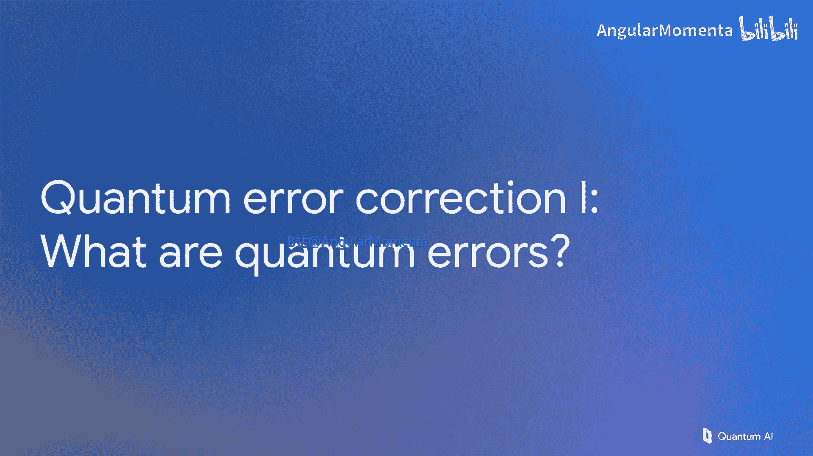

# 004：什么是量子错误？🔍

在本节课中，我们将学习量子计算中一个核心且不可避免的挑战：量子错误。我们将从经典的比特错误概念入手，逐步构建对量子错误的理解，并探讨如何通过编码和纠错技术来应对这些错误。

## 从经典错误到量子错误

上一节我们讨论了量子电路，并假设一切都能完美运行，没有错误。但在现实世界中，情况并非如此。实现量子电路并使其按预期工作非常困难。因此，我们将用一节课的时间来讨论错误，即当你尝试运行量子计算机时可能出现的所有问题。

与之前一样，我们将从经典计算机的直觉开始，讨论经典错误。这更简单，能为我们构建概念提供大量素材。

### 经典比特存储与纠错

我们从一个经典问题开始：存储一个比特（0或1），特别是在硬件存在错误的情况下。硬件在单位时间内存在一个比特翻转的概率P。问题是，如果我们不能接受单位时间内比特翻转的概率P，我们如何做得更好？无论单位时间是秒还是世纪，如果我们希望以高成功率存储数据超过单位时间，我们能做什么？

一个自然的想法是，如果硬件不完美，就使用更多硬件，制作副本。但这还不够。如果只有副本，且每个副本都有失败概率P，那么经过大约1/P的时间后，它们都会变得随机，你仍然会失败。必须引入某种智能处理才能使其工作。

一个很好的例子就是**多数表决**。如果你等待一段时间，发生了一个错误，但你有五个副本（如示例所示），通过多数表决，你会回到初始状态（多数为0），重置掉队的比特，就完成了。目前我们假设这种多数处理既是瞬间的又是完美的。我们将逐步移除这个假设。

现在假设发生了两个错误。这仍然是少数。当我们进行多数表决时，我们回到了初始状态。然而，如果发生三个或更多（超过一半）的比特翻转，我们就会失败。因此，这不是一个完美的协议。无论我们使用多少比特来提高成功率，总会有一定的失败概率。不过，这已经相当不错了。我们从单个比特在单位时间内有失败概率P，变成了五个副本，现在至少需要三个（即P³量级）错误才会导致失败。

在术语上，我们现在拥有的是一个**逻辑比特**。我们五个物理比特的集合形成了一个逻辑比特，其可靠性高于任何一个物理比特。

### 编码距离与纠错能力

我们希望进一步升级处理方式和术语。首先，我们引入**编码距离**的概念。对于五个比特，需要五次翻转才能到达相反状态（从逻辑0到逻辑1）。这意味着编码距离是5。一旦我们形式化了这个概念，我们就可以说，一个距离为D的编码只有在至少发生(D+1)/2个错误时才会失败。通常，如果我们希望错误概率任意小，只需使用越来越多的比特，任意增加编码的距离，就能以指数方式抑制错误。

### 从多数表决到配对奇偶校验

我们希望在这个例子中做更多事情。到目前为止，我们讨论了多数表决，这隐含意味着你将查看每一个比特，确定其状态，然后进行多数表决。这在量子计算中不是一个兼容的操作。因此，我们将调整我们的处理方式，以同样的效果，但采用一种能够过渡到量子纠错的方法。

现在，我们不再进行多数表决，而是查看**配对奇偶校验**。在第一个发生单个错误的例子中，你会发现我们有四个奇偶校验结果，前两个是1，后两个是0。我们可以利用这些信息做任何我们想做的事情。我们选择用它形成一个图：一个四节点、五条边的图，其中两条边被标为红色，因为那是我们得到奇数奇偶校验结果（即1）的地方。

这就定义了一个图问题。如果你解决以下问题：将高亮顶点成对连接或连接到最近的边界，使得使用的边数最少，这被称为**最小权重完美匹配**。图中高亮的绿色边就是该解决方案——一条连接那两个高亮节点的边。这告诉我哪个比特出了问题（具体是顶部第二个比特）。实际上，我根本不需要回到我的数据，我可以把这个知识留在计算系统中：那个比特是错误的。之后，当我去查看它时，翻转它的结果。计算机中可能发生更多错误，我可以利用现有的知识正确计算奇偶校验。

因此，与其说前两个比特导致了一个奇数奇偶校验（1），我们知道第二个比特是错误的，所以我们将其纠正为0。这使我们能够只看到错误链的端点，即这两个新的错误比特。这两个新的比特翻转给了我们一个有两个高亮节点的新图，一个带有两条新绿色边的新解决方案。最终，我们留下了对错误位置的信念：我们相信中间三个比特是错误的。然后，我们是否应该实际查看这些比特，确定每一个的状态，并得到结果（如0, 1, 1, 1, 0）？我们将利用对错误的了解来翻转中间那些比特，回到我们想要的状态。

事实证明，我们讨论的一切完全等同于进行多数表决。花点时间想想为什么是这样。我们将在量子案例中使用这个类比，但首先我们需要升级对错误的理解。

## 量子错误的丰富性与挑战

量子计算机中的错误比简单的比特翻转要丰富和多样得多。正如在硬件视频中提到的，我们在谷歌研究的硬件并不真正是一个量子比特（qubit），它有超过两个能级。除了基态和第一激发态，还有更高的激发态。如果我们的系统进入这些更高的状态，这被称为**泄漏**，这是一个问题，因为当一个泄漏到高能级的量子比特与其他量子比特相互作用时，它会污染所有接触到的东西。更糟的是，泄漏可以在计算机中传播。

在这张图中，我们从芯片中间一个泄漏的单个量子比特开始，然后运行一个旨在检测错误的量子电路。但实际上，它正在将那个错误传播到整个电路中。这是一个需要在硬件层面设计避免的例子。如果我们把它留给错误检测系统，这将导致失败。泄漏会累积，最终计算会失败。

这是另一种从测量过程本身导致泄漏的方式。当我们测量量子比特时，我们使用特定的微波音调，你可以认为它被两种不同状态（0和1）以略微不同的方式反射。它在信号中引入了一个可被室温检测到的偏移。如果你输入大量功率，理论上可以获得更快的测量，但你也向系统中倾注了更多能量，可能将其激发到更高的状态。由于许多量子比特连接到同一条线上，这可能导致许多不同量子比特出现大量错误。所以这是我们需要管理的事情。我们希望快速测量，但不能太快，否则会引入大量错误。

接下来，因为我们的芯片工作在10毫开尔文的极低温度，量子比特的能量尺度非常低，倾注的能量非常显著。你可以在这里看到一个图表。这是对我们芯片的一次冲击，倾注了大量能量，导致我们所有的数据升温并变得随机。在几十毫秒（相当于许多轮错误检测）的时间内，芯片基本上无法工作，错误概率接近50%的水平。这显然又是我们无法在软件层面应对的事情，必须在硬件层面减轻这种影响。

## 量子错误模型与处理基础

那么，我们剩下什么？我们明确地得出结论：真实的量子计算机并不理想。我们想要这样的门：你施加到一个状态上，它能在输出端精确地给出你想要的结果。但在现实中，这不会发生。我们还展示了我们甚至不期望通过量子软件来纠正的错误类型的例子。

那么，我们如何继续？我们将不得不依赖硬件工程师的建议，至少满足以下假设：无论发生什么错误，它们都使我们留在状态0和1中。这允许我们将这两个状态表示为一个只有两个分量的向量。因此，0态可以表示为 `[1, 0]`，1态可以表示为 `[0, 1]`。

如果我们不做这个假设，那么我们将需要更长的向量来表示那些更高的状态，这在做错误检测和纠正时会变得有问题。因此，我们将专注于这种情况。同样地，当我们有不止一个量子比特（例如两个量子比特的系统）时，假设没有泄漏到更高的状态，这允许我们将该系统表示为一个长度为4（不多于）的向量。这非常有用，因为当我们考虑每个门的操作时，我们现在可以将它们写成矩阵。

这里是我们相同的哈达玛门（H门）和相同的CNOT门，但这次表示为作用于向量的矩阵。向量 `[α, β]` 替换了原始状态 `α|0> + β|1>`。我们选择了以 `|0>` 和 `|1>` 为基础的表示法，这允许我们以这种形式书写它。通过这样做，我们现在可以将H写成所示的矩阵，CNOT门也是如此。通过选择将我们自己限制在状态0和1，它允许我们以矩阵的形式进行清晰的表述。

完成这些后，我们现在可以讨论那些我们可以用量子电路本身处理的错误。因此，我们将允许自己有一个单量子比特门（一个2x2矩阵），后面跟着一个任意的矩阵（任何东西都可以），这就是我们的错误。同样，一个双量子比特门（4x4矩阵）后面跟着一个任意的4x4错误矩阵。

我想重申，这仍然是一个限制，但这明确地忽略了泄漏，并假设这些问题已经在硬件层面得到处理。测量之前有一个任意错误，初始化状态 `|0>` 的方框后面也有一个任意错误。我们现在想讨论如何处理这种形式的错误。

### 泡利矩阵与错误分解

一些定义：这些是泡利矩阵——单位矩阵I、X、Y和Z。它们非常方便，我们会经常使用。我们将专注于X和Z矩阵，即比特翻转和相位翻转矩阵。这些特别有用，因为我们可以用它们作为任意矩阵空间的基。我可以取一个任意的2x2矩阵，并将其写成仅由单位门、比特翻转、相位翻转以及两者同时发生的线性组合。这实际上是一小段深刻的数学，它意味着一个任意错误真的只是这些简单错误的组合：可能什么都没有，可能是一个比特翻转，可能是一个相位翻转，或者两者都有。

这意味着在检测和纠正错误时，我们可以只关注比特翻转和相位翻转。因为即使它们可能非常复杂（这些任意矩阵），那种任意性实际上只是简单事物的线性组合。

你也可以对多量子比特门做同样的事情。这是一个双量子比特门的例子。一个双量子比特错误可以分解为16项的和。这些项利用了张量积，其定义如下所示。本质上，你取两个矩阵，并将最右边的矩阵代入最左边矩阵的每一个位置。这里有一个单位矩阵与X矩阵张量的例子，你会看到X矩阵被代入到原来为1的两个位置。

因此，我们可以分解错误，并且我们将确保专注于仅发现比特翻转和相位翻转。所以，我们现在的目标是构建实现这一点的电路，然后在软件中跟踪这些检测到的错误，这与我们在经典案例中所做的非常类似。我们将在下一个视频中开始讨论这些具体的电路。

## 总结

在本节课中，我们一起学习了量子计算中错误的基本概念。我们从经典的比特存储和多数表决纠错入手，理解了逻辑比特和编码距离的概念。接着，我们探讨了量子错误的丰富性和独特性，如泄漏和能量冲击，这些挑战需要在硬件层面进行管理。最后，我们建立了量子错误模型的基础，引入了泡利矩阵，并理解了任意量子错误都可以分解为比特翻转和相位翻转的组合，这为后续设计量子纠错电路奠定了理论基础。下一节，我们将开始构建具体的量子纠错电路。