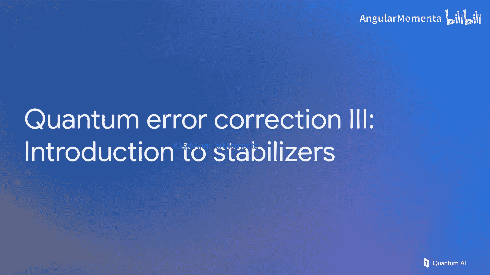

# 006：量子纠错实践 III - 稳定子理论入门 🧮




在本节课中，我们将深入探讨量子纠错的理论基础，特别是稳定子理论。我们将学习如何用稳定子来描述量子态，以及如何利用它们来检测和定位量子比特上的错误。

上一节我们介绍了量子纠错的基本概念，本节中我们将构建一个理论框架来应对复杂量子电路的复杂性。这个框架就是稳定子理论。

## 什么是稳定子？

我们从泡利矩阵开始。以下是四个基本的2x2矩阵：单位矩阵 `I`、比特翻转 `X`、相位翻转 `Z` 以及两者同时翻转 `Y`。`Y` 矩阵可以近似看作是 `X` 和 `Z` 的乘积。

为了解释这个理论，我们需要一些线性代数知识。我们将讨论这些矩阵的张量积。以下是一个例子：
```python
X ⊗ I ⊗ Z ⊗ Z ⊗ Y
```
对于一个五量子比特系统，这表示对第一个量子比特进行比特翻转，对第二个不做任何操作，对第三和第四个进行相位翻转，对最后一个同时进行两种翻转。

更紧凑的写法是 `X I Z Z Y`，其含义相同。任何泡利算符的有符号张量积，我们简称为一个“算符”，我们将广泛使用它们。

## 单量子比特稳定子示例

一些简单的稳定子就是单个泡利矩阵。例如，`Z` 矩阵。当你将其应用于 `|0>` 态时，状态不变。因此我们说 `|0>` 态被稳定子 `Z` 所稳定。这允许我们用算符符号来替代态符号。

更多例子：
*   `|1>` 态被算符 `-Z` 稳定。
*   `|+>` 态被算符 `X` 稳定。
*   `|->` 态被算符 `-X` 稳定。

我们需要熟悉“本征态”这个术语。上述状态就是其对应算符的本征态，即在算符作用下保持不变的状态。

这暗示了一种符号替换：如果一个算符有一个定义良好的 `+1` 本征态（即在其作用下不变的状态），那么我们可以不写出该状态，而直接写出该算符。目前看来，写这个符号和写那个符号似乎一样困难，但随着我们转向更复杂的量子纠错态，这样做的好处将越来越明显。

## 多量子比特稳定子

让我们从单量子比特扩展到多量子比特态，特别是一个三量子比特态：
```
|ψ> = |000> + |111>
```
这个特定的三量子比特态被三个独立的稳定子所稳定：
1.  `X X X`
2.  `Z Z I`
3.  `I Z Z`

如果我们翻转每个比特，三个 `0` 变成三个 `1`，三个 `1` 变成三个 `0`，我们得到的是初始状态。因此，`|ψ>` 确实是 `X X X` 的 `+1` 本征态。同样，它也是 `Z Z I` 和 `I Z Z` 的 `+1` 本征态。你可以也应该将这些算符应用于该态，会发现回到了起点。

现在你可能仍然觉得，列出这三个稳定子看起来并不简单。让我们继续探索。

为了确保理解扎实，让我们详细计算其中一个例子：将稳定子 `Z Z I` 应用于态 `|ψ>`。

这是从上一张幻灯片中取出的态。这是我们正在应用的算符。我们将其分配到叠加中的所有态上。`Z` 对 `|0>` 态不做任何操作，每次我们将 `Z` 应用于一个 `|1>` 态时，我们会得到一个负号。因为有两个 `Z` 算符，所以有两个负号，这再次让我们回到了起点。当你思考将稳定子应用于特定状态时，脑海中应该有这个步骤序列。

## 稳定子与错误检测

这如何与我们讨论的量子纠错，特别是错误联系起来呢？

让我们回到这个态，但现在对其施加一个错误：一个 `X2` 错误（翻转第二个量子比特，按当前符号表示是最左边的量子比特）。现在我们有了 `|100> + |011>`。什么改变了？

让我们回到上一张幻灯片详细讨论的算符 `Z2 Z1`，但现在将其应用于这个带有错误的态，看看这意味着什么。

之前没有错误时，我们有 `Z2 Z1` 的 `+1` 本征态。现在当我们计算时，`X2` 可以简单地穿过 `Z1` 算符，因为它们作用于不同的、互不影响的量子比特。然后 `X2` 和 `Z2` 作用于同一个量子比特，它们反对易，将其穿过会得到一个负号。我们现在可以说，带有错误的态 `X2|ψ>` 是算符 `Z2 Z1` 的 `-1` 本征态。

因此，在遭受错误后，我们改变了关于特定算符是 `+1` 还是 `-1` 本征态的陈述。所以，如果我们能找出如何测量我们的稳定子是 `+1` 还是 `-1` 本征态，那将是一种检测错误的方法。事实上，这就是我们要做的。

## 测量本征态的电路

什么电路能够告诉我们一个态是特定算符的 `+1` 还是 `-1` 本征态呢？答案是下面这个电路。你应该尝试计算这个电路在两种可能测量结果（`0` 和 `1`）下的输出。

现在，假设你已经尝试过了，让我们一起逐步分析。

初始时，我们只有态 `|0>|ψ>`，即我们的输入。应用哈达玛变换后，我们在第一个量子比特上得到 `|+>` 态（`|0>` 和 `|1>` 的叠加）。现在我们将执行一个受控 `A` 门，这意味着如果控制位是 `1`，则将算符 `A` 应用于态 `|ψ>`；如果是 `0`，则什么都不做。在 `|0>` 的情况下，我们什么都不做；在 `|1>` 的情况下，我们将对态 `|ψ>` 应用 `A`。然后我们将应用另一个哈达玛门。将这个态应用于 `|0>`，我们得到另一个 `|+>`；应用于 `|1>`，我们得到 `|->` 态。然后，如果我们重新排列这些项以强调两种可能的测量结果，这就是测量结果为 `0` 时在其余量子比特上留下的态；如果我们得到测量结果 `1`，我们将留下这个态在其余量子比特上。

仔细观察这两项，你会发现这是 `A` 的 `+1` 本征态。`|ψ> + A|ψ>`，给定 `A^2 = I`，这正是我们开始时的状态。因此，这个电路不仅告诉我们它所接触的量子比特上的态是 `A` 的 `+1` 还是 `-1` 本征态，而且对于任何输入态，它都会根据观察到的测量结果，将该输入投影到这两个本征态之一（要么是 `+1` 本征态，要么是 `-1` 本征态）。所以，这就是我们正在寻找的电路。它告诉我们是否有 `+1` 或 `-1` 本征态，并且如果我们的态偏离了这两种可能性之一，在运行此电路后，它将被清理并只成为其中一种状态。从根本上说，这个电路使我们那些总想被弄乱的量子态保持清洁。

## 定位错误：一个具体例子

现在让我们运行一个具体例子，用我们的稳定子定位错误。继续之前的例子，我们对第二个量子比特（最左边的量子比特）施加了一个比特翻转，然后那个翻转将我们的稳定子 `Z Z I` 变成了 `-Z Z I`。

一个好的练习是去思考，在这些错误之后，稳定子的符号会是什么。你可以再花点时间，看看这些态，计算出来。

你会发现：
*   如果你翻转中间比特，那么这两个符号都会翻转（这是中间量子比特，如果我们施加一个与这两者都反对易的错误，两个稳定子的符号都会被翻转）。
*   最后，如果我们只翻转最右边的量子比特（量子比特0），它只与最后一个稳定子反对易，因此只有它的符号会被翻转。

## 稳定子的图形表示

现在让我们展示这个完全相同状态的另一种表示。我们可以将 `|ψ>` 表示为一个显式态，我们可以将其表示为一个稳定子列表，并且我们可以将该稳定子列表表示为一幅图。

如果我们定义这个符号：3个量子比特（0，1，2），一个连接它们的形状（这里是三角形），颜色为白色，这将是我们的 `X` 稳定子（即 `X2 X1 X0` 稳定子的图示）。同样，我们可以看两个 `Z` 稳定子：一个接触量子比特2和1（这个对象），最后第三个稳定子接触量子比特1和0（这个形状代表了这张图的一部分）。

因此，我们也可以讨论这上面的错误。例如，如果我们有一个相位错误（使第一个稳定子从正翻转为负的东西），我们可以在图上将其表示为这部分图片符号的翻转。这就是我们开始讨论表面码时希望建立的基础，这将是下一讲的主题。

---


本节课中我们一起学习了稳定子理论的基础。我们了解了如何用稳定子算符来描述和表示量子态，特别是多量子比特的纠缠态。我们看到了错误如何改变稳定子的本征值符号，并介绍了通过特定量子电路测量这些符号来检测错误的核心方法。最后，我们接触了稳定子的图形表示，为后续学习更复杂的表面码等纠错方案奠定了基础。