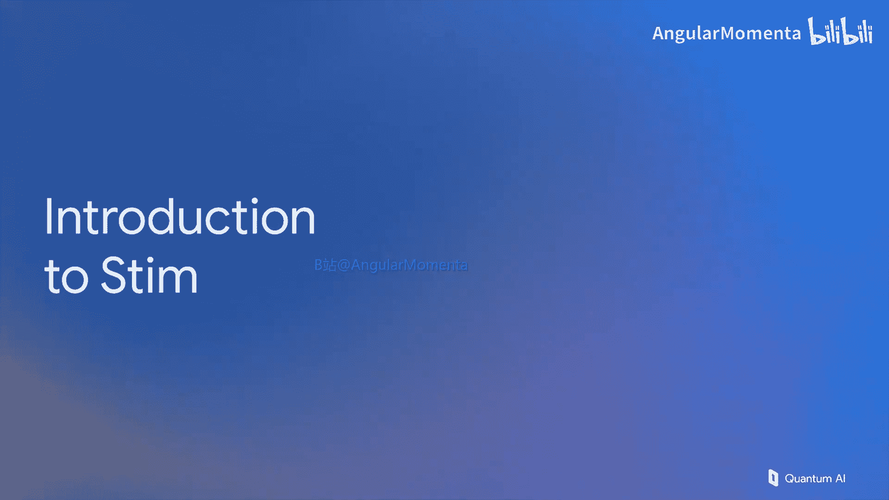

# 008：Stim 软件入门





在本节课中，我们将开始介绍 Stim。这是一个由 Craig Gidney 编写的软件，我们用它来模拟量子电路，特别是为量子纠错生成输出数据，以便评估特定纠错协议的效果。

本次讲解将是互动式的。我们会要求您访问 Stim 的代码仓库，下载并使用一些入门教程笔记本，并随着讲解实际编写几个示例代码，以熟悉这个工具及其使用方法。我们将详细讨论 Stim 的语法、文件格式以及使用它所需进行的操作。现在，让我们开始。

## 概述

上一讲我们以表面码结束，并提到即使是距离为 5（这仍然是一个相对较小的码），我们讨论的也是一个包含 49 个量子比特和大量门操作的电路。我们该如何模拟它呢？答案是使用 Stim。您当然可以查阅其原始参考文献，我鼓励您这样做。但核心要点是，这个软件模拟电路的速度比其他任何工具都快 1000 倍以上。举一个极端的例子，屏幕上显示的是距离为 5 的电路。想象一下距离为 100 的版本，宽度和高度都增加 20 倍。Stim 可以在 15 秒内模拟该电路（距离 100，100 轮），并以每秒 100 次的速度对该实验进行采样。这是一个非常强大且实用的工具，我们的目标是让您今天就开始使用它。

## Stim 的输出与应用

使用 Stim 后，您可以得到以下结果：当您输入正确的代码来定义不同距离的表面码电路以及您希望使用的错误模型后，您可以使用配套工具包绘制逻辑错误率随物理错误率和码距离变化的图表，得到类似下图的结果。


这张图包含大量信息。其中最常讨论的两个数字是：
1.  **阈值错误率**：在这个错误率下，增加纠错资源（即增大码的尺寸）并不能有效抑制逻辑错误。这对理论研究很有用。
2.  **实际目标错误率**：在实践中，您更想知道的是类似这个数字：在什么物理错误率下，每次将码距离增加 2，逻辑错误率就能被抑制 10 倍？

我们通常将这个抑制因子称为 **λ**。实现具有良好 λ 值的物理硬件是量子计算硬件研究的主要目标。使用 Stim 这类工具的目的，是研究何种物理错误率、架构和纠错码可以减轻硬件的负担，从而以更少的物理努力实现更高的 λ 值。

## Stim 语法入门

首先，我们来讨论 Stim 的语法。和之前一样，我们通常避免讨论整个表面码电路，因为它太复杂。我们将专注于表面码的一个片段，它看起来像重复码。这是一个我们反复使用的经典示例，因为它简单且能很好地代表表面码的工作原理。

右侧的这个电路正是从表面码中提取的这一部分。它只关注比特翻转错误，但包含了所有必要的操作流程。让我们具体看看如何用 Stim 的符号来定义这个重复码电路。

本质上，Stim 的输入是一个文本文件，它指定了所有门操作以及您希望施加在这些门上的所有错误过程。它从简单的重置所有量子比特开始。

以下是 Stim 文件的一个示例片段及其解释：

```
R 0 1 2 3 4
```

*   **语法**：`R` 后跟一个数字列表。
*   **含义**：重置列表中的每一个量子比特。
*   **对应电路**：这对应电路图中蓝色的初始化部分。

接下来，我们需要显式地应用错误。Stim 不会为任何门假设特定的错误模型；如果您不指定错误，门操作将被完美执行。因此，我们需要手动添加错误。

```
DEPOLARIZE1(0.001) 0 1 2 3 4
```

*   **语法**：`DEPOLARIZE1(p)` 后跟量子比特列表。
*   **含义**：以概率 `p`（例如 0.001）对列表中的每个量子比特施加单量子比特退极化噪声。这意味着有相等的概率发生 X、Y 或 Z 错误（或保持为 I）。
*   **对应电路**：这对应在数据量子比特上随机、独立地施加比特翻转错误（在退极化模型中，X 错误是比特翻转的一种）。

然后，我们应用一些 CNOT 门。

```
CX 0 1 0 2
```

*   **语法**：`CX` 后跟控制量子比特和目标量子比特列表。
*   **含义**：以量子比特 0 为控制位，分别以量子比特 1 和 2 为目标位执行 CNOT 操作。
*   **注意**：我们需要手动为每个双量子比特门添加错误，也不能忘记为闲置的量子比特添加单量子比特噪声。

```
DEPOLARIZE2(0.001) 0 1 0 2
DEPOLARIZE1(0.001) 3 4
```

*   `DEPOLARIZE2(p)`：以概率 `p` 对指定的双量子比特门施加双量子比特退极化噪声。这意味着在 15 种可能的非平凡泡利算子乘积（如 IX, IZ, XI, XX, XY, ... , ZZ）中，每种发生的概率相等。
*   `DEPOLARIZE1(p)`：对闲置的量子比特 3 和 4 施加单量子比特噪声。

我们可以继续更快地浏览后续步骤。这些是朝上的 CNOT 门，同样需要为闲置量子比特添加单量子比特噪声，为双量子比特门添加双量子比特噪声。

一个需要注意的点是：当您想要模拟有错误的测量时，您需要在测量门**之前**添加错误。因为一旦测量完成，就不再存在量子态。因此，您需要将有错误的测量建模为在测量门之前发生错误。

```
DEPOLARIZE1(0.001) 1 3
M 1 3
```

现在，我们遇到了一个新的概念：**探测器**。我们在这个视频系列中广泛讨论了探测器，现在我们在 Stim 代码中看到了它的具体实现。

```
DETECTOR(1, 0) rec[-1]
```

*   **语法**：`DETECTOR(x, t) rec[-n]`
*   **含义**：
    *   `(1, 0)`：一个用户自由指定的任意坐标。明智的做法是将其指定为与量子比特相关的方式，以便于记忆。这里我们选择用坐标 (1, 0) 表示，您可以将其理解为与量子比特 1 相关，时间步为 0。
    *   `rec[-1]`：访问最近一次的测量结果。`rec` 数组存储测量结果，`-1` 表示最近一次，`-2` 表示上一次，依此类推。
*   **作用**：通过提供初始化的状态，我们知道这个测量结果应该是 0。如果它不是 0，那就表示一个探测事件。因此，单个测量本身就可以作为一个探测器。

以上就是电路的一个模块。您还可以添加 `TICK` 指令，这有助于 Stim 美观地显示电路。

```
TICK
```

`TICK` 指令只是将电路划分为易于人类理解的步骤，便于 Stim 整齐地显示。它们对模拟本身没有影响，只是便于检查您输入的电路是否正确。由于屏幕空间有限，我们后续将省略它们。

## 构建多轮电路

现在，让我们继续到下一个模块。表面上它和第一个模块相似，是第一个模块的重复，但没有初始化门。我们希望能够多次重复它，当然不希望每次都显式地写出这些门。您不需要这样做，因为 Stim 有**重复块**的概念。

```
REPEAT 5 {
  # ... 这里是第二轮及以后各轮的门和错误 ...
  SHIFT_COORDS(0, 1)
  DETECTOR(1, 0) rec[-2] rec[-1]
}
```

这里有一些新的东西：
*   `REPEAT n { ... }`：将其中的内容重复执行 `n` 次。
*   `SHIFT_COORDS(dx, dt)`：此指令意味着之后定义的每个探测器的坐标都将被这里指定的值所偏移。这里我们指定空间坐标 (`dx`) 不变，时间坐标 (`dt`) 增加 1。因此，后续轮的探测器将与之前的轮次在时间上相差一个单位。这同样是任意的，选择易于记忆和直观的数字关系是明智的。
*   `DETECTOR(1, 0) rec[-2] rec[-1]`：现在我们的探测器涉及两次测量。为了检测错误，必须将其与之前的测量结果进行比较。在 Stim 中，最近的测量结果存储在 `rec` 数组中，使用 `-1` 访问最近一次，`-2` 访问上一次，依此类推。在文件中，您需要理清这个线性数组，并确定实际需要比较哪些测量结果来构建您的探测器。

## 最终轮测量与逻辑错误

最后一部分是最终轮的测量。这比之前的电路简单得多。然而，需要记住的关键点是，现在我们需要在最后一轮中取成对的测量结果，并与倒数第二轮中的单个测量结果进行比较。

```
DETECTOR(1, 0) rec[-3] rec[-2] rec[-1]
```

这里最大的新内容是，我们现在有了一个包含三次测量的探测器。

现在，我们还需要最后一件事：判断我们的实验是否成功。如果我们将数据量子比特初始化为全零，并且实验成功，那么在经过所有校正之后，我们最终应该得到零态。这意味着任何一次经过校正的测量结果都应该是 0。如果在校正后，这些测量结果是 1，说明我们的校正在某个时间点失败了，数据没有被保存下来。这将被记录为发生了一次逻辑错误。

由于这些最终测量中的任何一个都能告诉我们是否成功保存了状态，我们选择让 Stim 跟踪的可观测量是这些最终测量中的任何一个。我们选择了 `rec[-1]`（最近一次测量），但选择 `rec[-2]` 或 `rec[-3]` 同样有效，它们都是最后一轮的测量，都能告诉我们是否成功地将状态从 0 保存下来，还是错误地翻转为 1。

```
OBSERVABLE_INCLUDE(0) rec[-1]
```

*   **语法**：`OBSERVABLE_INCLUDE(index) rec[-n]`
*   **含义**：将指定的测量结果纳入到索引为 `index` 的逻辑可观测量的计算中。如果所有相关测量结果的奇偶性（通常经过校正后）与预期不符，则记录一次逻辑错误。

## 实践练习

现在，是一些练习。此时，您最好暂停视频，去实际操作。

1.  **组装与修改**：访问 Stim 的 GitHub 仓库，下载并开始编码。首先，将本幻灯片中的所有代码片段组装成一个单独的文件。添加 `TICK` 指令，以便清楚哪些门操作被分组在一起。然后修改它，进行一个小改动以获得使用该格式的经验：修改它，使最后一轮的测量不与前一轮分开，而是发生在同一时间。因为物理上没有必要延迟这些测量，完全可以同时进行。

2.  **生成参数化电路**：完成上述步骤后，您需要认识到 Stim 的真正用途不是单个文件对应单个码距离。您真正需要的是创建一个 Python 脚本，该脚本能为任意的码距离 `d` 和任意的错误率 `p` 输出那个文本文件。脚本中应该有您输入的变量，输出应该是一个具有相应生成电路和错误模型的 Stim 文件。如果这看起来工作量很大，确实如此。目前有研究试图使其更容易、更直观，不需要低级编程来创建电路、探测器等所有内容以便运行 Stim 模拟。但目前，这就是练习，请尝试一下。

3.  **使用内置函数与自定义模型**：尝试之后，问题来了：这个函数放在哪里？Stim 中有一个类似的函数示例，您可以使用它来生成重复码的内存实验。您可能会问，为什么我们还要做上一个练习？答案是，内置函数生成的错误模型与我们刚才所做的**不完全相同**。内置函数**不会**在闲置量子比特上施加错误。我们在上一个练习中构建的，是文献中一个非常常见的错误模型，其中每个量子比特，无论是否正在执行门操作，都会受到噪声影响。这不是 Stim 的默认设置，您必须自己编码。现在您已经编码了。您需要做的是在 Stim 的入门笔记本中找到这个函数（您会在第 7 节找到它），并用您编写的函数替换它。这样做之后，您将能够使用您的函数（生成带有您定义的错误模型的电路）来模拟不同码距离和物理错误率的输出。

您将得到类似下图的输出。对于较大的码距离和较低的错误率，您将看到错误被迅速抑制。


## 深入分析与关键指标

让我们更进一步，继续学习入门笔记本，并特别注意：当您使用更大的码时，错误率必须低于阈值才能获得改进。这对所有形式的量子纠错都是通用的：总存在一个阈值错误率。这个阈值错误率越高越好，因为更容易建造满足该约束的设备，从而更有可能从纠错中实际获益。

同样，如前所述，虽然阈值错误率是一个很好的数字，但更好的数字是**每次将码距离增加 2 时获得 10 倍抑制的错误率**（即 λ 对应的错误率）。请花时间找出您编写的重复码和 Stim 中的表面码示例的这个错误率。

一旦您有了这些数字，它们就为您未来的大量工作奠定了基础。当您想计算一个算法的开销时，您可以利用内存实验中错误随码距离的抑制速率，来计算在整个算法体积中可能累积多少错误。这将告诉您需要多强的纠错能力（即需要多大的码距离），进而算出算法的开销（需要多少量子比特、多少时间才能执行一个算法）。这一切都始于为简单的内存实验创建此类图表。

## 总结

本节课中，我们一起学习了 Stim 软件的基本概念和语法。我们了解了如何使用 Stim 定义量子电路和错误模型，特别是针对重复码这一示例。我们探讨了探测器在 Stim 中的实现方式，以及如何构建多轮实验和定义逻辑错误。通过实践练习，我们掌握了创建参数化 Stim 电路文件的方法，并理解了评估纠错码性能的关键指标，如阈值错误率和逻辑错误抑制因子 λ。这些是使用 Stim 进行量子纠错模拟和分析的基础。


下次课，我们将看看 Craig Gidney 编写的另一个工具——Crumble，它用于分析表面码中一些最复杂的电路，那些实际允许您执行逻辑操作以及移动代码等更复杂功能的电路。