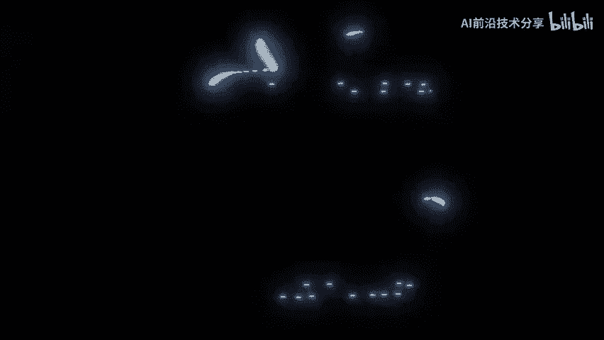
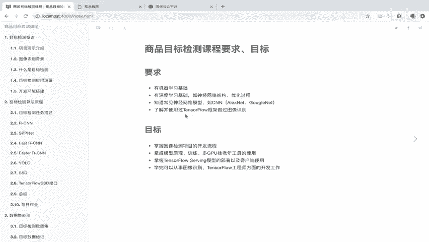
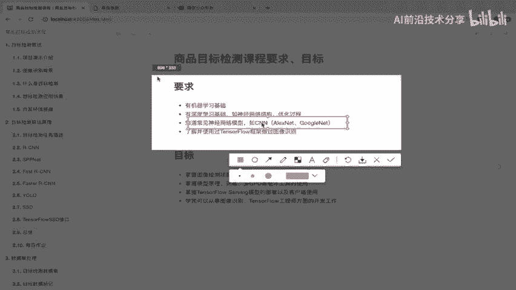
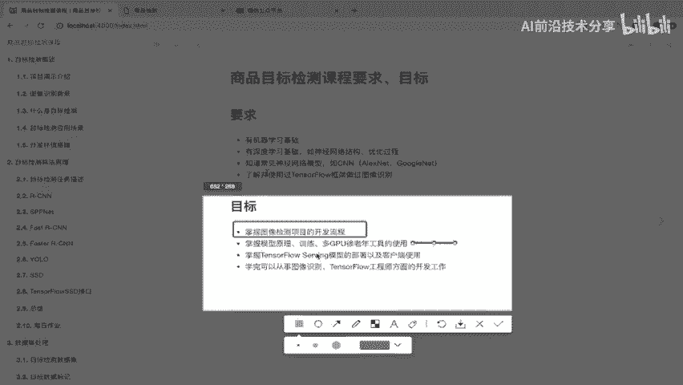
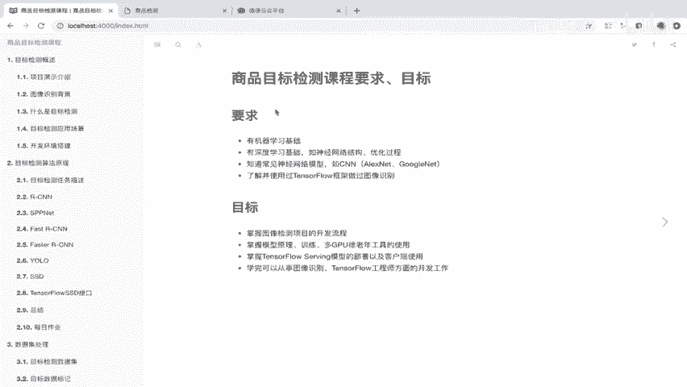

# 课程P1：目标检测课程要求与目标 🎯

在本节课中，我们将明确学习目标检测课程所需的前置知识，以及完成课程后你将能够掌握的核心技能。了解这些要求与目标，有助于你评估自身基础并规划学习路径。

## 课程要求 📋

在正式开始课程前，你需要具备以下技术基础。这些是理解后续课程内容的关键。

以下是具体的技术要求：

1.  **机器学习基础**：你需要对机器学习的基本算法有一定了解。例如，决策树、随机森林、线性回归、逻辑回归等。同时，你需要有使用 `scikit-learn` 库编写和训练模型的实际经验。
2.  **深度学习基础**：你需要理解神经网络的基本结构、工作原理及其优化过程。
3.  **基础模型知识**：你需要熟悉卷积神经网络（CNN）这一最基础的图像分类模型。同时，对 `AlexNet`、`GoogleNet` 等经典网络架构也需有一定了解。
4.  **框架使用经验**：你必须具备使用 `TensorFlow` 框架的经验。这包括了解其核心模块的使用方法，并曾用它完成过简单的图像识别任务。

如果你尚未达到上述要求，学习本课程可能会感到吃力。建议你先补充相关知识。

## 课程目标 🚀

上一节我们明确了学习本课程需要具备的基础。那么，完成本课程后，你将能达到哪些目标呢？

以下是完成课程后你将掌握的核心能力：

1.  **掌握项目开发流程**：你将能够独立完成一个图像识别或目标检测项目的完整开发流程。
2.  **理解并实践模型训练**：你将深入理解模型的原理，并掌握如何构建模型、训练模型，以及如何使用GPU乃至多GPU工具来加速训练过程。
3.  **掌握模型部署与交互**：你将学会如何将训练好的模型部署到线上服务器，并了解客户端如何与模型服务器进行交互。

## 职业发展 💼

基于以上技能，学成之后，你可以从事多种相关岗位的工作，例如：TensorFlow工程师、图像识别/检测工程师，或机器视觉相关的开发工作。

## 总结 📝

本节课中，我们一起学习了目标检测课程的具体要求与最终目标。我们明确了学习本课程所需的**机器学习**、**深度学习**、**CNN模型**及**TensorFlow框架**四方面基础。同时，我们也了解了完成课程后，你将能够掌握从模型开发、训练到部署上线的全流程技能，为从事相关技术岗位打下坚实基础。请务必牢记这些要点，以便更好地进行后续学习。