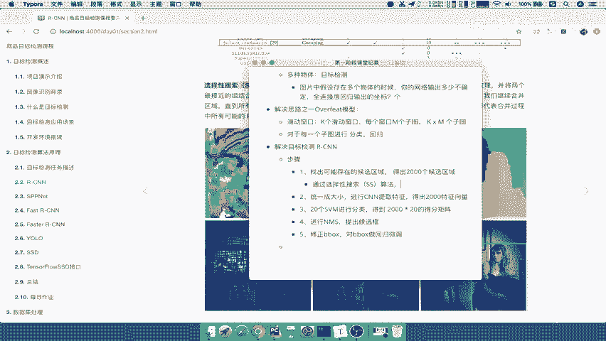
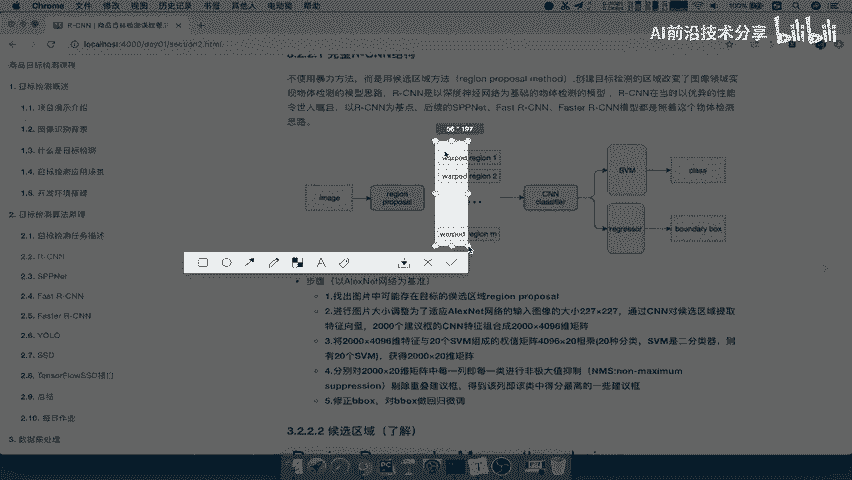
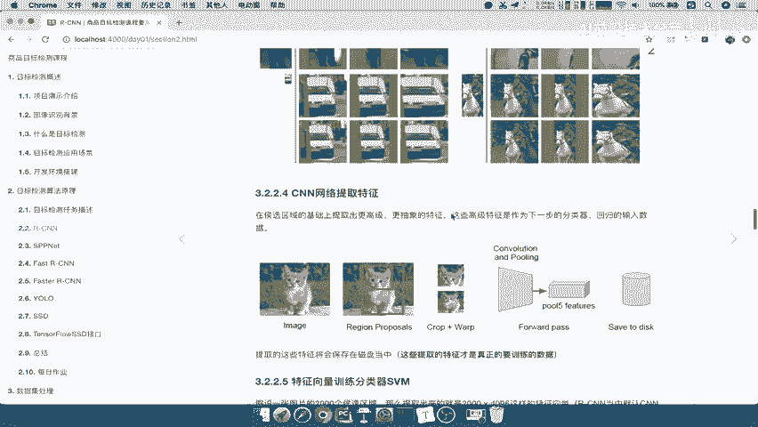
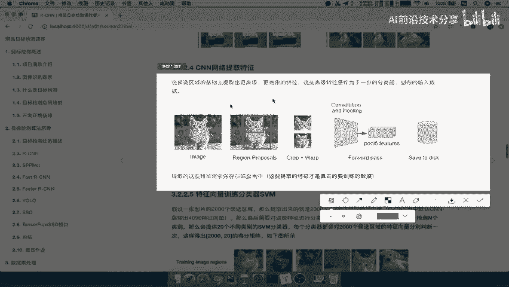
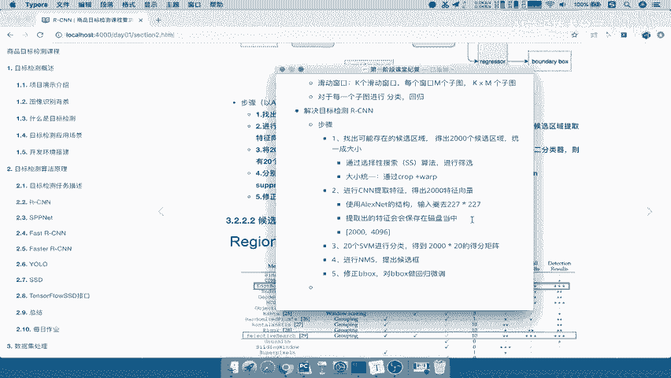

# 课程 P10：10.03_RCNN：候选区域与特征提取 🧠

在本节课中，我们将要学习RCNN（Region-based Convolutional Neural Networks）模型的前两个核心步骤：**候选区域生成**与**特征提取**。我们将了解如何从一张图片中找出可能包含物体的区域，并利用卷积神经网络将这些区域转化为可供后续分类和定位使用的特征向量。

---

## 第一步：候选区域生成

上一节我们介绍了RCNN的整体流程，本节中我们来看看它的第一个具体步骤——生成候选区域。这部分内容我们作为了解即可。

候选区域（Region Proposal）的目的是从原始图像中筛选出可能包含物体的区域。在RCNN提出时，有多种方法可以实现，其中被广泛采用且效果较好的一种算法是**选择性搜索（Selective Search, SS）**。

选择性搜索的基本原理如下：
*   它首先基于像素之间的相似性，将图像分割成许多小的、颜色或纹理相近的像素块。
*   然后，算法根据这些小块之间的邻近和相似关系，逐步将它们合并成更大的区域。
*   通过这种自底向上的合并过程，最终生成一系列大小不一的候选区域框。

这个过程的主要目的是提供一系列像素相近的区块作为后续算法的输入。以下是其核心要点：
*   通过**选择性搜索（SS）算法**进行有效筛选。
*   生成的候选区域数量通常较多（例如约2000个），为后续处理提供丰富的可能性。

---

## 第二步：区域尺寸统一与特征提取

在得到候选区域后，我们需要将这些区域输入到卷积神经网络（CNN）中进行特征提取。然而，CNN通常要求固定尺寸的输入。

### 2.1 统一区域尺寸

由于选择性搜索产生的候选区域形状和大小各异，在送入CNN之前，必须将它们调整为统一尺寸。RCNN最初使用的是AlexNet网络，其输入要求是 **227×227** 像素。

为了实现尺寸统一并尽量减少图像变形，RCNN采用了一种称为 **“Crop + Warp”** 的方法。这个方法的作用是：
*   **Crop（裁剪）**： 截取候选区域的核心部分。
*   **Warp（扭曲/缩放）**： 将裁剪后的区域拉伸或缩放到目标尺寸（227×227）。

这种方法旨在固定输入大小的同时，尽可能减少图像的扭曲变形。如下图所示，第二种方法（Crop+Warp）产生的变形通常比简单的拉伸方法要小。

因此，这一步的核心操作是：**通过Crop + Warp方法将所有候选区域统一调整为227×227的固定大小**。

### 2.2 卷积神经网络特征提取

尺寸统一后，每个候选区域就可以被送入CNN网络了。CNN的作用是提取高级的、抽象的特征，这些特征能够代表图像中物体的关键信息。

在RCNN中：
*   使用的CNN结构是 **AlexNet**。
*   每一个候选区域（共约2000个）都会独立地通过整个CNN网络进行前向传播。
*   网络最终会输出一个固定长度的特征向量。对于AlexNet，这个特征向量的长度是 **4096**。

一个需要特别注意的细节是：**提取出的这些特征向量会被保存到磁盘中**。这是因为在原始的RCNN设计中，特征提取与后续的分类、回归步骤是分开进行的。保存特征可以避免对同一张图片重复进行耗时的CNN前向传播，从而提升训练和测试效率。

我们来总结一下特征提取步骤的输出：
*   每个候选区域生成一个 **4096维** 的特征向量。
*   一张图片约有2000个候选区域，因此会生成一个 **2000 × 4096** 的特征矩阵。
*   这些特征被**存储在磁盘**中以供后续使用。

---

## 总结

本节课中我们一起学习了RCNN模型的前两个关键步骤：
1.  **候选区域生成**： 使用选择性搜索（SS）算法从图像中找出约2000个可能包含物体的区域。
2.  **特征提取**：
    *   首先，通过 **Crop + Warp** 方法将所有候选区域统一调整为 **227×227** 的固定尺寸。
    *   然后，使用 **AlexNet** 卷积神经网络对每个区域进行独立处理，提取出一个 **4096维** 的特征向量。
    *   最后，将所有提取出的特征**保存到磁盘**中。

至此，我们已经完成了从原始图像到高级特征表示的转换。下一节课，我们将探讨如何利用这些保存的特征进行物体分类和边界框的精确定位。