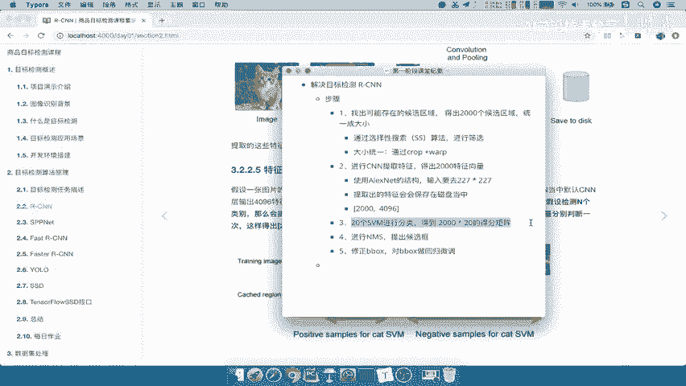
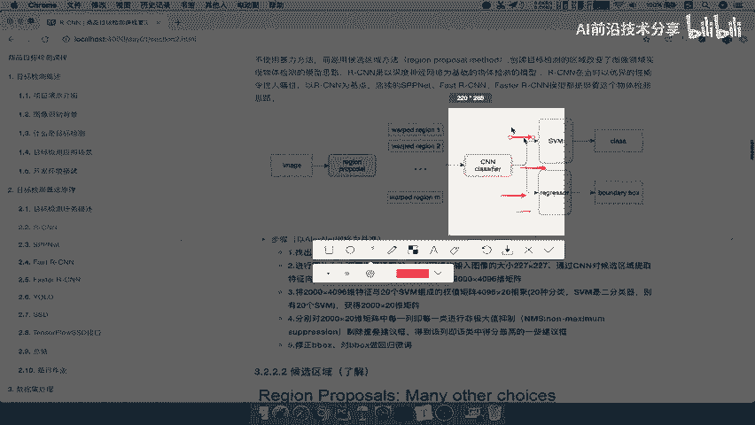
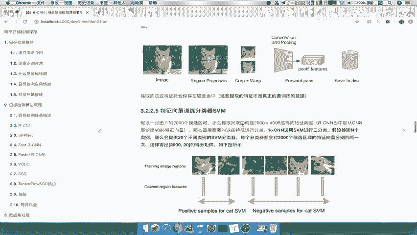
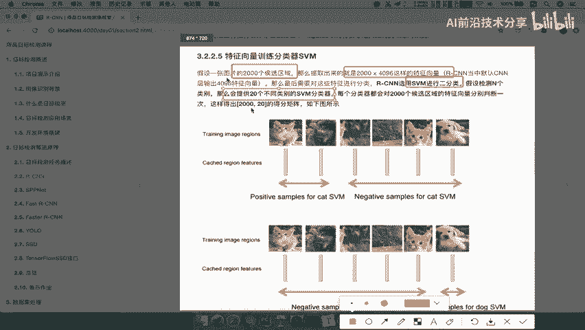
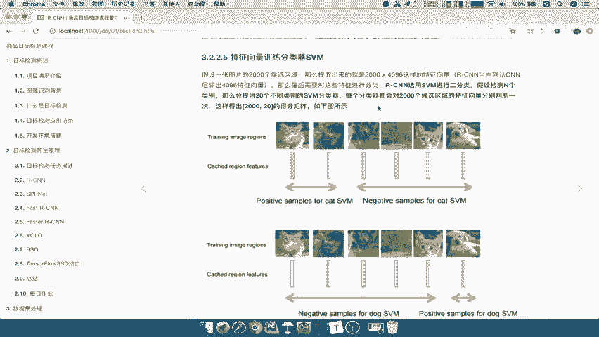
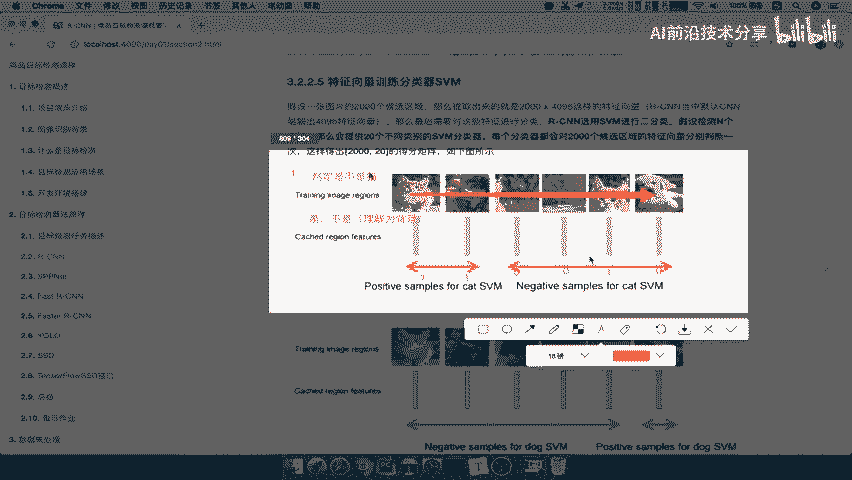
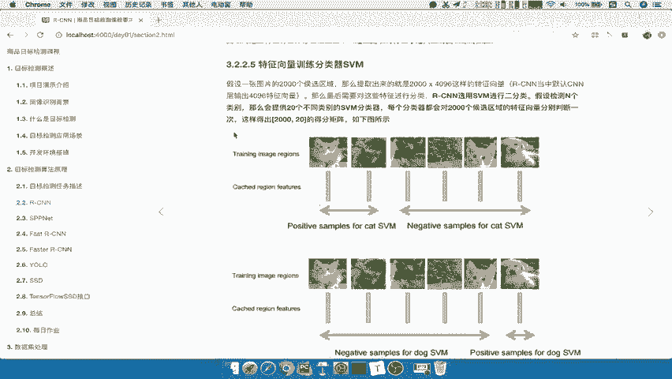
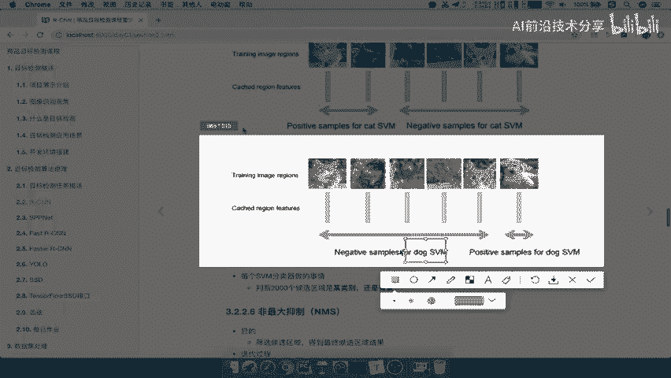
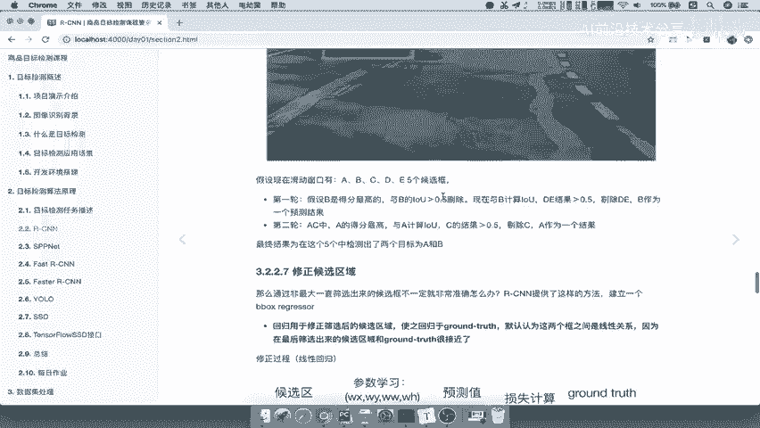

# 课程 P11：RCNN 中的 SVM 分类器 🧠

在本节课中，我们将要学习 RCNN 目标检测算法的第三步：使用 SVM 分类器对候选区域进行分类。这是整个算法的核心步骤之一，我们将详细解释其工作原理和具体流程。

---

## 概述：SVM 分类器的任务

上一节我们介绍了如何从图像中提取候选区域并获取其特征。本节中我们来看看如何利用这些特征进行分类。

第三步是使用 SVM 进行分类。这个步骤是算法的一个重点。

具体做法是：我们已经得到了 2000 个候选区域的特征。每一个候选区域的特征都需要经过 SVM 分类器进行处理。

我们来看 SVM 具体在做什么。算法首先将图像转换为候选区域，并将其定义为一个分类问题。

## SVM 分类过程详解

以下是 SVM 分类的具体步骤：

假设你有 2000 个候选区域，每个区域提取出一个 4096 维的特征向量。我需要对这些特征向量进行分类。

使用 SVM 对每一个特征向量进行分类。SVM 主要是一种二分类器。假设有 N 个类别，我们的最终目标就是检测这 N 个类别。

有同学会问，之前提到的数字 20 是怎么来的？就是这么来的。为什么是 20？因为 RCNN 在最初测试时，定义的目标检测任务就是检测 20 个类别。也就是说，目标检测一共需要检测 20 个类别，没有其他类别了。这就是数字 20 的来源。

每个分类器都会对这 2000 个候选区域的特征向量分别判断一次。这样会得出一个 `2000 x 20` 的得分矩阵。

20 代表你的目标检测任务在当前数据集中一共需要检测 20 种类别。例如，PASCAL VOC 数据集就有 20 个类别。

这个过程有 20 个类别，因此需要 20 个 SVM 分类器。

这 20 个分类器各自做什么呢？首先，第一个分类器需要对 2000 个候选区域（注意，一个分类器处理所有 2000 个区域）进行分类。

例如，这里列举了 2000 个候选区域。每个候选区域都要经过这个 SVM 分类器。假设这个 SVM 是判定“是不是猫”的，它只有两个输出：是猫，或者不是猫（可以理解为背景）。

比如，第一个区域判定为猫，记为正例（如标记为 1）。第二个区域也是猫，记为正例。第三个区域不是猫，记为负例。以此类推。

这个 SVM 分类器训练好后，就可以用来进行判定。

我们保存这个 SVM 分类器对候选区域的分类结果。

这是一个分类器。那么第二个分类器呢？比如，第二个分类器专门用于判断“是不是狗”。这样就能理解了：**每一个类别的分类器，都会对 2000 个候选区域的特征进行一次分类**。

SVM 输出的是一个得分或概率。假设 SVM 分类器已经训练好了。

我们来看一下这个过程得出的结果。首先，特征来自 2000 个候选区域，维度是 `2000 x 4096`。

我们可以这样表示：
*   行：代表第 1 到第 2000 个候选区域。
*   列：代表第 1 到第 20 个 SVM 分类器（对应 20 个类别，如猫、狗、车等）。

每个 SVM 分类器（在测试阶段）接收这 2000 个特征，并输出 2000 个得分（例如概率值 `P1, P2, ..., P2000`）。

这样，我们就得到了一个 `2000 x 20` 的得分矩阵。

这个得分矩阵表示每个候选区域属于每个类别的可能性。

## 后续步骤：非极大值抑制 (NMS)

得出 `2000 x 20` 的得分矩阵后，接下来要进行筛选。

在后续的第四步中，会分别对这个 `2000 x 20` 的矩阵中的每一类（共20类）进行**非极大值抑制**，以剔除重叠的候选框。NMS 也是一个非常重要的过程。

---

## 总结

本节课中我们一起学习了 RCNN 算法中 SVM 分类器的工作流程。核心要点包括：
1.  **任务**：使用训练好的 SVM 对 2000 个候选区域的特征进行分类。
2.  **机制**：为数据集中每一个待检测的类别（例如 20 类）训练一个独立的二分类 SVM。
3.  **输出**：每个 SVM 分类器对所有候选区域进行打分，最终形成一个 `2000 x 20` 的得分矩阵，该矩阵记录了每个区域属于每个类别的可能性。
4.  **目的**：该得分矩阵为后续的非极大值抑制步骤提供了筛选依据，以确定最终的检测框和类别。

通过这一步，RCNN 将目标检测问题转化为了对候选区域的分类问题，并为精确定位和分类奠定了基础。