# 课程 P12：12.05_RCNN：非极大抑制（NMS）🚀

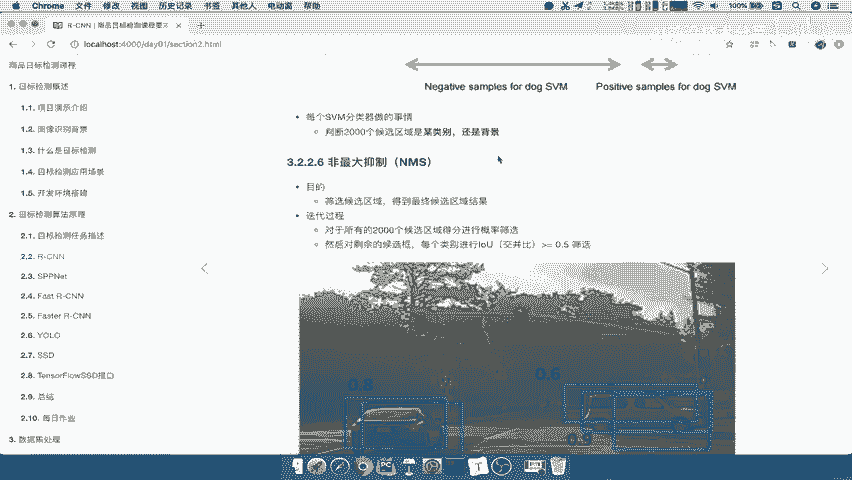

## 概述
在本节课中，我们将要学习RCNN目标检测算法中的一个关键步骤：**非极大抑制**。它的核心作用是筛选出最有可能包含物体的候选框，避免对同一物体进行重复检测，从而得到最终简洁、准确的检测结果。

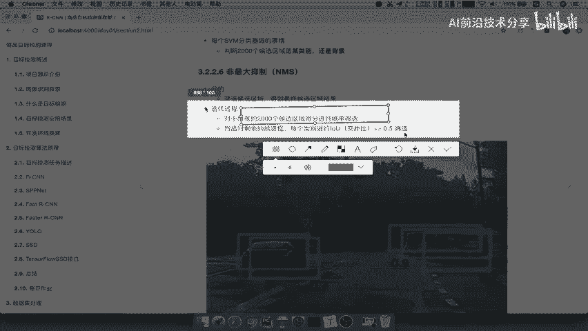

---

## 非极大抑制的作用
上一节我们介绍了RCNN如何为每个候选框生成类别得分。假设我们有2000个候选框，每个框有20个类别的得分，那么最终会得到一个 `2000 x 20` 的得分矩阵。但一张图片中不可能有2000个物体，因此我们需要筛选出可能性最大的少数候选框。非极大抑制的目的就是完成这个筛选过程，为图片推荐最终有效的检测框。

## NMS的工作原理
非极大抑制是一个迭代过程。它首先对候选框进行概率筛选，然后对剩余的候选框进行交并比计算与比较。

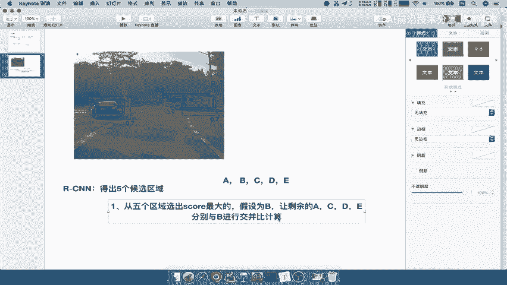

以下是NMS的核心步骤：

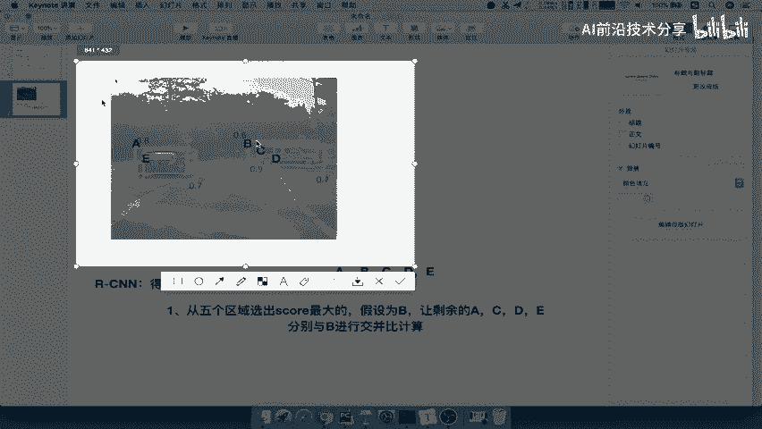

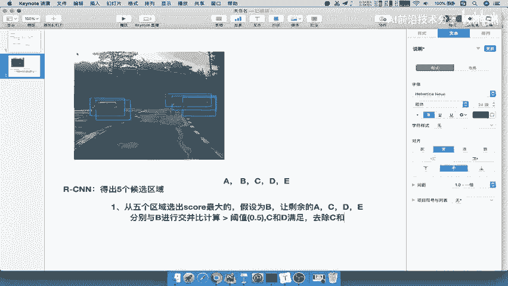

1.  **概率筛选**：对于每个候选框，取其所有类别得分中的最大值（即该框最可能属于的类别的得分）。然后，从所有候选框中选出得分最高的那个框。
2.  **交并比计算与抑制**：将剩余的每个候选框与上一步选出的最高分框进行**交并比**计算。
    *   **交并比公式**：`IoU = (A ∩ B) / (A ∪ B)`
    *   其中，`A ∩ B` 代表两个框的交集面积，`A ∪ B` 代表两个框的并集面积。
3.  **阈值判断**：设定一个阈值（通常为0.5）。如果某个候选框与最高分框的IoU大于该阈值，则认为它们检测的是同一个物体，从而将该候选框**删除**。
4.  **迭代循环**：在删除了一部分框后，从剩余的候选框中再次选出得分最高的框，重复步骤2和3，直到所有候选框都被处理完毕。

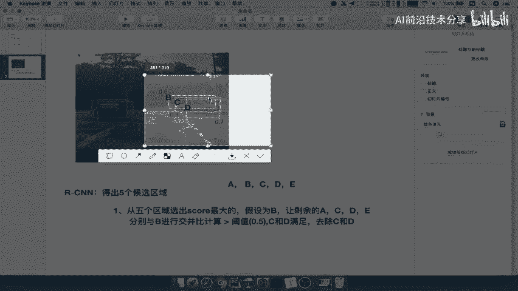

## 实例演示
为了便于理解，我们用一个简化的例子来说明。假设RCNN为一张图片生成了5个候选框，标记为A、B、C、D、E。

**第一轮迭代：**
*   假设B框的得分最高。
*   计算A、C、D、E与B的IoU。
*   假设C和D与B的IoU大于阈值0.5，则认为C和D与B检测的是同一物体。
*   **删除C和D**，**保留B**作为第一个预测结果。

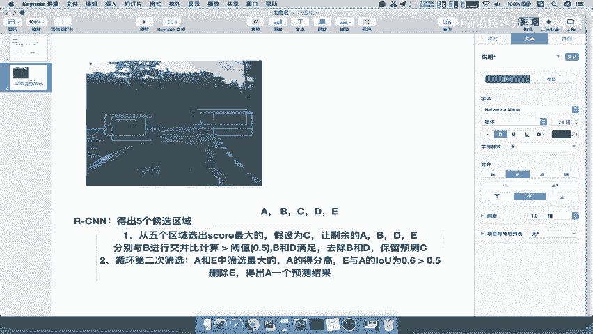

**第二轮迭代：**
*   在剩余的A和E中，假设A的得分最高。
*   计算E与A的IoU。
*   假设E与A的IoU大于阈值0.5。
*   **删除E**，**保留A**作为第二个预测结果。

最终，我们从5个候选框中筛选出了B和A两个最终的检测框。这个过程有效地去除了对同一物体的冗余检测。

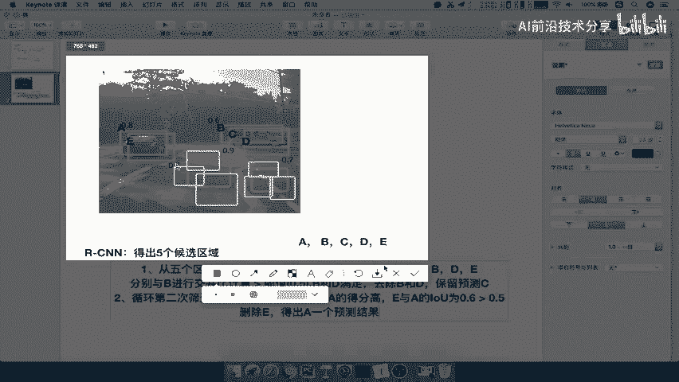

## NMS在RCNN流程中的位置
理解了NMS的步骤后，我们来看它在整个RCNN流程中处于什么位置。

1.  **特征提取**：CNN网络从候选框中提取特征。
2.  **分类打分**：SVM（或线性分类器）根据特征为每个候选框的每个类别进行打分。
3.  **非极大抑制**：对SVM打分后的候选框（例如2000个）应用NMS算法进行筛选。
4.  **输出结果**：得到最终数量较少、且最可能包含物体的候选框集合。

预测结果的准确数量并非固定，它取决于图片中实际有多少物体以及模型预测的准确度。NMS确保了每个物体只由一个最合适的框来代表。

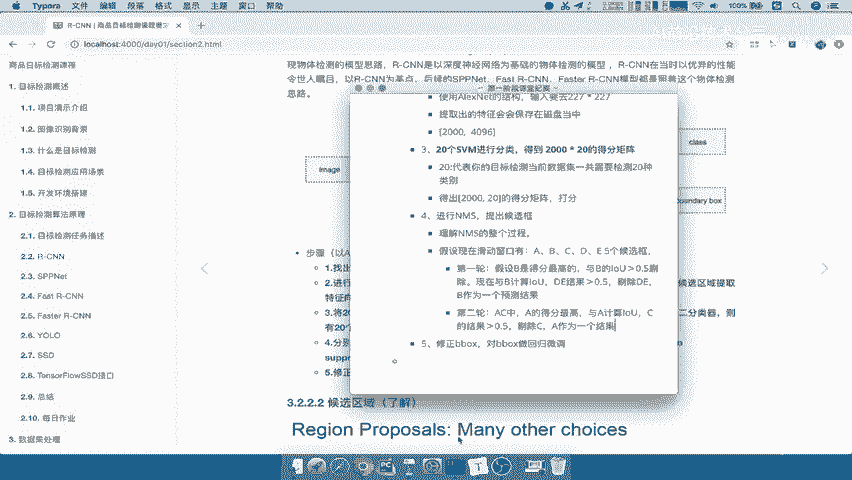

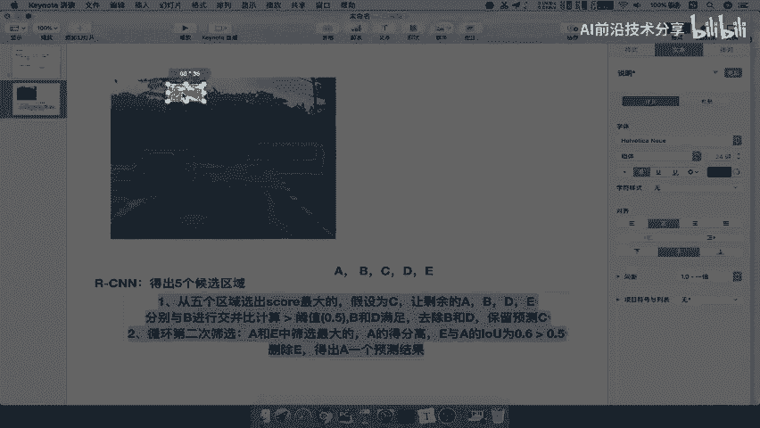

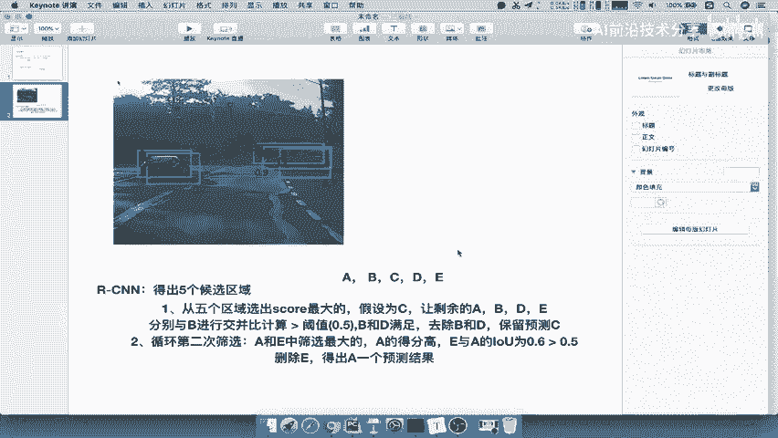

## 总结
本节课中我们一起学习了**非极大抑制**。我们了解到，NMS通过迭代地**选取最高分框**并**抑制与其高度重叠**的其他框，有效地解决了目标检测中的冗余框问题。它是RCNN以及后续许多目标检测算法中不可或缺的后处理步骤，保证了检测结果的简洁性和准确性。