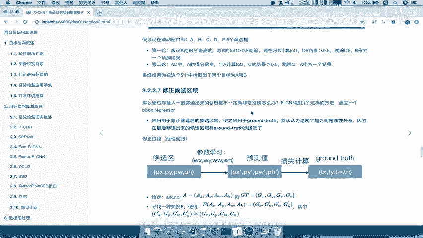
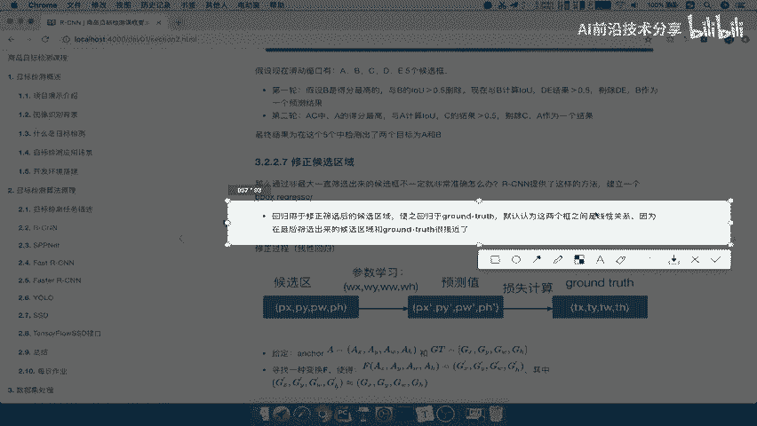
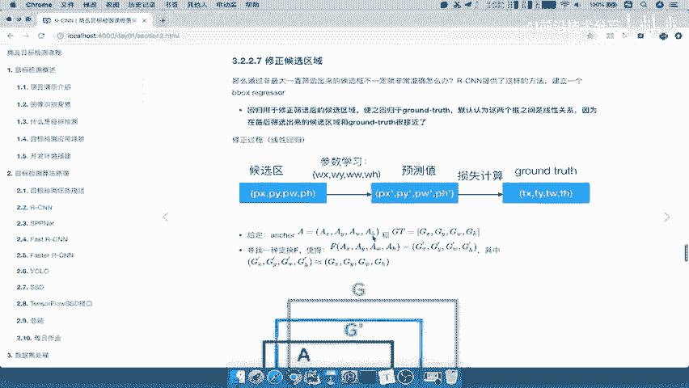
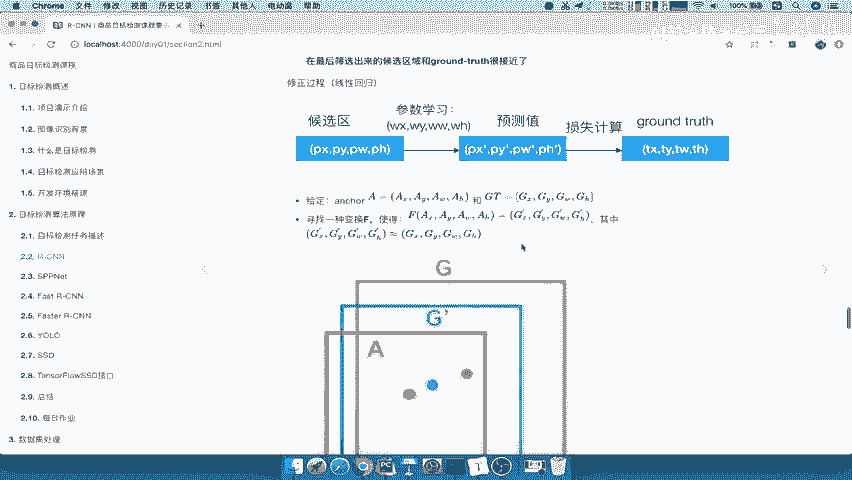
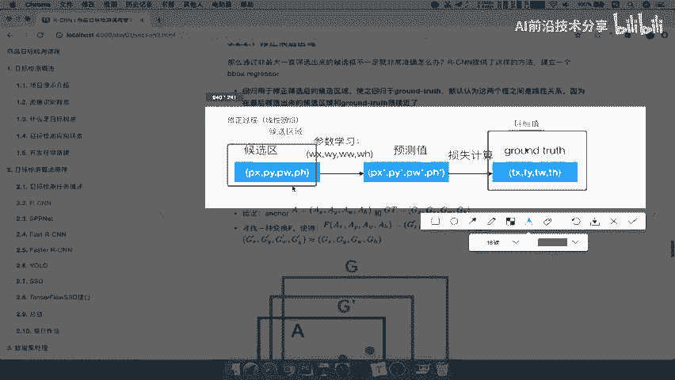
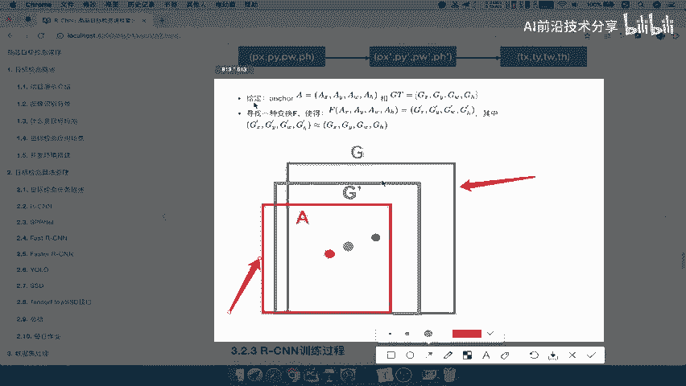
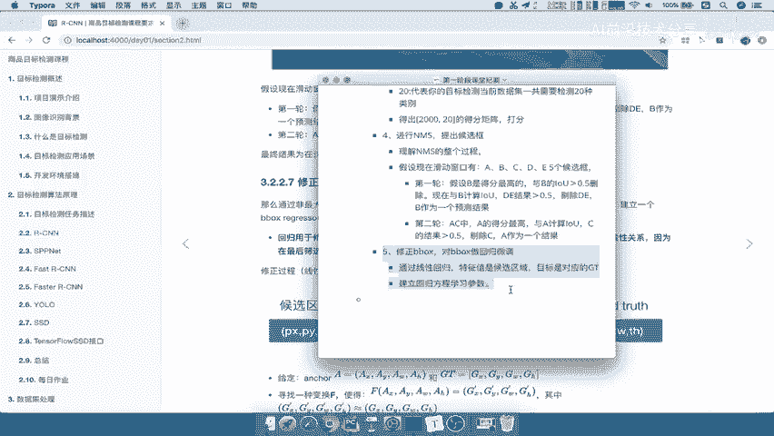

# 课程P13：13.06_RCNN：候选区域修正 🎯

在本节课中，我们将要学习RCNN（区域卷积神经网络）流程中的最后一步：候选区域修正。我们将了解为何需要对检测框进行微调，以及如何通过回归方法使候选框更精确地匹配真实目标框。

---

## 概述

RCNN的目标检测流程包含多个步骤。上一节我们介绍了非极大值抑制（NMS），它帮助我们筛选出最有可能包含目标的候选框。然而，这些由选择性搜索算法生成的候选框，其位置和大小可能并不完全准确。即使某个候选框的分类得分很高，它与真实的标注框（Ground Truth）之间仍可能存在偏差。

因此，本节中我们来看看如何通过一个回归过程，自动调整候选框的位置和尺寸，使其更接近真实的目标框。这个过程被称为边界框回归。

---

## 为何需要修正候选区域？



选择性搜索等算法推荐的候选区域不一定完全准确。即使某个候选区域的分类得分较高，其边界框与真实标注框之间仍可能存在位置或尺度上的误差。

所以，我们需要对筛选后的候选框进行手动或自动的调整，使其位置更接近于真实标注框。这个过程可以称为回归过程，即边界框回归。

---

## 什么是边界框回归？



边界框回归用于修正筛选后的候选框，使之回归于与之对应的真实标注框。该方法默认候选框与真实框之间是线性关系，即它们比较相近，只存在简单的线性偏移。

以下是修正过程的示意图：




我们的目标是让候选框（通常作为输入特征）通过一个回归计算，学习一组参数。这组参数与候选框进行运算后，会产生一个预测框。训练的目标是让这个预测框无限接近真实标注框。

---

## 回归过程详解

我们可以通过下图来理解这个过程：





假设绿色框（G）是真实标注框，蓝色框（A）是选择性搜索返回的候选框。回归任务的目标是学习一个变换，将候选框A调整到虚线框（G’）的位置，使得G’尽可能接近G。这种变换就是一种线性回归。




因此，修正候选区域的过程就是一个回归过程。我们通过对边界框进行微调，使其更精确。

---

## 如何实现边界框回归？

实现边界框回归的核心是建立一个回归方程。以下是关键要素：


*   **特征值**：我们的候选区域。通常使用从该区域提取的CNN特征作为输入。
*   **目标值**：与该候选区域对应的真实标注框。
*   **学习目标**：建立回归方程，学习一组变换参数（如平移和缩放参数）。这组参数能够将候选框映射到更接近真实框的位置。

公式上，我们通常学习四个参数：**dx, dy, dw, dh**。它们分别用于调整候选框的中心点坐标（x, y）以及宽度（w）和高度（h）。

一个简化的变换公式如下：
```
预测框中心x = 候选框中心x + dx * 候选框宽
预测框中心y = 候选框中心y + dy * 候选框高
预测框宽 = 候选框宽 * exp(dw)
预测框高 = 候选框高 * exp(dh)
```
模型的任务就是根据输入特征，预测出最优的 **dx, dy, dw, dh**。

---

## RCNN完整流程回顾

现在，我们将RCNN的整个流程梳理一遍。修正边界框是流程的最后一步：

1.  **生成候选区域**：使用选择性搜索等算法找出可能包含物体的区域，并将这些区域调整到统一尺寸。
2.  **特征提取**：将调整后的候选区域输入预训练好的CNN网络，提取出特征向量。
3.  **区域分类**：将提取的特征输入到SVM分类器中进行打分，判断该区域属于哪个类别。
4.  **非极大值抑制**：应用NMS算法，剔除重叠度高的冗余候选框，保留得分最高的框。
5.  **边界框回归**：对保留下的候选框进行位置和尺寸的微调，使其更精确地框住目标。



---

## 总结


本节课中，我们一起学习了RCNN目标检测框架的最后关键一步——候选区域修正。我们了解到，由于初始候选框不够精确，需要通过边界框回归技术对其进行微调。这个过程以候选框为输入，以对应的真实标注框为目标，通过线性回归学习一组变换参数，从而得到更准确的目标定位。

至此，我们已经完成了对RCNN整个流程的详细讲解，从候选区域生成、特征提取、分类打分、去冗余到最终的框位置修正，每一步都是为了实现更准确的目标检测。