# 🧠 课程 P14：RCNN 训练与测试过程详解

在本节课中，我们将学习 RCNN 模型的核心环节：训练过程与测试过程。我们将详细拆解如何准备数据、训练网络以及最终进行预测，确保初学者能够清晰地理解每个步骤。

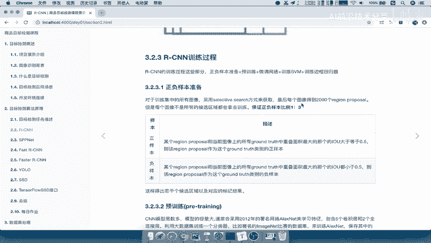

---

## 📋 概述

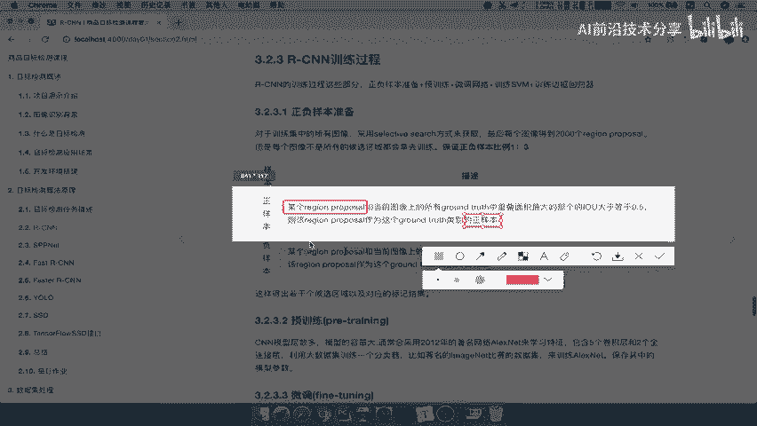

RCNN 作为一种经典的目标检测模型，其训练过程涉及多个精心设计的步骤，包括数据准备、网络预训练与微调，以及特定分类器与回归器的训练。理解这些步骤是掌握 RCNN 工作原理的关键。

---

## 🔧 训练过程详解

上一节我们介绍了 RCNN 的整体流程，本节中我们来看看其具体的训练步骤。RCNN 的训练过程主要分为以下几个部分：正负样本准备、网络预训练、网络微调、SVM 分类器训练以及边框回归器训练。

### 1. 正负样本准备

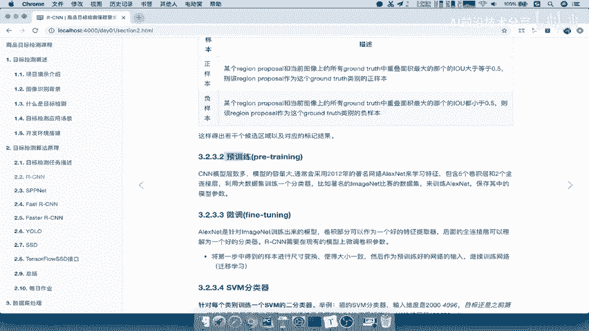

首先，我们需要从图像中筛选出用于训练的有效样本。通过 Selective Search 方法获取的约 2000 个候选区域并不会全部用于训练，而是根据它们与真实标注框的重叠程度进行筛选。

以下是正负样本的定义与筛选规则：

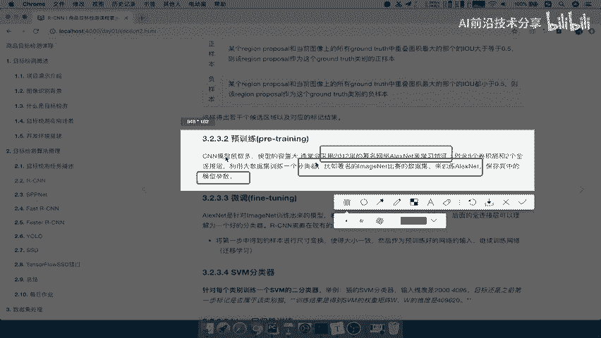

*   **正样本**：某个候选区域与图像中任意一个真实标注框（Ground Truth）的重叠面积（IoU）最大值 **大于等于 0.5**。这意味着该候选区域较好地覆盖了目标物体。
*   **负样本**：某个候选区域与图像中所有真实标注框的 IoU 值 **均小于 0.5**。这意味着该候选区域与目标物体几乎没有重叠。

在实际操作中，需要保证正样本与负样本的比例大致为 **1:3**，以平衡训练数据。

### 2. 预训练与微调网络

接下来是训练卷积神经网络部分。由于 CNN 参数众多，直接从头开始训练需要海量数据，因此通常采用“预训练 + 微调”的策略。

以下是预训练与微调的核心概念：

*   **预训练**：使用大型通用数据集（如 ImageNet）上已训练好的 CNN 模型（例如 AlexNet）及其参数。这相当于获得了一个具有强大特征提取能力的“基础模型”。
    *   **公式/代码表示**：`预训练模型参数 = Load_Pretrained_Model(‘AlexNet_ImageNet’)`
*   **微调**：将上一步获得的基础 CNN 模型，在 **我们自己标记好的正负样本数据集** 上继续进行训练，以调整参数，使其更适应我们的特定检测任务。这个过程也称为迁移学习。
    *   **公式/代码表示**：`微调后模型参数 = FineTune(预训练模型参数， 我们的正负样本数据)`

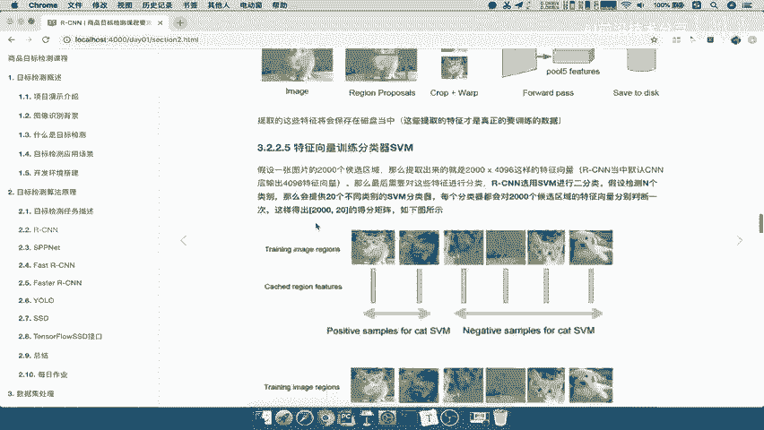

简单来说，预训练是“借用”通用知识，微调是“定制”专属技能。

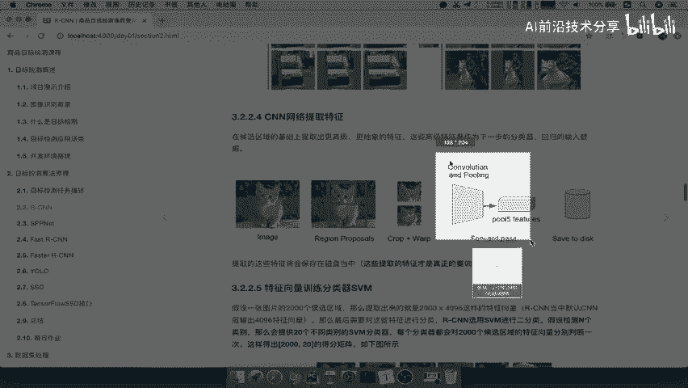

### 3. 训练 SVM 分类器

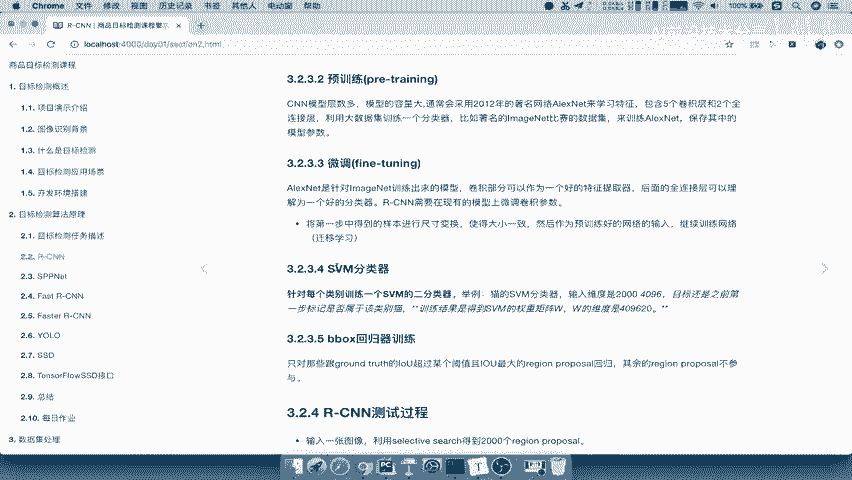

经过微调的 CNN 用于提取候选区域的特征。但这些特征需要送入专门的分类器来判断具体类别。RCNN 为每个目标类别训练一个独立的 SVM 分类器。

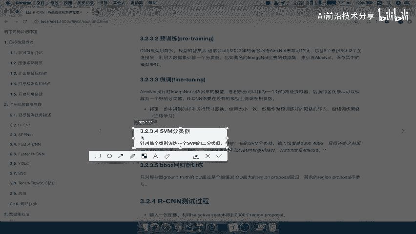

以下是训练 SVM 分类器的过程：

*   假设我们有 20 个待检测类别，则需要训练 20 个 SVM 分类器。
*   对于“猫”这个类别的分类器，其输入是所有候选区域通过 CNN 提取出的特征（例如维度为 `N x 4096`，N 为候选区域数量）。
*   其训练目标是判断每个候选区域是否属于“猫”。我们将之前标记的、属于猫的正样本作为正例，其他所有非猫的样本（包括其他类别的正样本和所有负样本）作为负例进行训练。
*   最终，每个 SVM 分类器会学习到一组权重参数。

### 4. 训练边框回归器

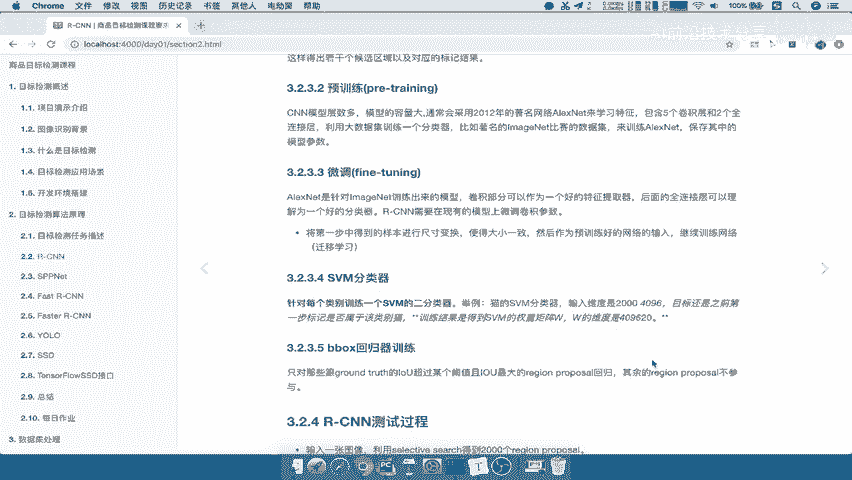

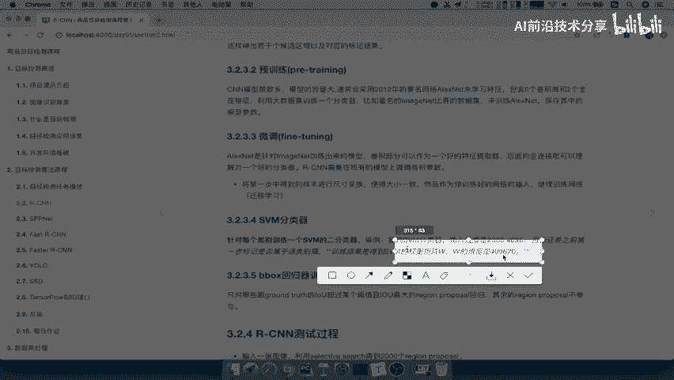

最后，为了更精确地定位目标，我们需要训练一个边框回归器（Bounding Box Regressor）。它的作用是微调候选框的位置，使其更紧密地贴合真实目标。

以下是边框回归器的训练要点：

*   训练数据筛选更为严格：只选择那些与真实标注框 IoU 值超过一个较高阈值（例如 0.6 或 0.7）的候选区域进行回归训练。
*   回归器学习的是候选框与真实框之间的 **位置偏移量**（如中心点坐标变化、宽高缩放）。
*   训练完成后，会得到回归器的参数，用于在测试阶段修正预测框的位置。

---

## 🚀 测试（预测）过程

训练完成后，所有组件（CNN特征提取器、SVM分类器、边框回归器）的参数都已就绪，即可进行预测。

RCNN 的测试过程与我们之前介绍的整体流程完全一致：

1.  **输入图像**，通过 Selective Search 生成约 2000 个候选区域。
2.  **尺寸调整**，将每个候选区域缩放至固定大小。
3.  **特征提取**，将调整后的区域输入微调好的 CNN，得到 `2000 x 4096` 维的特征矩阵。
4.  **分类打分**，将每个候选区域的特征分别输入 20 个 SVM 分类器，得到 `2000 x 20` 的得分矩阵，表示每个区域属于各类别的可能性。
5.  **非极大值抑制**：对每个类别，应用非极大值抑制（NMS）去除高度重叠的冗余框。
6.  **边框回归**：对保留下的候选框，使用训练好的边框回归器进行位置精修，得到最终的预测框。

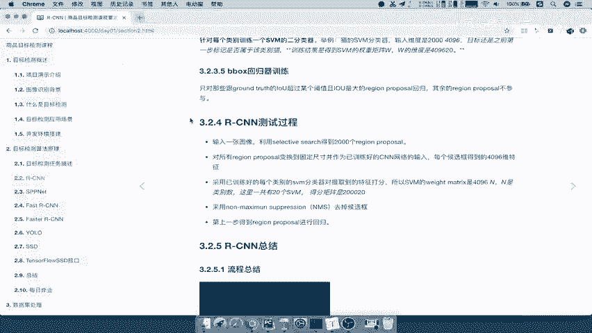

**公式/代码表示测试流程**：
```
候选区域 = Selective_Search(输入图像)
特征矩阵 = CNN_Forward(尺寸调整(候选区域))
得分矩阵 = SVM_Classify(特征矩阵)
精炼框 = NMS(得分矩阵)
最终预测框 = BBox_Regress(精炼框)
```

---

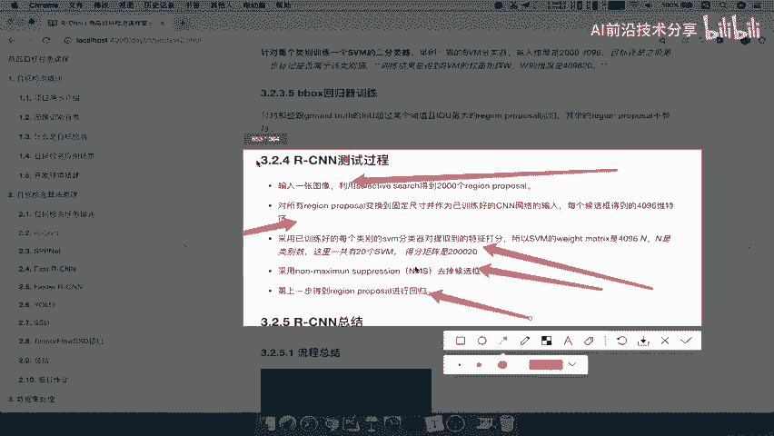

## 📝 总结

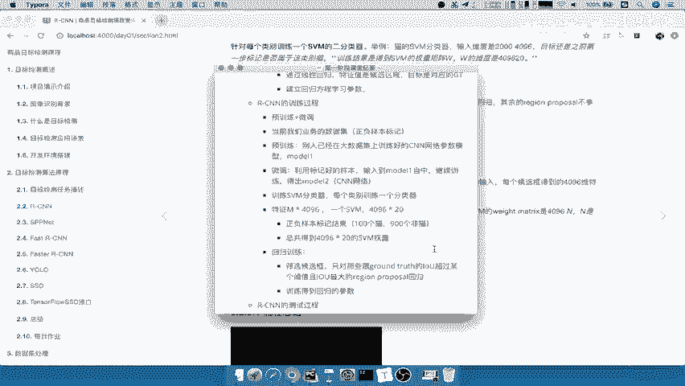

本节课我们一起学习了 RCNN 模型训练与测试的全过程。我们明确了训练需要经历的四个主要阶段：准备正负样本、预训练与微调 CNN、训练多类别 SVM 分类器以及训练边框回归器。测试过程则整合了这些训练好的组件，按照“候选区域 -> 特征提取 -> 分类打分 -> 非极大值抑制 -> 边框回归”的流程，最终完成目标检测任务。理解这一流程是后续学习更高效检测模型（如 Fast R-CNN, Faster R-CNN）的重要基础。