# 课程P15：RCNN总结、优缺点与问题自测 📝

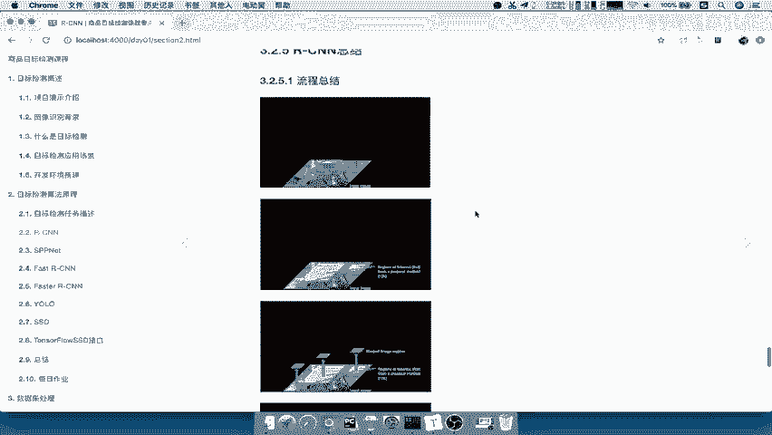

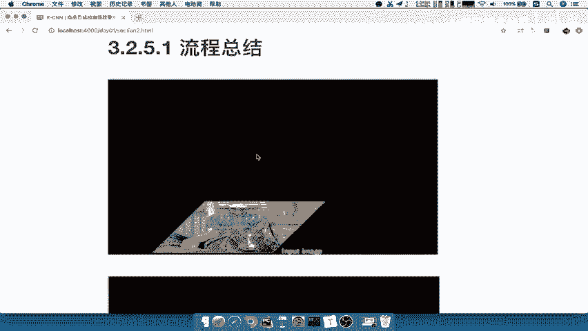

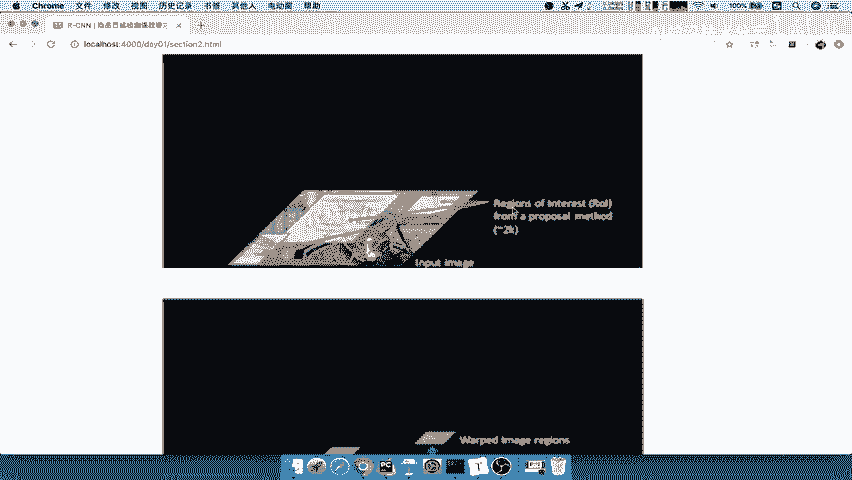

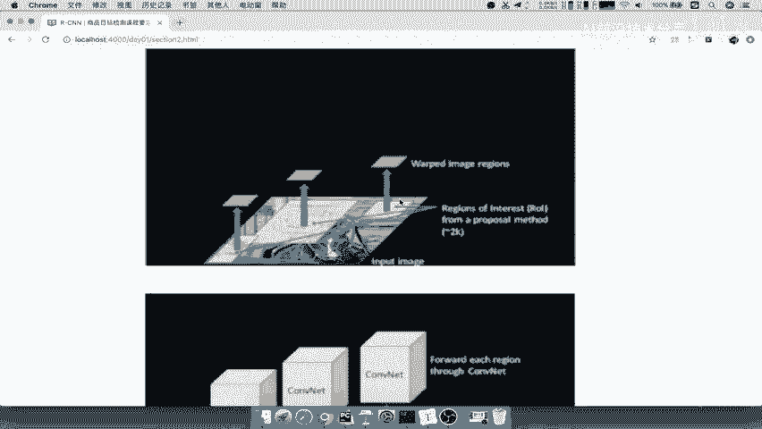

在本节课中，我们将对RCNN模型进行全面的总结。我们将回顾其核心流程，深入分析其显著的优缺点，并通过一系列自测问题来检验你对RCNN关键知识的掌握程度。

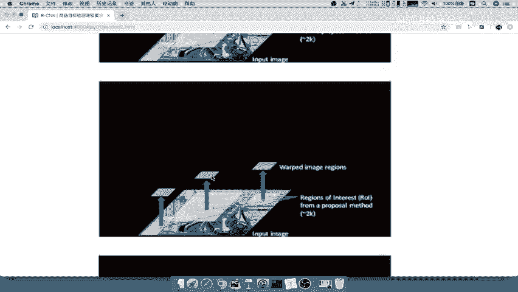

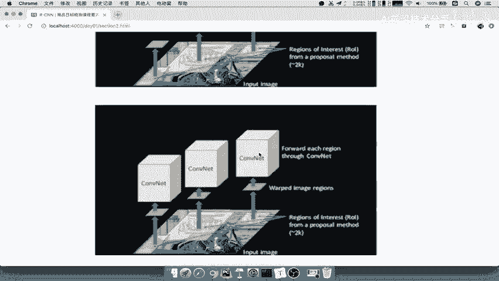

## 流程回顾 🔄

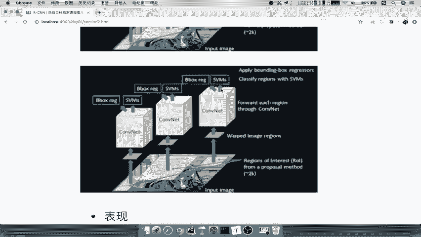

上一节我们详细介绍了RCNN的各个组成部分，本节中我们来看看其完整的端到端流程。理解这个流程是掌握RCNN的基础。

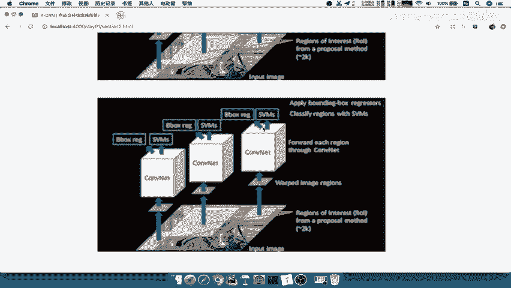

以下是RCNN处理一张图片的完整步骤：

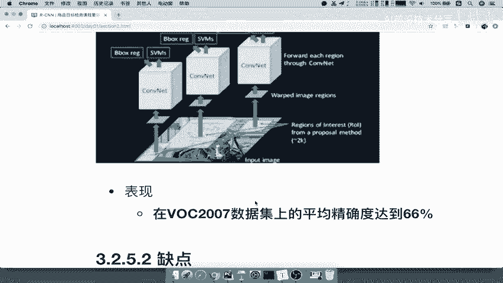

1.  **输入图片**：模型接收一张原始图片作为输入。
2.  **生成候选区域**：使用选择性搜索算法从输入图片中提取约2000个候选区域，这些区域也称为感兴趣区域。
3.  **区域归一化**：将每个大小不一的候选区域通过仿射变换等方法，统一调整为固定尺寸。
4.  **特征提取**：将每个归一化后的区域输入到一个预训练的卷积神经网络中，提取出固定长度的特征向量。
5.  **分类与回归**：
    *   将提取出的特征输入到一组SVM分类器中，判断该区域属于哪个类别。
    *   同时，将特征输入到边界框回归器中，对候选区域的位置和大小进行微调，使其更精确地框住目标。

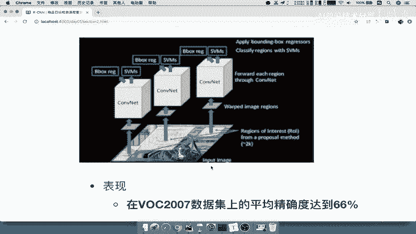

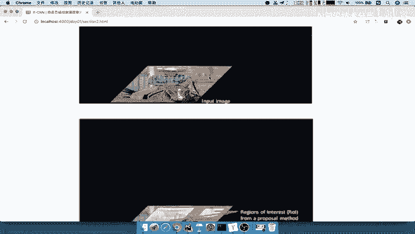

## 性能与优缺点 ⚖️

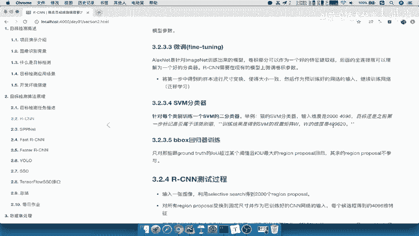

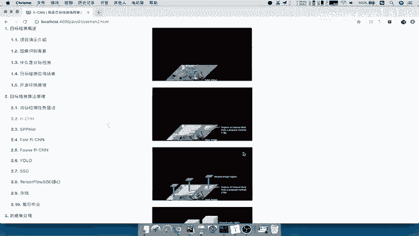

了解了RCNN的流程后，我们来看看它的实际表现和内在的局限性。

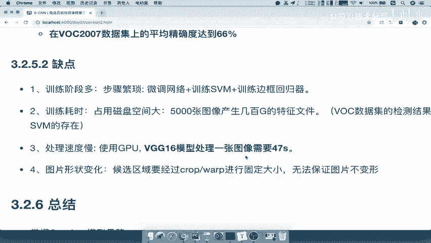

RCNN于2014年被提出，在PASCAL VOC 2007数据集上取得了约66%的mAP精度。虽然以今天的标准来看这个精度并不算高，但在当时，相比不使用深度学习的传统方法，这是一个巨大的突破。

然而，RCNN的缺点也非常明显，这些缺点直接推动了后续Fast R-CNN、Faster R-CNN等模型的诞生。

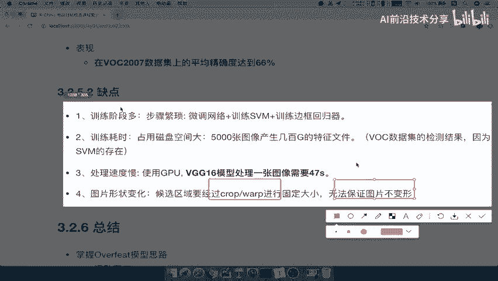

以下是RCNN的主要缺点：

*   **训练过程复杂且阶段多**：训练需要分多个独立阶段进行，包括CNN预训练、微调、SVM分类器训练和边界框回归器训练，过程繁琐。
*   **训练与测试速度极慢**：由于每个候选区域都需要单独通过CNN进行前向传播以提取特征，效率低下。例如，使用VGG16网络处理一张图片需要约47秒。
*   **占用大量磁盘空间**：SVM训练需要将CNN提取的所有区域特征保存到磁盘。对于包含5000张图片的VOC数据集，特征文件可能达到数百GB。
*   **区域变形问题**：在将候选区域归一化为固定尺寸时，可能导致图像内容发生形变，影响特征提取的准确性。

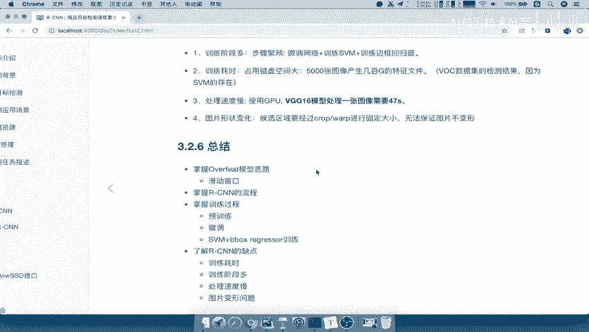

## 核心要点总结 🎯

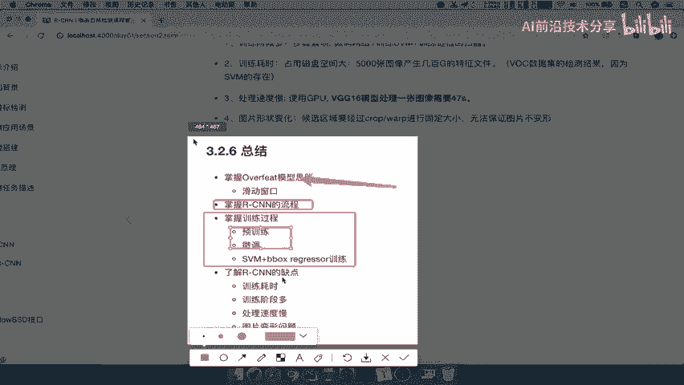

本节课我们一起学习了RCNN模型的总结性内容。我们来回顾一下需要掌握的核心要点：

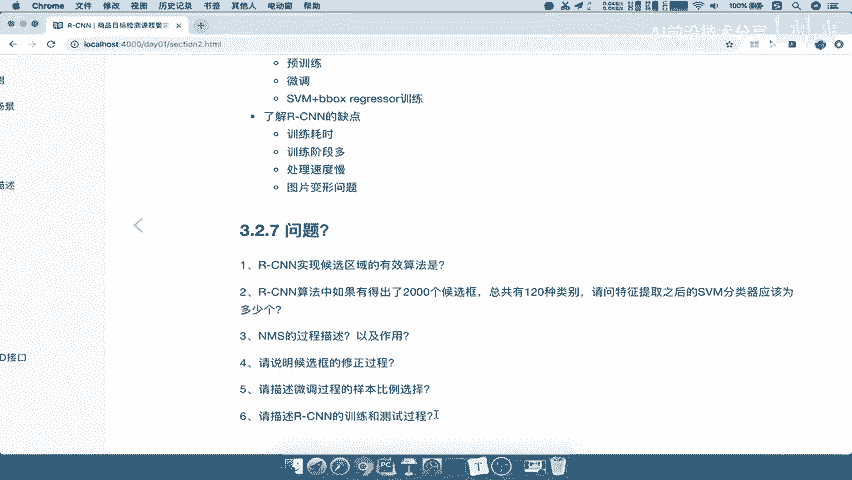

*   **解决思路**：RCNN采用了“区域提议+深度学习分类”的范式，是两阶段目标检测器的开创性工作。
*   **整体流程**：掌握从输入图像到输出检测框的完整流水线。
*   **训练过程**：重点理解**预训练**和**微调**两个阶段的目的与区别，以及SVM和回归器的作用。
*   **模型缺点**：深刻理解RCNN在**训练速度、测试速度、存储开销和流程复杂性**方面的主要缺陷。

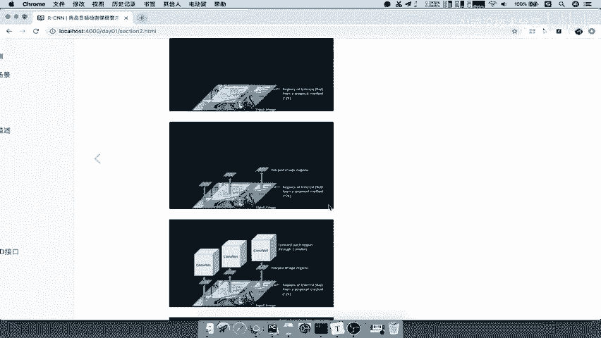

## 知识自测 ❓

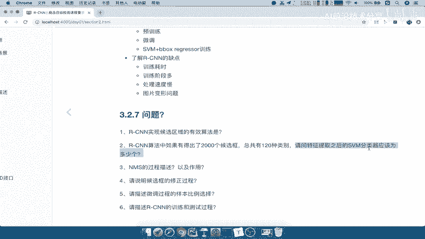

为了帮助你检验学习成果，以下是几个关键问题。如果你能清晰回答这些问题，说明你已经掌握了RCNN的核心内容。

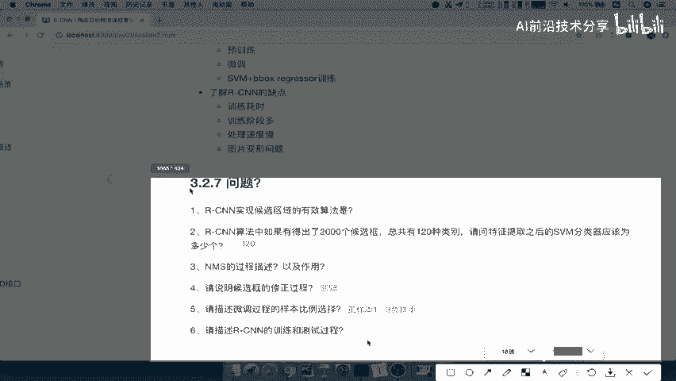

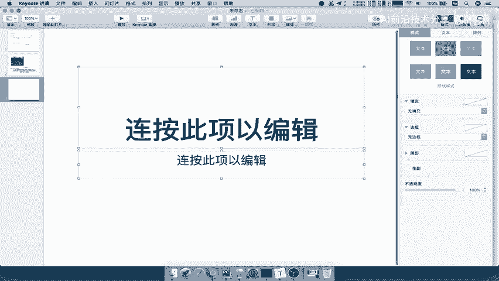

1.  RCNN中使用什么算法来获取候选区域？
2.  如果RCNN为每张图片提取2000个候选框，数据集中共有120个物体类别，那么需要训练多少个SVM分类器？
3.  边界框回归器的作用是什么？
4.  在CNN微调阶段，正负样本的比例通常如何设置？
5.  请简要描述RCNN在测试时的完整过程。

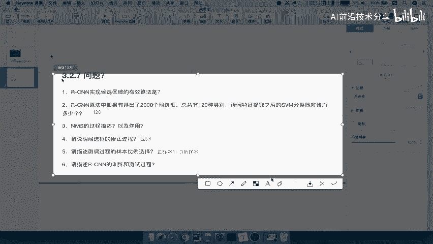

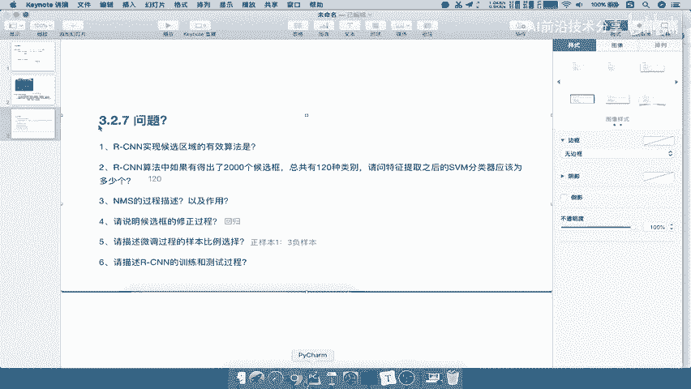

**参考答案**：
1.  选择性搜索算法。
2.  120个（每个类别一个二分类SVM）。
3.  对候选区域的位置和大小进行微调，使其更精确地匹配真实目标框。
4.  正样本与负样本的比例通常为1:3。
5.  输入图片 → SS提取约2000个候选区域 → 区域归一化 → CNN提取特征 → SVM分类 → 边界框回归 → 输出最终检测结果。