# 课程 P16：16.01_SPPNet 🧠

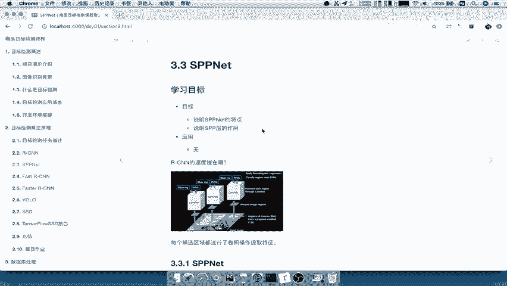

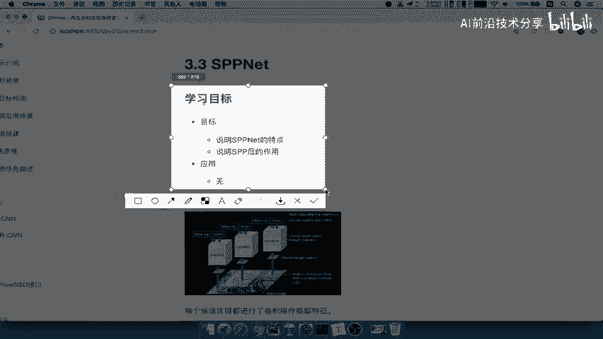

在本节课中，我们将要学习 SPPNet（Spatial Pyramid Pooling Network），这是一个在 RCNN 基础上进行改进的目标检测模型。我们将重点探讨它与 RCNN 的主要区别、其核心的网络流程，并理解其如何解决 RCNN 存在的关键问题。

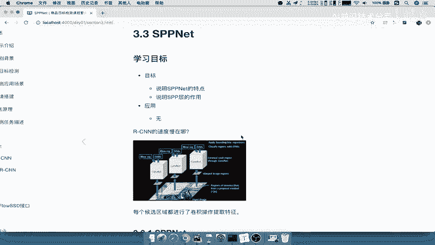

## 与 RCNN 的区别

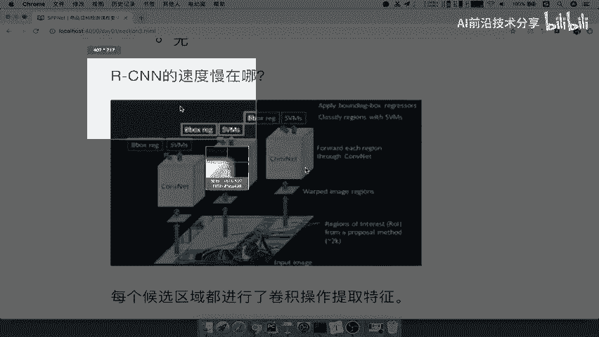

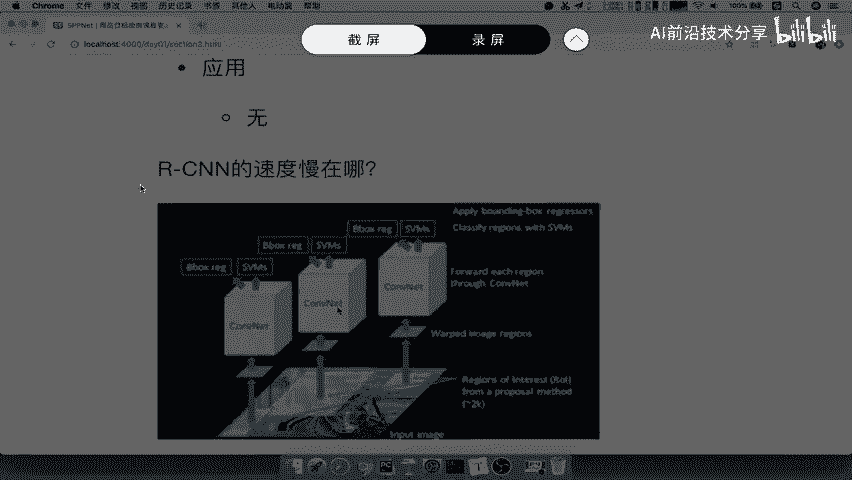

上一节我们介绍了 RCNN 的基本原理。本节中我们来看看 SPPNet 针对 RCNN 做了哪些改进。

RCNN 的速度慢是一个主要问题。其速度慢的原因在于卷积计算部分。在 RCNN 中，通常需要处理约 2000 个候选区域，而每个候选区域都需要独立地输入卷积神经网络（CNN）进行特征提取。这意味着同一张图片的卷积计算需要重复执行数千次，计算量巨大，非常耗时。

相比之下，SPPNet 提出了两点核心改进：

1.  **减少卷积计算**：SPPNet 不再让每个候选区域单独通过 CNN。相反，它只将整张原始图片输入 CNN 一次，得到一整张特征图（Feature Map）。
2.  **防止图片内容变形**：RCNN 在将候选区域输入 CNN 前，需要将其缩放（Warp）到固定尺寸，这会导致图像扭曲和失真。SPPNet 通过引入新的结构避免了这一操作。

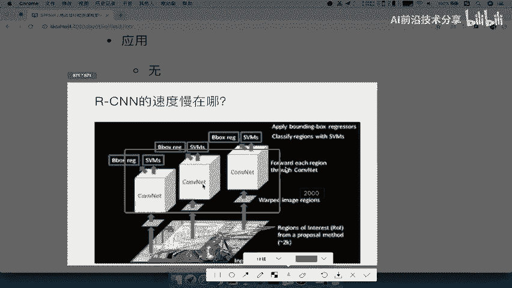

以下是 SPPNet 与 RCNN 流程的直观对比：

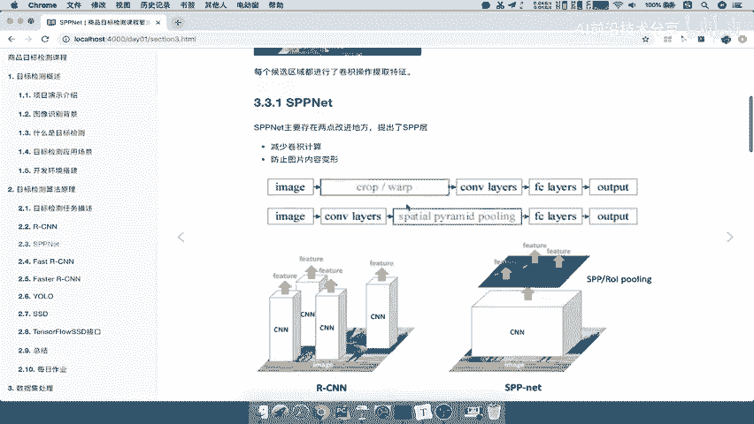

*   **RCNN**：原始图像 -> 提取候选区域 -> 每个区域缩放并独立输入 CNN -> 得到每个区域的特征 -> 后续分类与回归。
*   **SPPNet**：原始图像 -> **整图输入 CNN 得到特征图** -> 将候选区域映射到特征图上 -> 通过 **SPP 层** 提取固定大小的特征 -> 后续分类与回归。

可以看到，SPPNet 的核心思路是**共享卷积计算**，并引入 **SPP 层** 来处理不同大小的输入。

## SPPNet 网络流程分析

了解了基本区别后，本节我们将深入分析 SPPNet 的具体工作流程。其流程可以概括为以下几个关键步骤：

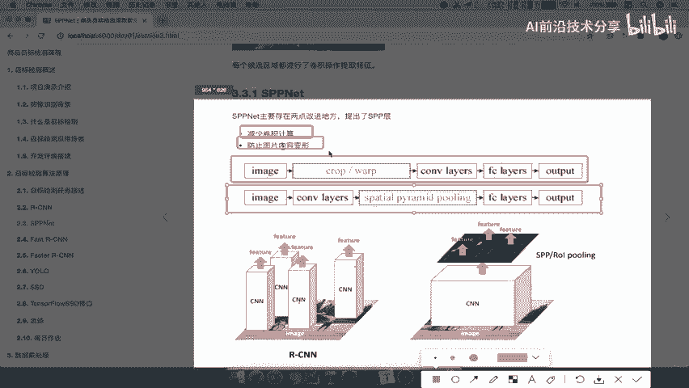

1.  **生成整图特征图**：将完整的输入图像一次性通过卷积神经网络（CNN），输出一张对应的特征图。
2.  **生成候选区域**：使用 Selective Search（SS）算法在**原始图像**上生成候选区域（Region Proposals）。
3.  **特征映射**：这是关键一步。需要将原始图像上的候选区域，映射到第一步得到的特征图上的对应位置。因为特征图是原图经过卷积下采样后的结果，所以需要计算坐标的对应关系。映射后，每个候选区域在特征图上对应一个特征块（Feature Patch）。
4.  **空间金字塔池化（SPP）**：映射得到的特征块大小是不固定的。SPP 层的作用就是接收这些任意尺寸的特征块，并输出固定长度的特征向量。这是 SPPNet 的核心创新。
5.  **分类与回归**：将 SPP 层输出的固定维特征向量输入全连接层，最终完成目标分类和边界框回归。

这个流程中的重点和难点在于 **特征映射** 和 **SPP 层**。

### 特征映射详解

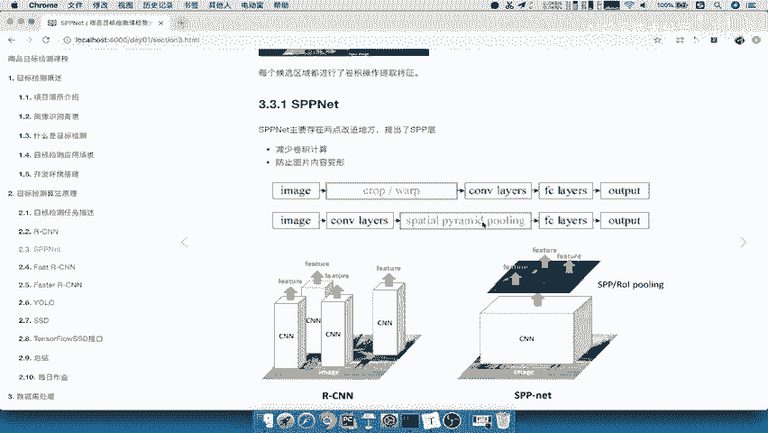

为什么需要映射？因为候选区域是从原始图像（例如 1000x600 像素）中提出的，而特征图是原始图像经过多个卷积和池化层后的结果（例如 60x40 的特征图）。两者尺寸和坐标系统不同。映射就是找到原始图像中候选框的四个角点 `(x_min, y_min, x_max, y_max)`，在特征图上对应的位置。

映射公式通常考虑网络的下采样步长（Stride）。假设从输入图像到特征图的总步长为 `S`（例如 S=16），那么特征图上的坐标大约可以通过原始坐标除以 `S` 得到：
```
特征图_x ≈ 原始_x / S
特征图_y ≈ 原始_y / S
```
实际计算中还需考虑填充（Padding）等因素进行微调。通过映射，我们无需对每个区域重复卷积，直接从共享的特征图中“裁剪”出对应的特征。

### SPP层的作用

SPP 层全称为空间金字塔池化层，它解决了卷积神经网络后接的全连接层要求输入特征尺寸固定这一问题。

以下是 SPP 层工作原理的简单描述：
1.  对于一个输入的特征块（假设大小为 `h x w x c`，其中 c 是通道数），SPP 层会对其进行多尺度的池化。
2.  常见的做法是使用三个尺度的池化窗口：`4x4`, `2x2`, `1x1`。这里的数字代表将特征图在空间上划分的网格数。
3.  对于每个尺度的每个网格，进行最大池化（Max Pooling）操作。这样，`4x4` 网格产生 16 个池化结果，`2x2` 网格产生 4 个，`1x1` 网格产生 1 个。
4.  将所有池化结果（16+4+1=21个）按通道连接（Flatten）起来，形成一个固定长度的特征向量（长度为 `21 * c`）。

通过这种方式，无论输入的特征块 `h` 和 `w` 是多少，SPP 层总能输出一个固定维度的特征向量，从而满足全连接层的要求。其代码逻辑可简示如下（伪代码）：
```python
# 假设输入特征 feature_patch 尺寸为 [h, w, c]
outputs = []
for bin_size in [4, 2, 1]: # 金字塔尺度
    # 计算每个网格的池化结果
    pooled = spatial_pooling(feature_patch, bin_size) # 形状 [bin_size, bin_size, c]
    outputs.append(pooled.flatten()) # 展平
fixed_length_vector = concatenate(outputs) # 连接所有展平后的向量
```

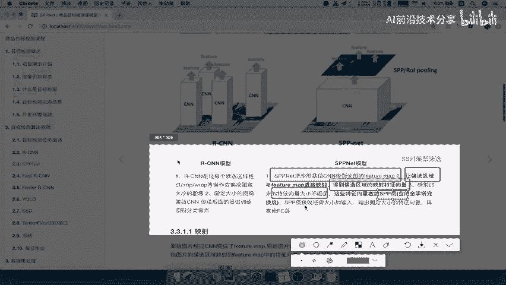

## 总结

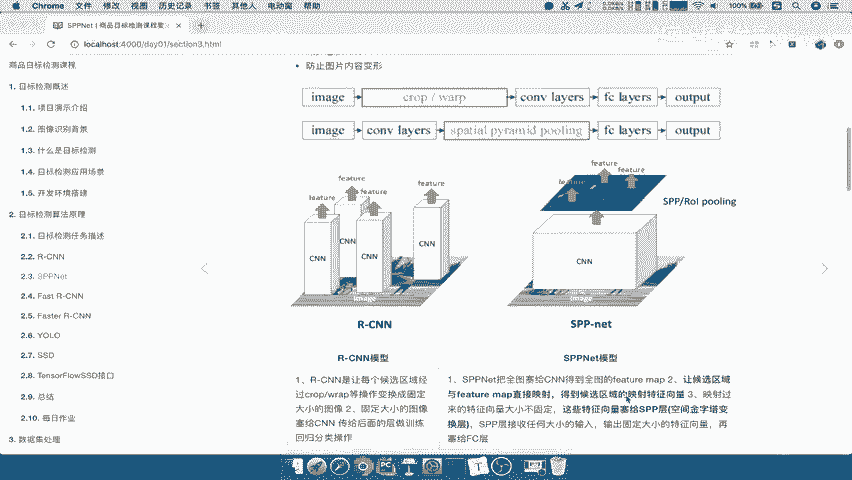

本节课中我们一起学习了 SPPNet 模型。我们首先分析了 RCNN 速度慢的根源在于对每个候选区域进行重复的卷积计算。接着，我们探讨了 SPPNet 的两大改进：**整图卷积共享**以极大提升速度，以及引入 **SPP 层** 来避免图像变形并处理可变尺寸的输入。最后，我们详细梳理了 SPPNet 的网络流程，重点讲解了**特征映射**的方法和 **SPP 层** 的工作原理。SPPNet 的这些思想为后续更快的目标检测模型（如 Fast R-CNN）奠定了重要基础。