# 课程 P17：SPPNet 中的区域映射详解 🗺️

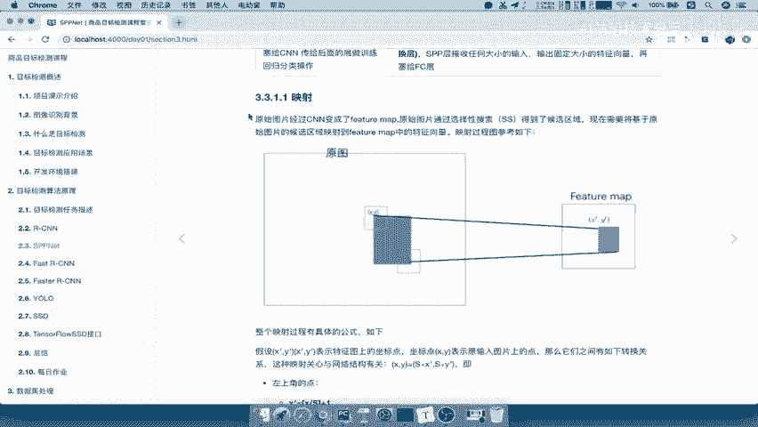

在本节课中，我们将要学习 SPPNet 中的一个核心概念：如何将原始图像上的候选区域映射到卷积神经网络（CNN）生成的特征图上。理解这个映射过程是掌握 SPPNet 工作原理的关键。

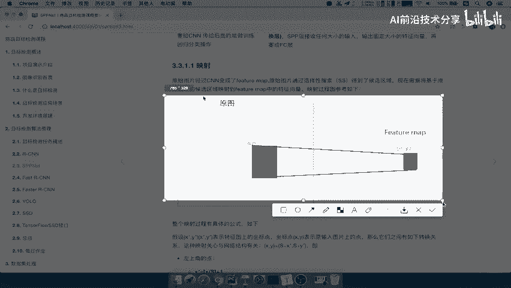

## 映射的概念与背景

上一节我们介绍了 SPPNet 的基本思想，本节中我们来看看“映射”具体指什么。

映射指的是将原始图像上的候选区域，转换到 CNN 输出的特征图上的对应位置的过程。

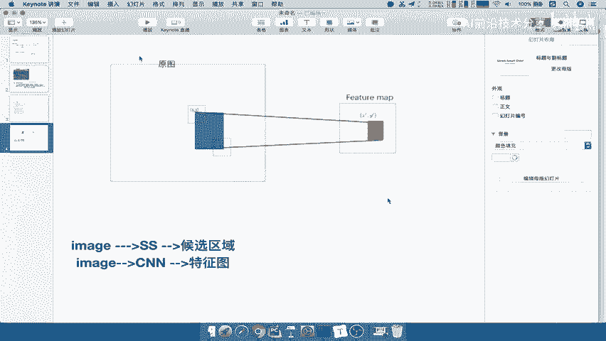

在 SPPNet 中，我们同时拥有两个输入：
1.  原始图像通过选择性搜索（Selective Search）算法得到的候选区域。
2.  原始图像通过 CNN 前向传播后生成的特征图。

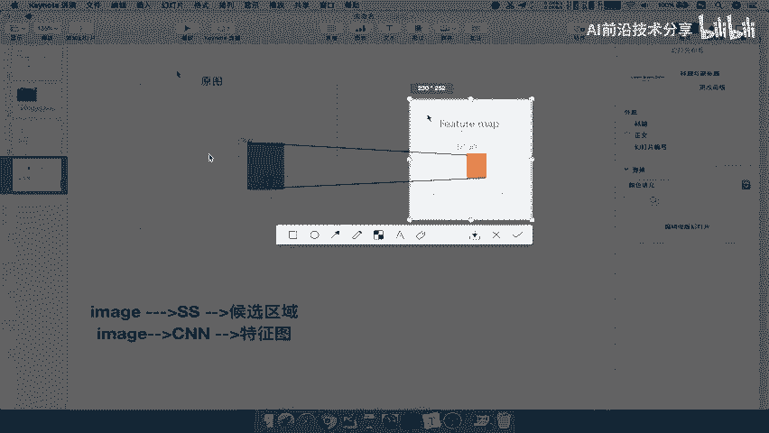

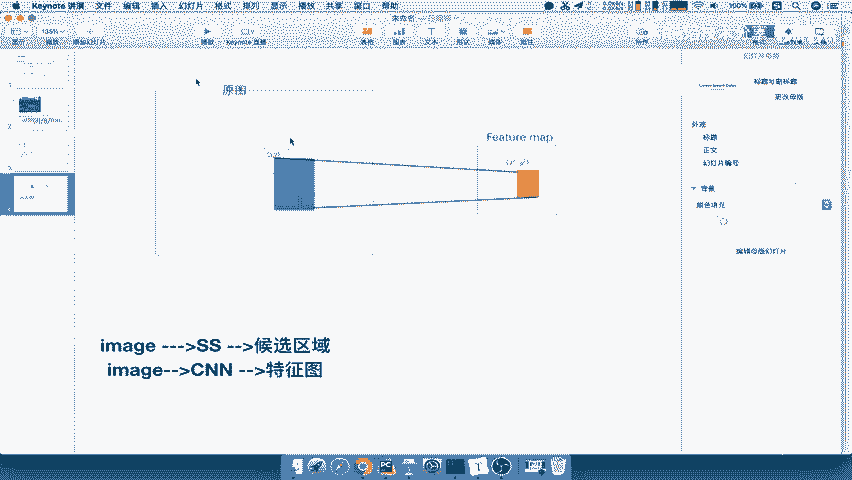

我们的最终目标是为每一个候选区域提取一个固定长度的特征向量，用于后续的分类和回归。然而，候选区域是基于原始图像定义的，而特征图是经过多层卷积和池化运算后的结果，其尺寸和空间关系已经发生了变化。

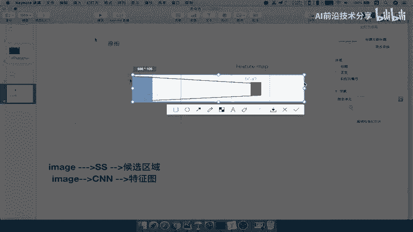

因此，必须找到一个方法，将原始图像上的候选框（例如 `(x_min, y_min, x_max, y_max)`）准确地映射到特征图上的对应区域。这个过程就是“映射”。

## 映射公式详解

理解了为什么需要映射后，我们来看看这个映射是如何通过数学公式精确计算的。

映射的核心在于找到一个缩放因子 **S**，它代表了从原始图像空间到特征图空间的总体步长（stride）。假设原始图像上某点的坐标为 `(x, y)`，其在特征图上的对应坐标为 `(x‘, y’)`，则映射关系由以下公式定义：

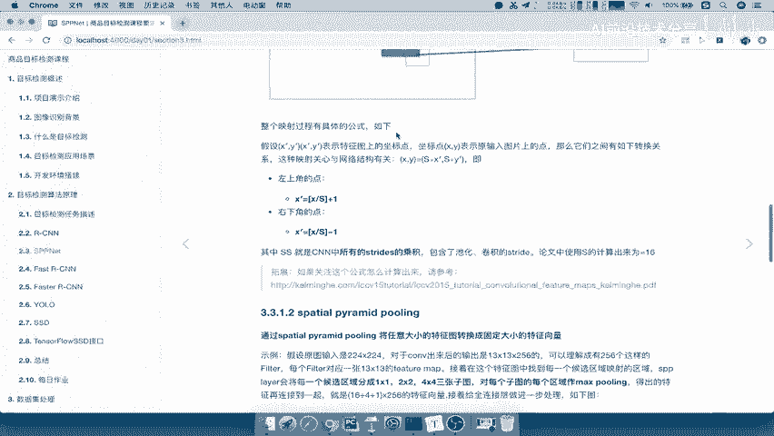

**左上角坐标映射公式：**
`x‘ = floor(x / S)`
`y‘ = floor(y / S)`

**右下角坐标映射公式：**
`x‘_max = ceil(x_max / S) - 1`
`y‘_max = ceil(y_max / S) - 1`

这里的 **S** 是 CNN 网络中所有卷积层和池化层的 **步长（stride）的乘积**。在原始的 SPPNet 论文中，基于其使用的 CNN 结构（如 ZF-5 或 VGG16），这个 **S** 通常为 **16**。

举个例子，若原始图像上一个候选区域的左上角坐标为 `(100, 150)`，且 `S=16`，那么该点在特征图上的横坐标 `x‘ = floor(100 / 16) = 6`。

## 映射过程的意义

通过上述公式，我们可以将原始图像上的每一个候选区域都映射到特征图上。

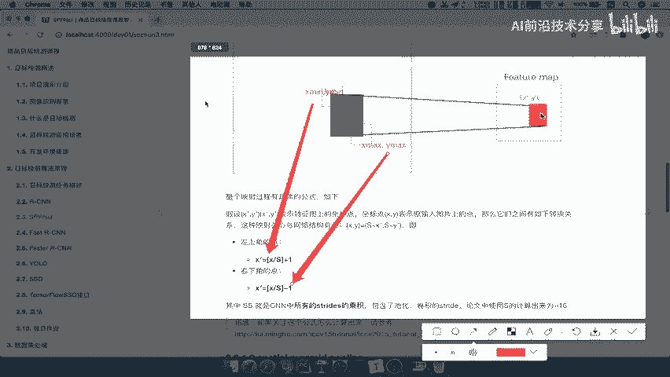

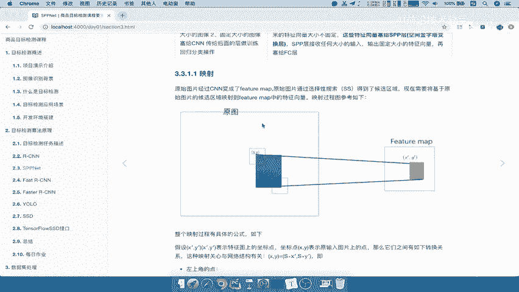

这意味着，对于通过选择性搜索产生的约 2000 个候选区域，我们都能在特征图上找到其对应的“特征区域”。这些特征区域才是后续输入给 SPP（空间金字塔池化）层，以生成固定长度特征向量的基础。

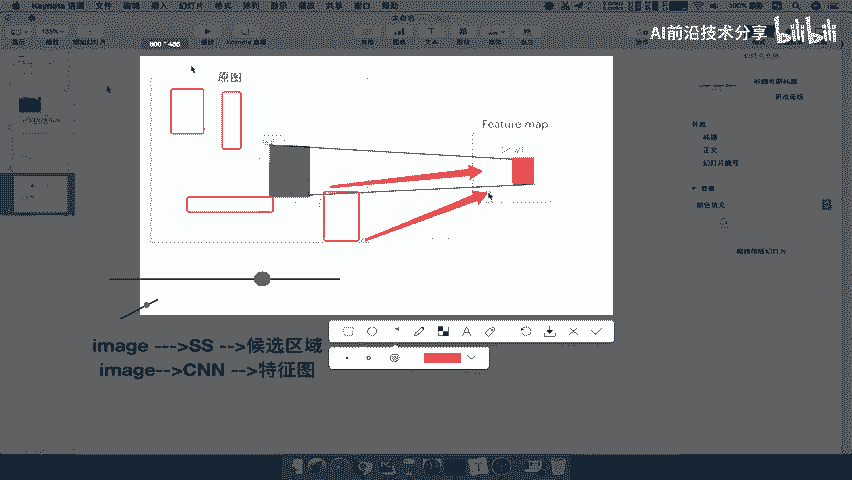

映射过程解决了 R-CNN 中需要对每个区域独立进行 CNN 前向传播的效率瓶颈。SPPNet 只需对整张图像做一次前向传播，生成一个特征图，然后通过这个映射公式，即可一次性为所有候选区域找到其特征表示，极大地提升了速度。

## 总结

本节课中我们一起学习了 SPPNet 中至关重要的区域映射机制。

我们首先明确了映射的目的是为了将基于原始图像的候选框与 CNN 生成的特征图在空间上对齐。接着，我们深入讲解了实现这一对齐的**核心映射公式**，该公式利用网络总步长 **S** 来计算坐标转换。最后，我们理解了这一过程的意义：它使得 SPPNet 能够高效地在单次前向传播中为所有候选区域提取特征，这是其相比 R-CNN 获得巨大速度提升的关键一步。

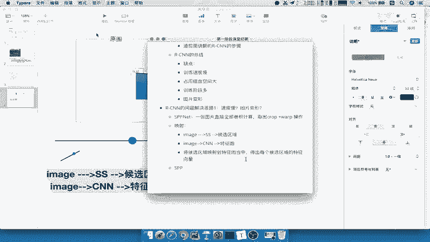

掌握这个映射原理，就为理解下一节要介绍的 SPP（空间金字塔池化）层如何工作打下了坚实的基础。