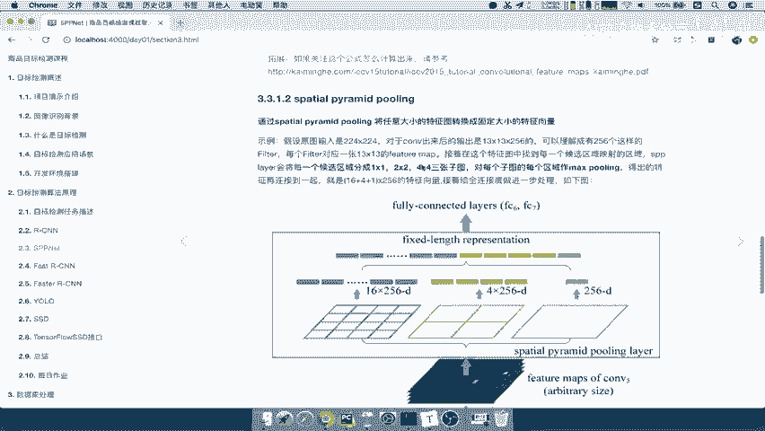
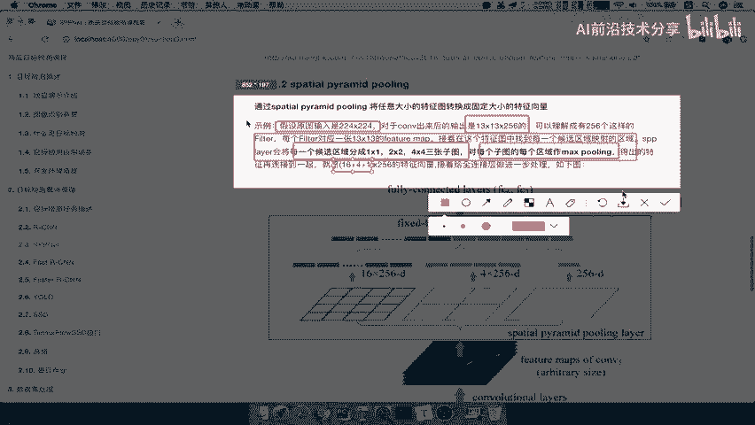
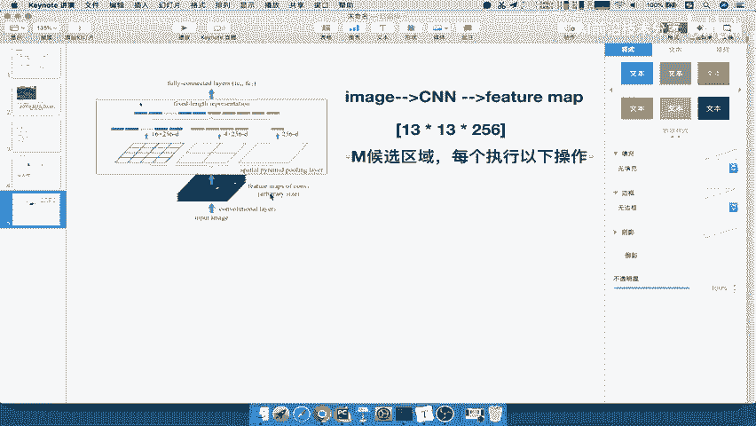
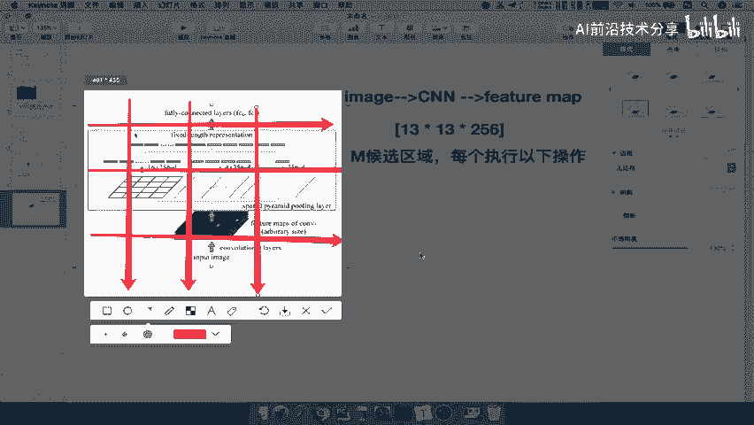
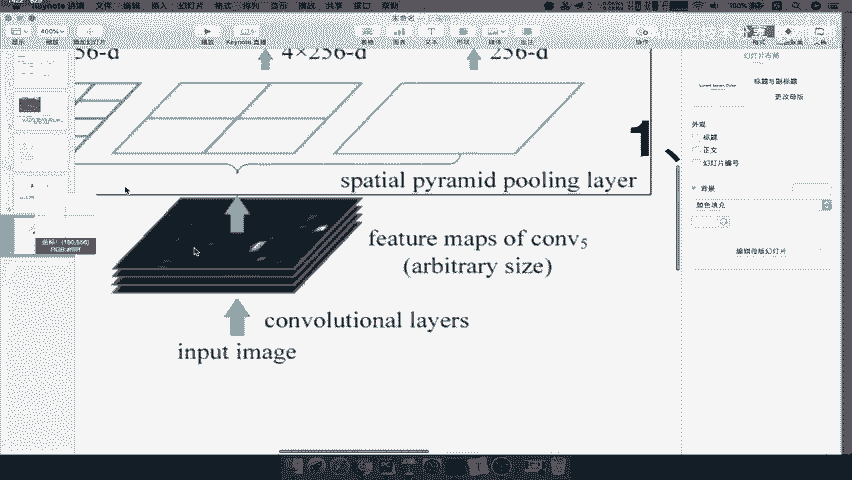
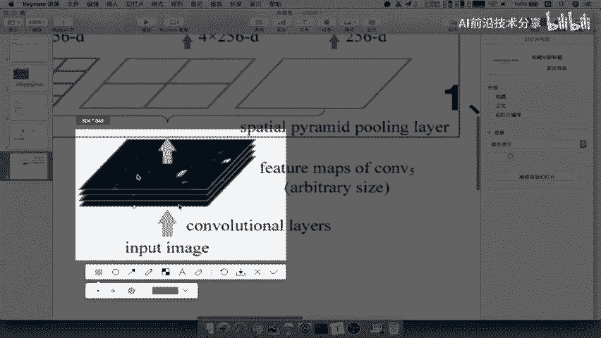
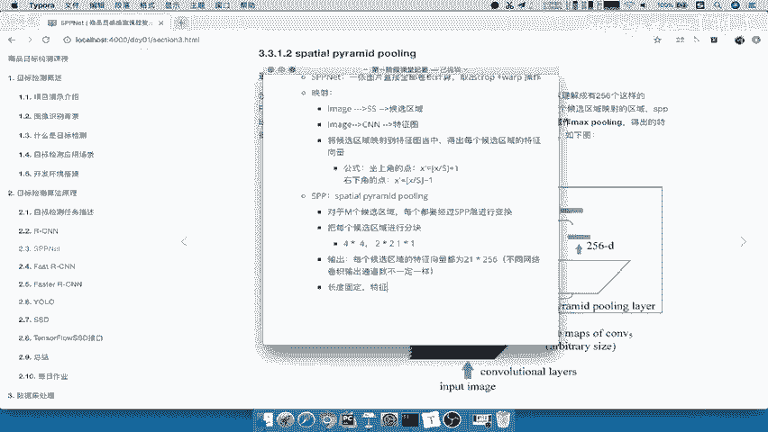
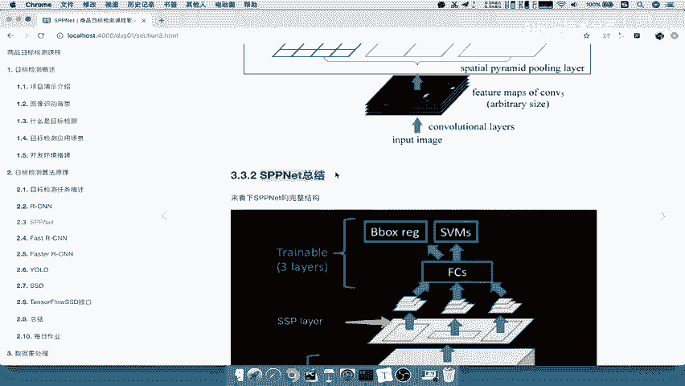

# 课程 P18：SPPNet - SPP层的作用详解 🧠

在本节课中，我们将要学习SPPNet网络中的一个核心组件——SPP层（空间金字塔池化层）。我们将详细解析它的工作原理，以及它如何解决输入特征图尺寸不固定，但全连接层需要固定长度输入这一关键问题。

上一节我们介绍了候选区域到特征图的映射过程。本节中我们来看看如何将这些大小不一的特征图区域，转换为固定长度的特征向量。

## SPP层的引入与作用

映射之后得到的特征变量大小是不固定的。然而，R-CNN等网络的全连接层（FC层）要求输入是固定大小的。例如，R-CNN输入固定为227x227，输出的特征向量也是固定的4096维。

因此，必须有一种方法将不固定大小的输入，转换为固定大小的输出。这个任务就交给了SPP层。

SPP层，即空间金字塔池化层，它能接受任何大小的输入，并输出固定维度的特征向量，然后传递给全连接层。

## SPP层的工作流程

这个过程的关键在于变换。对于从原始图像中筛选出的M个候选区域（注意，M不一定是2000，2000是R-CNN的设定），每一个都需要经过SPP层进行相同的变换。

以下是SPP层变换过程的文字描述：
输入图片的一个候选区域，经过卷积后得到一个特征图（例如13x13x256）。SPP层会将该区域对应的特征图块，分别划分成1x1、2x2、4x4的网格。对每个网格内的区域执行最大池化（Max Pooling）操作，然后将所有结果连接起来，最终形成一个固定长度（例如 (16+4+1)*256）的特征向量，传给全连接层。

接下来我们详细讲解这个过程。

## SPP层过程详解

假设输入图像经过CNN后，得到一个特征图（Feature Map）。这个特征图通常有多个通道，例如尺寸为13x13，通道数为256，即共有256张13x13的特征图。

对于这M个候选区域中的每一个，都需要执行以下操作：

SPP层对该候选区域对应的特征图块进行多尺度网格划分：

1.  **使用4x4的网格进行划分**：将区域均匀划分为16个小块。
    *   每一小块进行最大池化，得到一个值。
    *   对于一个有256个通道的特征图，经过此操作会得到 `16 * 256` 个值。

2.  **使用2x2的网格进行划分**：将区域均匀划分为4个小块。
    *   每一小块进行最大池化，得到一个值。
    *   最终得到 `4 * 256` 个值。

3.  **使用1x1的网格进行划分**：即不划分，将整个区域视为一块。
    *   进行最大池化，得到该区域的最大值。
    *   最终得到 `1 * 256` 个值。

最后，将这三个尺度池化得到的结果连接（Concatenate）起来，形成最终的特征向量。

其维度计算公式为：
`(16 + 4 + 1) * 通道数 = 21 * 通道数`

因此，**每个候选区域**经过SPP层处理后，都会得到一个固定为 `21 * 256` 的特征向量（这里的256是示例网络的通道数，实际根据网络结构如AlexNet、VGG等会有所不同）。

## 核心总结

本节课中我们一起学习了SPPNet的核心创新点——SPP层。

我们来总结一下SPP层的关键作用：
*   **输入**：任意尺寸的特征图区域。
*   **操作**：对每个区域进行1x1, 2x2, 4x4三个尺度的网格划分和最大池化。
*   **输出**：固定长度的特征向量（例如 `21 * 通道数`）。
*   **意义**：这使得网络可以一次性对整张图像进行卷积计算，然后通过SPP层处理各个候选区域，避免了R-CNN中需要对每个区域重复进行卷积运算的巨大开销，显著提升了检测速度。

至此，特征向量的长度被固定下来，后续的全连接层和分类、回归操作就可以正常进行了。