# 🧠 课程 P19：SPPNet 总结、优缺点与问题自测

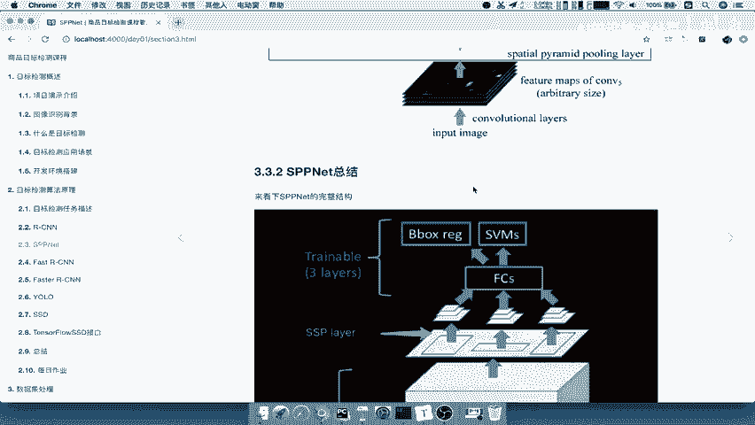

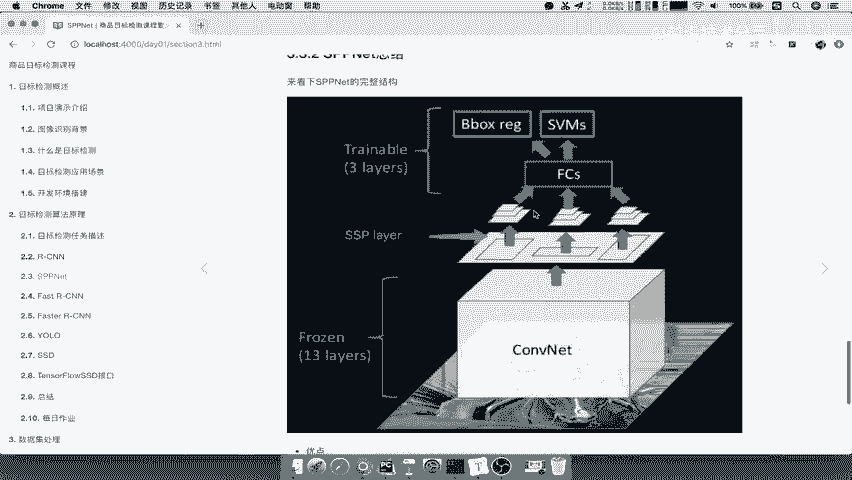

在本节课中，我们将总结 SPPNet 的核心思想、完整结构，分析其优缺点，并通过几个关键问题来检验你对 SPPNet 的理解程度。

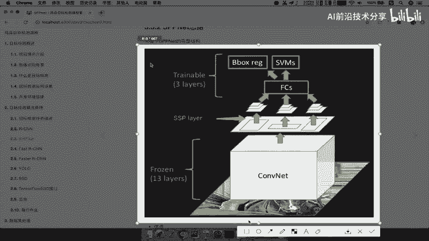

---

## 📊 SPPNet 完整结构回顾

上一节我们介绍了 SPPNet 的核心思想，本节中我们来看看它的完整处理流程。

整个结构可以概括为以下几个步骤：

1.  **输入图像**：将一张图片输入网络。
2.  **卷积特征提取**：图像直接经过卷积神经网络，生成特征图。
3.  **区域映射与 SPP 层处理**：将候选区域映射到上一步生成的特征图上。对于每个映射后的特征区域，SPP 层会对其进行多尺度池化。
4.  **固定长度输出与分类回归**：SPP 层将每个区域处理成固定长度的特征向量，然后输入全连接层。最后，通过 SVM 分类器和 Bounding Box 回归器完成目标检测。

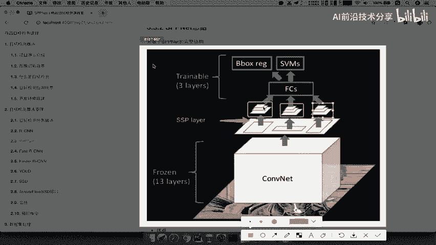

这个过程与 R-CNN 类似，但关键改进在于**SPP 层的引入**。

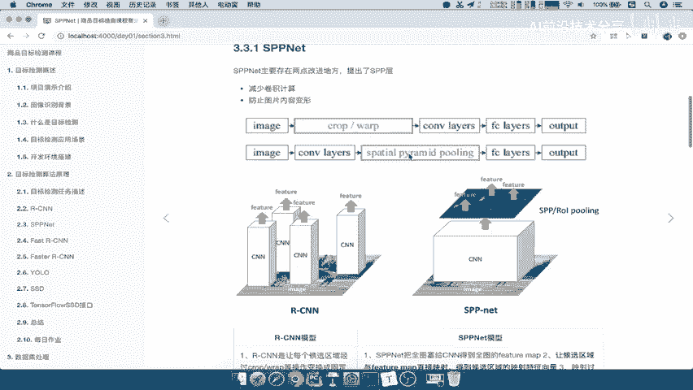

以下是 SPP 层多尺度池化的一个示例，它通常包含 `4x4`、`2x2`、`1x1` 等不同尺度的池化：

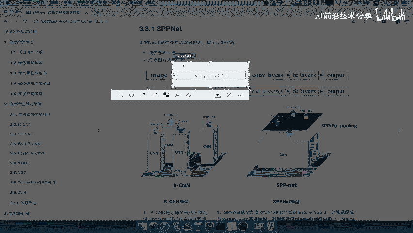

```python
# 概念性代码，表示 SPP 层对同一区域进行不同尺度的池化
spp_output = []
for pool_size in [(4,4), (2,2), (1,1)]:
    pooled_feature = spatial_pyramid_pooling(feature_map, pool_size)
    spp_output.append(pooled_feature)
fixed_length_vector = concatenate(spp_output) # 拼接成固定长度向量
```

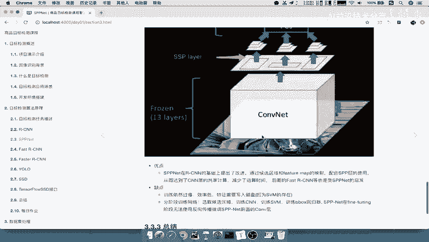

因此，SPPNet 的完整结构主要改善了两点：**大幅减少了卷积运算次数**，以及**生成了固定长度的特征向量**。

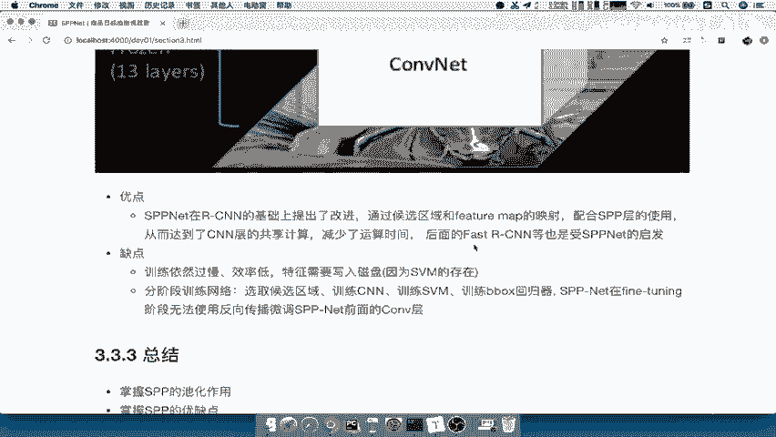

---

## ⚖️ SPPNet 的优缺点分析

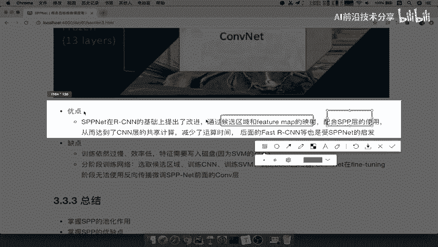

了解了 SPPNet 的结构后，我们来系统性地分析它的优势与不足。

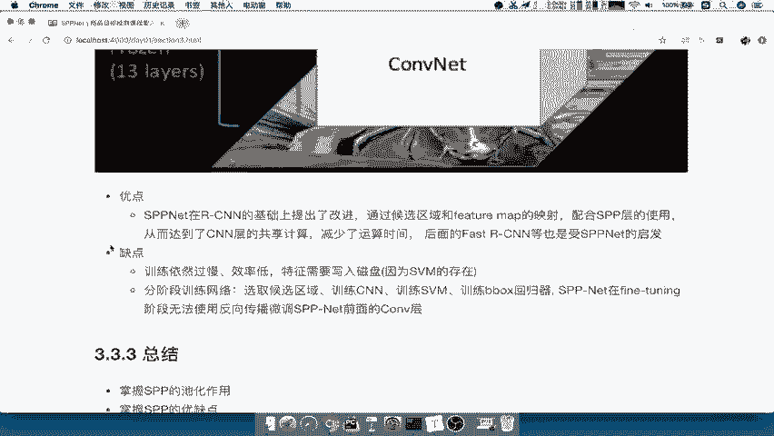

### 优点

相对于 R-CNN，SPPNet 的主要改进在于：
*   **计算效率提升**：通过将候选区域映射到共享的特征图上，只需对整图进行一次卷积计算，避免了 R-CNN 中每个候选区域都独立进行卷积的重复计算。
*   **避免图像形变**：SPP 层可以接受任意尺寸的输入并输出固定长度的特征，因此无需像 R-CNN 那样对每个候选区域进行裁剪或形变，保留了更多原始信息。

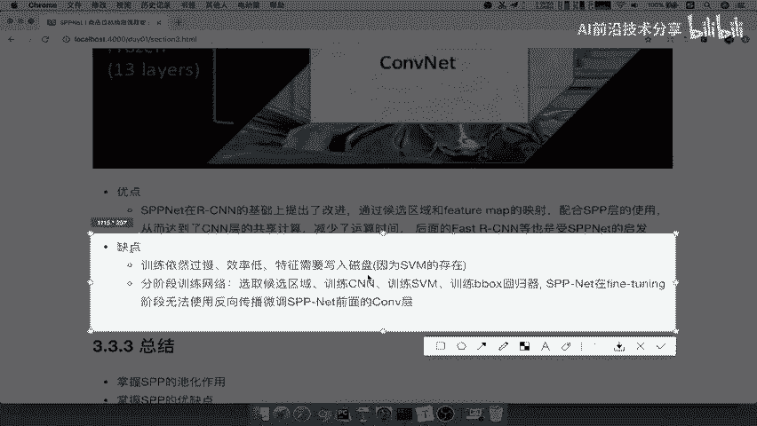

### 缺点

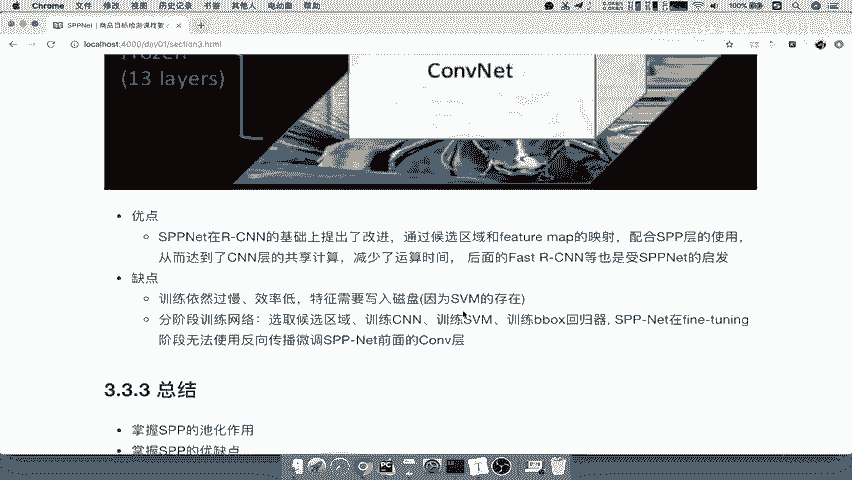

然而，SPPNet 并未解决 R-CNN 的所有固有缺陷：

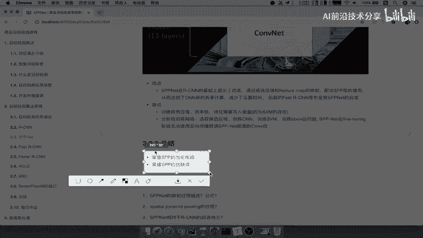

以下是 SPPNet 存在的主要缺点：
1.  **训练流程复杂且缓慢**：训练仍然是多阶段的，需要分别训练卷积网络、SVM分类器和Bounding Box回归器。
2.  **特征需要写入磁盘**：在训练SVM和回归器时，中间生成的特征需要保存到磁盘，占用大量存储空间且速度慢。
3.  **无法端到端训练**：SVM和回归器无法与前面的卷积网络部分进行联合优化，限制了模型性能的进一步提升。

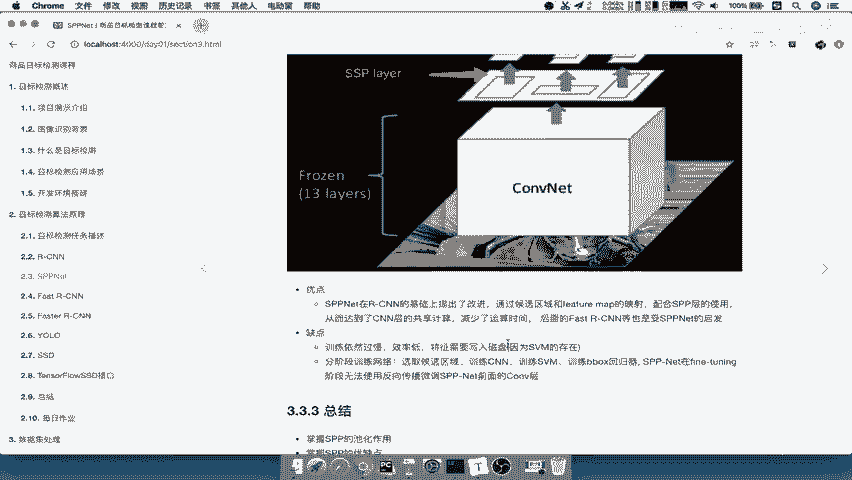

---

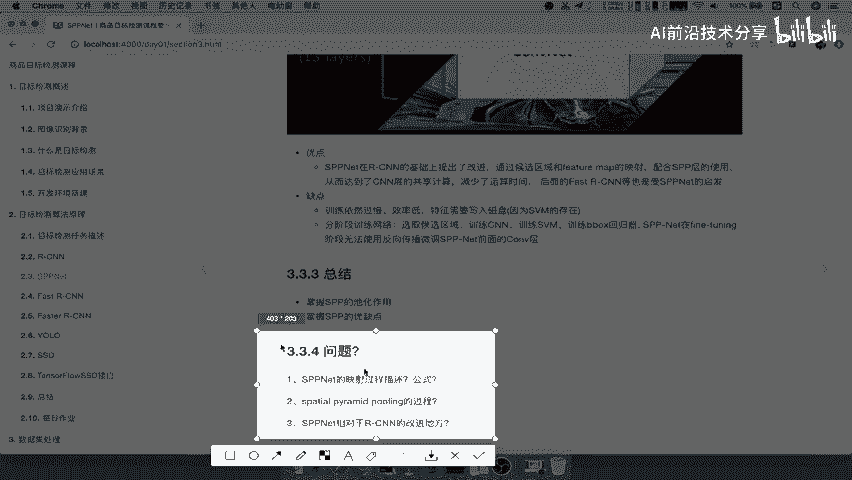

## ✅ 学习成果自测

最后，我们通过几个问题来检验你是否掌握了 SPPNet 的核心内容。

请尝试回答以下问题：
1.  **映射过程公式**：描述 SPPNet 中将原始图像上的候选区域映射到特征图上的过程，其坐标计算公式是什么？（提示：注意与 R-CNN 的不同之处）
2.  **SPP 层过程**：SPP 层具体是如何操作的？“4x4, 2x2, 1x1”的池化结构是如何产生固定长度输出的？
3.  **核心改进**：相对于 R-CNN，SPPNet 最主要的改进体现在哪里？它解决了 R-CNN 的哪些痛点？

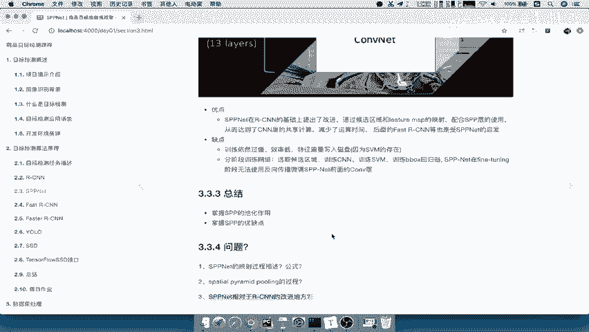

---

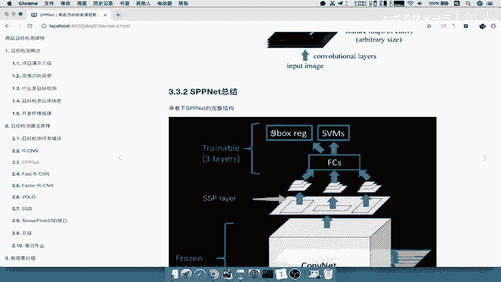

## 📝 本节课总结

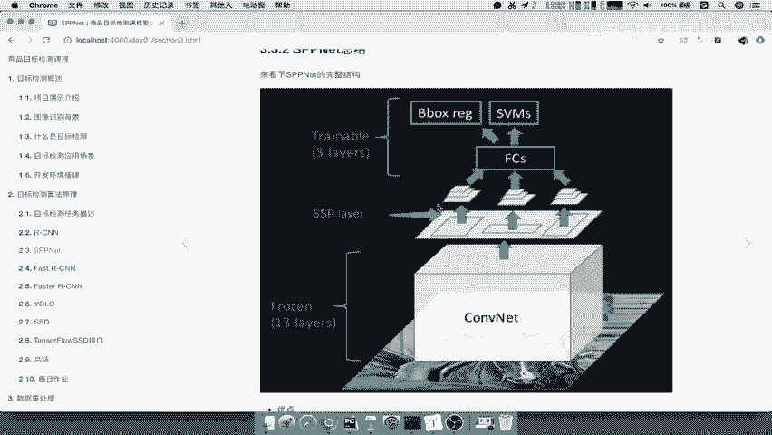

本节课中，我们一起学习了 SPPNet 的完整架构，明确了其通过**共享卷积计算**和引入**空间金字塔池化层**来提升 R-CNN 效率的核心机制。我们分析了 SPPNet 在**减少计算量**和**避免图像形变**方面的优点，同时也指出了它在**训练流程**和**端到端学习**方面存在的局限。理解 SPPNet 的这些特点，为我们后续学习更先进的检测模型奠定了重要基础。