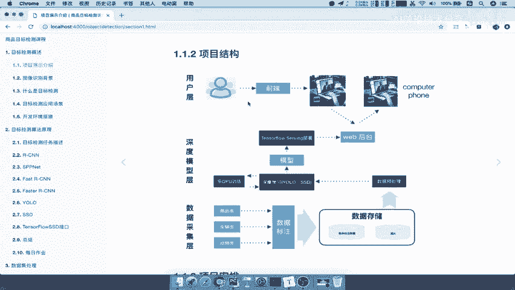
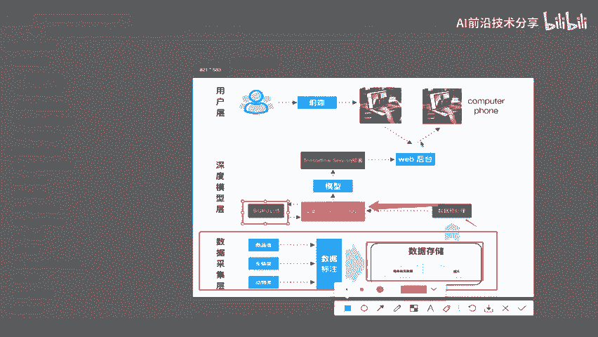
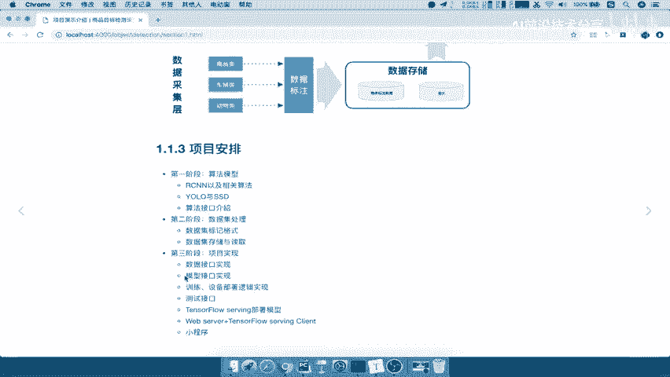
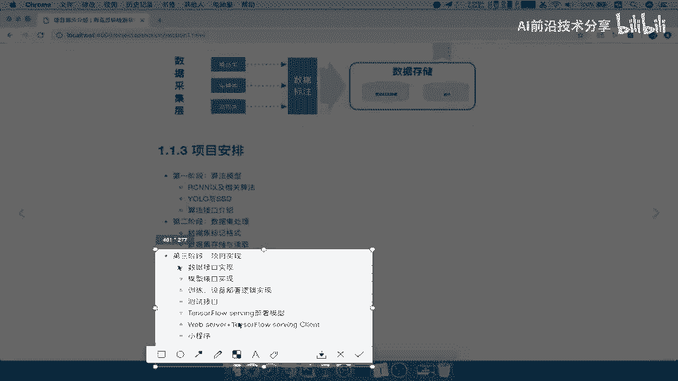
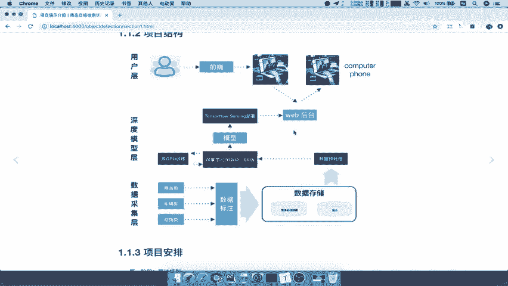

# 课程P2：项目结构安排 🏗️

在本节课中，我们将学习整个项目的宏观结构。我们将了解项目从数据准备到最终用户交互的完整流程，并明确后续学习的三个阶段。

## 项目整体架构概述

上一节我们介绍了项目的背景，本节中我们来看看项目的整体架构。整个流程主要分为三个层次：数据采集层、深度模型层和用户交互层。下图清晰地展示了各层之间的关系与数据流向。

对于这张图，我们目前只需要达到一个整体了解的程度，知道整个过程即可。后续课程会针对每个部分的设计进行详细讲解。

## 架构详解：三层结构

接下来，我们详细解析架构图中的三个核心部分。

### 1. 数据采集层 📥

数据采集层负责准备训练所需的数据。以下是该层的主要工作：

*   **数据采集**：收集大量的图片数据。
*   **数据标注**：为收集到的图片数据进行标注。在深度学习中，训练模型需要已标注的数据，例如为图片标记其所属的类别。
*   **数据存储**：将标注好的数据和对应的图片数据存储到本地磁盘中，为后续训练做好准备。

### 2. 深度模型层 🤖

深度模型层是项目的核心，负责模型的训练与部署。以下是该层的关键步骤：

*   **数据预处理**：将存储的数据输入模型层前，先进行必要的预处理。
*   **模型训练**：将处理好的图片数据输入到算法模型中进行训练。本项目会使用**多GPU**进行训练，以加速过程。
*   **生成模型**：训练的目的是得到一个可用的模型文件。
*   **模型部署**：生成的模型文件需要部署到 **TensorFlow Serving** 服务器上，以便提供预测服务。
*   **提供接口**：部署后，我们会搭建一个简单的Web后台（本项目重点不在此），该后台提供接口，用于接收输入并返回模型的预测结果。

### 3. 用户交互层 👥

用户交互层是项目的最终呈现部分。以下是其工作方式：

*   **接口调用**：用户通过前端（如网页或小程序）进行交互，调用Web后台提供的接口。
*   **输入与输出**：用户通过接口输入一张图片，接口则返回模型的预测或识别结果。

## 项目核心流程总结

现在，我们把刚才介绍的三层结构及其职责总结一下。

*   **数据采集层**：核心工作是**数据标注**与决定**数据存储格式**。
*   **深度模型层**：核心工作包括**数据预处理**、**多GPU训练**、**得到模型**，并使用 **TensorFlow Serving** 进行**模型部署**，最终为Web后台提供预测接口。
*   **用户交互层**：用户通过网页或小程序等前端，调用接口**获取预测或识别结果**。

这就是项目的整体架构，大家目前对此有一个简单的了解即可。

## 项目学习三阶段安排 📅

了解了项目结构后，我们来看一下整个课程将如何分阶段展开讲解。项目学习分为以下三个阶段：

以下是三个学习阶段的具体内容：

1.  **第一阶段：算法模型**
    在介绍相关背景知识后，我们将首先深入讲解核心的算法模型。这是项目最重要的部分，我们将学习如R-CNN、SSD等当前效果优秀的识别算法。

2.  **第二阶段：数据处理**
    掌握了算法原理后，第二阶段将重点处理数据。这包括数据的标记、存储格式的决定与管理等。

3.  **第三阶段：项目实现**
    了解了前两个模块后，第三阶段将进行完整的项目实现。这包括：
    *   数据接口的实现
    *   模型接口的实现
    *   训练模块的逻辑实现
    *   测试接口的实现
    *   TensorFlow Serving服务端的部署
    *   Web服务器与客户端的编写
    *   小程序的最终集成与测试

---

本节课中我们一起学习了项目的三层整体架构（数据采集层、深度模型层、用户交互层）以及课程后续将遵循的三个学习阶段（算法模型、数据处理、项目实现）。这为我们后续的深入学习奠定了清晰的路线图。