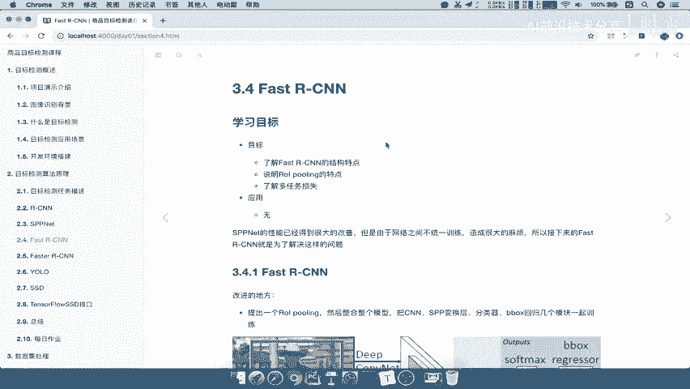
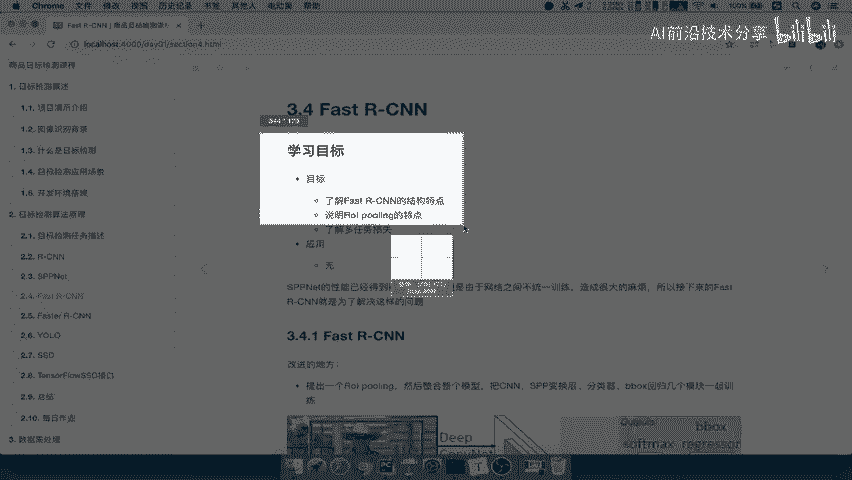
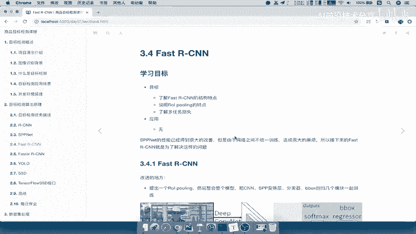
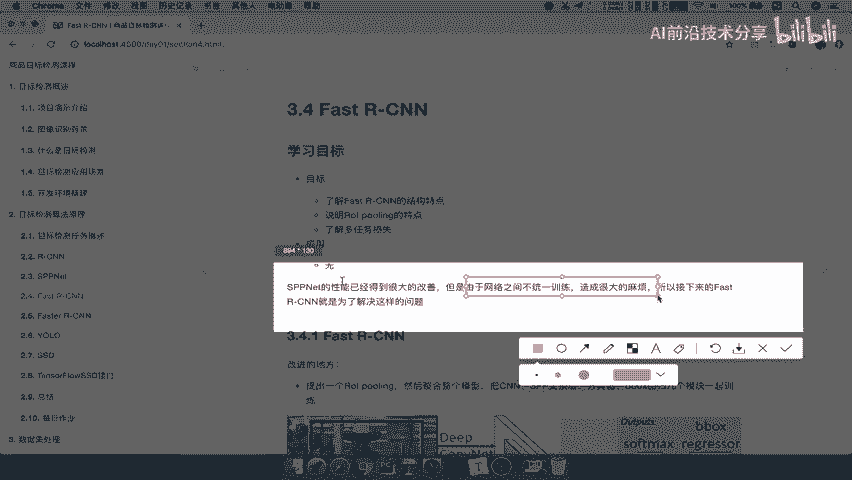
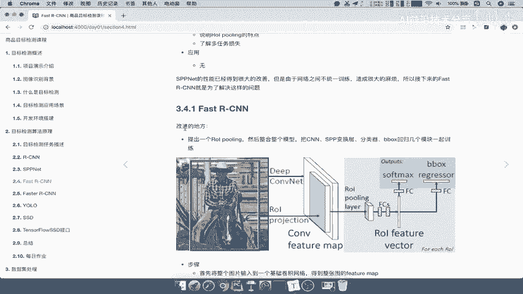
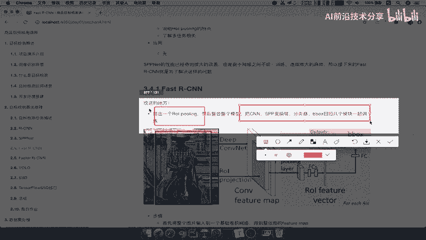
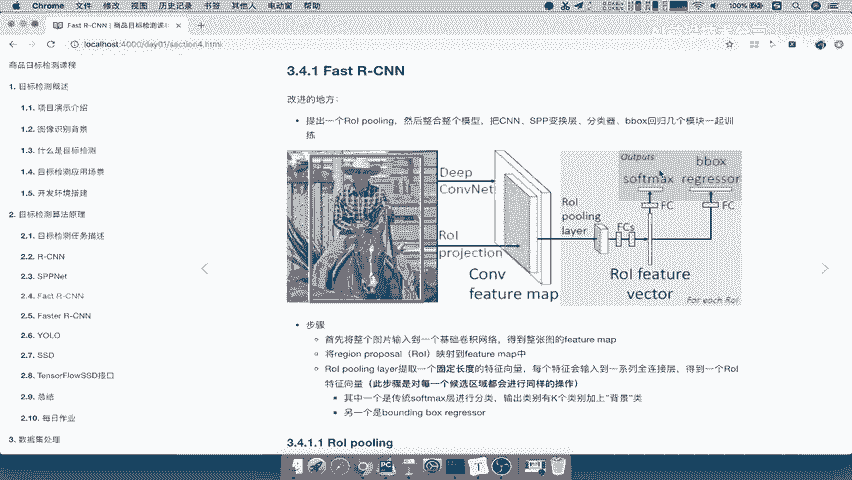

# 课程P20：Fast R-CNN详解 🚀



在本节课中，我们将学习Fast R-CNN算法。我们将了解其核心改进点、网络结构流程，并理解它如何解决其前身SPP-Net所面临的问题。



---



上一节我们介绍了SPP-Net，它的性能已得到较大改善，卷积计算无需在多个区域重复进行。但它存在一个显著问题：网络各部分无法统一训练，且需要大量磁盘空间来存储特征图。Fast R-CNN正是为了解决这些问题而提出的。

## 核心改进点 ✨



Fast R-CNN的主要改进体现在以下两个方面：

1.  **提出了ROI Pooling层**：该层整合了整个模型，将SPP变换、分类器和边界框回归统一到一个网络中，实现端到端的训练，使网络结构更加紧凑。
2.  **将SVM分类器替换为Softmax分类器**：这使得分类任务能够与边界框回归任务在同一个网络中联合训练。



## 网络流程详解 🔄

以下是Fast R-CNN的整体工作步骤，我们可以对照流程图来理解：



1.  **特征提取**：将整张图片输入卷积神经网络，得到特征图（Feature Map）。
2.  **候选区域映射**：提取候选区域（Region Proposals），并将它们映射到上一步得到的特征图上。
3.  **ROI Pooling**：对特征图上的每一个候选区域（也称为ROI，Region of Interest）进行ROI Pooling操作，将其转换为固定长度的特征向量。
4.  **全连接与输出**：将固定长度的特征向量输入全连接层，最终并行输出两个结果：
    *   一个通过**Softmax**分类器，输出`K`个目标类别加上一个背景类。
    *   另一个通过**边界框回归器（Bounding Box Regression）**，对候选区域的位置进行精修。

## 关键概念解析 🔍

上一节我们概述了流程，本节我们来深入看看其中的两个核心概念。

### ROI Pooling

ROI Pooling是SPP（Spatial Pyramid Pooling）层的简化版本。它的目的是将任意大小的ROI区域特征，转换为固定尺寸（例如 `7x7`）的特征图，以便后续的全连接层处理。

其操作可以简化为以下两个步骤：
1.  根据ROI在特征图上的坐标，划分出对应的区域。
2.  将该区域均匀划分成 `H x W` 个网格（如 `7x7`），并对每个网格内的值进行**最大池化（Max Pooling）**。

**代码描述其核心思想**：
```python
# 伪代码示意
output = []
for grid in divided_ROI:
    pooled_value = max(grid)  # 对每个小网格取最大值
    output.append(pooled_value)
return fixed_size_output  # 例如 7x7 的向量
```

### 多任务损失（Multi-task Loss）

Fast R-CNN使用一个多任务损失函数来同时优化分类和边界框回归，这是实现端到端训练的关键。

总损失函数 **L** 由两部分加权求和构成：
**L(p, u, t^u, v) = L_cls(p, u) + λ[u ≥ 1] L_loc(t^u, v)**

*   **L_cls(p, u)** 是分类损失，通常是对数损失（Log Loss），用于衡量预测类别概率 **p** 与真实类别 **u** 的差异。
*   **L_loc(t^u, v)** 是定位损失，用于衡量预测的边界框修正参数 **t^u** 与真实修正参数 **v** 的差异，通常使用平滑L1损失（Smooth L1 Loss）。
*   **λ** 是一个平衡两个任务权重的超参数。`[u ≥ 1]` 是一个指示函数，当 `u` 为背景类（`u=0`）时，定位损失为0。

---



本节课中，我们一起学习了Fast R-CNN算法。我们了解到它通过引入**ROI Pooling层**和**多任务损失函数**，成功地将特征提取、区域分类和边界框回归整合到一个统一的、可端到端训练的网络中，显著提升了训练效率和模型性能，并解决了SPP-Net模型训练不统一和存储开销大的问题。