# 课程 P21：Fast R-CNN 中的 RoI Pooling 结构及其与 SPP 的对比 🧠

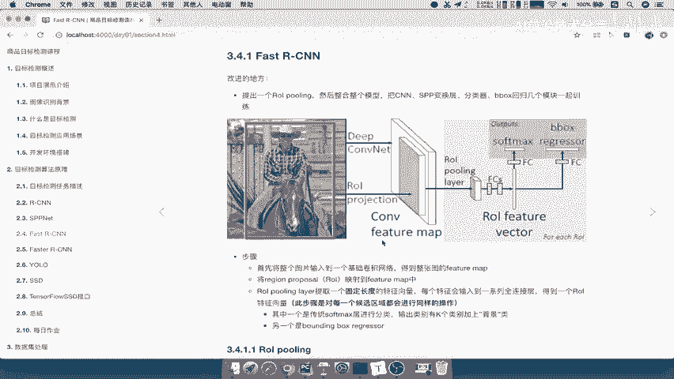

在本节课中，我们将要学习 Fast R-CNN 模型中的一个核心组件——RoI Pooling（感兴趣区域池化）。我们将详细探讨它的工作原理、设计目的，并重点对比它与 SPP（空间金字塔池化）层的区别，理解为何 Fast R-CNN 选择了 RoI Pooling 来提升模型效率。

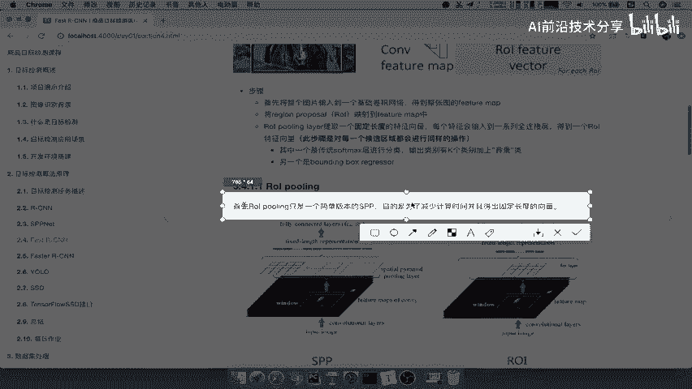

## 概述：RoI Pooling 的设计目的

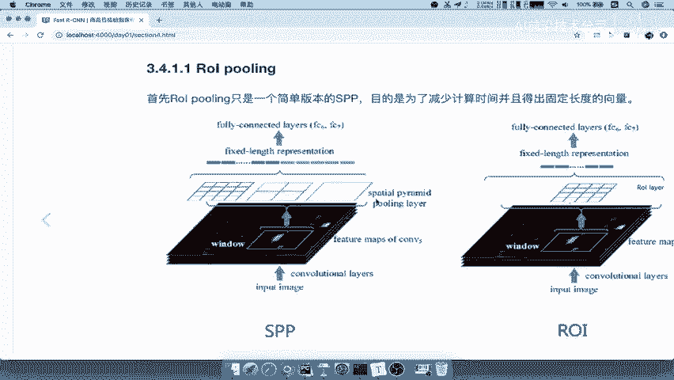

RoI Pooling 可以看作是 SPP 层的一个简化版本。它的主要目的有两个：
1.  **减少计算时间**。
2.  为后续的全连接层生成**固定长度的特征向量**。

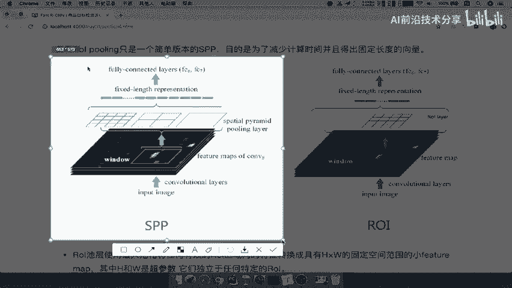

上一节我们介绍了 SPP 层的基本概念，本节中我们来看看它的简化版——RoI Pooling 是如何具体实现的。

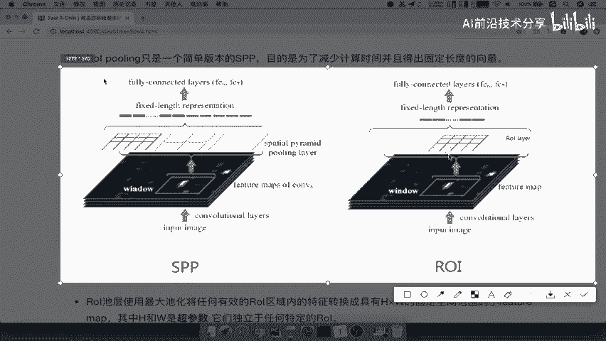

## RoI Pooling 与 SPP 的结构对比

通过对比两张结构图，可以清晰地理解两者的区别。

**SPP层**采用了一种金字塔式的分块策略。例如，它会将特征图同时划分成 `4x4`、`2x2`、`1x1` 等多种尺度的网格，然后将每个网格内的特征进行池化（如最大池化），最后将所有结果拼接起来。

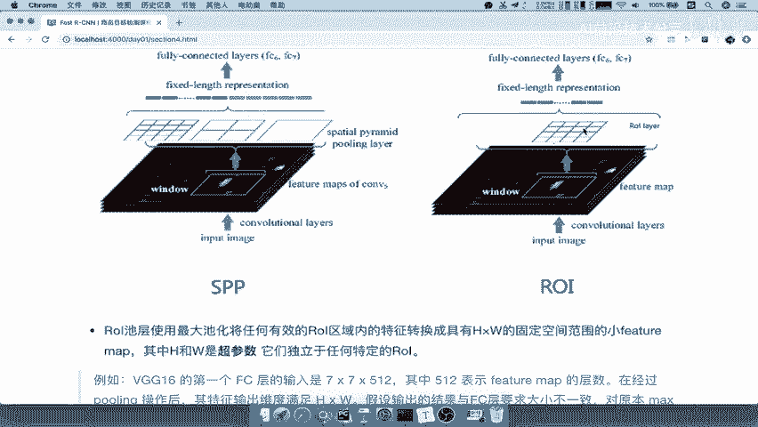

**RoI Pooling层**则只采用**单个固定尺度**的网格进行划分。例如，图中展示的是 `4x4` 的网格，但这个大小并非固定，它是一个可设置的超参数，我们通常将其记为 `K x M`。

因此，RoI Pooling 层的作用可以总结为：**将任意大小的感兴趣区域（RoI）内的特征，通过池化操作，转换为一个具有固定空间大小（`H x W`）的特征向量**。这里的 `H` 和 `W` 就是超参数，独立于任何具体的 RoI 尺寸。

## 为何选择单尺度（Single Scale）？

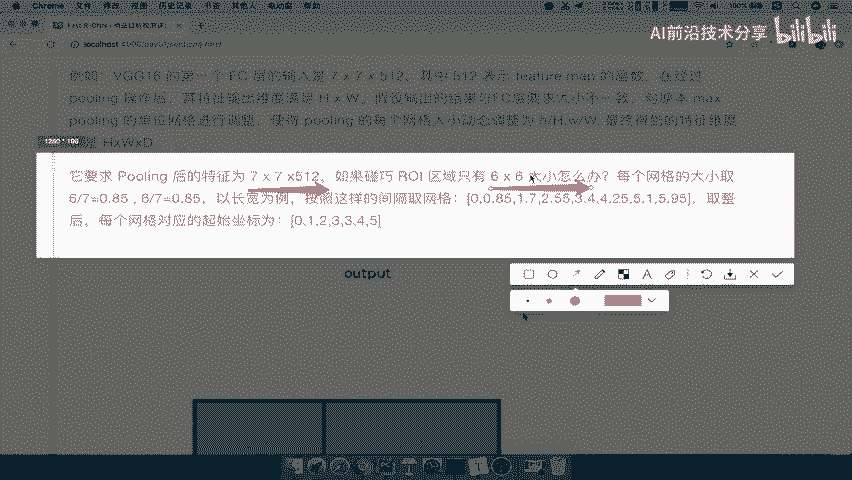

一个自然的问题是：既然 SPP 的多尺度（Multi-Scale）结构可能捕捉更丰富的特征，为什么 Fast R-CNN 要选择单尺度的 RoI Pooling 呢？

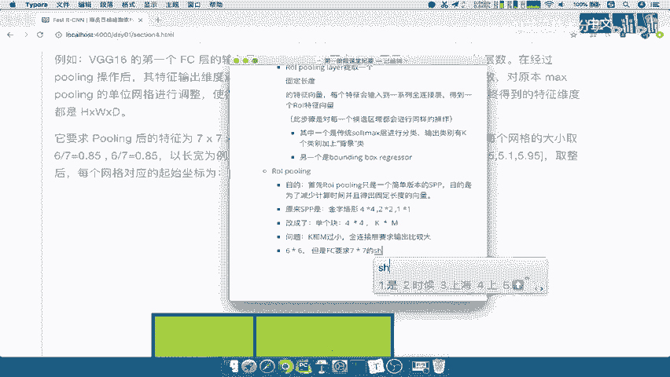

以下是两者的优缺点分析：

*   **单尺度（Single Scale）**：直接将图像区域调整到单一尺度输入网络。其优点是**实现简单、计算速度快**。
*   **多尺度（Multi-Scale）**：构建图像金字塔，在不同尺度上提取特征。其优点是**可能获得更细致、更准确的特征表示**。

然而，在算法设计中常常需要在速度和精度之间进行权衡。实验表明，多尺度方法相比单尺度方法，在精度上的提升并不显著，但却会**大幅增加计算时间**。因此，为了追求更快的检测速度，Fast R-CNN 选择了单尺度的策略，即 RoI Pooling。

**核心优化点**：Fast R-CNN 通过采用 RoI Pooling（单尺度），在精度损失很小的情况下，显著提升了检测速度，实现了速度与精度的高效平衡。

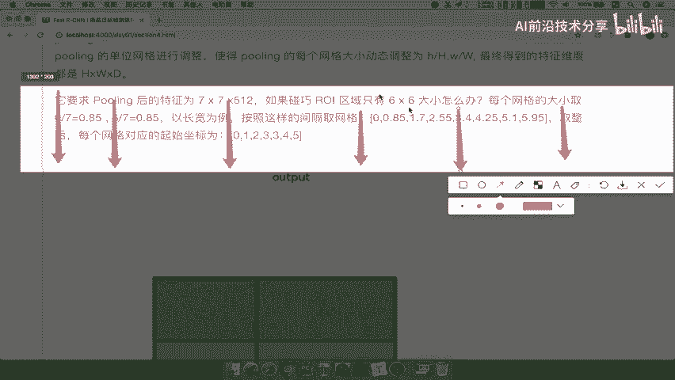

## 处理尺寸不匹配：动态调整机制

在实际操作中，RoI 的尺寸可能与全连接层要求的固定输入尺寸（例如 `7x7`）不匹配。RoI Pooling 通过一种动态调整机制来解决这个问题。

假设全连接层要求输入特征图大小为 `7x7`，但某个 RoI 经过卷积后得到的特征网格只有 `6x6`。处理过程如下：

1.  **计算缩放比例**：将 RoI 的宽和高分别除以目标尺寸。例如，`6 / 7 ≈ 0.85`。
2.  **重新划分网格**：按照这个比例（0.85），将原来的 `6x6` 网格**动态地、近似地**划分成 `7x7` 个区间。
3.  **区间内池化**：在每个新划分出的区间内执行最大池化操作，最终得到一个严格的 `7x7` 输出。

**公式描述**：
若目标池化大小为 `H x W`，RoI 特征区域大小为 `h x w`，则每个输出网格在输入上对应的高约为 `h/H`，宽约为 `w/W`。

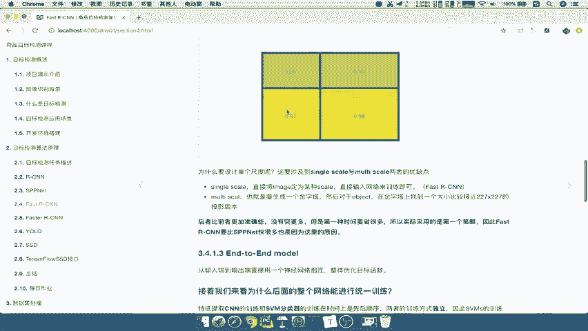

这个过程确保了无论输入的 RoI 尺寸如何，都能输出固定大小的特征图，以满足全连接层的要求。

## 操作过程可视化

下图清晰地展示了 RoI Pooling 的整个过程：

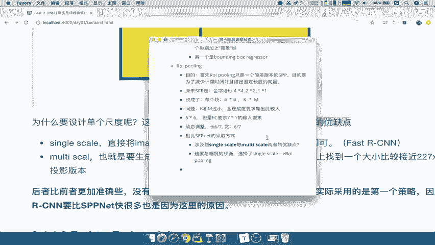

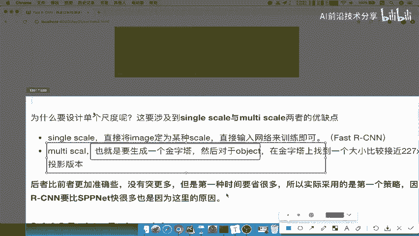

1.  模型首先提出一个候选区域（RoI）。
2.  将该区域对应的特征图部分划分成预设的网格（例如 `2x2`）。
3.  对每个网格内的值进行最大池化（Max Pooling）。
4.  将池化后的结果组合起来，形成最终的、固定大小的输出特征。

## 总结

本节课中我们一起学习了 Fast R-CNN 的关键结构——RoI Pooling。

*   **核心目的**：为加速计算并生成固定长度的特征向量。
*   **与 SPP 的区别**：RoI Pooling 采用**单尺度**（如 `K x M`）池化，而 SPP 采用**多尺度金字塔**池化。这是为了在精度与速度之间取得更好平衡。
*   **关键机制**：通过**动态调整**网格划分来解决 RoI 尺寸与全连接层要求不匹配的问题。
*   **最终效果**：RoI Pooling 是 Fast R-CNN 实现高效目标检测的重要优化步骤之一，它简化了流程，大幅提升了模型的训练和检测速度。