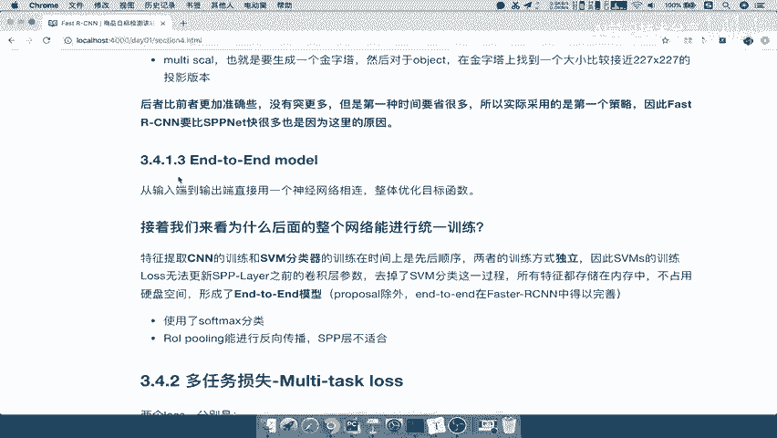
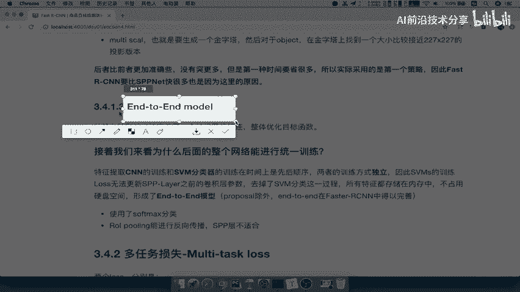
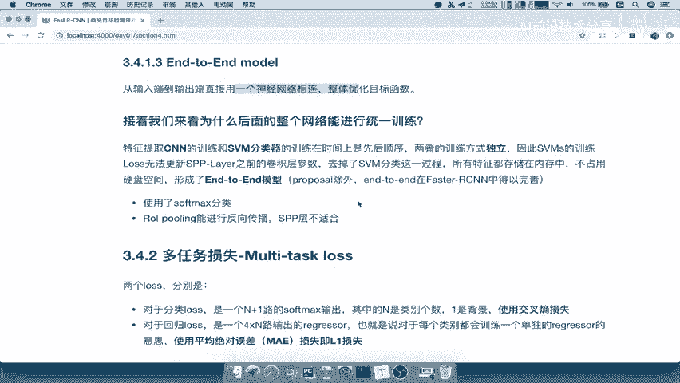
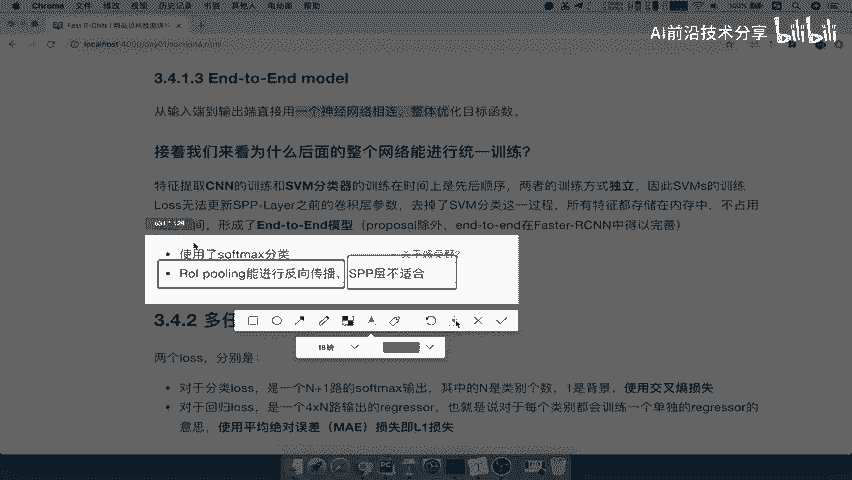
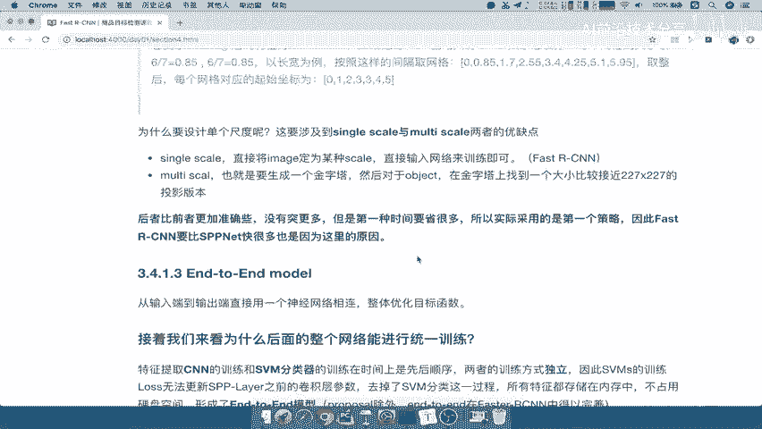
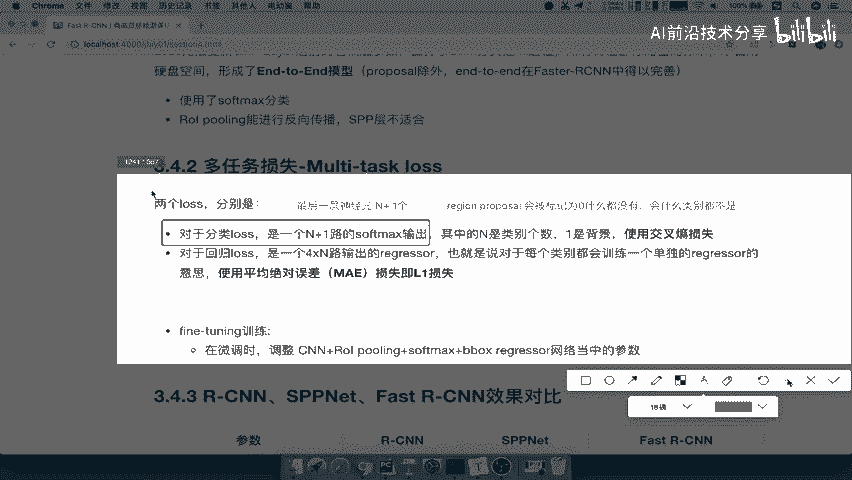
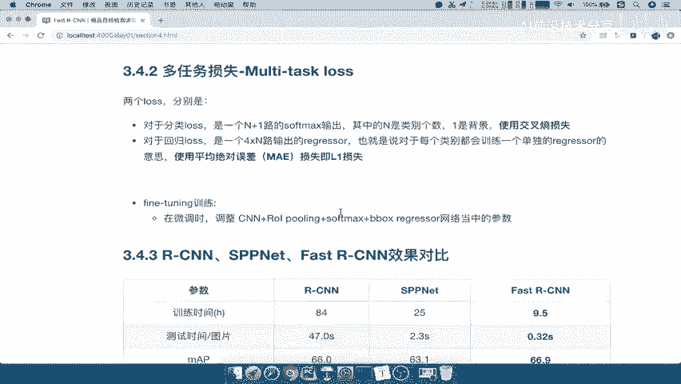
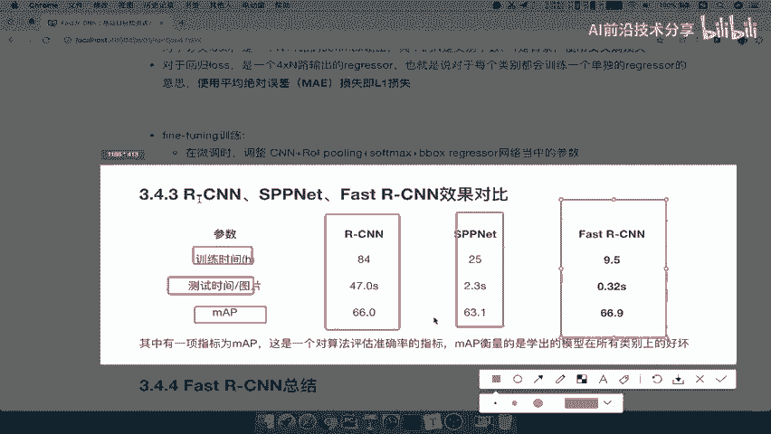
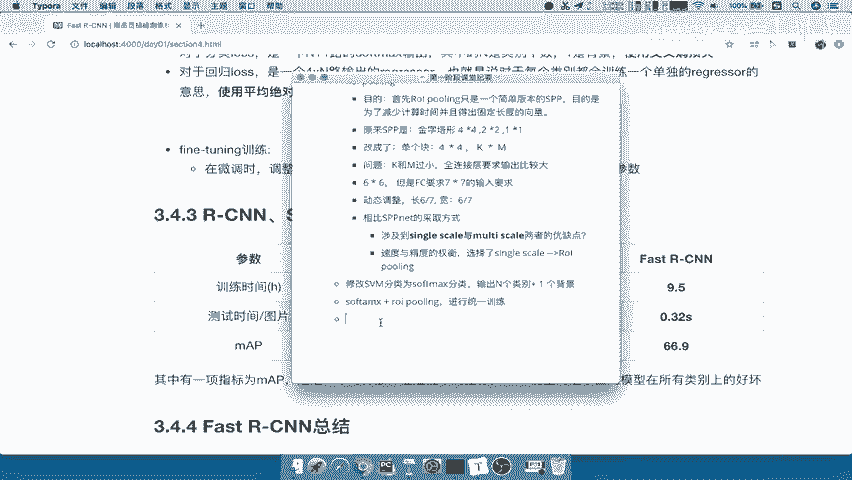

# 课程 P22：Fast R-CNN 多任务损失 🎯

在本节课中，我们将学习 Fast R-CNN 模型的核心改进之一：**多任务损失**。我们将了解它如何通过将 SVM 分类器替换为 Softmax，并结合边界框回归，实现端到端的训练，从而提升模型的效率和性能。

---

上一节我们介绍了 ROI Pooling 的完整过程。本节中，我们来看看另一个关键的改进点：将分类器从 SVM 替换为 Softmax。

这个改进与 ROI Pooling 相结合，带来了显著的好处。Fast R-CNN 因此可以被视为一种 **端到端模型**。

在之前的算法分类中，我们提到过“两步走”和“端到端”两种范式。像 YOLO 和 SSD 是典型的端到端模型。虽然 Fast R-CNN 和 Faster R-CNN 不完全算完整的端到端，但在此处，Fast R-CNN 也可以类似地被称为端到端。

端到端模型是指从输入端到输出端直接由一个网络相连，可以进行整体优化。这意味着整个网络可以放在一起训练，无需单独训练多个模型。那么 Fast R-CNN 是如何做到的呢？

首先，在 R-CNN 中，卷积特征提取和 SVM 分类器的训练是必须分开、独立进行的。SVM 的特征需要存储在内存或磁盘中。

而对于 Fast R-CNN 来说，它使用了 **Softmax** 进行分类。Softmax 函数自然可以与网络一起训练。同时，**ROI Pooling 层能够进行反向传播**。相比之下，前代模型 SPP-Net 中的 SPP 层不太适合反向传播。关于这一点有详细的数学推导，我们在此不深入展开，只需记住结论：ROI Pooling 支持反向传播，而 SPP 层不太适合。

因此，Fast R-CNN 可以被视为一个端到端模型。在训练时，衡量损失就变得简单了：Softmax 用于计算分类损失，回归器用于计算边界框回归损失，然后一起进行反向传播，从网络后端一直更新到前端的卷积层参数。

所以，我们的损失函数由两部分组成。

以下是分类损失和回归损失的详细说明：

**1. 分类损失**
*   使用一个 **N+1** 路的 Softmax 输出。其中 N 代表目标类别数（例如 20 个类别），**加上的 1 代表“背景”类别**。
*   这是因为 Region Proposal 推荐的区域有可能不包含任何有效目标，需要被标记为“背景”。
*   最终使用 **交叉熵损失** 来计算分类误差。

**2. 回归损失**
*   为 **每个类别** 训练一个独立的边界框回归器。例如，针对“猫”类别训练一个回归器，针对“狗”类别训练另一个回归器。
*   这样可以使每个类别对应的候选框预测得更准确。
*   这里使用 **平均绝对误差**，即 **L1 损失**。这与 R-CNN 中使用的均方误差不同。

这个多任务损失使得在微调网络时，卷积层、ROI Pooling 层、Softmax 分类器和边界框回归器可以**一起进行训练**。唯一独立的部分是 Region Proposal 的生成过程（仍使用 Selective Search 等方法）。

这就是 Fast R-CNN 的多任务损失。Fast R-CNN 在 SPP-Net 的基础上做出了这些改进，那么这三个算法的性能对比如何呢？

以下是 R-CNN、SPP-Net 和 Fast R-CNN 在训练时间、测试时间和精确度上的对比（基于 PASCAL VOC 2007 数据集）：

*   **训练时间**：R-CNN 需 84 小时，SPP-Net 需 25 小时，而 **Fast R-CNN 仅需 9.5 小时**。
*   **测试时间（每张图）**：R-CNN 需 47 秒，SPP-Net 需 2.3 秒，而 **Fast R-CNN 仅需 0.32 秒**。这个速度已经让用户几乎感觉不到等待。
*   **准确度（mAP）**：R-CNN 为 66.0%， SPP-Net 为 63.1%， Fast R-CNN 为 66.9%。总体而言，Fast R-CNN 在速度大幅提升的同时，保持了较高的准确度。

---

### 总结 📝

本节课中，我们一起学习了 Fast R-CNN 的**多任务损失**机制。核心要点包括：
1.  将 SVM 分类器改为 **Softmax** 分类器，输出为 **N+1** 路（N个类别 + 1个背景）。
2.  Softmax 分类损失与边界框回归的 **L1 损失** 共同构成多任务损失。
3.  得益于 **ROI Pooling 支持反向传播**，整个网络（除 Region Proposal 生成外）可以实现**端到端的联合训练**。
4.  与 R-CNN 和 SPP-Net 相比，Fast R-CNN 在训练和测试速度上取得了**数量级的提升**，同时保持了优秀的检测精度。

