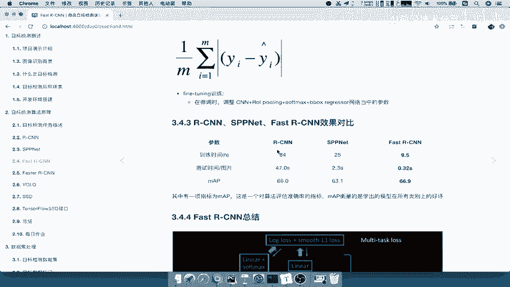
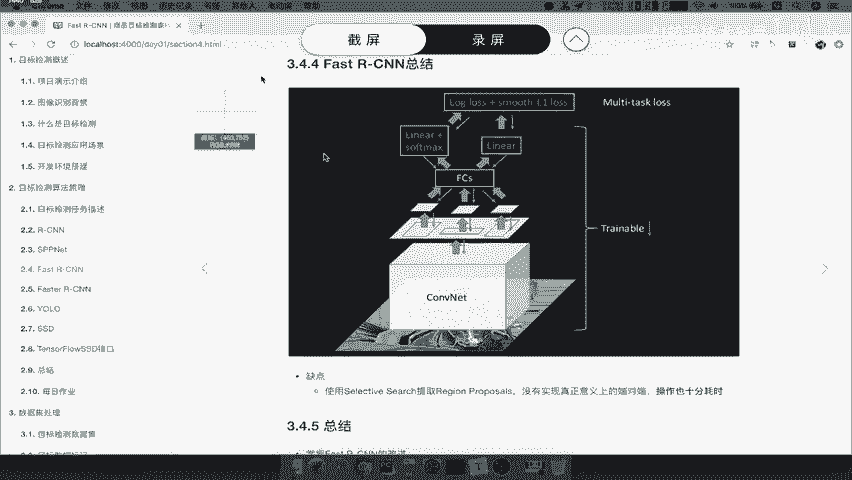
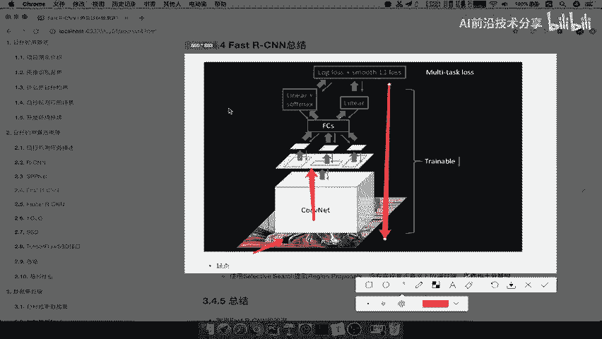
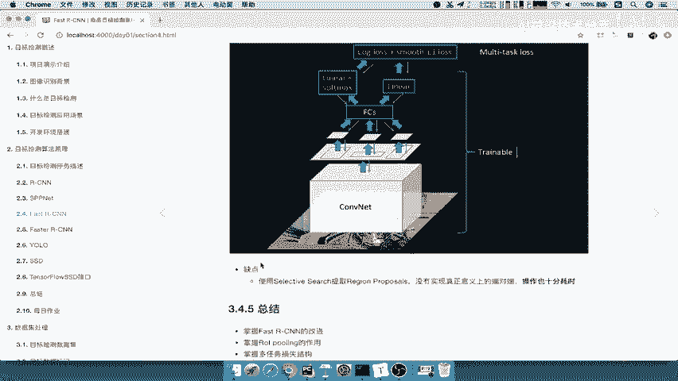
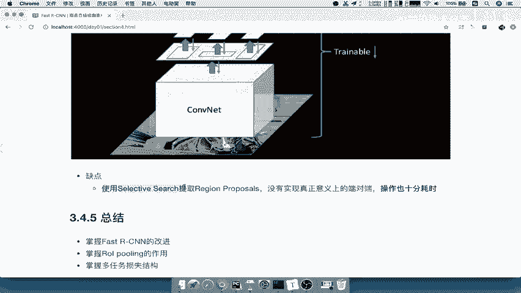
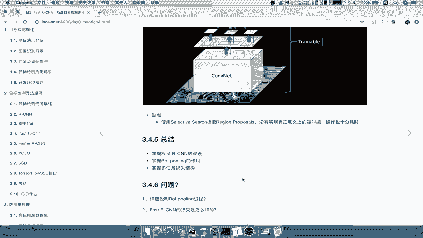

# 课程 P23：Fast R-CNN 总结与问题自测 🧠



在本节课中，我们将对 Fast R-CNN 模型进行总结，回顾其核心流程，分析其存在的缺点，并梳理需要掌握的关键知识点。最后，我们将通过几个自测问题来检验学习成果。

---



## 模型流程总结 📊

上一节我们详细介绍了 Fast R-CNN 的各个组件，本节中我们来看看它的整体工作流程。

Fast R-CNN 的整体流程可以概括为以下几个步骤：

1.  **特征提取**：输入图像首先通过一个卷积神经网络，生成一张共享的特征图。
2.  **区域映射**：通过 Selective Search 等方法生成的候选区域被映射到上一步得到的特征图上。
3.  **区域特征统一**：每个映射后的候选区域通过 **ROI Pooling** 层，被转换为固定尺寸的特征向量。
4.  **分类与回归**：这些固定尺寸的特征向量被送入全连接层。网络最终输出两个部分：
    *   通过 **Softmax** 函数得到的目标类别概率。
    *   通过线性回归得到的边界框坐标偏移量。
5.  **联合训练**：分类损失和边界框回归损失共同构成多任务损失函数，反向传播以更新整个网络的参数（区域推荐步骤除外）。

其核心流程可以用以下伪代码描述：
```python
# 伪代码流程
feature_map = CNN(input_image)
rois = selective_search(input_image) # 外部算法
pooled_features = ROI_Pooling(feature_map, rois)
cls_score, bbox_pred = FC_Layers(pooled_features)
loss = classification_loss(cls_score) + regression_loss(bbox_pred)
```



---



## 模型缺点分析 ⚠️

了解了 Fast R-CNN 的优势后，我们来看看它仍然存在的不足之处。

Fast R-CNN 最主要的缺点集中在区域推荐阶段：

*   **非完全端到端**：模型依赖外部的 **Selective Search** 算法来生成候选区域。这一步计算耗时，且没有与网络的主体部分进行联合训练，因此不能称为真正意义上的端到端学习。
*   **速度瓶颈**：Selective Search 本身是一个计算密集型的算法，成为整个检测流程的速度瓶颈。

因此，后续算法的改进方向非常明确：**将区域推荐步骤也集成到神经网络内部，实现完全的端到端训练与推理。**

---



## 核心知识点梳理 📝

以下是关于 Fast R-CNN 必须掌握的三个核心改进点及其细节。

**1. ROI Pooling 的作用**
ROI Pooling 层的主要作用是将任意大小的候选区域特征图池化为固定大小（如 7x7）的输出。其关键意义在于**允许梯度通过该层进行反向传播**，从而能够训练之前的卷积层。该层的输出尺寸 `(pooled_height, pooled_width)` 是一个可调的超参数。

**2. 多任务损失函数**
Fast R-CNN 使用一个多任务损失函数进行联合训练，公式如下：
`L = L_cls + λ * L_loc`
其中：
*   `L_cls` 是分类损失，通常为 **Softmax 交叉熵损失**。
*   `L_loc` 是边界框回归损失，采用**平滑 L1 损失**。对于每个候选区域，计算其预测边界框与真实边界框坐标的差异。损失值近似于预测偏移量与真实偏移量之差的绝对值总和再取平均。

**3. 主要改进总结**
Fast R-CNN 相较于 R-CNN 的核心改进在于：
*   引入了 **ROI Pooling**，实现了对整张图像特征的一次性提取和共享。
*   将分类和边界框回归任务合并，使用**多任务损失**进行端到端的训练（除区域推荐外），大幅提升了训练和测试速度。

---

## 学习成果自测 ❓

为了巩固对本节课内容的理解，请尝试回答以下问题：

1.  请简述 ROI Pooling 的操作过程及其在 Fast R-CNN 中的重要性。
2.  Fast R-CNN 的损失函数由哪两部分构成？分别对应什么任务？
3.  Fast R-CNN 最主要的缺点是什么？后续算法会如何改进它？

---



## 课程总结 🎯

本节课中，我们一起学习了 Fast R-CNN 的完整流程。我们首先回顾了其从特征提取到多任务输出的工作步骤，然后指出了其依赖外部 Selective Search 算法这一核心缺点。最后，我们梳理了必须掌握的三个关键知识点：ROI Pooling 的原理与作用、多任务损失函数的构成，以及模型的主要改进点。理解这些内容，是学习后续更先进的物体检测模型（如 Faster R-CNN）的重要基础。