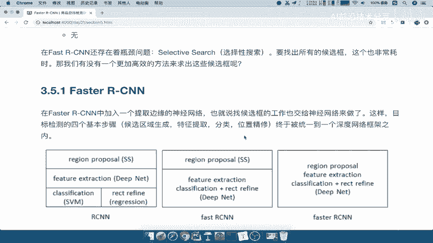
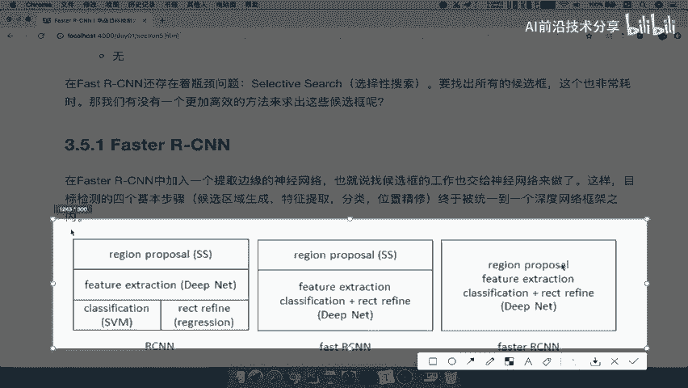
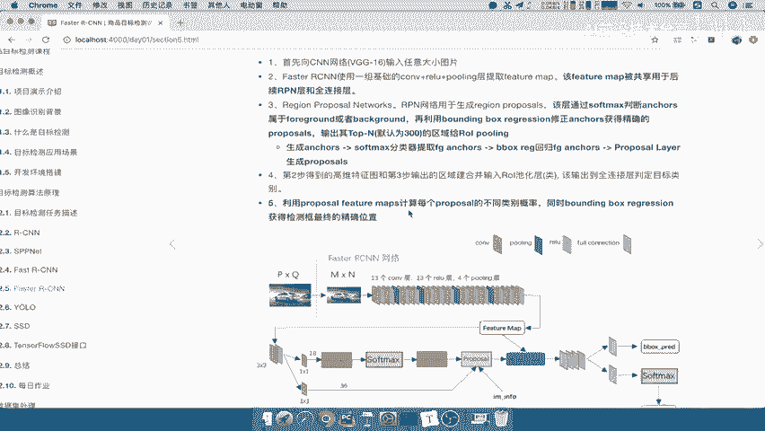
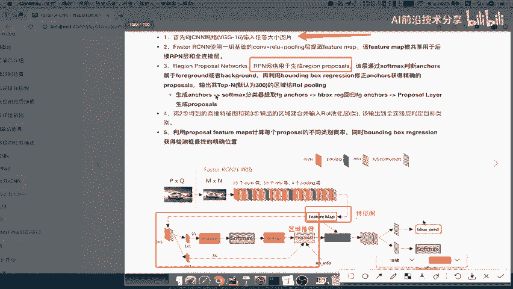
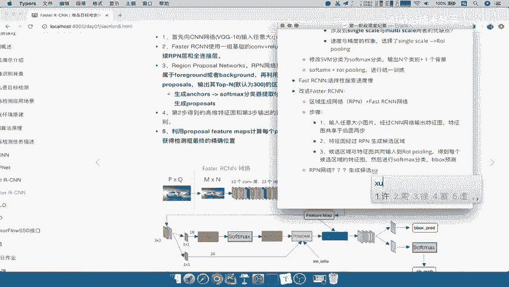

# 课程 P24：Faster R-CNN 网络结构与步骤详解 🚀

在本节课中，我们将要学习 Faster R-CNN 的核心思想、网络结构以及其工作流程。我们将重点探讨它是如何改进 Fast R-CNN 的，并深入理解其关键组件——区域生成网络（RPN）的工作原理。

## 概述

Faster R-CNN 是目标检测领域的一个重要模型。上一节我们介绍了 Fast R-CNN，它通过共享卷积特征和引入 ROI Pooling 层提升了效率。然而，Fast R-CNN 仍然依赖外部算法（如选择性搜索）来生成候选区域，这个过程非常耗时。本节中我们来看看 Faster R-CNN 是如何将候选区域生成也整合进神经网络，从而形成一个端到端的、更快速的目标检测框架的。

## Faster R-CNN 的改进与结构

Faster R-CNN 的主要改进在于去除了耗时的选择性搜索（Selective Search）步骤。它通过引入一个名为**区域生成网络（Region Proposal Network, RPN）**的组件，将候选区域生成任务也交由神经网络完成。

我们可以将 Faster R-CNN 视为一个由 **RPN 网络** 和 **Fast R-CNN 网络** 组成的统一模型。其核心思想是将候选框的生成过程也融入到端到端的训练中。

以下是 Faster R-CNN 与之前模型的对比：

*   **R-CNN**：特征提取、SVM分类、边界框回归是分离的模块。
*   **Fast R-CNN**：将特征提取后的分类和回归整合进一个网络，但候选区域仍需外部生成。
*   **Faster R-CNN**：将候选区域生成（RPN）、特征提取、分类和回归全部整合到一个统一的深度网络中。

## Faster R-CNN 工作流程详解

接下来，我们对照结构图，详细拆解 Faster R-CNN 的四个核心步骤。

### 第一步：特征提取

输入一张任意大小的图片。图片经过一个基础的卷积神经网络（例如 VGG-16 的 13 个卷积层、13 个 ReLU 层和 4 个池化层），输出一个高维的**特征图（Feature Map）**。这个特征图包含了图像的抽象信息，并将在后续步骤中被共享使用。

### 第二步：生成候选区域（RPN）

这是 Faster R-CNN 的创新核心。上一步得到的特征图被输入到 **区域生成网络（RPN）** 中。

RPN 的核心任务是：在特征图的每个位置上，同时预测该位置是否存在目标（物体/背景）以及生成一系列可能包含目标的边界框（即候选区域，Region Proposals）。它取代了 Fast R-CNN 中耗时的选择性搜索。

RPN 的具体工作原理我们将在下一小节详细展开。

### 第三步：特征图与候选区域结合（ROI Pooling）

第二步 RPN 会输出一系列候选区域（Proposals）。同时，第一步生成的特征图也被共享到这一步。

这个过程与 Fast R-CNN 相同：将每个候选区域映射回第一步生成的特征图上，然后通过 **ROI Pooling 层** 从特征图中提取出固定大小的特征向量。这样，每个形状不一的候选区域都被转化为统一尺寸的特征表示，便于后续处理。

### 第四步：分类与精修

最后，每个经过 ROI Pooling 的固定尺寸特征向量被送入两个并行的全连接层：
1.  **Softmax 分类层**：判断该候选区域属于哪个具体类别（如人、车、猫等）或是背景。
2.  **边界框回归层（Bounding Box Regression）**：对候选区域的边界框坐标进行微调，使其更精确地贴合真实目标。

以下是整个流程的步骤总结：

1.  输入任意大小图片，经过 CNN 网络输出特征图。
2.  特征图经过 RPN 网络，生成候选区域。
3.  将候选区域与特征图共同输入到 ROI Pooling 层，得到每个区域的固定尺寸特征图。
4.  对特征图进行 Softmax 分类和 Bounding Box 回归，得到最终检测结果。

## 核心：区域生成网络（RPN）原理

上一节我们介绍了 Faster R-CNN 的整体流程，本节中我们重点来看看其核心——RPN 网络是如何生成候选区域的。

RPN 的设计非常巧妙。它在特征图上滑动一个小的网络（例如 3x3 的卷积核），这个滑动窗口在特征图的每个位置上都会输出一个特征向量。

对于这个位置的特征向量，RPN 会同时进行两项任务：

1.  **二分类（物体/背景）**：通过一个 `1x1` 卷积层判断该“锚点”位置是前景（包含物体）还是背景。公式可以简化为 `cls_score = Conv1x1(feature_vector)`。
2.  **边界框回归**：通过另一个 `1x1` 卷积层预测基于该位置的一系列“锚框（Anchor Boxes）”的偏移量（`dx, dy, dw, dh`），以调整锚框更接近真实物体。公式可简化为 `bbox_pred = Conv1x1(feature_vector)`。

**锚框（Anchor）** 是预定义在特征图每个位置上的、具有不同尺度和长宽比的基准框。例如，在每个位置设置 3 种尺度（128, 256, 512）和 3 种长宽比（1:1, 1:2, 2:1），就会得到 `k=9` 个锚框。RPN 的任务就是判断这些锚框中哪些可能包含物体，并对其坐标进行初步调整。

以下是 RPN 生成候选区域的关键步骤列表：

*   **生成锚框**：在特征图的每个滑动窗口中心，生成 `k` 个不同尺度和比例的锚框。
*   **计算预测**：对每个锚框，通过 RPN 网络计算它是前景的概率以及坐标修正值。
*   **筛选提案**：根据前景概率对所有锚框进行排序，选取概率最高的前 N 个，并利用回归值修正其坐标，形成初步的候选区域（Proposals）。
*   **去重优化**：使用非极大值抑制（NMS）去除高度重叠的候选框，得到最终输送给后续 Fast R-CNN 网络的候选区域列表。

通过这种方式，RPN 能够快速、高效地从深度特征中直接生成高质量的候选区域，并与检测网络共享卷积特征，实现了端到端的训练和显著的速度提升。

## 总结

本节课中我们一起学习了 Faster R-CNN 的网络结构与工作步骤。我们了解到它的核心贡献是引入了**区域生成网络（RPN）**，将耗时的候选区域生成过程也整合到神经网络中，与特征提取、目标分类和边界框回归共同构成了一个统一的、端到端的目标检测框架。这使得 Faster R-CNN 在保持高精度的同时，速度比 Fast R-CNN 有了质的飞跃，成为目标检测发展史上的一个里程碑模型。