# 🎯 课程 P25：Faster R-CNN 中的 RPN 网络原理

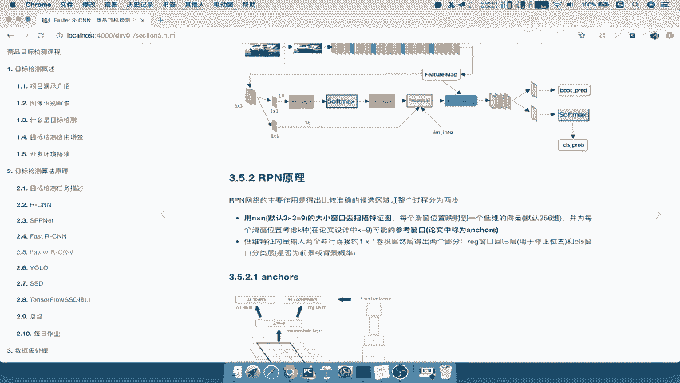

在本节课中，我们将学习 Faster R-CNN 模型的核心组件之一——区域生成网络（RPN）。我们将详细探讨 RPN 如何从特征图中生成候选区域，以及它是如何通过训练来优化这些区域的。

---

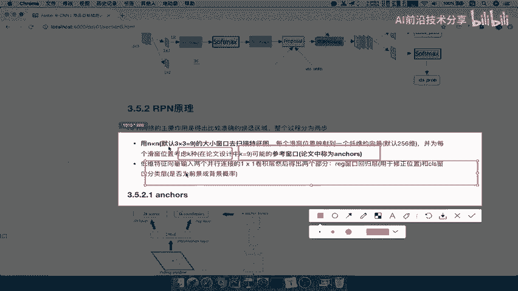

## 📖 概述

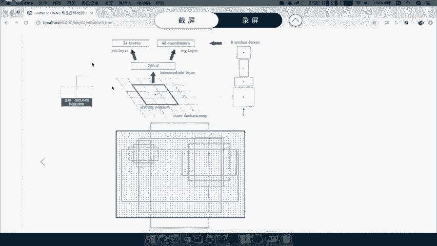

RPN 的主要作用是生成高质量的候选区域（Proposals）。它接收卷积神经网络提取的特征图作为输入，输出一系列可能包含物体的候选框，并对这些候选框进行初步的分类（前景/背景）和位置修正。

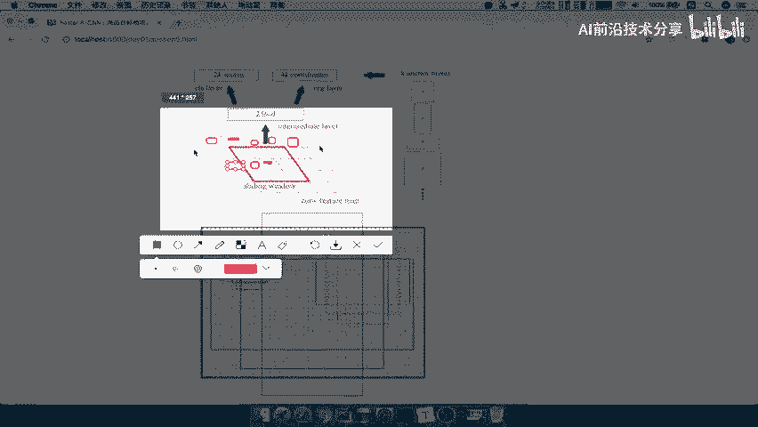

---

## 🔍 RPN 的工作原理

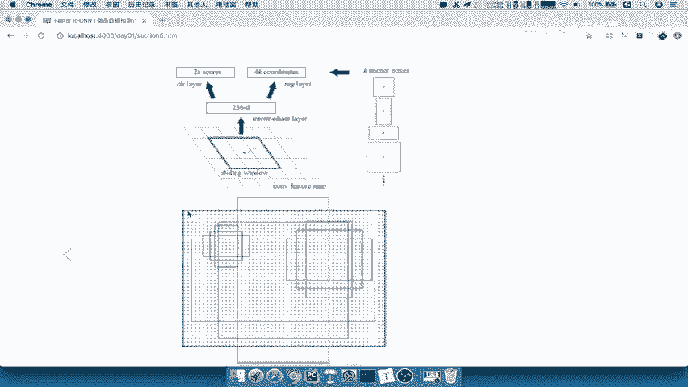

RPN 的工作流程可以分为两个主要步骤。

### 第一步：生成锚框（Anchors）

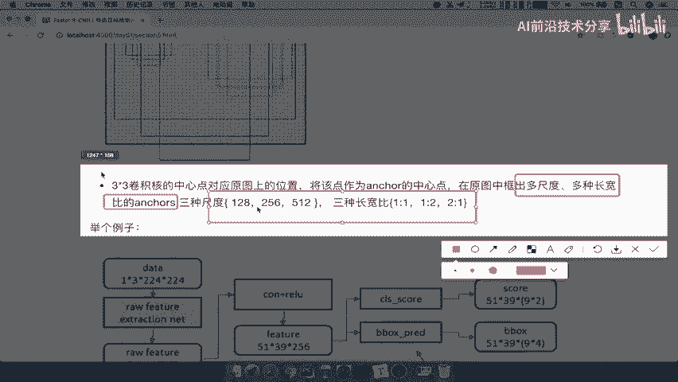

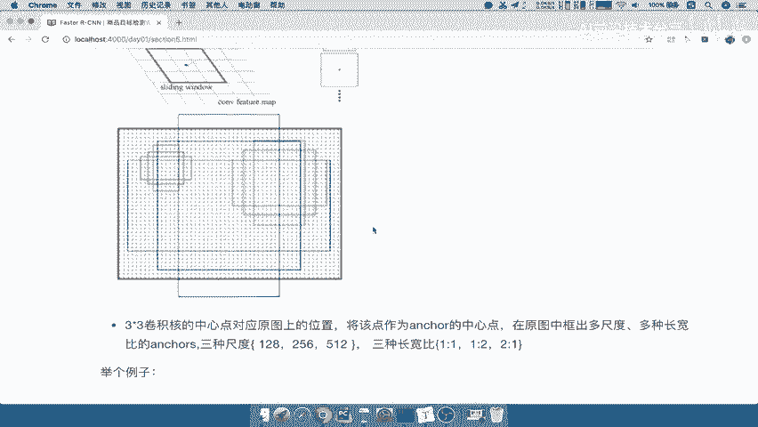

首先，RPN 使用一个 3×3 的滑动窗口在输入的特征图上进行扫描。对于滑动窗口中心的每一个像素点，都会生成 K 个不同尺度和长宽比的锚框。在原始的 Faster R-CNN 论文中，K 默认为 9。

以下是锚框生成的代码示意：
```python
# 假设特征图尺寸为 H x W
# 对于特征图上的每个位置 (i, j)
for i in range(H):
    for j in range(W):
        # 以该位置为中心，生成 K 个锚框
        anchors = generate_anchors(center=(i, j), scales=[128, 256, 512], ratios=[1:1, 1:2, 2:1])
```

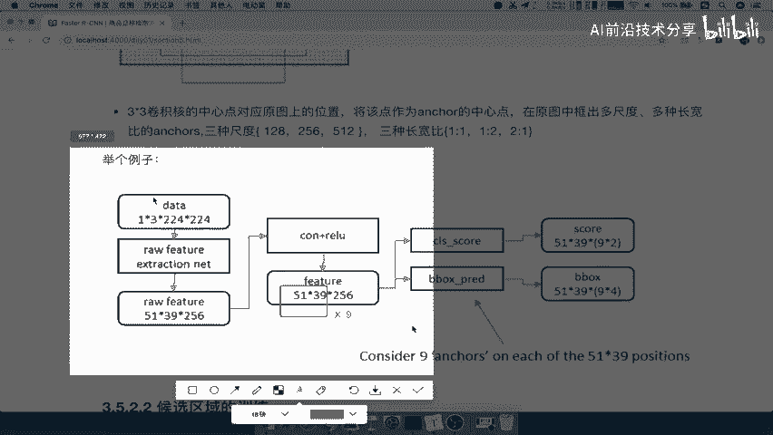

锚框的尺度和长宽比是预先定义的：
*   **尺度**：128×128, 256×256, 512×512
*   **长宽比**：1:1, 1:2, 2:1
这 3 种尺度和 3 种长宽比组合，共得到 9 种锚框。

如果输入特征图的尺寸是 51×39，那么总共会生成 **51 × 39 × 9** 个锚框。

### 第二步：锚框的修正与分类

对于生成的每一个锚框，RPN 会通过两个并行的全连接层进行处理：
1.  **回归层（reg layer）**：输出 4K 个值，用于修正锚框的位置（中心点坐标 x, y 和宽高 w, h），使其更接近真实物体框。
2.  **分类层（cls layer）**：输出 2K 个分数，表示每个锚框是“前景”（包含物体）或“背景”的概率。这是一个二分类问题。

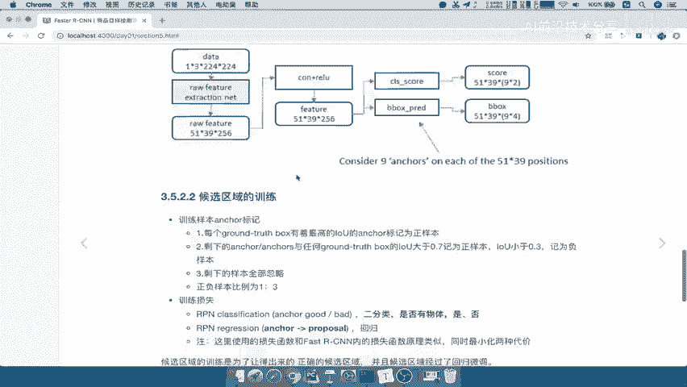

公式表示为：
对于每个锚框，回归层输出：`(Δx, Δy, Δw, Δh)`
对于每个锚框，分类层输出：`P(前景), P(背景)`

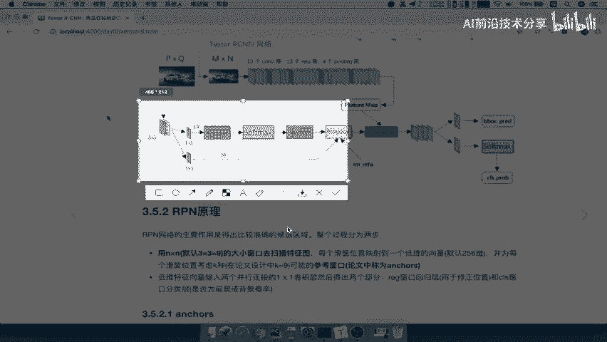

---

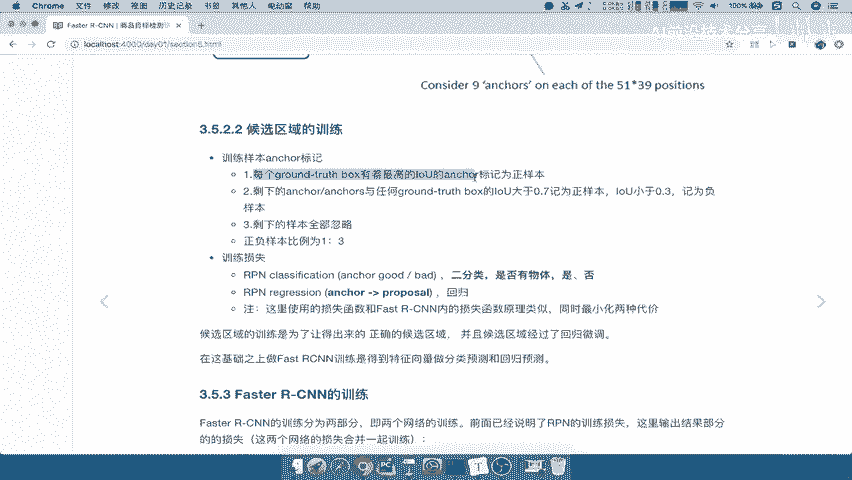

## 🏷️ RPN 的训练样本标记

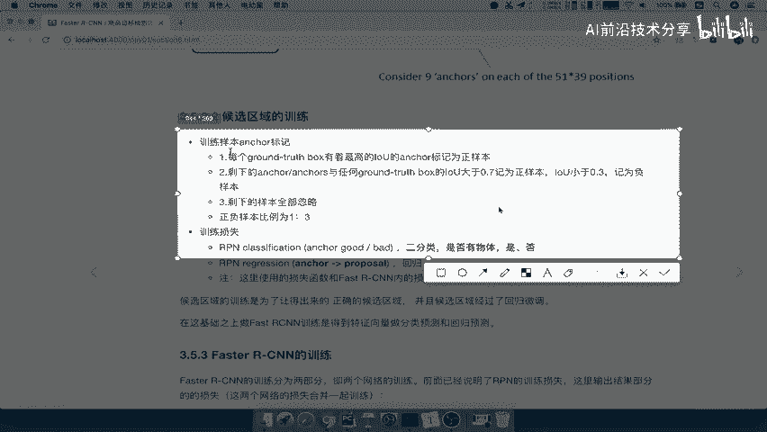

RPN 本身是一个需要训练的网络。为了训练它，我们需要为生成的成千上万个锚框标记“正样本”（包含物体）和“负样本”（背景）。

以下是训练样本的标记规则：

1.  **与真实框（Ground Truth Box）重叠度最高的锚框**：对于每个真实物体框，与其 IoU（交并比）最高的那个锚框被标记为正样本。
2.  **高重叠度锚框**：任何与某个真实框的 IoU 大于 0.7 的锚框，都被标记为正样本。
3.  **低重叠度锚框**：与所有真实框的 IoU 都小于 0.3 的锚框，被标记为负样本。
4.  **忽略的锚框**：IoU 在 0.3 到 0.7 之间的锚框，在训练时被忽略，不参与损失计算。

这样标记的目的是确保正样本是与真实物体高度相关的锚框，而负样本是明确的背景区域。

---

## 🔄 RPN 在 Faster R-CNN 中的角色

上一节我们介绍了 RPN 如何生成和初步筛选锚框。现在，我们来看看它在整个 Faster R-CNN 流程中的作用。

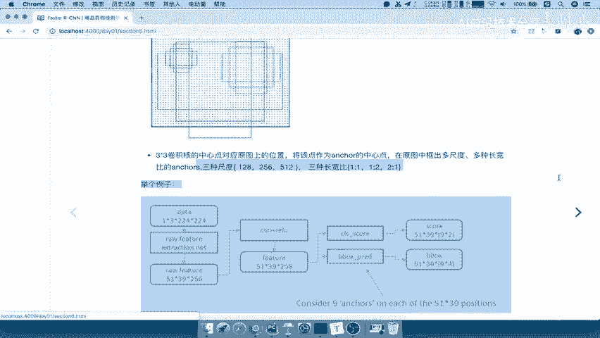

训练好的 RPN 网络可以看作是一个“海选”系统：
*   **输入**：任意图像经过主干网络（如 VGG16）提取的特征图。
*   **处理**：RPN 快速扫描特征图，生成大量锚框，并预测每个锚框包含物体的概率以及更精确的位置。
*   **输出**：RPN 会筛选出概率较高、位置较优的锚框，作为“候选区域”输出给后续的 Fast R-CNN 网络进行精细处理。

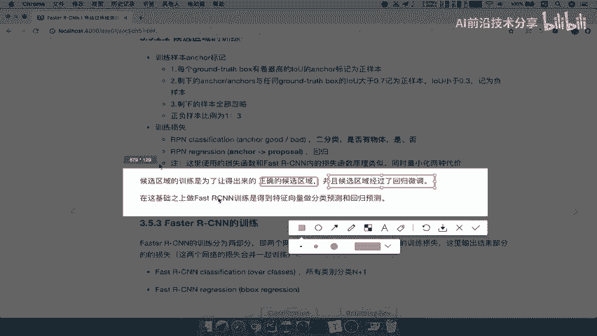

而后续的 Fast R-CNN 网络则负责：
*   **精细分类**：对 RPN 提出的每个候选区域进行 **N+1** 类分类（例如 20个物体类 + 1个背景类），而不仅仅是二分类。
*   **最终回归**：对候选区域的位置进行最终的微调，得到检测框。

---

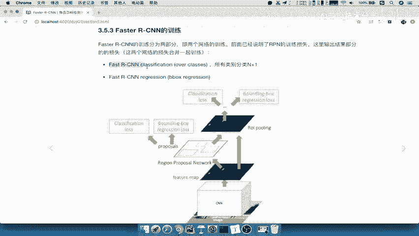

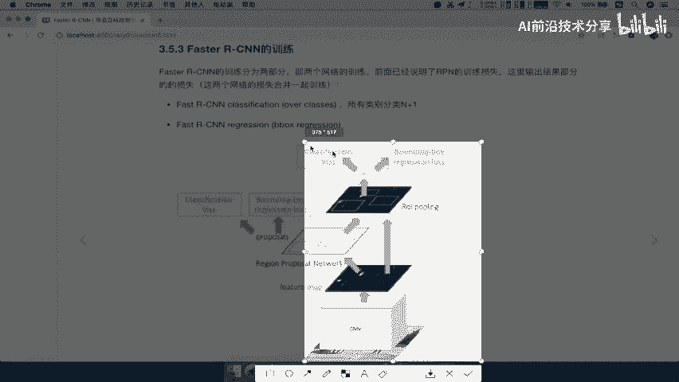

## 📝 总结

本节课我们一起学习了 Faster R-CNN 中区域生成网络（RPN）的原理。我们了解到：
1.  RPN 通过滑动窗口和预定义的锚框，从特征图上生成大量候选区域。
2.  RPN 通过一个二分类网络和一个回归网络，对这些锚框进行初步筛选和位置修正。
3.  RPN 的训练依赖于根据与真实框的 IoU 来精心标记正负样本。
4.  RPN 的核心作用是替代了传统的选择性搜索（Selective Search）等方法，高效、高质量地生成候选区域，并与检测网络共享卷积特征，从而大幅提升检测速度。

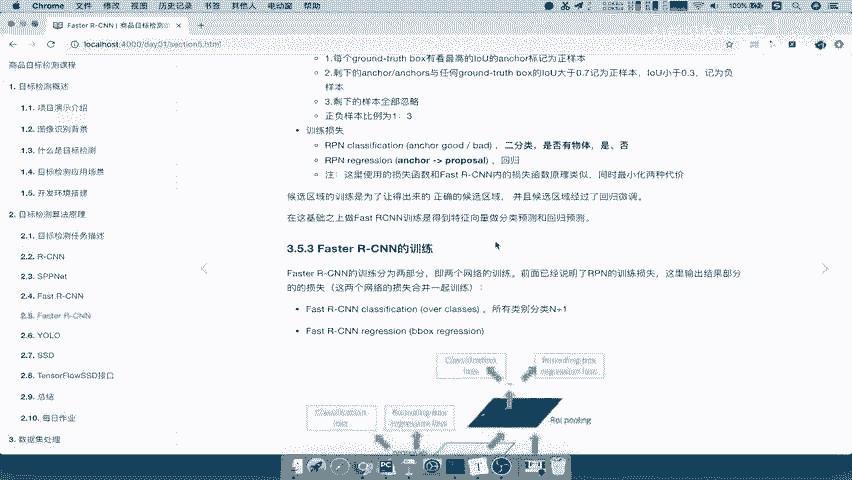

理解 RPN 是掌握 Faster R-CNN 的关键，它巧妙地将候选区域生成这一步骤集成到神经网络中，实现了端到端的物体检测。