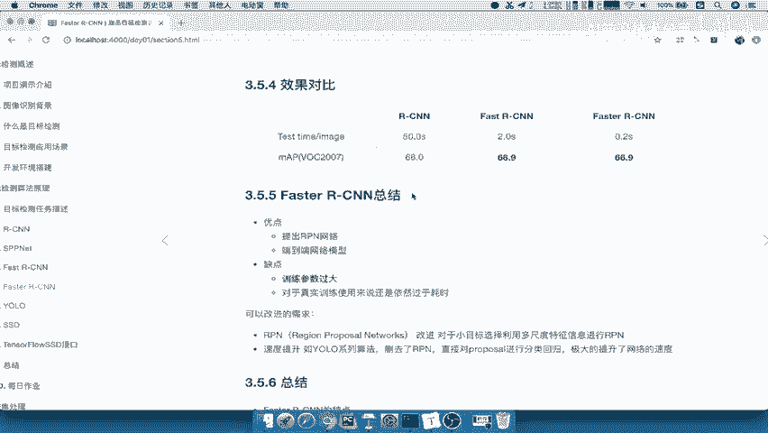
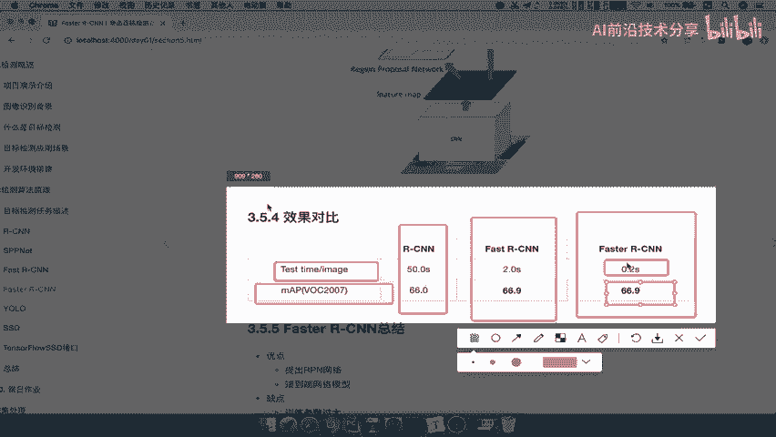
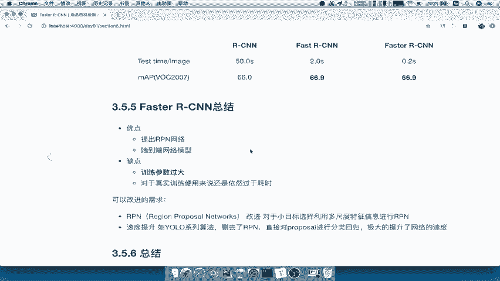
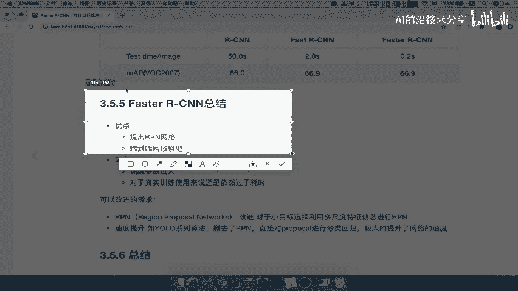
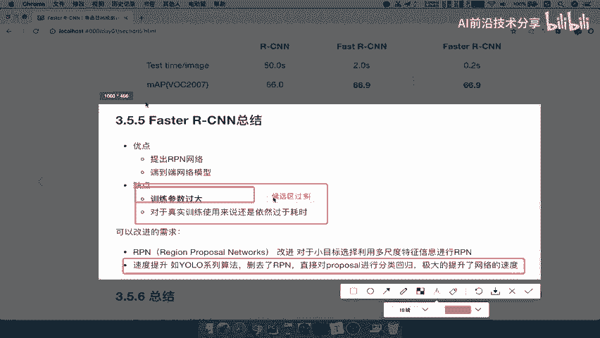
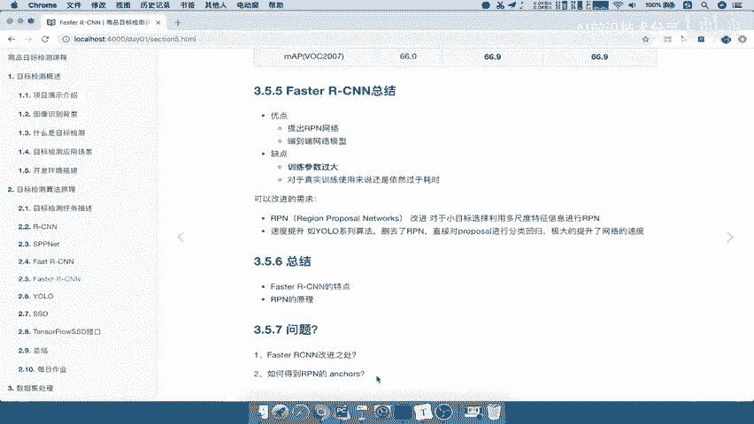

# 课程P26：Faster R-CNN总结与问题自测 🧠



在本节课中，我们将对Faster R-CNN模型进行总结，回顾其核心改进、优缺点，并设置自测问题以巩固理解。

---

## 模型性能对比 📊

上一节我们介绍了Faster R-CNN的架构，本节中我们来看看它的实际性能表现。

下图展示了Faster R-CNN与之前模型的对比结果。


以下是各模型在测试速度和准确率上的对比数据：
*   **R-CNN**：速度较慢，此处未给出具体数值。
*   **Fast R-CNN**：测试速度约为 **2.0秒**，准确率为 **66.9%**。请注意，此处使用的数据集可能与之前讨论的不同。
*   **Faster R-CNN**：速度相比Fast R-CNN有显著提升，准确率保持在 **66.9%** 左右。



通过对比可以看出，Faster R-CNN的主要优势在于**速度**。它在保持高准确率的同时，大幅提升了训练和测试的速度。

---

## Faster R-CNN 优缺点总结 ⚖️



了解了性能对比后，我们来系统总结一下Faster R-CNN的优缺点。

### 优点 ✅



Faster R-CNN的核心优点是提出了**区域提议网络**。该网络能够自主训练并生成候选区域，这可以被理解为一个**端到端**的网络模型。

用代码概念描述其核心思想是：
```python
# RPN 替代了传统的外部候选区域生成方法（如Selective Search）
proposals = RPN(feature_map)  # 直接从特征图生成候选框
```

### 缺点 ❌

然而，Faster R-CNN也存在明显的缺点：**训练参数过大**。对于实际的工业级训练任务而言，使用它依然**过于耗时**。这意味着，如果用企业场景的真实数据训练Faster R-CNN，可能需要等待非常长的时间。

---

## 改进需求与后续发展 🚀

正因为Faster R-CNN在速度上仍有不足，业界产生了进一步的改进需求。

对于RPN网络本身，它在处理小目标时可能存在过滤问题。但更主要的改进方向是**追求更快的速度**。尽管Faster R-CNN已经提速，但对许多应用来说还是不够快。

这就催生了YOLO系列等算法。这些算法的一个关键改进是**直接删除了RPN网络**，不再需要独立的候选区域生成步骤，而是直接对图像进行边界框的分类与回归预测，从而实现了速度的飞跃。

---

## 理解“参数过大”与RPN原理 🔍

那么，如何具体理解“训练参数过大”这个问题呢？



这主要与RPN生成的**候选区域数量过多**有关。我们可以参考下图进行分析。


假设特征图大小为 `51 × 39`，每个位置预设 `9` 个不同尺度和长宽比的锚点，那么生成的候选框总数就是 `51 × 39 × 9`。这个庞大的数量是导致计算量大的原因之一。

本部分课程最重要的内容就是理解**RPN的原理与过程**。可以说，掌握了RPN，就掌握了Faster R-CNN的改进精髓。

---

## 课程总结与问题自测 📝

本节课中，我们一起学习了Faster R-CNN的总结。我们对比了其性能，分析了它以RPN为核心的优点，也指出了其训练耗时的缺点，并了解了后续算法为提升速度所做的改进。

为了巩固学习，请尝试回答以下自测问题：



1.  Faster R-CNN相对于Fast R-CNN的主要改进之处是什么？
2.  RPN中的锚点是如何得到的？
3.  RPN网络的训练过程是怎样的？

回答这些问题，将帮助你清晰地掌握Faster R-CNN的改进核心。