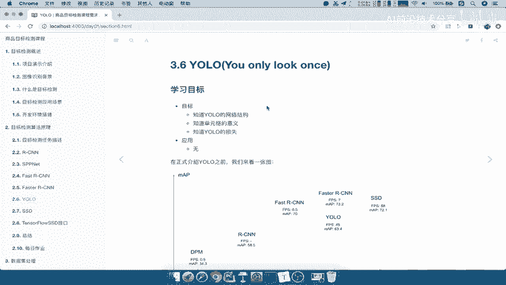
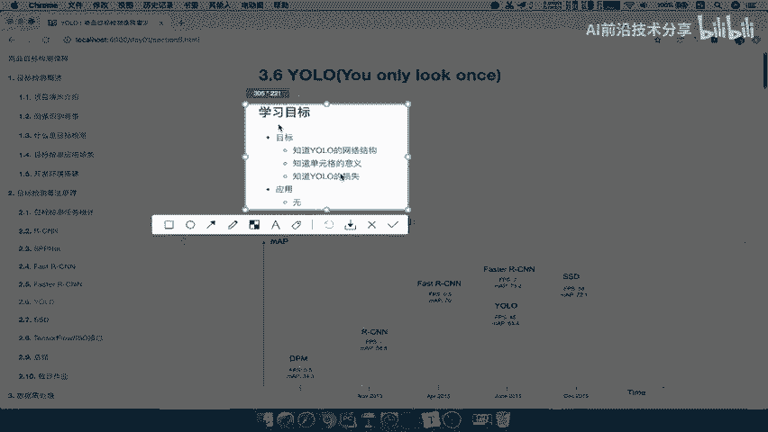
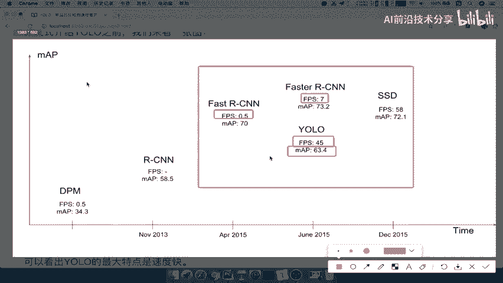
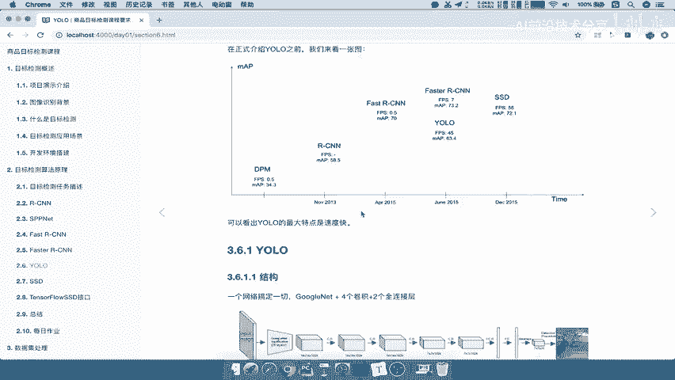
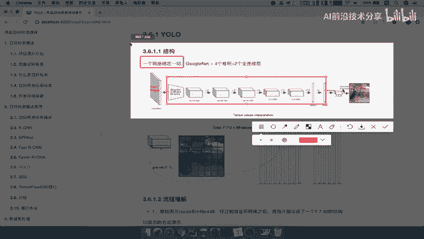
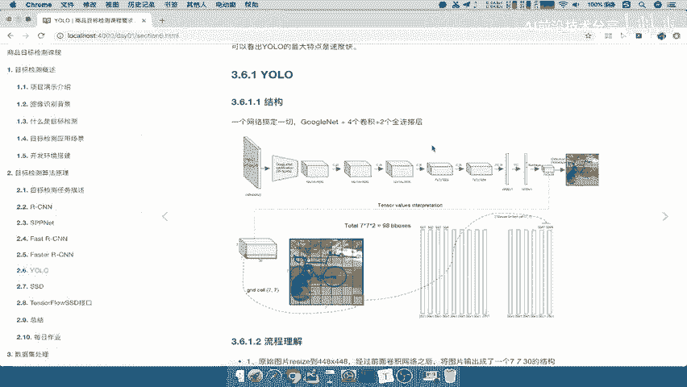

# 课程P27：YOLO算法特点与流程介绍 🎯

在本节课中，我们将要学习YOLO（You Only Look Once）算法的核心特点与基本流程。YOLO是一种著名的目标检测算法，以其“端到端”的设计和极快的处理速度而闻名。我们将了解其网络结构、工作原理以及它为何能在速度上取得显著优势。

## 算法特点：速度与精度的权衡 ⚖️

上一节我们介绍了其他目标检测算法，本节中我们来看看YOLO的独特之处。YOLO的全称是“You Only Look Once”，意为“只看一次”，这直观地体现了其追求快速和便捷的设计理念。

为了理解YOLO的特点，我们可以参考算法性能对比图。图中纵坐标表示精确度，横坐标表示算法出现的时间。重点关注Faster R-CNN和YOLO等算法。

以下是几个关键观察点：
*   **FPS（每秒帧数）**：FPS值体现了算法的运行速度。YOLO的FPS值显著高于Faster R-CNN，说明其速度非常快。
*   **mAP（平均精度均值）**：mAP值体现了算法的检测准确度。Faster R-CNN的mAP值通常更高。相比之下，YOLO的准确度会有所降低。

因此，YOLO的核心特点是**速度特别快，但准确率会有所折衷**。这为需要实时处理的应用场景提供了重要选择。

## 网络结构：简洁的端到端设计 🏗️

了解了YOLO的速度优势后，本节我们来看看其简洁的网络结构是如何实现这一点的。YOLO采用单一网络完成所有任务，无需像Faster R-CNN那样使用区域生成网络（RPN）加检测网络的两阶段设计。

其网络结构可以概括为：**输入图片 -> 卷积神经网络（如GoogleNet加若干卷积层）-> 全连接层 -> 输出特征图**。整个过程在一个网络内完成，结构非常简单。

## 工作流程：从单元格到预测 📊

那么，这个简单的网络是如何进行预测的呢？接下来我们详细解析YOLO的工作流程。

整个流程可以分为以下几步：
1.  **输入处理**：将原始图片缩放至固定尺寸，例如448x448像素。
2.  **特征提取与输出**：图片经过卷积网络后，输出一个 **7x7x30** 的张量。为了便于理解，我们可以将这个7x7的网格视为将图片划分成了49个单元格。
3.  **单元格预测**：**每个单元格负责预测两个边界框（Bounding Box）** 以及这些框的置信度和类别概率。
4.  **结果生成**：对所有单元格的预测结果进行筛选（如非极大值抑制，NMS），最终得到检测结果。

关键在于，YOLO**摒弃了显式的候选区域筛选步骤**，直接让每个单元格进行预测，从而实现了流程的极大简化与加速。

## 核心概念与表示 🔑

以下是YOLO算法中的几个核心概念及其表示方式：

*   **网络输出**：算法最终输出一个三维张量，其尺寸为 `S x S x (B*5 + C)`。
    *   `S x S`：代表将图像划分成的网格数（如7x7）。
    *   `B`：每个网格预测的边界框数量（如2）。
    *   `5`：每个边界框的预测值，包括中心坐标(`x, y`)、宽高(`w, h`)和1个置信度(`confidence`)。
    *   `C`：待检测的类别数量。
    *   因此，对于PASCAL VOC数据集（20类），输出为 `7x7x(2*5+20)=7x7x30`。

*   **置信度计算**：边界框的置信度（Confidence）反映了框内包含目标且位置准确的程度。其公式为：
    **Confidence = Pr(Object) * IOUᵗʳᵘᵗʰₚᵣₑᵈ**
    其中，`Pr(Object)`表示该单元格是否存在目标，`IOU`（交并比）是预测框与真实框的重叠程度。

## 总结 📝

本节课中，我们一起学习了YOLO v1算法的核心内容。

我们首先了解了YOLO**追求高速、在精度上有所妥协**的算法特点。然后，剖析了其**简洁的端到端网络结构**，它通过单一网络直接输出检测结果，省去了候选区域生成步骤。最后，我们逐步拆解了YOLO的工作流程：从图像输入、网格划分、单元格预测到最终结果输出，并理解了其输出张量 **`7x7x30`** 的具体含义。

总而言之，YOLO通过将目标检测重构为单一的回归问题，实现了惊人的检测速度，为实时目标检测奠定了基础。