# 课程 P28：YOLO 单元格原理详解 🧱

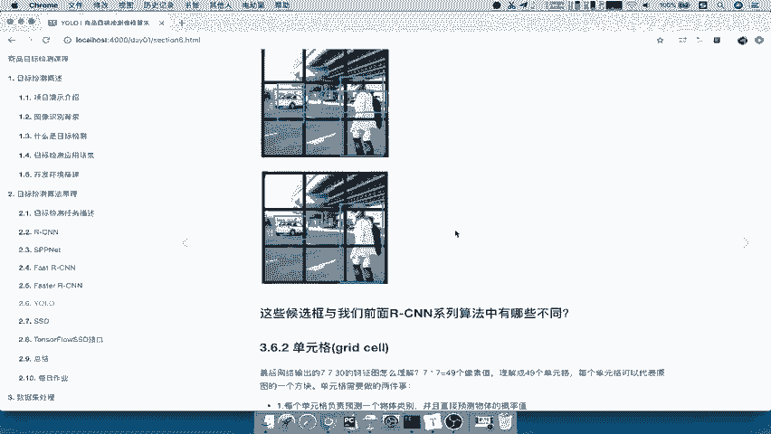

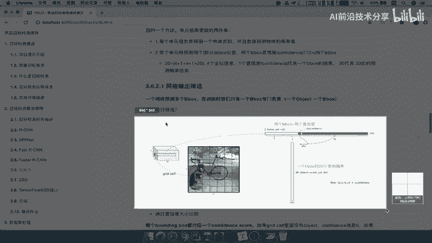


在本节课中，我们将深入探讨 YOLO 算法中一个核心概念——单元格。我们将详细解释 YOLO 网络输出的 `7x7x30` 张量如何被理解，以及每个单元格如何负责预测物体类别和边界框。

---

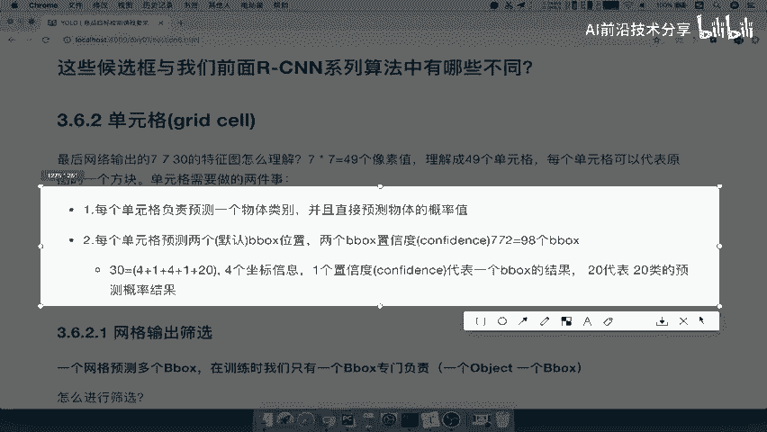

## 单元格概念引入

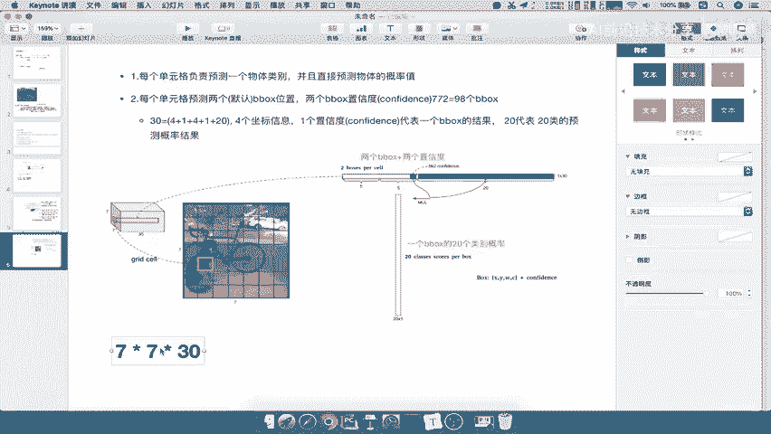

上一节我们介绍了 YOLO 网络的基本结构。本节中，我们来看看其输出 `7x7x30` 的具体含义。为此，我们引入“单元格”的概念。

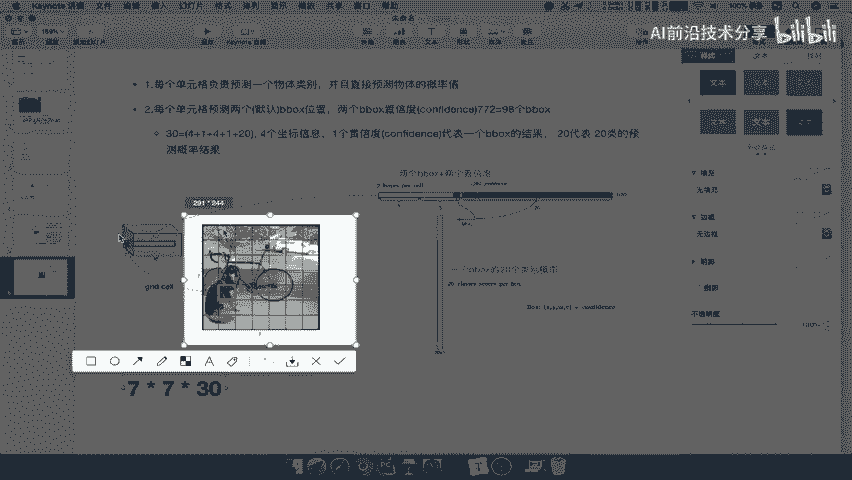

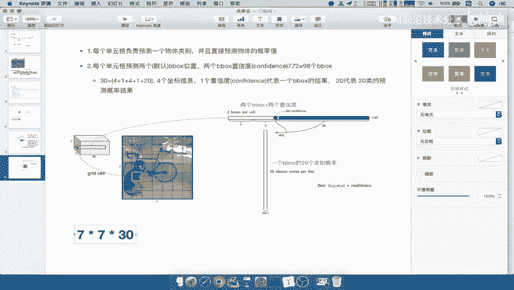

我们可以将 `7x7` 理解为 49 个像素值。这 49 个像素值可以看作是原始图像被划分成的 49 个单元格。每个像素代表一个单元格。

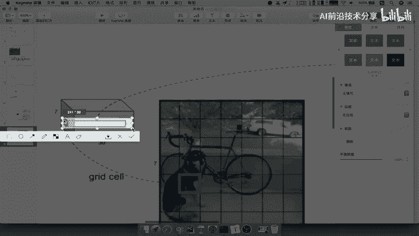

每个单元格需要完成两件事：
1.  每个单元格只负责预测一个物体类别，并直接预测该物体的概率。
2.  每个单元格会预设两个边界框的位置，每个边界框附带一个置信度。

因此，总共有 `49 x 2 = 98` 个边界框。

---

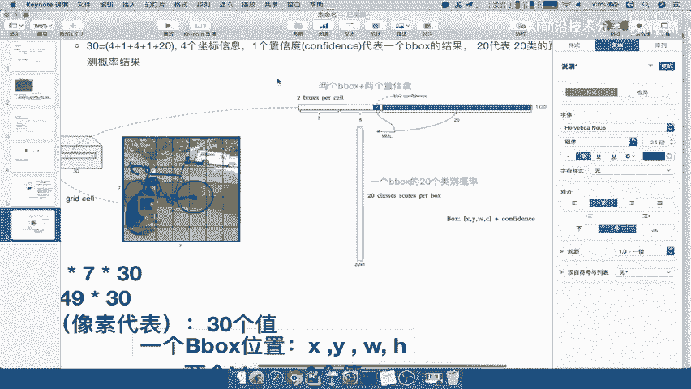

## 30维向量的拆解

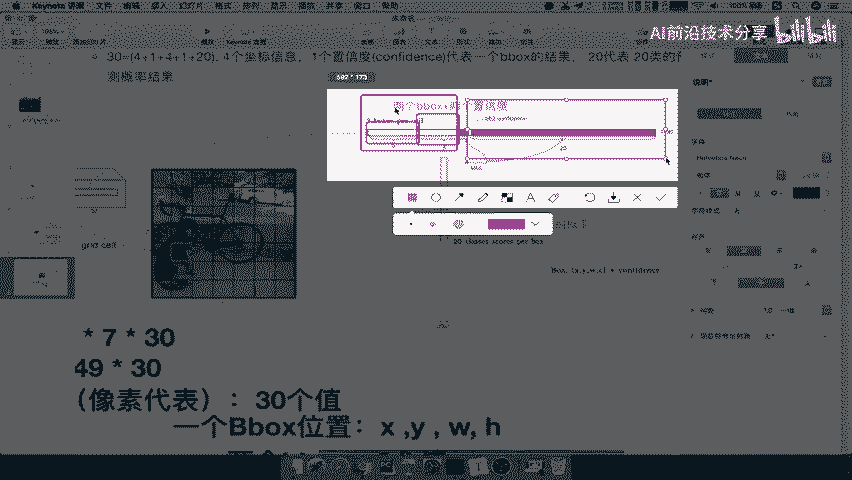

接下来，我们详细拆解每个单元格对应的 30 维向量。

每个单元格（即每个像素位置）对应一个 30 维的向量。这 30 个值的构成如下：

以下是 30 维向量的具体构成：
*   **边界框部分**：包含两个预设的边界框。
    *   每个边界框需要 4 个值来描述其位置 `(x, y, w, h)`。
    *   每个边界框附带 1 个置信度值。
    *   因此，两个边界框共占 `(4+1) x 2 = 10` 个值。
*   **类别概率部分**：在 PASCAL VOC 数据集中，共有 20 个物体类别。
    *   单元格需要预测它属于这 20 个类别的概率。
    *   因此，这部分占 20 个值。

总计 `10 + 20 = 30` 个值，与网络输出维度吻合。所以，`30 = (5 + 5) + 20`。前 10 个值专门用于边界框预测，后 20 个值用于该单元格的类别概率预测，并从中选取概率最大的类别作为预测结果。

---

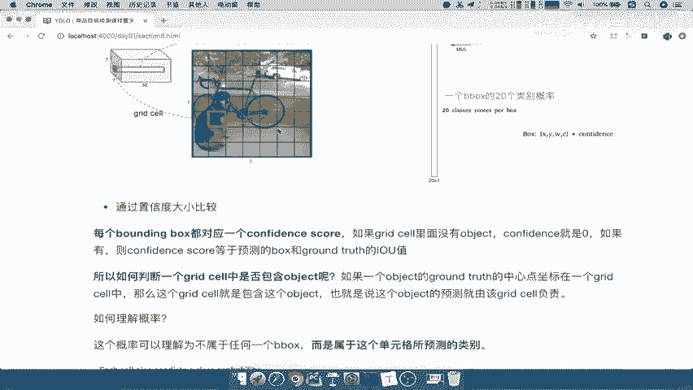

## 边界框的筛选与置信度

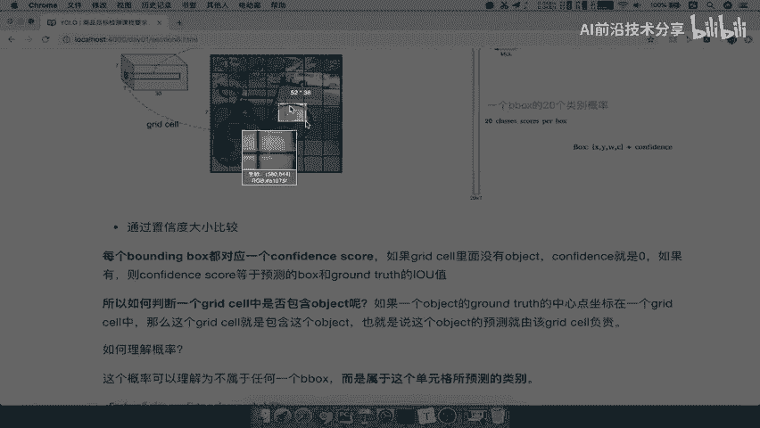

一个网格会预测多个边界框。在训练时，我们只选用其中一个边界框负责预测物体。

每个边界框都对应一个置信度。置信度由网络直接输出，其含义如下：
*   如果该边界框内没有物体，则其置信度应为 0。
*   如果该边界框内有物体，则其置信度等于该边界框与真实框的 IoU 值。

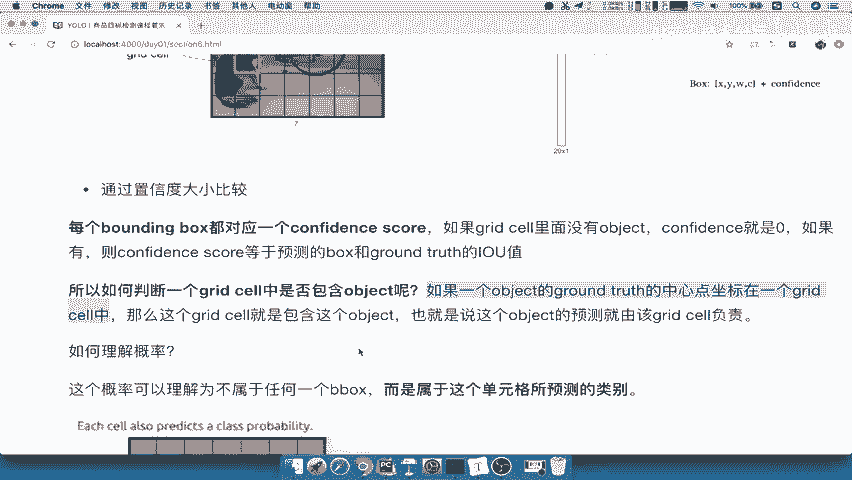

那么，如何判断一个单元格“有物体”呢？规则是：如果一个真实物体的中心点坐标落在某个单元格内，则该单元格就负责预测这个物体。

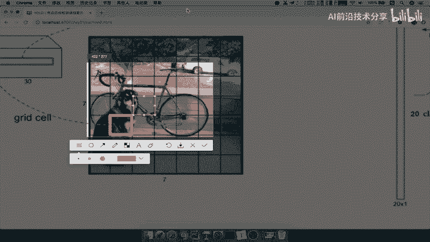

在训练过程中，我们会将包含物体中心点的单元格标记为正样本（目标值为1），其他大部分单元格则标记为负样本（目标值为0）。这样，网络在训练时，包含物体的单元格预测出的置信度会越来越高。

---

## 单元格的最终输出

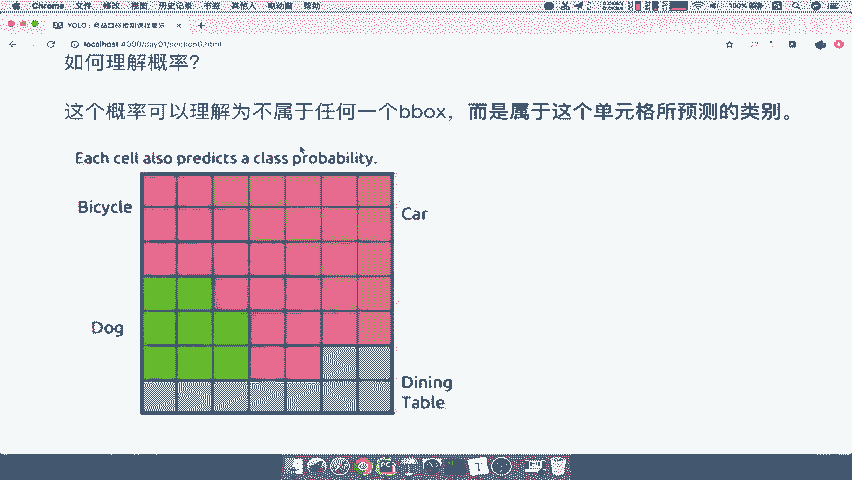

每个单元格最终需要输出一个边界框位置和一个类别。

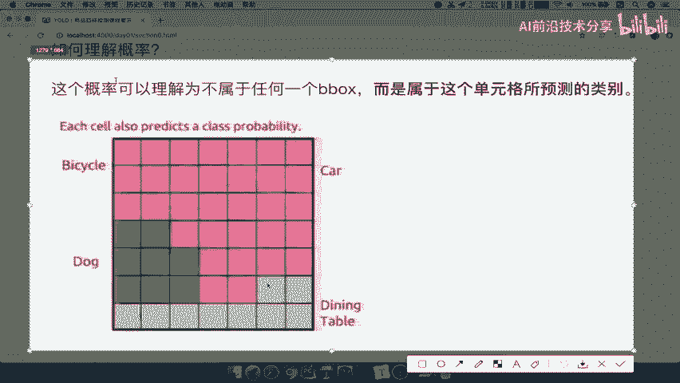

以下是单元格的决策过程：
1.  **选择边界框**：从该单元格预设的两个边界框中，选择置信度较高的一个。
2.  **选择类别**：从该单元格预测的 20 个类别概率中，选择概率最大的一个。

因此，对于输入图像，网络最终会输出 49 个单元格的预测结果，每个结果包含一个边界框（位置）和一个类别标签。

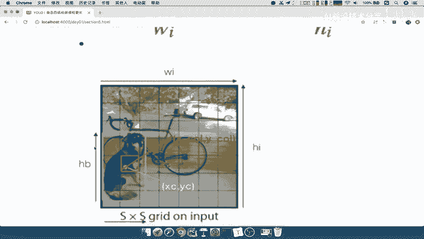

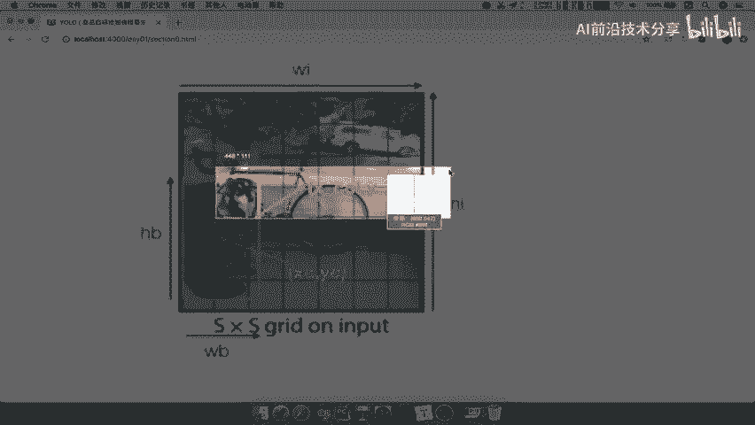

关于边界框位置 `(x, y, w, h)` 的理解，它们都是相对于单元格的偏移量和相对于整张图像的归一化比例，具体公式如下：

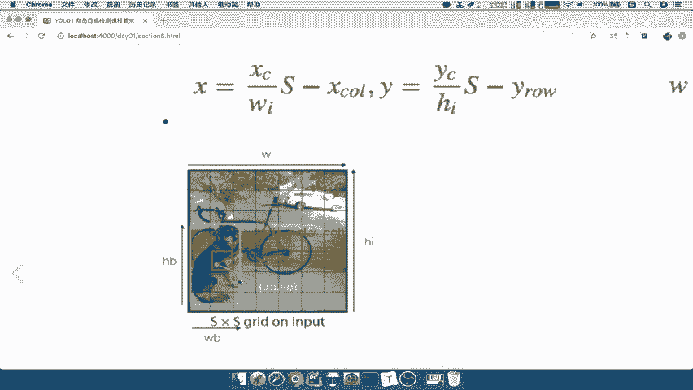

```
# (x, y) 是边界框中心相对于单元格左上角的偏移
# (w, h) 是边界框的宽高相对于整张图像宽高的比例
x = (x_center_of_object / image_width) * grid_size - column_index
y = (y_center_of_object / image_height) * grid_size - row_index
w = bbox_width / image_width
h = bbox_height / image_height
```

---

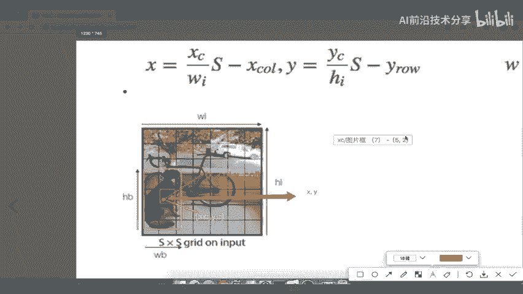

## 总结

本节课中，我们一起学习了 YOLO 算法中单元格的核心原理。
*   我们将 `7x7x30` 的输出解释为 49 个单元格，每个单元格携带 30 维信息。
*   这 30 维信息被拆分为两部分：用于预测两个边界框位置和置信度的 10 个值，以及用于预测 20 个类别概率的 20 个值。
*   我们了解了如何通过物体中心点确定负责预测的单元格，以及如何利用置信度筛选出最终的边界框。
*   每个单元格的最终输出是一个置信度最高的边界框和一个概率最大的物体类别。

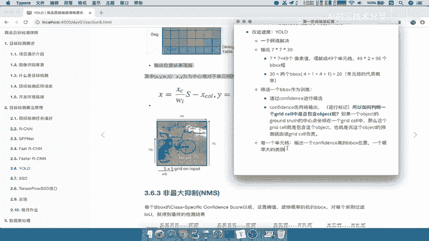

这就是 YOLO 通过单元格机制实现“只看一次”就能完成目标检测的关键所在。