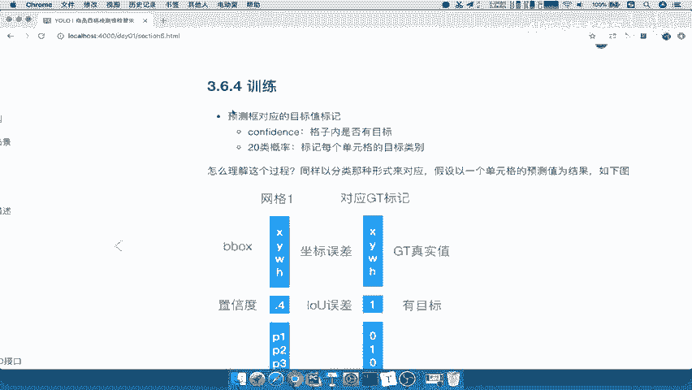
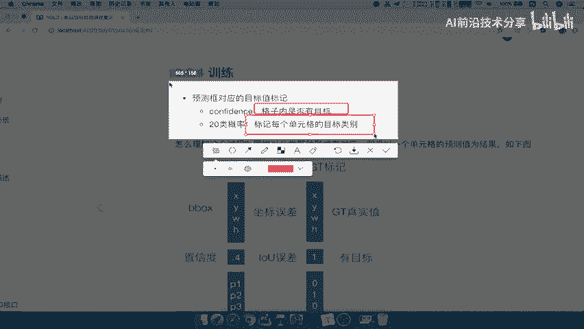
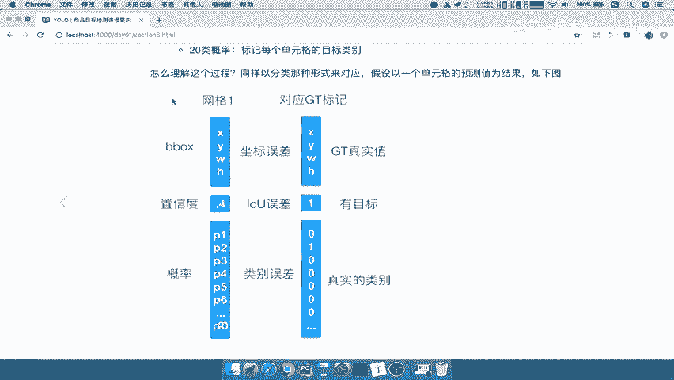
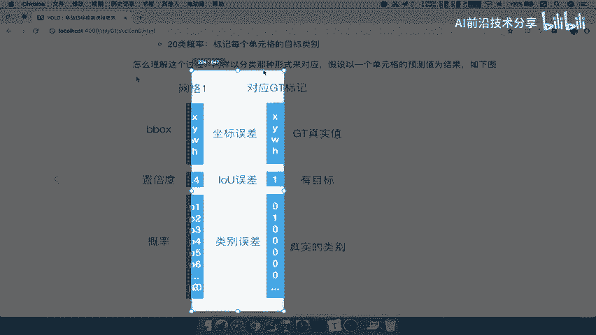
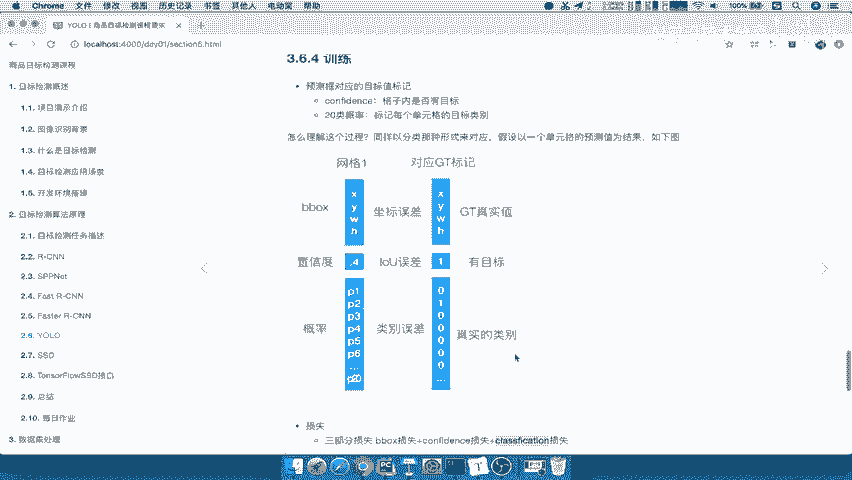

# 课程 P29：YOLO 训练过程的样本标记 🎯

在本节课中，我们将学习 YOLO 模型在训练阶段如何对样本进行标记。理解这个过程是掌握 YOLO 如何学习检测目标的关键。

上一节我们介绍了 YOLO 在测试阶段的流程，本节中我们来看看它在训练时是如何工作的。

## 训练过程的样本标记

训练过程的核心是为模型提供正确的“答案”，即标记。这包括判定每个网格单元内是否有目标，以及目标的类别和位置。

具体来说，训练标记需要为每个网格单元提供以下信息：
*   该单元格内**是否有目标**。
*   目标的**20个类别概率**（针对VOC数据集）。
*   目标**边界框（Bounding Box）的坐标**。

## 预测框与真实值的对比

训练时，模型会为每个网格单元生成预测值。这些预测值需要与对应的真实值进行对比，以计算误差并指导模型更新。

以下是训练对比的关键步骤：

1.  **坐标误差**：计算预测的边界框与真实的边界框（Ground Truth, GT）之间的坐标误差。
2.  **置信度误差**：衡量预测的“是否有目标”的置信度与真实情况是否匹配。有目标的单元格，其真实置信度标记为 **1**；无目标的则标记为 **0**。模型预测的是一个与真实框的IOU值相关的概率。
3.  **类别误差**：计算预测的类别概率分布与真实的类别标签之间的误差。

## 样本标记的具体方式

每个网格单元都会根据真实情况获得一个对应的标记。

*   如果该单元格**包含目标中心点**，则将其“有目标”标记设为 **1**，并为其分配真实的类别概率和边界框坐标。
*   如果该单元格**不包含任何目标**，则将其“有目标”标记设为 **0**。在训练时，模型对这些单元格的预测就不会产生目标。

通过这种方式，模型能够学会区分有目标的区域和无目标的背景区域。

## 理解训练过程图示

为了更直观地理解，我们可以参考以下训练过程的逻辑图示（此处为文字描述）：
模型将预测值与真实标记在三个维度上进行对比：边界框坐标、目标置信度和类别概率，并计算综合损失来调整自身参数。

本节课中我们一起学习了 YOLO 训练过程中样本标记的核心机制。关键在于理解每个网格单元如何根据真实目标被标记为“有目标”或“无目标”，并如何通过对比预测值与真实值在坐标、置信度和类别三个方面的误差，来驱动模型的学习。掌握这一过程，就理解了 YOLO 模型能够学会检测目标的原理。