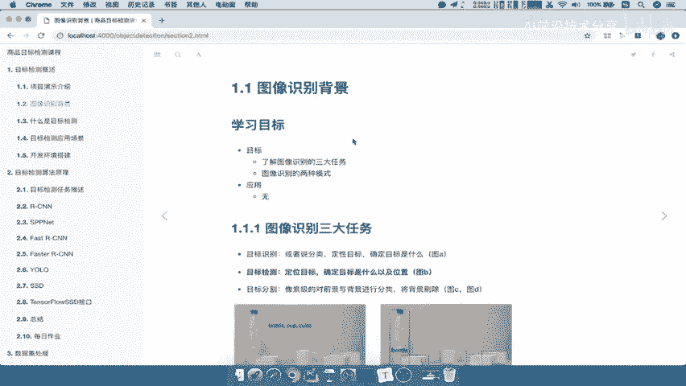
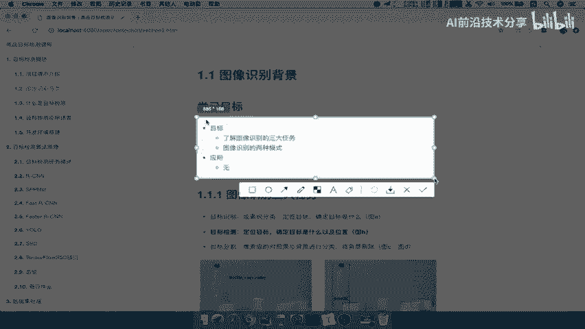
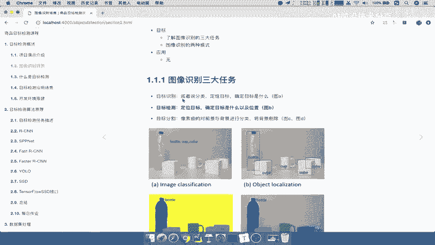
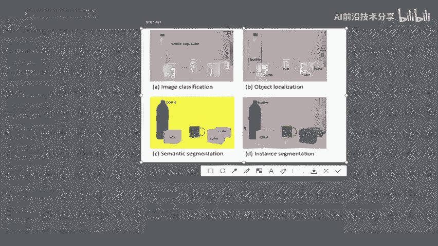
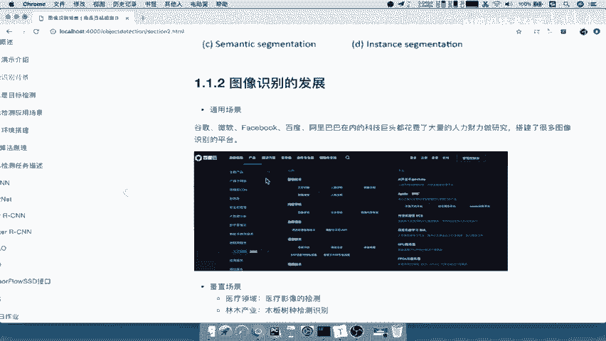
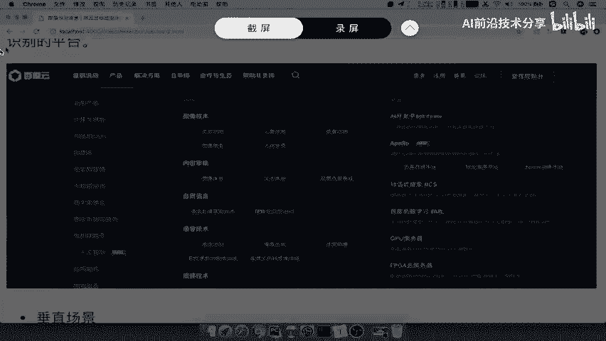
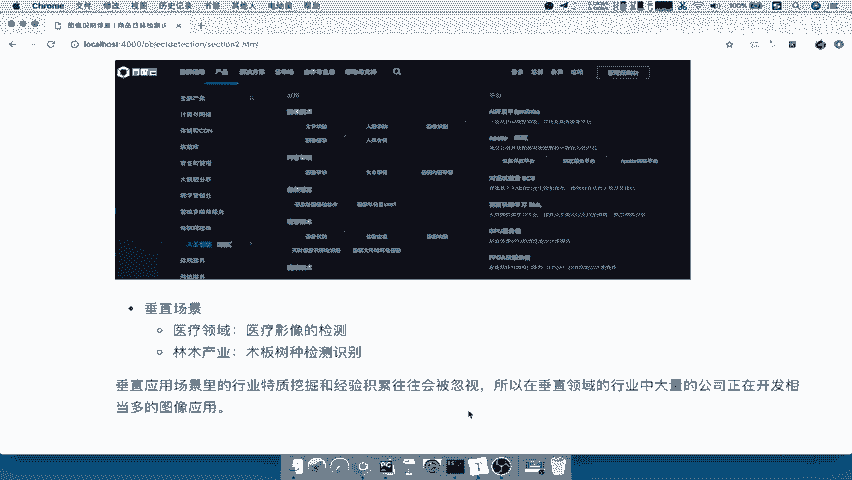
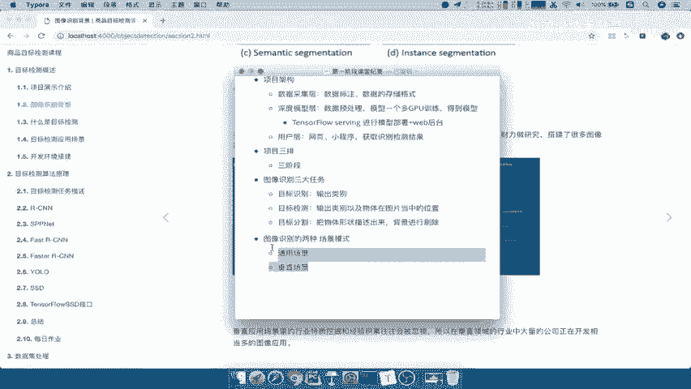

# 图像识别背景3 - AI前沿技术分享 - P3 🖼️

在本节课中，我们将要学习图像识别领域的核心背景知识。我们将了解图像识别的三大核心任务，并探讨其在实际应用中的两种主要发展模式。

## 图像识别的三大任务 🎯

上一节我们介绍了课程的整体目标，本节中我们来看看图像识别的具体任务划分。图像识别领域主要包含三大任务。

以下是三大任务的定义：

1.  **目标识别 (Image Classification)**：对图像中的目标进行分类定性，确定目标是什么。其核心是输出目标的类别。例如，判断一张图片中是“矿泉水瓶 (bottle)”还是“杯子 (cup)”。
2.  **目标检测 (Object Detection/Localization)**：定位图像中的目标。除了识别目标类别，还需要确定目标在图片中的具体位置。通常用边界框 (Bounding Box) 的坐标来标记位置。
3.  **目标分割 (Image Segmentation)**：对图像的前景与背景进行分类，将目标从背景中分离出来。它进一步细分为：
    *   **语义分割 (Semantic Segmentation)**：将物体与背景分开。
    *   **实例分割 (Instance Segmentation)**：不仅分离物体与背景，还能区分同一类别的不同个体，并精确标记出物体的整个形状轮廓。

所以，我们可以简单总结一下图像识别的三大任务：
*   **目标识别**：输出目标的类别。
*   **目标检测**：输出目标的类别及其在图片中的位置。
*   **目标分割**：描述目标的精确形状，并将背景进行标记或剔除。

本课程后续的重点将是**目标检测**。虽然目标分割在像素级精度上更优，但目标检测在平衡精度与计算效率方面应用更为广泛。

## 图像识别的两种发展模式 📈

了解了图像识别的任务分类后，我们来看看它在实际应用中的发展模式。图像识别的发展主要通过两种应用场景模式来体现。

以下是两种主要的应用场景：

1.  **通用场景 (General Scene)**：以谷歌、微软、Facebook、百度等大型互联网企业为代表。它们凭借雄厚的人力、财力和数据资源，致力于开发通用的识别产品。例如，通用的物体识别、内容审核、人脸检测等。这些企业通常会搭建开放平台（如百度AI开放平台），提供基础的图像技术服务。
2.  **垂直场景 (Vertical Scene)**：基于具体行业或公司的特定业务需求进行开发。由于不同行业（如医疗影像、林业树种识别、工业质检）的数据具有私密性和专业性，大公司的通用模型往往难以直接适用。因此，需要利用特定领域的私有数据构建数据集并训练模型。目前大量的图像应用开发都集中在垂直领域。

通用场景的平台提供的功能能达到基础效果，但难以满足企业级深度定制的需求。而垂直领域的行业特质常被通用方案忽略，因此催生了大量针对特定场景的图像应用开发。我们后续的学习和实践也将主要围绕**垂直场景**的目标检测展开。

---

本节课中我们一起学习了图像识别的三大核心任务：**目标识别**、**目标检测**和**目标分割**，并了解了图像识别在**通用场景**与**垂直场景**下的两种不同发展模式。理解这些背景知识，有助于我们明确后续技术学习的方向和应用落地的场景。