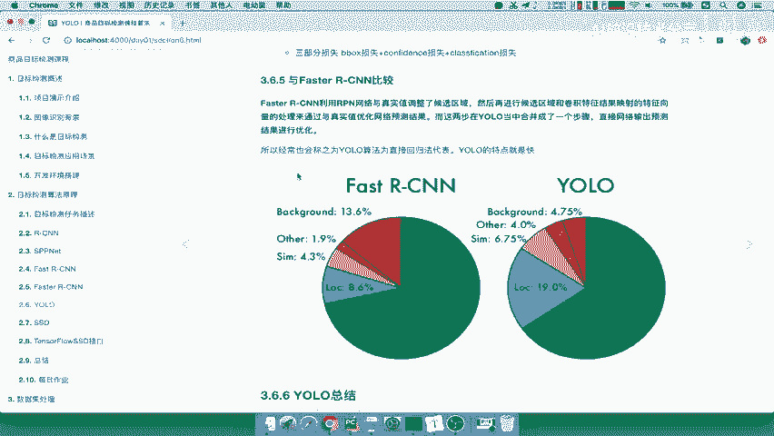
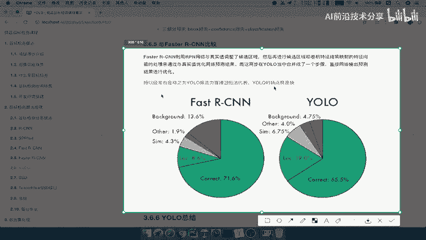
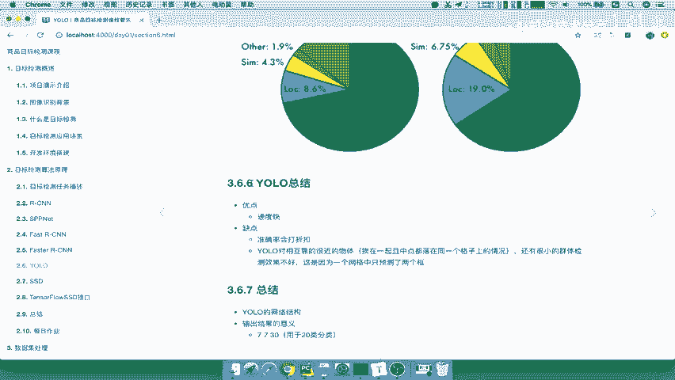
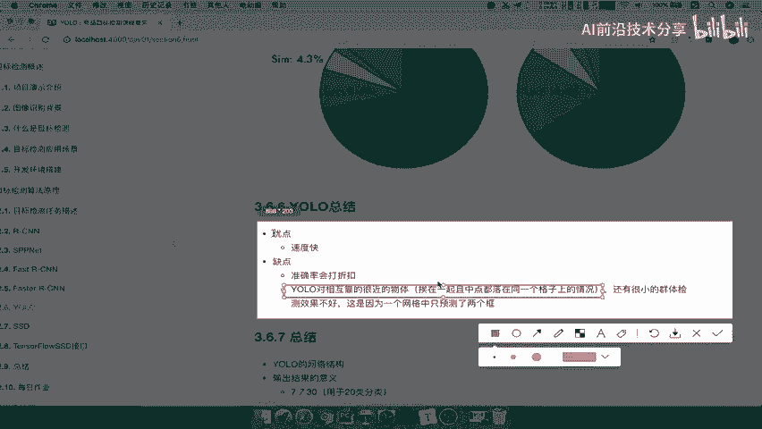

# 课程 P30：YOLO 总结 🎯

在本节课中，我们将对 YOLO 算法进行总结，并将其与 Fast R-CNN 进行对比，以明确其优缺点。我们将通过图表和要点分析，帮助初学者理解 YOLO 的核心特性。

## YOLO 与 Fast R-CNN 的对比 📊

上一节我们介绍了 YOLO 的网络结构，本节中我们来看看它与另一种经典目标检测算法 Fast R-CNN 的区别。下图展示了两种算法在相同数据集上的性能对比。

从图中可以看出，YOLO 在准确度上不及 Fast R-CNN。YOLO 的主要特点是**速度快**，但并未保证达到最佳的准确率。相对于 Fast R-CNN，YOLO 的结果存在一定误差。

## YOLO 的优缺点总结 ✅❌

基于上述对比，我们可以对 YOLO 算法进行总结。

以下是 YOLO 的主要优点：
*   **速度快**：这是 YOLO 最显著的优势。

以下是 YOLO 的主要缺点：
*   **准确率会打折扣**：这是追求速度所付出的代价。
*   **对相互靠近的物体检测效果不佳**：当多个物体落在同一个预测网格（grid cell）时，YOLO 可能无法正确区分。
*   **对小群体检测效果不好**：对于尺寸较小的物体，检测效果不理想。

## 核心概念回顾 🔑

最后，我们回顾一下 YOLO 的核心设计。YOLO 的网络结构及其输出 `7x7x30` 的张量是需要理解的关键。

本节课中我们一起学习了 YOLO 算法的总结。我们将其与 Fast R-CNN 进行了对比，明确了 YOLO **速度快但准确率稍逊**的特点，并分析了其在处理密集和小物体时的局限性。理解这些优缺点有助于在实际应用中根据需求选择合适的检测模型。