# 课程31：SSD网络结构与Detector结构详解 🎯

在本节课中，我们将学习一种在速度和精度之间取得良好平衡的目标检测模型——SSD。我们将重点解析其网络结构，并深入理解其核心组件“Detector”与“Classifier”的工作原理。

---

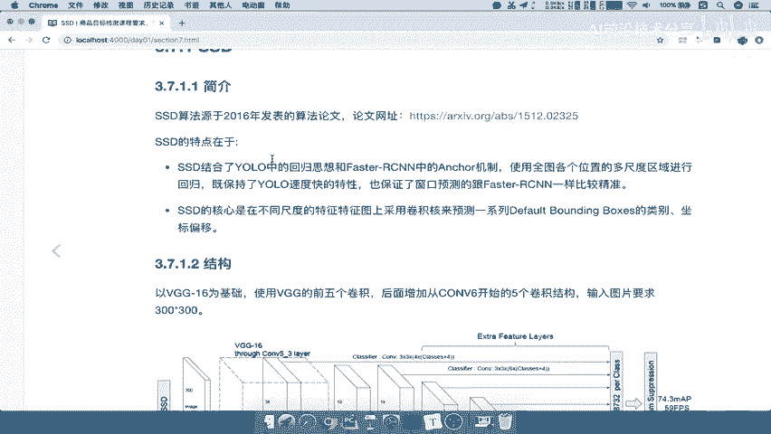

## SSD简介

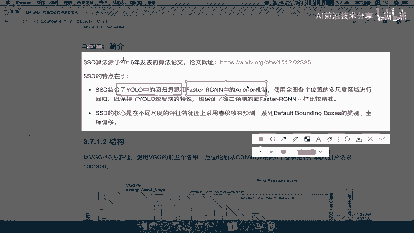

上一节我们介绍了YOLO模型，其速度表现优异。那么，是否存在一种算法能同时兼顾速度与准确度呢？答案是肯定的，那就是SSD。

SSD，英文全称为 **Single Shot MultiBox Detector**，是一种在项目中非常实用的重要模型。

它的学习目标是：
*   了解SSD的网络结构。
*   理解其中“Detector”和“Classifier”组件的作用。
*   说明SSD的主要优点。

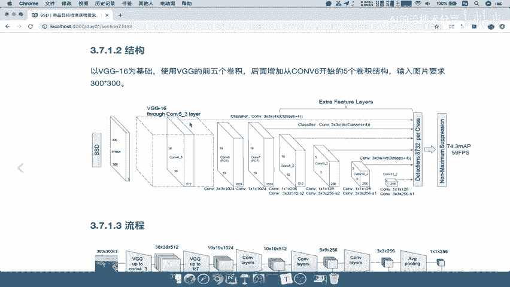

SSD于2016年发表。其核心特点是**结合了YOLO的回归思想与Faster R-CNN的Anchor机制**，从而在保持较高检测速度的同时，也保证了精度。

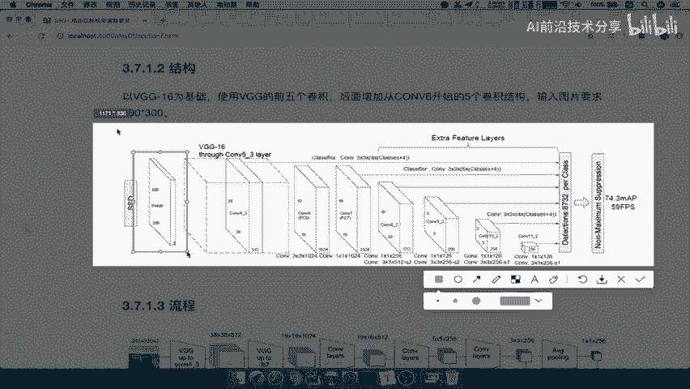

因此，SSD**兼顾了速度与精度**。请注意，这里的SSD并非指固态硬盘，虽然名称相同。

---

## SSD网络结构

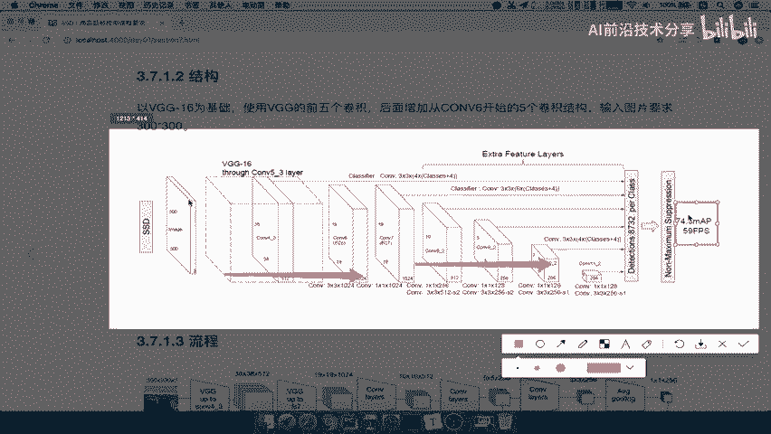

了解了SSD的基本概念后，本节我们来看看它的具体网络结构。

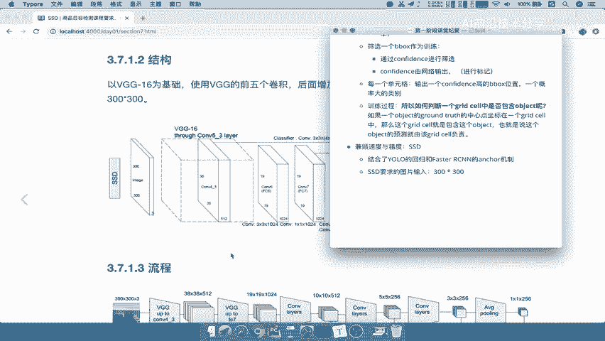

对于SSD模型，输入图片有固定要求：**必须是300×300像素的大小**。如果处理的图片不是此尺寸，则需要进行相应的缩放或裁剪。

图片输入后，会经过一个包含卷积层、全连接层等的深度网络进行处理。最终，SSD在特定数据集上能达到约59 FPS的速度和74.3%的mAP精度，这个表现在当时是相当出色的。

作为对比，之前学习的YOLO模型输入图片尺寸为448×448。

---

## SSD工作流程

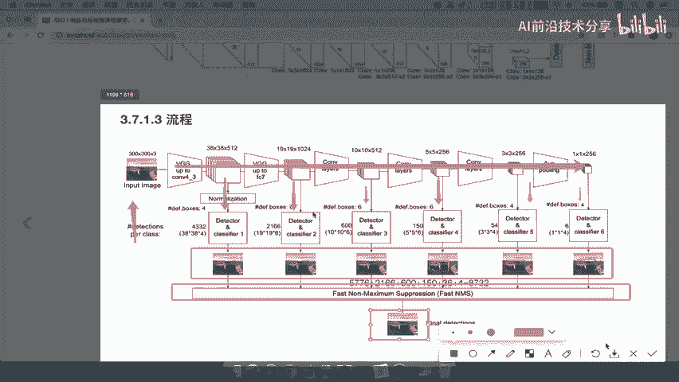

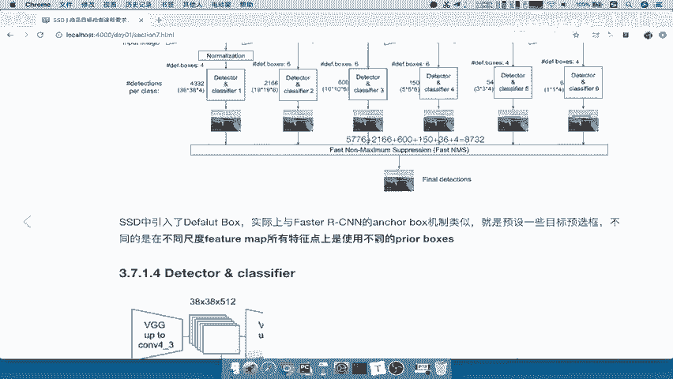

明确了输入要求后，我们来梳理SSD的整体工作流程。

当一个300×300×3的图片输入网络后，数据从左向右流动。在网络结构的多个特定层级（图中向下的箭头处），都会进行一项关键操作：**Detector & Classify**。

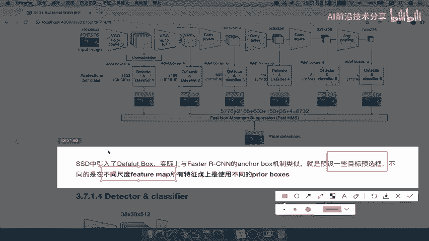

每一个“Detector & Classify”模块都会输出一系列预测框。所有这些来自不同层级的预测框会被汇集起来，最后通过**NMS（非极大值抑制）** 算法进行筛选，最终得到图片中物体的预测结果。

由此可见，整个流程的核心就是**Detector & Classify**模块。我们的重点也将放在理解这个模块上。

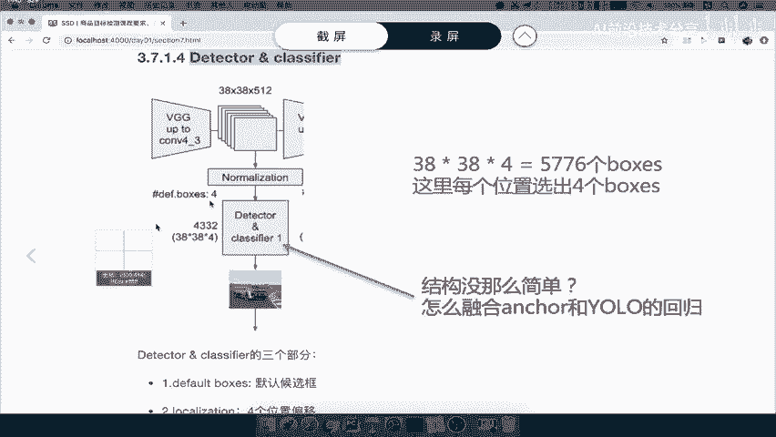

---

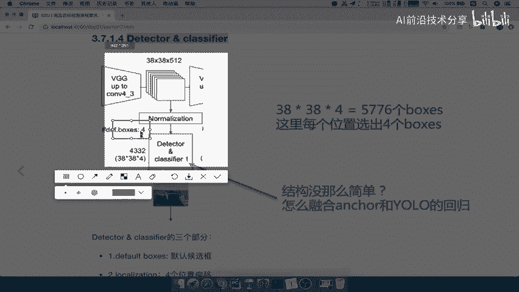

## Detector & Classify 详解

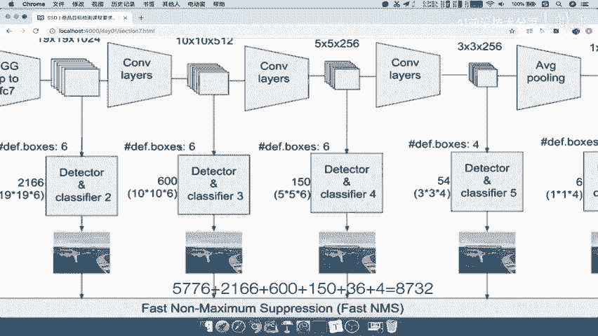

上一节我们指出了流程中的核心模块，本节中我们来详细剖析“Detector & Classify”。

SSD引入了 **Default Box** 的概念，这与Faster R-CNN中的Anchor Box机制类似，都是预设一些不同形状和大小的候选框。不同之处在于，SSD会在**多个不同尺度的特征图**上都生成Default Boxes。

以下是对其结构的说明：

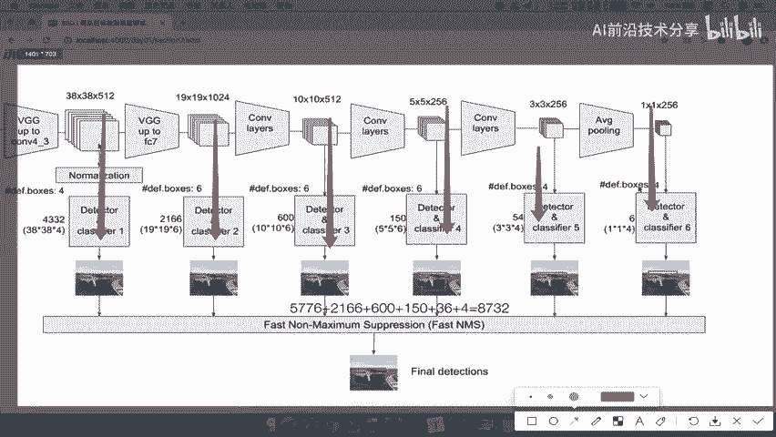

以网络中某个输出为38×38的特征图为例。在该特征图的**每一个像素点**上，SSD会预测**4个**默认框（Default Box）。

因此，仅这一层产生的候选框总数就是：`38 × 38 × 4 = 5776`个。

观察网络结构图可以发现，不同层级的特征图（如19×19， 10×10， 5×5等），其每个像素点对应的Default Box数量是不同的（可能是4个或6个）。

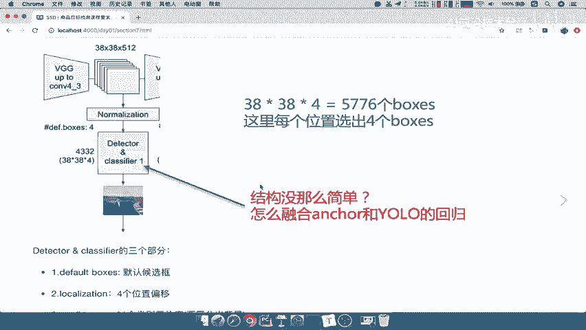

最终，SSD将所有层级的Default Box数量相加，总共会生成**8732个**候选框。这些框将作为后续分类和位置修正的基础。

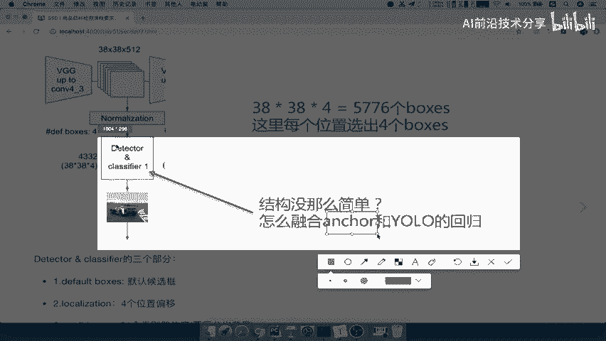

那么，这个结构是如何进行训练和预测的呢？“Detector & Classify”模块**融合了YOLO的边界框回归思想和Faster R-CNN的Anchor机制**。

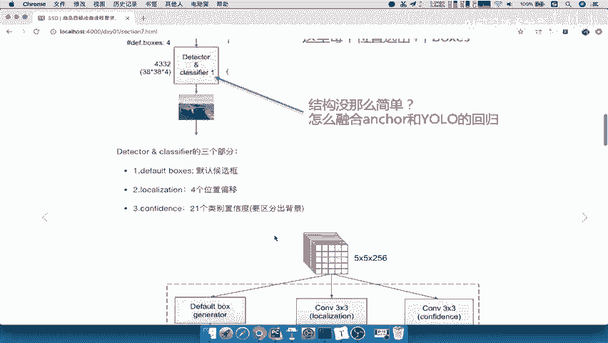

具体来说，该模块包含三个核心组成部分：
1.  **Default Boxes**：生成的默认候选框。
2.  **Localization**：4个值，表示预测框相对于Default Box的位置偏移（Δcx, Δcy, Δw, Δh）。
3.  **Confidence**：21个类别的置信度（20个目标类别 + 1个背景类别）。

---

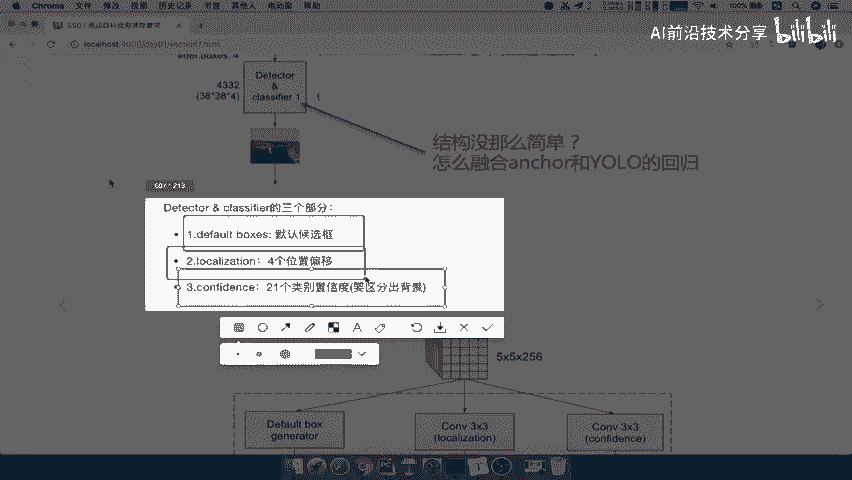

## 三个核心组件解析

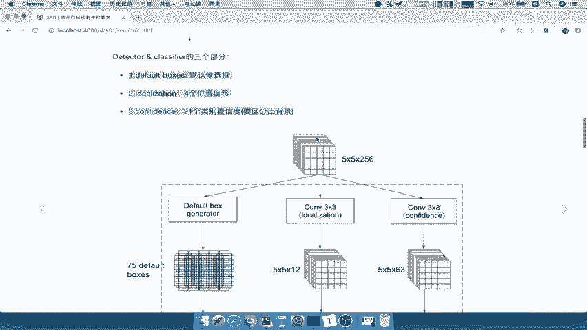

我们已经知道了“Detector & Classify”的三个组成部分，现在来逐一深入理解。

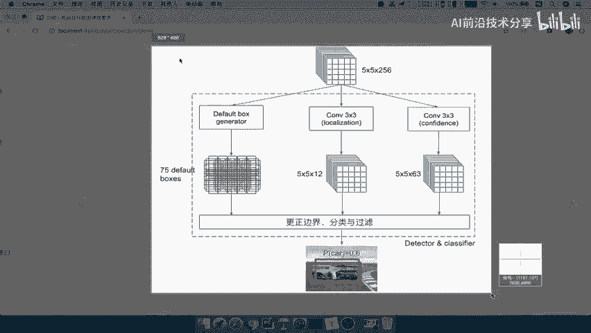

我们以网络中一个5×5×256的特征图输出为例进行说明。

### 1. Default Boxes的生成

首先，通过一个Default Box Generator，为5×5特征图的每个像素点生成若干个（例如6个）默认候选框。这些框是如何产生的呢？

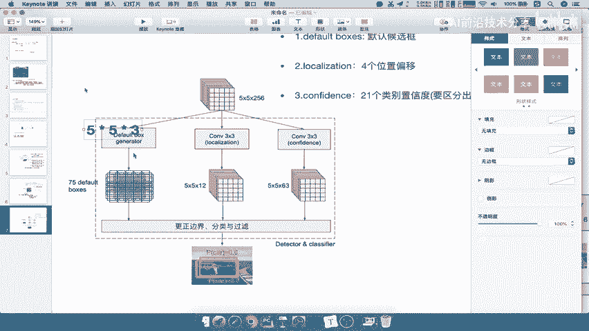

其生成方式与Faster R-CNN类似，也基于滑动窗口和固定公式。每个像素点会预测多个（如3个或6个）不同大小和长宽比的框。

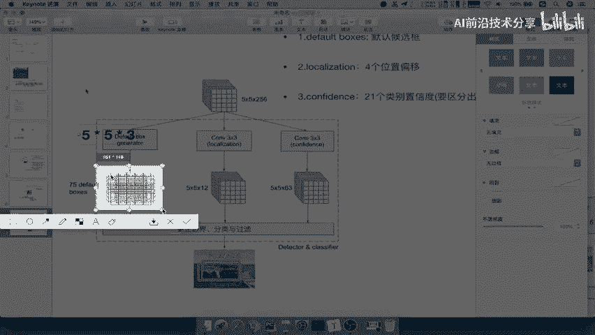

生成过程主要依赖两个参数：
*   **Ratio**：候选框的长宽比。
*   **S_min 和 S_max**：分别代表最底层和最顶层特征图用于计算框大小的尺度参数。

生成公式作为了解内容，此处不要求掌握。你只需知道Default Boxes是通过预设的尺度和长宽比，在特征图的每个点上生成的即可。

### 2. Localization 与 Confidence

对于同一个5×5×256的特征图，SSD会进行两次不同的3×3卷积操作：
*   一次卷积输出为5×5×12，这12个通道对应了每个Default Box的4个位置偏移量（`(x, y, w, h)`的调整值）。
*   另一次卷积输出为5×5×63，这63个通道对应了每个Default Box的21个类别的置信度（假设有20个物体类别+背景）。

### 组件关系总结

综上所述，这三个组件协同工作：
1.  **Default Boxes** 提供初始的候选区域。
2.  **Localization** 预测这些区域需要如何微调以更贴合真实物体。
3.  **Confidence** 判断每个区域属于哪个类别或是否是背景。

网络通过训练学习如何准确地预测偏移量和置信度，从而在推理时，对大量的Default Box进行快速分类和位置修正。

---

## 总结

本节课中，我们一起学习了SSD目标检测模型。
*   我们首先了解了SSD是一种**兼顾速度与精度**的模型，它融合了YOLO的回归思想和Faster R-CNN的Anchor机制。
*   然后，我们分析了SSD的**网络结构**，其输入要求为300×300的图片。
*   接着，我们梳理了SSD的**工作流程**，其核心在于多个特征层上的“Detector & Classify”模块。
*   最后，我们深入剖析了该模块的**三个核心组件**：Default Boxes（默认框生成）、Localization（位置偏移预测）和Confidence（类别置信度预测）。

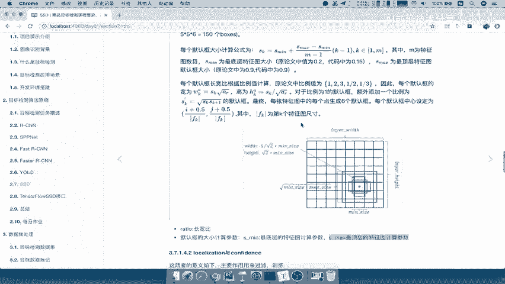

理解这些内容，是掌握SSD模型原理和应用的基础。