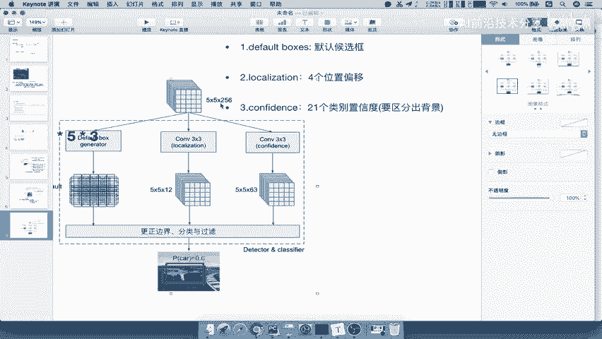
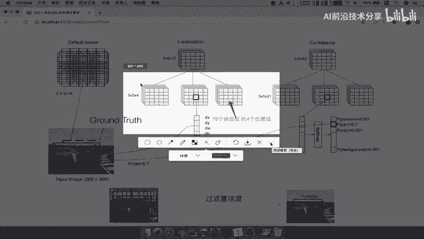
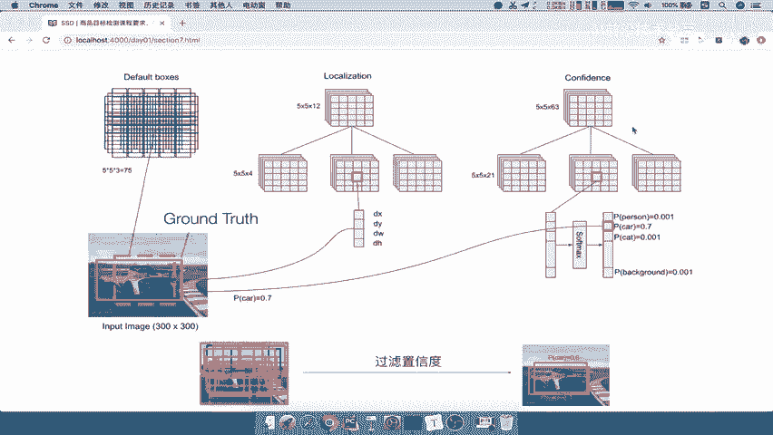
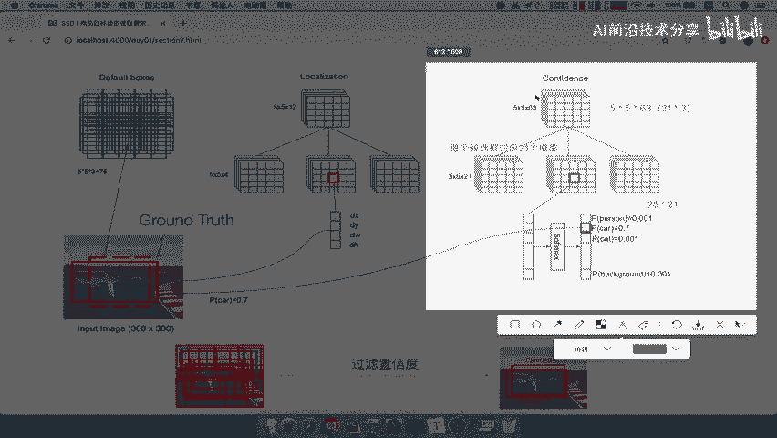
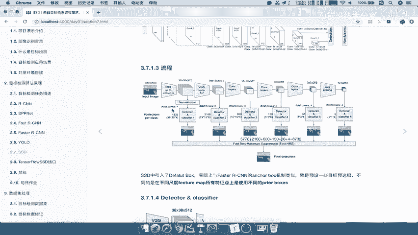
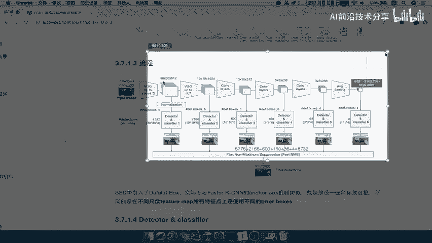
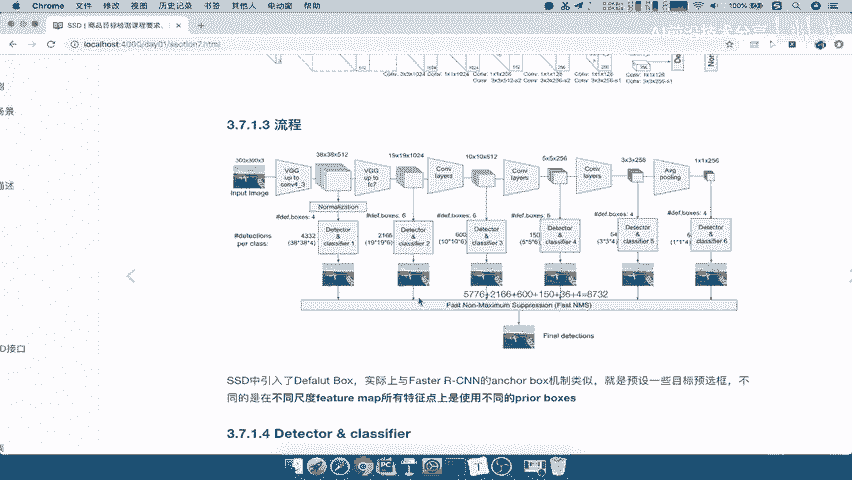
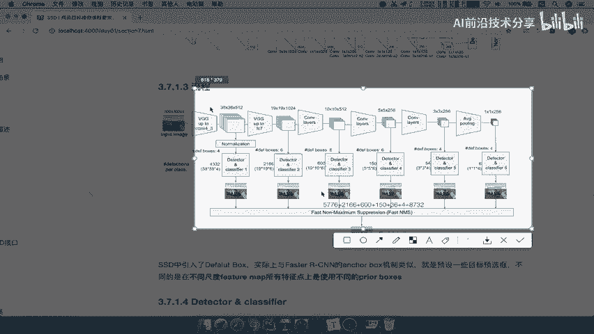
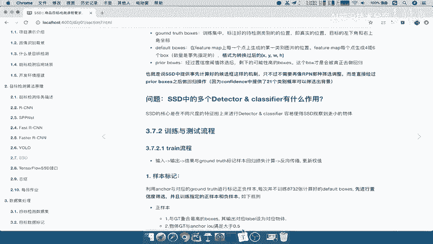

# 课程P32：SSD中的定位与置信度 🎯

在本节课中，我们将要学习SSD（Single Shot MultiBox Detector）目标检测算法中的两个核心概念：**定位**与**置信度**。我们将详细探讨网络如何为每个候选框预测位置偏移和类别概率，并理解这些预测如何用于最终的目标检测。

---

## 从候选框到预测

上一节我们介绍了SSD如何生成默认框。本节中我们来看看网络如何利用这些默认框进行预测。

在Fast R-CNN中，默认框用于与真实标注框进行比较和修正，并进行背景或物体的概率预测。在YOLO中，则直接对结果进行回归和损失计算。SSD的做法是：为生成的每个候选框，网络需要输出两个关键信息：**定位**和**置信度**，以代表每个候选框的预测结果。

## 定位预测

定位预测的输出是一个形状为 `5×5×12` 的张量。我们来分解这个结构。

以下是其构成方式：
*   它可以分为三个部分：`5×5×4`， `5×5×4`， `5×5×4`。三者相加即为 `5×5×12`。
*   这里的“4”代表每个像素点对应的一个候选框的**四个位置偏移值**（例如中心点坐标和宽高的修正量）。
*   由于每个像素点对应3个不同尺度的候选框，因此总共有 `5×5×3 = 75` 个候选框。
*   每个候选框需要4个值来修正其位置，所以总的位置偏移参数数量为 `75 × 4`，这正好由 `5×5×12` 的张量来表示。

网络直接输出的这些值，将用于后续的边界框回归计算。

## 置信度预测

置信度预测的输出是一个形状为 `5×5×21` 的张量。

以下是其含义：
*   每个候选框都会对应一组21个概率值（假设数据集中有20个物体类别，外加1个背景类别）。
*   总共有75个候选框，因此总的置信度参数数量为 `75 × 21`。
*   这个张量也可以理解为由卷积得到的 `5×5×63` 的特征图拆分而成，因为 `63 = 3 × 21`，对应每个像素点的3个候选框及其21个类别的概率。

这样，我们就得到了每个候选框的位置偏移和属于各个类别的概率。

## 预测后处理流程

获得定位和置信度信息后，接下来的处理流程与YOLO类似。

以下是处理步骤：
1.  **置信度过滤**：根据每个候选框的类别概率，过滤掉置信度低的候选框。
2.  **非极大值抑制**：对剩余的候选框应用NMS，去除高度重叠的冗余框。

经过这些步骤，最终保留下来的高质量候选框，就是网络的预测结果。

## 关键概念辨析

在训练和预测过程中，会涉及几种不同的边界框，理解它们的区别很重要。

以下是核心概念：
*   **Ground Truth Boxes**：图片中真实物体的标注框。
*   **Default Boxes**：网络事先设定的、在不同位置和尺度上生成的候选框（类似于Faster R-CNN中的锚框）。它们是计算和匹配的起点。
*   **Predicted Boxes**：网络对Default Boxes进行位置偏移预测和置信度筛选后，得到的最终预测框。这些框会与Ground Truth Boxes计算损失进行训练，或在推理时作为输出结果。

简而言之，**Default Boxes是预设的“模板”，而Predicted Boxes是网络根据“模板”调整和筛选后的“成品”**。

## SSD的多尺度检测优势

现在我们来思考SSD中多个检测层的作用。Faster R-CNN的候选框主要来自最后一个特征图。而SSD的不同之处在于，它在**多个不同尺度的特征图**上都进行默认框的生成和预测。

以下是这种设计的好处：
*   **兼顾不同大小物体**：浅层特征图分辨率高，包含更多细节信息，有利于检测小物体；深层特征图语义信息强，有利于检测大物体。
*   **提高检测精度**：通过在不同尺度上进行密集预测，能够覆盖更多可能的物体位置和大小，从而提高检测的召回率和准确性。

这种多尺度预测机制，有效避免了YOLO早期版本中单一网格预测可能遗漏小物体或对物体定位不够精细的问题。

---

本节课中我们一起学习了SSD算法的核心预测机制。我们明确了网络如何为每个默认框输出**定位偏移**和**置信度**，理解了从预测到最终输出结果的后处理流程，并辨析了Default Boxes与Predicted Boxes的关键区别。最后，我们探讨了SSD采用多尺度特征图进行预测的优势，这使其能够更有效地检测不同大小的物体。掌握这些概念，是理解SSD算法工作原理的重要基础。