# 🚀 课程33：SSD训练与测试流程总结

在本节课中，我们将系统性地总结SSD（Single Shot MultiBox Detector）模型的训练与测试流程。我们将深入理解如何准备训练数据、计算损失，以及模型在推理阶段如何工作。

---

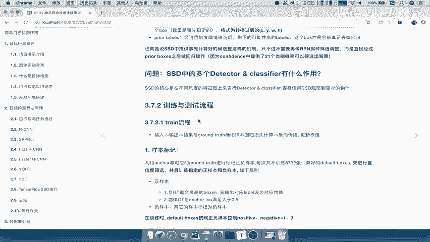

## 训练流程概述

上一节我们介绍了SSD的网络结构，本节中我们来看看其训练流程。训练的核心在于将模型预测的边界框与真实标注（Ground Truth）进行匹配和比较，从而计算损失并优化模型。

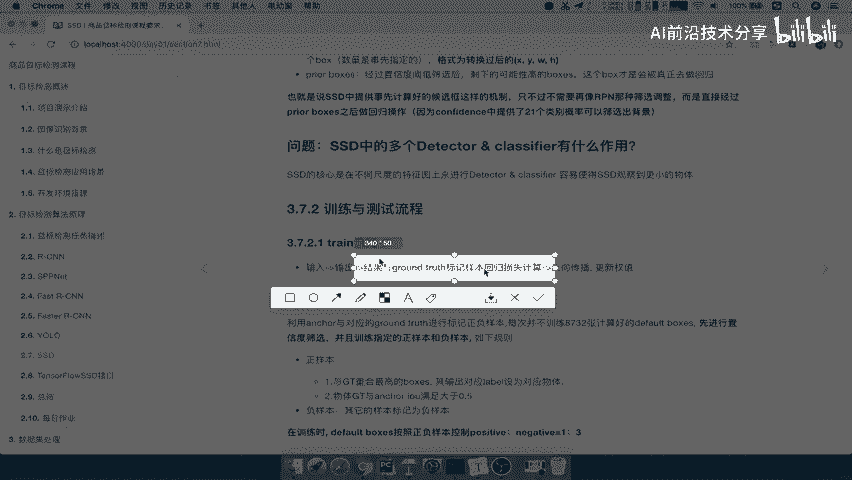

训练流程可以概括为：输入图像，经过网络得到预测框，然后将这些预测框与真实标注进行匹配和标记，最后计算损失并反向传播。

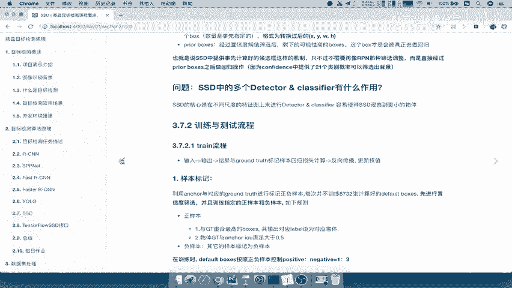

### 样本标记

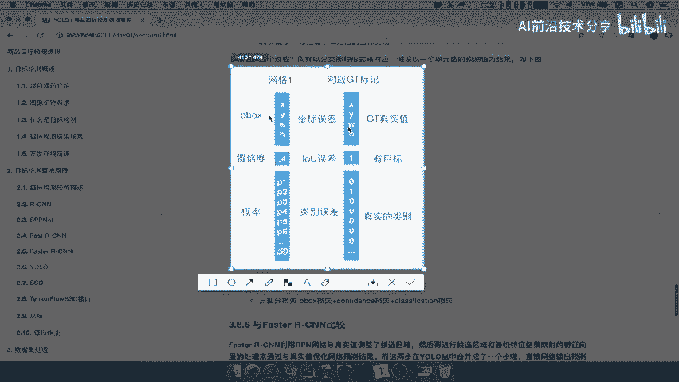

要进行训练，就需要为模型生成的大量候选框（例如8732个）分配标签。这个过程称为样本标记。

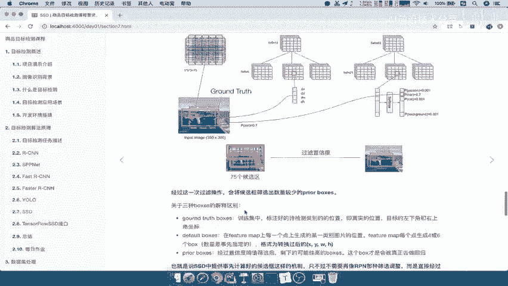

首先，模型会输出大量预测框。经过置信度筛选后，例如保留约3000个高质量的预测框。接下来，需要为这3000个预测框逐一进行标记，每个框都要对应一个真实标注（GT）的结果。

以下是样本标记的具体规则：

*   **正样本**：与任意真实标注框的重叠度（IoU）大于0.5的预测框被标记为正样本。
*   **负样本**：其余预测框被标记为负样本。
*   **样本平衡**：为了保证训练稳定性，通常会控制正负样本的比例，例如保持**1:3**的比例。这是一个经验值。

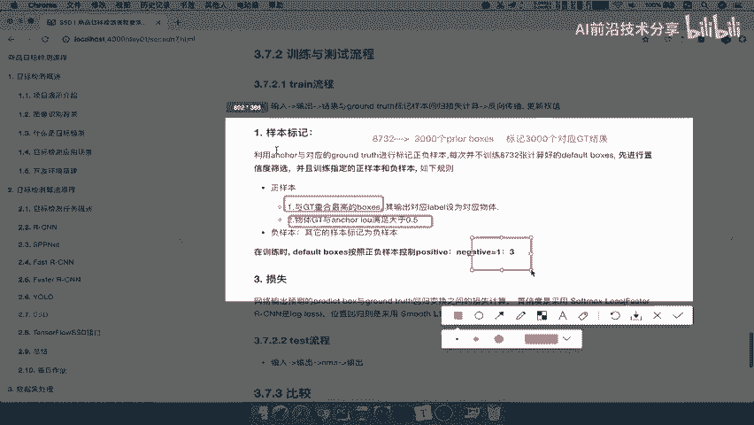

### 损失计算

在完成样本标记后，就可以计算损失函数来指导模型学习了。SSD的损失函数与YOLO类似，由两部分组成。

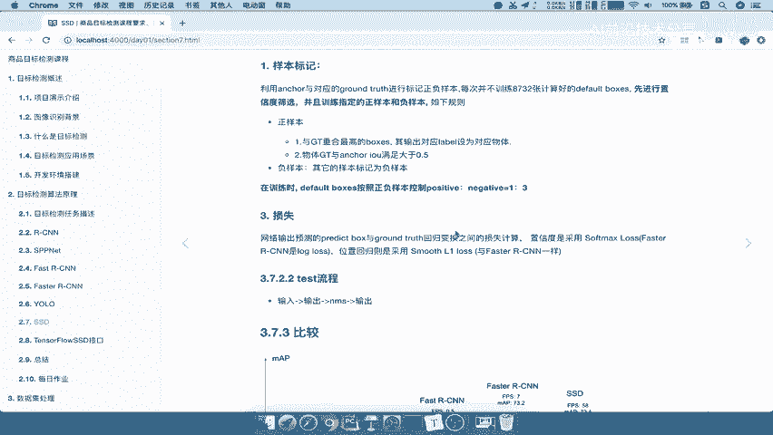

总损失 `L` 的公式可以表示为：
`L = (1/N) * (L_conf + α * L_loc)`
其中：
*   `N` 是匹配到的正样本数量。
*   `L_conf` 是分类置信度损失（Confidence Loss）。
*   `L_loc` 是定位回归损失（Localization Loss）。
*   `α` 是用于平衡两项损失的权重参数。

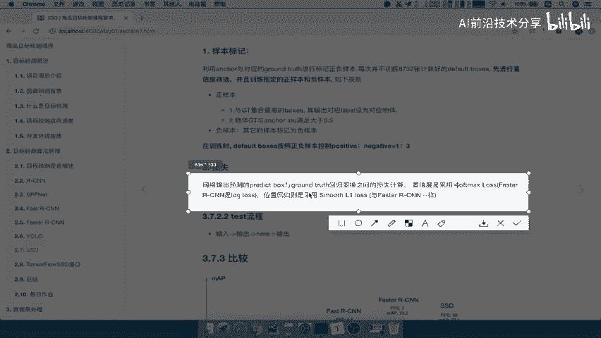

具体来说：
1.  **分类置信度损失 (`L_conf`)**：通常使用 **Softmax Loss**（或交叉熵损失）来计算预测类别与真实类别之间的差异。
    
2.  **定位回归损失 (`L_loc`)**：采用 **Smooth L1 Loss** 来计算预测框与真实标注框在中心点坐标(`cx, cy`)和宽高(`w, h`)上的回归误差。这与Faster R-CNN中使用的回归损失一致。

---

## 测试流程概述

了解了训练过程后，我们来看测试（推理）流程。测试流程相对简单直接，其目标是利用训练好的模型对新图像进行预测。

模型训练完成后，其参数是固定的。在测试时，输入一张图像，网络会直接输出大量的预测框及其类别置信度。

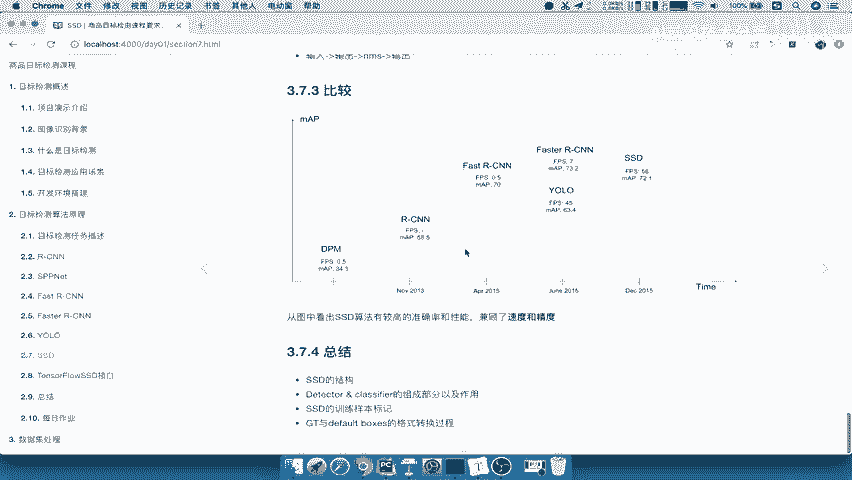

测试流程的关键步骤是**非极大值抑制（Non-Maximum Suppression, NMS）**。NMS会过滤掉那些与得分最高的框重叠度过高的冗余框，最终为每个物体保留一个最准确的预测框和其对应的类别。

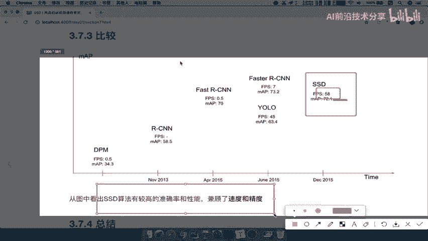

---

## SSD算法优势

最后，我们来总结一下SSD算法的特点。从性能对比图中可以看出，SSD在目标检测算法中处于一个非常有利的位置。

SSD的核心优势在于它**兼顾了速度与精度**。它像YOLO一样是单阶段检测器，速度很快；同时，它通过在多尺度特征图上进行预测，获得了较高的检测准确率。

---

## 📝 课程总结

本节课中我们一起学习了SSD模型的完整流程，以下是核心要点总结：

1.  **网络结构回顾**：SSD是一个端到端的网络，会在多个不同尺度的特征图上生成候选框，并同步预测每个框的**置信度（confidence）** 和**定位偏移量（localization）**。
2.  **训练核心**：训练的关键在于**样本标记**。需要将网络输出的成千上万个预测框与真实标注进行匹配，区分为正负样本，并保持一定的比例（如1:3）。
3.  **损失函数**：总损失由**分类损失**和**定位回归损失**两部分加权构成，分别使用Softmax Loss和Smooth L1 Loss。
4.  **测试流程**：训练好的模型可直接进行前向传播，并通过**非极大值抑制（NMS）** 后处理步骤输出最终的检测结果。
5.  **算法特点**：SSD成功地在**速度**和**精度**之间取得了优秀的平衡，这是其被广泛采用的重要原因。

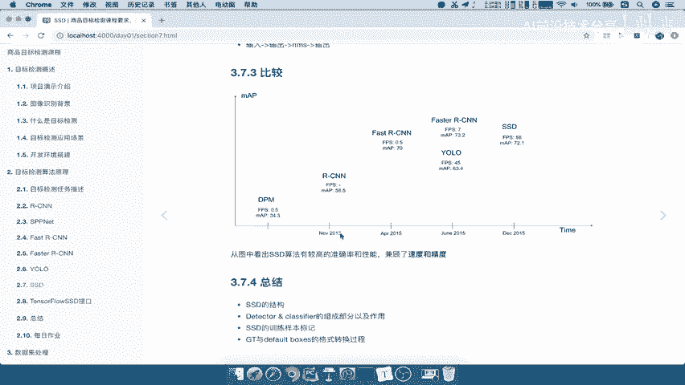

总而言之，SSD通过单一网络直接输出检测结果，其训练过程围绕着如何为海量默认框分配合适的标签展开，而测试过程则高效简洁。理解了这个流程，就掌握了SSD算法最核心的思想。