# 课程 P34：Tensorflow SSD 接口介绍 🧠

在本节课中，我们将学习 Tensorflow 框架中 SSD 目标检测算法的接口。我们将了解其核心配置参数、网络结构以及主要功能函数，以便能够快速上手使用。

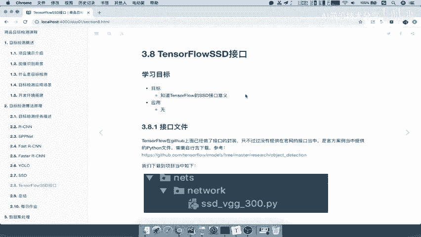

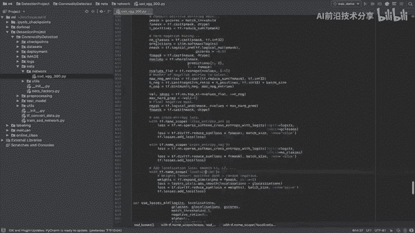

上一节我们介绍了从 R-CNN 到 YOLO、SSD 等目标检测算法的发展历程。本节中我们来看看 Tensorflow 为 SSD 算法提供的官方接口。

## 接口文件与网络配置

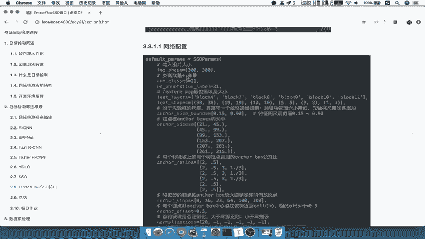

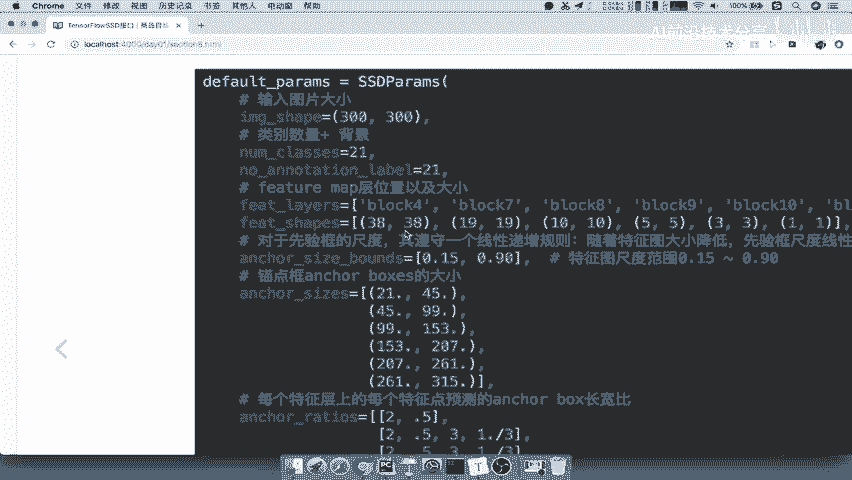

Tensorflow 的 SSD 接口源码通常包含在项目文件中。其核心在于网络配置，它定义了每一层网络的结构和参数。

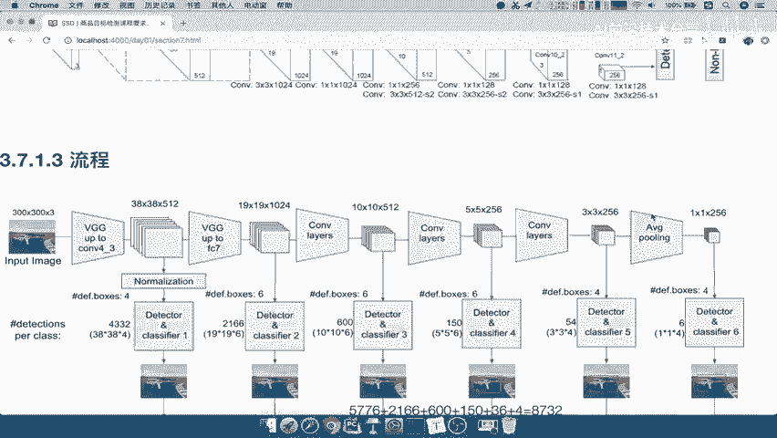

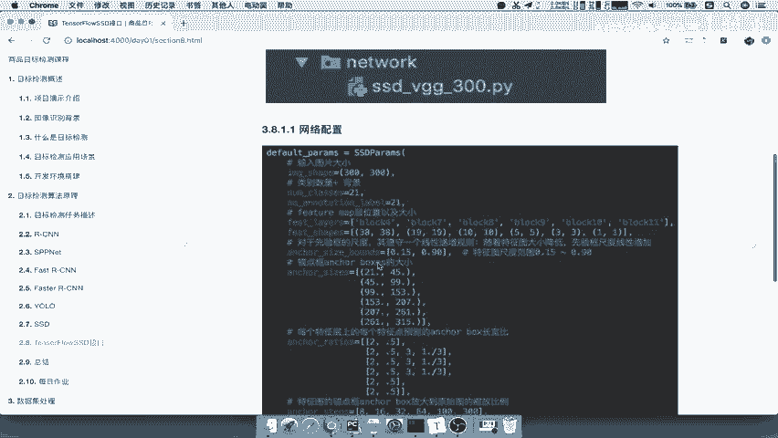

以下是网络配置中的关键参数及其含义：

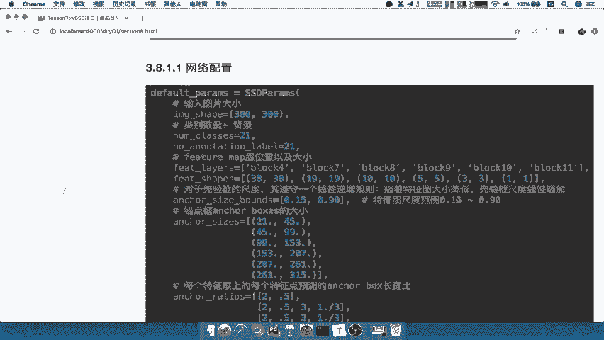

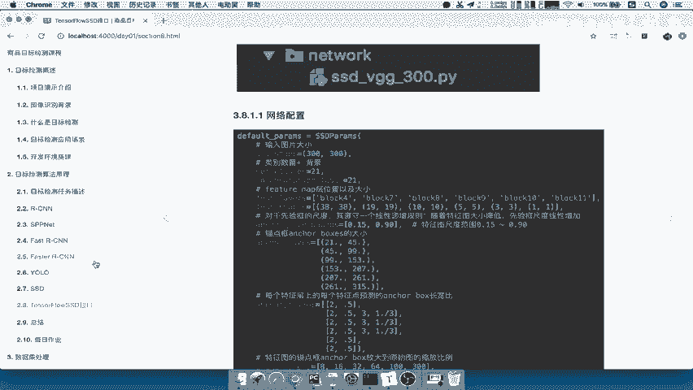

*   **`image_shape`**：输入图像的尺寸，例如 `300×300`。
*   **`num_classes`**：类别数量，通常为实际类别数加背景类。例如，对于 20 个类别的数据集，此值为 `21`。
*   **`feature_map_shapes`**：各层特征图的大小，例如 `[38, 19, 10, 5, 3, 1]`，对应 SSD 网络中的 38×38 到 1×1 的特征层。
*   **`scales`**：默认框（default boxes）的尺度范围，对应公式中的 `s_min` 和 `s_max`。例如，`[0.15, 0.91]` 定义了默认框最小和最大的相对尺寸。
*   **`aspect_ratios`**：每一层默认框的长宽比列表，例如 `[[2, 0.5], [2, 3, 0.5, 0.333], ...]`。

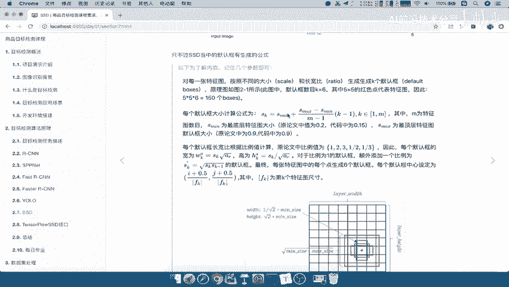

了解这些参数后，再看接口代码就会清晰很多。它们直接对应了 SSD 论文中描述的网络设计。

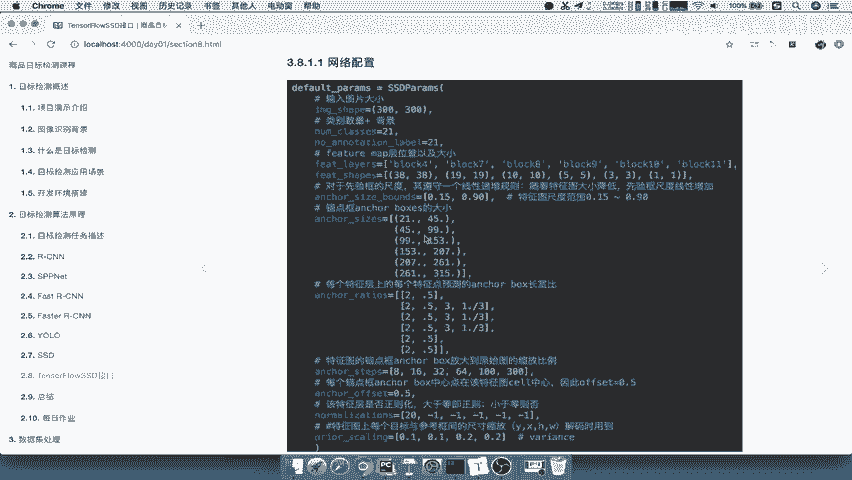

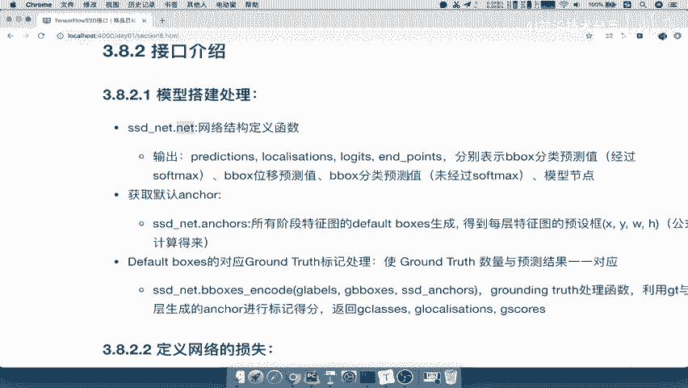

## 核心接口函数

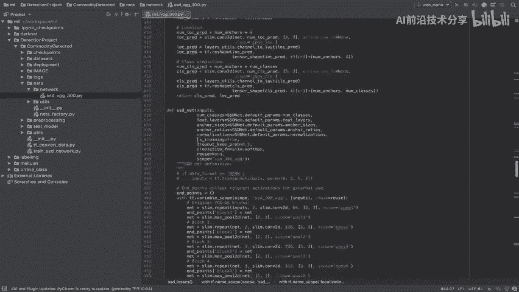

Tensorflow SSD 接口提供了几个关键函数，用于构建和训练网络。

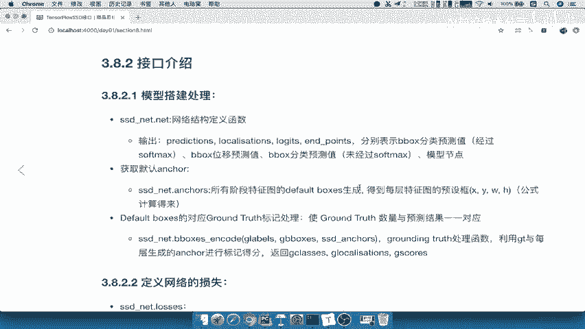

以下是主要的功能函数：

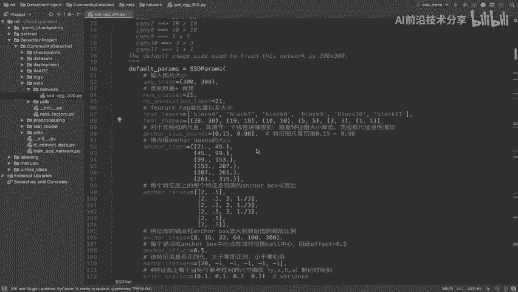

*   **`ssd_net`**：此函数定义了整个 SSD 网络结构。它返回构建好的网络模型，其中包含了每一层的具体配置，如卷积核数量（128， 256等）。
*   **`ssd_anchors`**：此函数用于生成所有特征层上的默认框（anchors/default boxes）。SSD 通常有 6 个特征层，每层会生成不同数量和尺寸的默认框。
*   **`ssd_losses`**：此函数定义了网络的损失函数。它计算预测结果（类别和位置偏移）与真实标注（ground truth）之间的损失。训练时，会从生成的众多默认框中筛选一部分与真实框进行匹配和计算。

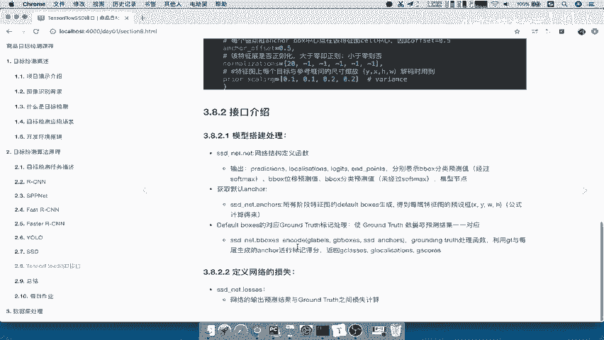

这些函数封装了 SSD 算法的核心步骤。在使用时，理解每个参数（如 `predictions`, `localizations`）所代表的含义至关重要。

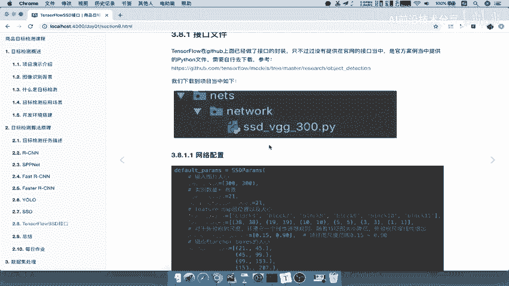

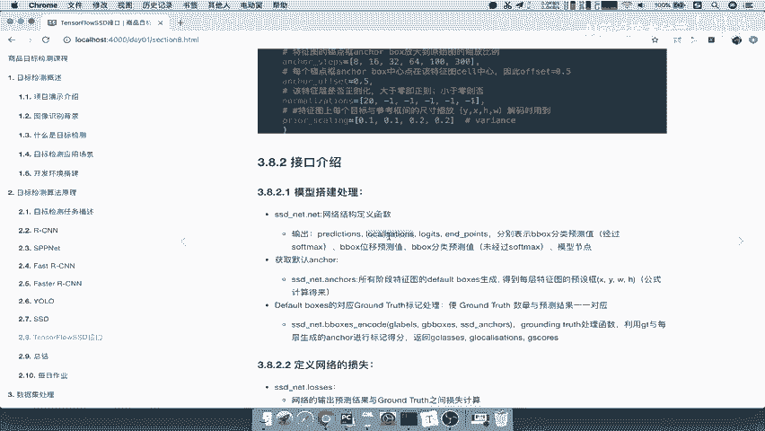

本节课中我们一起学习了 Tensorflow 中 SSD 目标检测接口的核心配置和主要函数。通过理解网络配置参数和几个关键接口，我们能够快速掌握如何使用该接口进行目标检测任务的开发。后续在实际应用时，我们将结合具体代码进行实践。