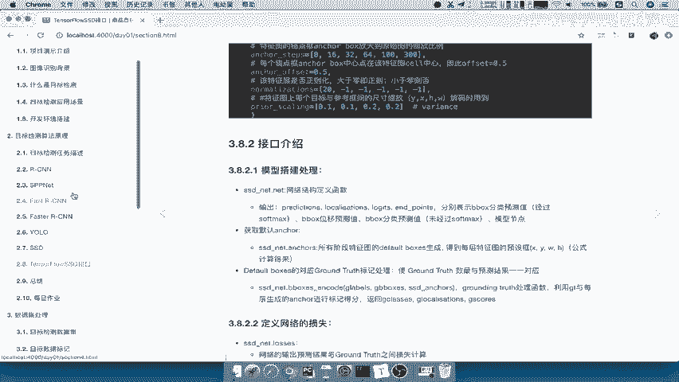
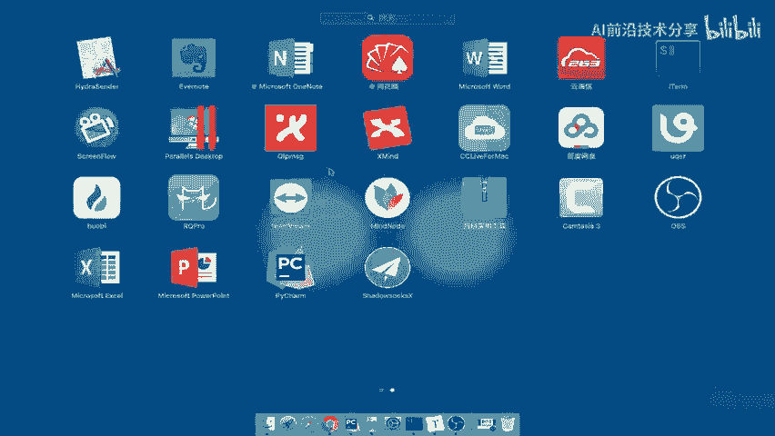
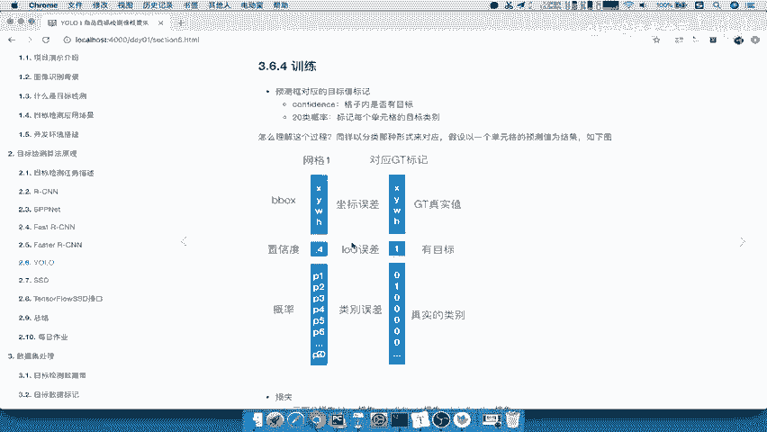
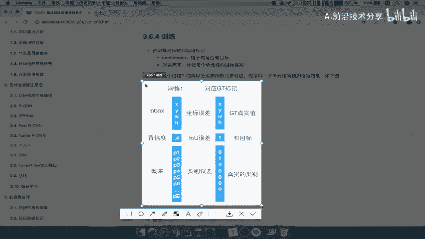
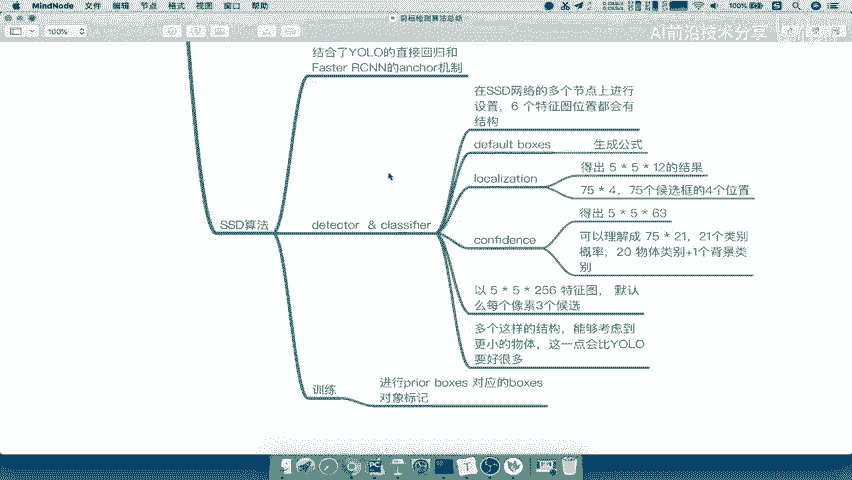

# 📚 课程 P35：第一阶段目标检测算法总结

在本节课中，我们将系统性地回顾第一阶段介绍过的几种经典目标检测算法。我们将梳理每个算法的核心思想、关键改进点以及它们之间的演进关系，帮助你构建清晰的知识脉络。

## 🎯 概述：目标检测问题的初始解决方案

目标检测的核心任务是识别图像中物体的类别并定位其位置。最初的解决思路是“分类加定位”。

*   **单目标场景**：直接使用一个全连接层（FC）回归输出物体的边界框坐标。
*   **多目标场景**：引入了 **滑动窗口** 的概念。通过设置 K 个不同尺寸的窗口，在每个位置进行滑动，总共产生 K × M 个待检测区域。OverFeat 模型是这一思路的代表。

## 🔍 R-CNN：两阶段检测的开端

上一节我们介绍了基础思路，本节中我们来看看首个成功应用深度网络的目标检测算法——R-CNN。它奠定了“候选区域+分类”的两阶段范式。

R-CNN 的测试流程包含以下几个核心步骤：

1.  **候选区域生成**：使用选择性搜索（Selective Search）算法从输入图像中提取约2000个候选区域。
2.  **图像变换**：将每个候选区域缩放到固定大小（如 227×227）。
3.  **特征提取**：使用预训练的卷积网络（如 AlexNet）对每个区域提取特征。最终得到 `2000 × 4096` 维的特征矩阵。
4.  **类别分类**：为每个类别训练一个独立的 SVM 分类器进行二分类，得到一个 `2000 × 20` 的得分矩阵。
5.  **非极大值抑制（NMS）**：对每个类别的预测框，应用 NMS 去除冗余的重叠框。
6.  **边界框回归**：使用线性回归模型对筛选后的候选框进行位置微调，使其更接近真实标注。

R-CNN 的训练过程是分阶段进行的：

*   **预训练**：在大型分类数据集（如 ImageNet）上训练一个卷积网络。
*   **微调**：在目标检测数据集上，用候选区域及其类别标签对上述卷积网络进行微调。
*   **SVM 训练**：用卷积网络提取的特征，为每个类别训练 SVM 分类器。
*   **边界框回归器训练**：训练用于修正位置的线性回归模型。

**R-CNN 的主要缺点**：训练分多个阶段，繁琐且速度慢；特征需要写入磁盘，占用大量存储空间；对每个候选区域独立进行卷积运算，计算存在大量重复；输入图像需要变形，可能影响精度。

## ⚡ SPP-Net：共享计算与空间金字塔池化

R-CNN 的重复计算问题严重。SPP-Net 的核心改进在于**共享卷积计算**。

其关键流程如下：

1.  将整张图像输入卷积网络，得到整张图的特征图。
2.  将 Selective Search 得到的候选区域**映射**到特征图上的对应区域。
    *   映射公式需要掌握：假设原图上坐标点为 `(x, y)`，经过若干次步长为 `S` 的卷积/池化后，在特征图上对应的坐标约为 `(x/S, y/S)`。
3.  每个形状各异的候选区域特征，通过 **SPP 层（空间金字塔池化层）** 转换为固定长度的特征向量。SPP 层将区域划分为不同尺度的网格（如 `4×4`, `2×2`, `1×1`），并对每个网格进行池化，最后将所有结果拼接起来。例如，三种尺度会得到 `16+4+1=21` 个池化结果。
4.  固定长度的特征向量送入全连接层进行分类和回归。

**SPP-Net 的贡献**：通过一次卷积计算整图特征，大幅提速；SPP 层允许输入任意大小的区域，输出固定维度的特征，避免了图像变形。

## 🚀 Fast R-CNN：迈向端到端训练

SPP-Net 仍需多阶段训练。Fast R-CNN 旨在实现更统一的训练。

其主要改进点如下：

*   **ROI Pooling**：简化版的 SPP 层。它将每个候选区域特征图划分为固定的 `K×M` 个网格（如 `7×7`），然后在每个网格内进行最大池化，输出固定大小的特征。**关键优势是 ROI Pooling 可进行反向传播**，使得网络能够端到端训练。
*   **多任务损失**：用 Softmax 分类器替代多个 SVM 分类器，输出 `N+1` 个类别（N个物体类 + 1个背景类）。分类损失和边界框回归损失被合并为一个统一的损失函数，同时进行优化。

**Fast R-CNN 的缺点**：其候选区域生成仍依赖于外部算法（如 Selective Search），未能实现完全端到端，检测速度的瓶颈在于候选区域提取。

## 🤖 Faster R-CNN：真正的端到端检测器

为了解决候选区域提取的瓶颈，Faster R-CNN 引入了 **RPN（区域提议网络）**，将候选区域生成也融入网络，实现真正意义上的端到端。

其工作流程如下：

1.  **共享特征提取**：输入图像经过基础卷积网络，得到共享特征图。
2.  **RPN 生成候选框**：
    *   在共享特征图上滑动一个小网络（如 `3×3` 卷积）。
    *   在每个滑动窗口中心，预设 `K` 个不同尺度和长宽比的 **锚点（Anchor）**。例如，对于 `M×N` 的特征图，会产生约 `M×N×K` 个锚点。
    *   RPN 输出两部分：① 每个锚点是前景（物体）或背景的概率；② 对每个锚点坐标的修正量。
    *   经过筛选和微调后，输出高质量的候选区域（Proposals）。
3.  **Fast R-CNN 检测**：将 RPN 产生的候选区域通过 ROI Pooling 映射到共享特征图上，后续流程与 Fast R-CNN 相同（分类 + 精修）。

**Faster R-CNN 的意义**：精度高，是两阶段检测器的标杆。但速度仍难以满足实时性要求。

## ⚡ YOLO v1：单阶段检测的先锋

为了追求极致的速度，YOLO（You Only Look Once）提出了全新的单阶段思路。

**核心思想**：将目标检测视为单一的回归问题。将输入图像划分为 `S×S`（如 `7×7`）的网格。每个网格负责预测：
*   `B` 个边界框（每个框包含中心坐标、宽高和1个置信度）。
*   1 个条件类别概率（即该网格属于各个类别的概率）。

网络最终输出一个 `S × S × (B*5 + C)` 的张量。以 YOLO v1 为例：`7 × 7 × (2*5 + 20) = 7 × 7 × 30`。

**YOLO 的优点**：速度极快，可实现实时检测。
**YOLO 的缺点**：早期版本（v1）对密集小物体检测效果较差，定位精度相对较低。

## 🧱 SSD：单阶段检测的精度提升者

SSD（Single Shot MultiBox Detector）结合了 YOLO 的回归思想和 Faster R-CNN 的锚点机制，在速度和精度间取得了更好平衡。

SSD 的核心结构是在多个不同尺度的特征图上进行预测：

1.  **多尺度特征图预测**：SSD 利用主干网络（如 VGG）中不同深度的多个特征图进行预测。深层特征图感受野大，适合检测大物体；浅层特征图分辨率高，适合检测小物体。
2.  **默认框（Default Box）**：在每个特征图的每个单元格上，设置一系列具有不同尺度和长宽比的默认框（类似于锚点）。
3.  **预测模块**：对于每个默认框，网络同时预测：
    *   **定位偏移**：`4` 个值，用于调整默认框的位置。
    *   **类别置信度**：`C+1` 个值（C个物体类 + 背景）。
4.  **训练时的匹配策略**：将真实标注框与这些默认框进行匹配，匹配成功的默认框作为正样本，负责预测该物体的类别和位置。

**SSD 的优势**：通过多尺度预测，显著提升了对不同大小物体，尤其是小物体的检测能力，在保持高速的同时获得了更高的精度。

## 📝 总结

本节课中我们一起学习了目标检测算法从 R-CNN 到 SSD 的演进历程：

*   **R-CNN** 开创了基于深度学习的“候选区域+CNN特征”两阶段范式，但存在计算冗余、训练复杂等问题。
*   **SPP-Net** 通过共享卷积计算和空间金字塔池化，大幅提升了特征提取效率。
*   **Fast R-CNN** 引入 ROI Pooling 和多任务损失，实现了端到端训练，但候选区域提取仍是外部模块。
*   **Faster R-CNN** 创新性地提出 RPN 网络，将候选区域生成纳入网络，完成了两阶段检测器的最终形态。
*   **YOLO** 另辟蹊径，将检测视为单次回归问题，实现了惊人的实时速度，但早期版本精度有损失。
*   **SSD** 融合了单阶段的效率和锚点机制的多尺度优势，在多个特征图上进行预测，有效平衡了速度与精度。

理解这些算法的核心思想与演进关系，是掌握现代目标检测技术的重要基础。