# 课程P36：目标检测数据集介绍 🎯

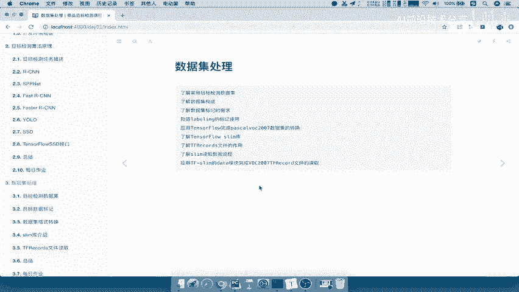

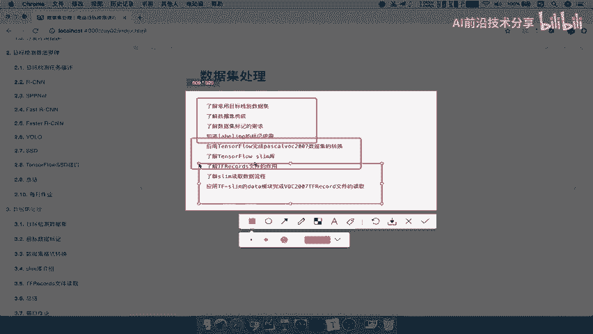

在本节课中，我们将学习目标检测领域常用的公开数据集，重点了解PASCAL VOC数据集的结构和格式。掌握数据集的组织方式是进行模型训练和评估的基础。

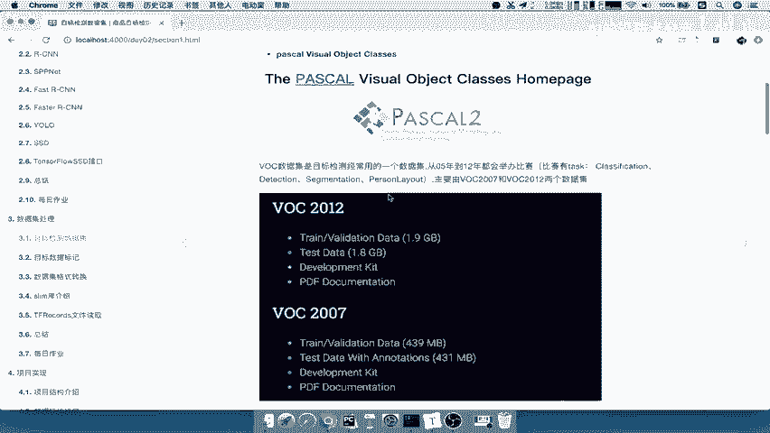

上一节我们介绍了目标检测算法的基本原理，本节中我们来看看如何准备和组织训练数据。

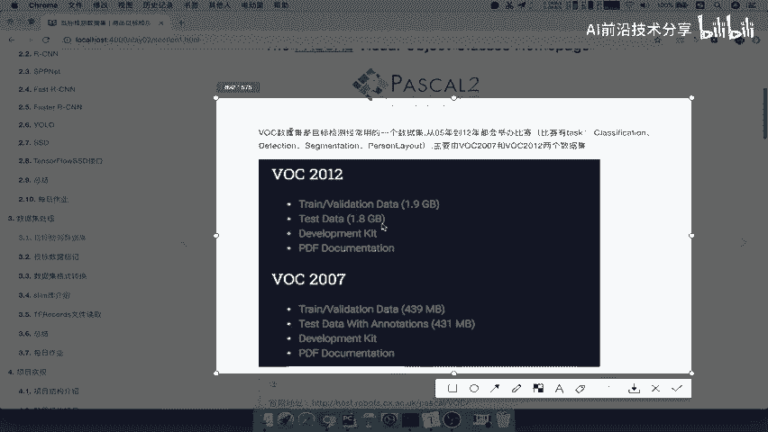

## 常用数据集概览

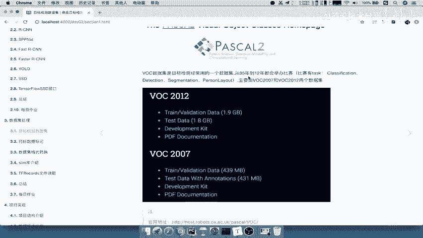

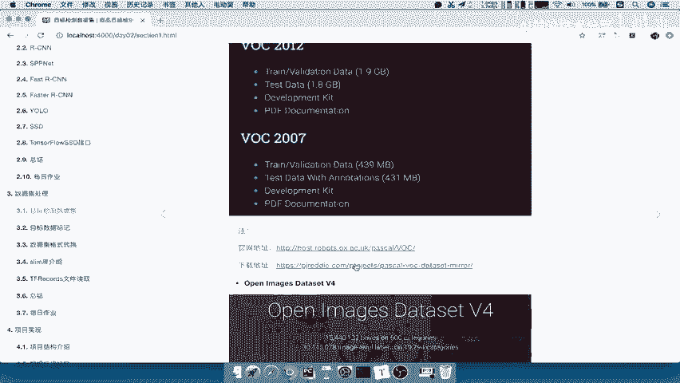

以下是两个在目标检测领域广泛使用的公开数据集：

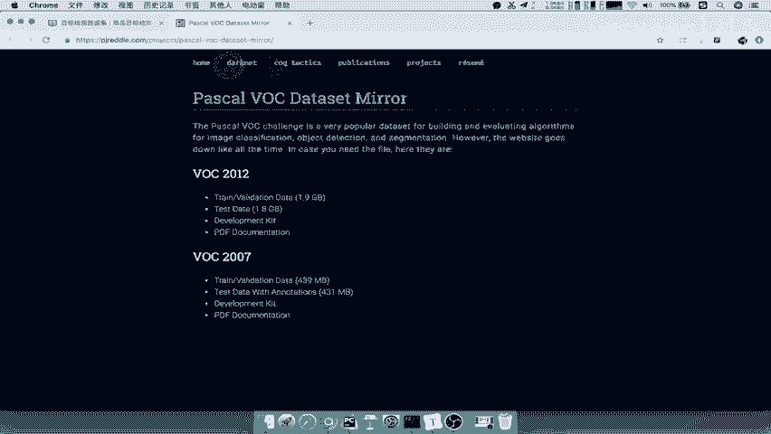

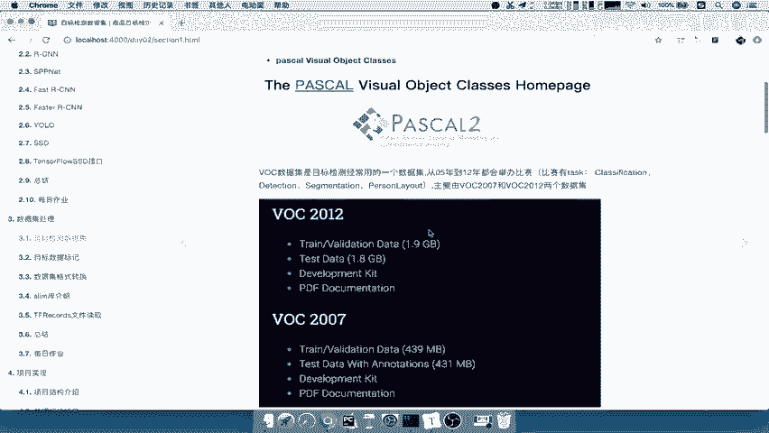

*   **PASCAL VOC数据集**：这是一个历史悠久且极具代表性的数据集，包含VOC2007和VOC2012等版本。许多经典模型和比赛都基于此数据集进行训练和评估。其官网地址为 [http://host.robots.ox.ac.uk/pascal/VOC/](http://host.robots.ox.ac.uk/pascal/VOC/)。为了方便，也可以从其他镜像地址下载。
*   **Open Images Dataset V4**：这是一个较新（2018年发布）且规模巨大的数据集，包含约190万张图片和600个物体类别。它由专业标注人员标注，是目前最大的带标注目标检测数据集之一。

在课程演示和后续实践中，我们将主要使用**PASCAL VOC 2007**数据集，因为其结构清晰，且有丰富的工具和预训练模型支持。

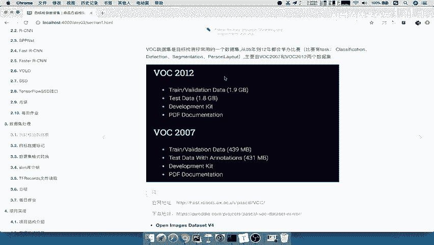

## PASCAL VOC 2007数据集详解

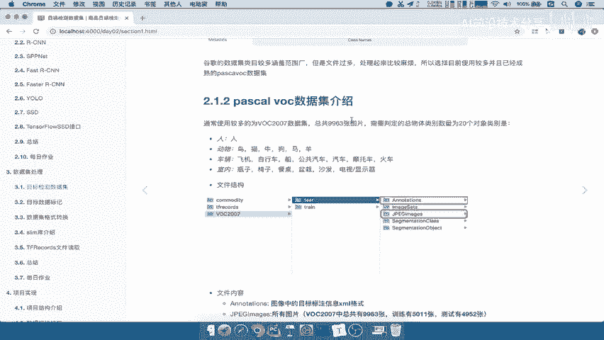

PASCAL VOC 2007数据集总共包含9963张图片，标注了20个常见的物体类别，例如：人、鸟、猫、狗、汽车、飞机、自行车、瓶子、椅子、餐桌等。

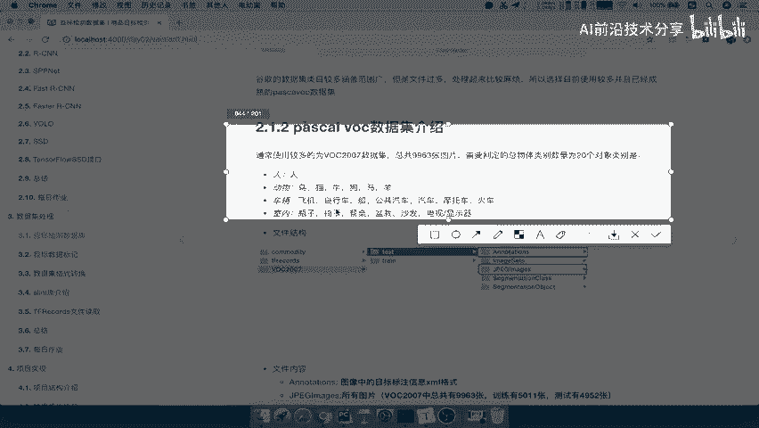

下载并解压数据集后，你会看到以下目录结构。对于目标检测任务，我们主要关注两个文件夹：

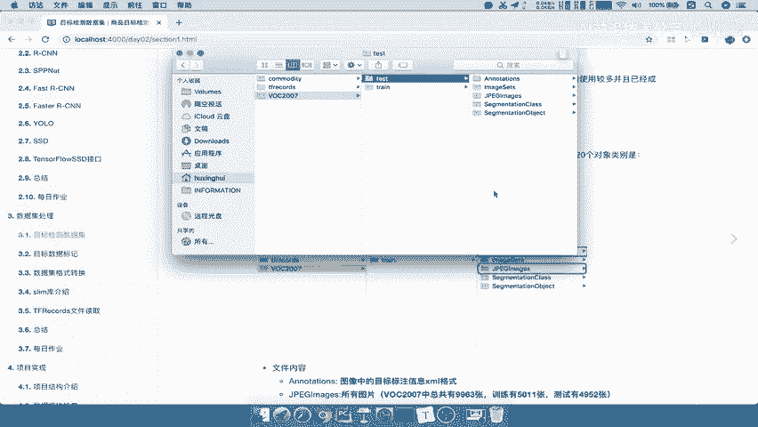

*   `JPEGImages/`：存放所有的原始图片文件（.jpg格式），共9963张。
*   `Annotations/`：存放与每张图片对应的XML格式的标注文件。

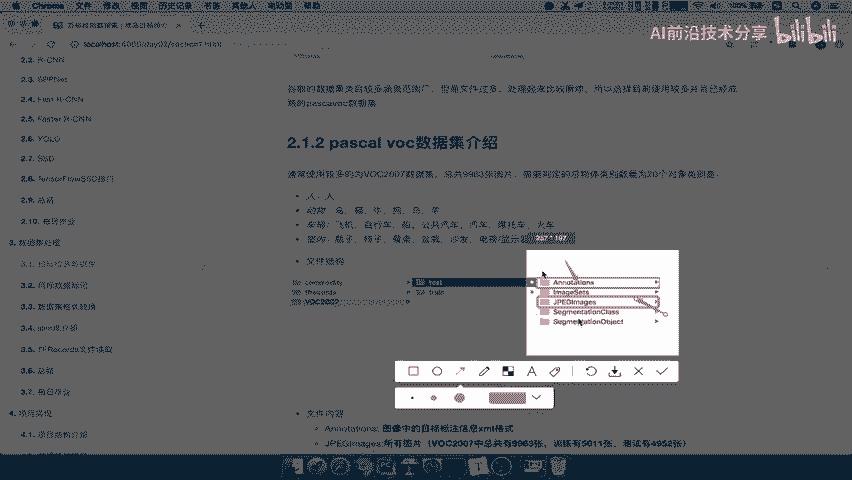

每个图片文件（例如 `000001.jpg`）都对应一个同名的XML标注文件（`000001.xml`）。XML文件记录了该图片中所有被标注物体的详细信息。

## 标注文件（XML）结构解析

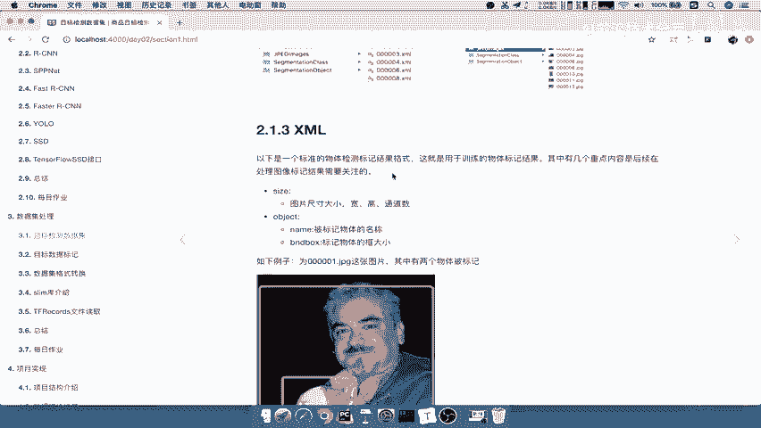

XML文件是数据集的核心，它以一种结构化的方式记录了图片的元数据和物体的标注框。

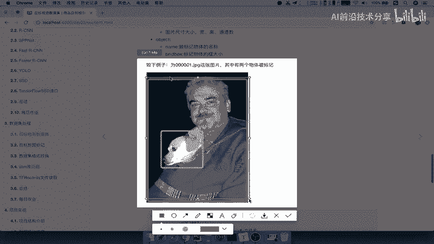

以下是XML文件中需要关注的关键部分：

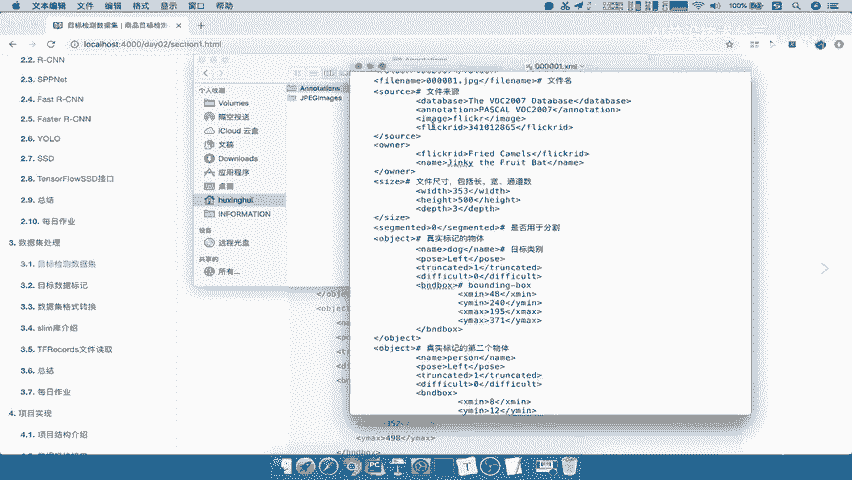

*   `size`：记录了图片的基本信息。
    *   `width`：图片宽度。
    *   `height`：图片高度。
    *   `depth`：图片通道数（通常是3，代表RGB）。
*   `object`：每个被标记的物体都会有一个`object`节点。如果一张图中有多个物体，就会有多个`object`节点。
    *   `name`：物体的类别名称（例如：“person”， “dog”）。
    *   `bndbox`：物体边界框（Bounding Box）的坐标，即我们常说的真实标注（Ground Truth）。它包含四个值：
        *   `xmin`：边界框左上角的x坐标。
        *   `ymin`：边界框左上角的y坐标。
        *   `xmax`：边界框右下角的x坐标。
        *   `ymax`：边界框右下角的y坐标。

例如，对于一张包含一个人和一只狗的图片，其XML文件中会有两个`object`节点，分别记录“person”和“dog”的类别及其对应的`bndbox`坐标。这个坐标值 `(xmin, ymin, xmax, ymax)` 是相对于该图片尺寸的。

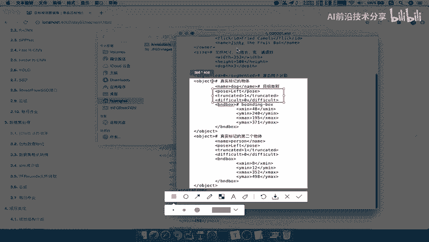

**核心概念示例：**
一个物体的边界框信息在XML中通常如下表示：
```xml
<object>
    <name>dog</name>
    <bndbox>
        <xmin>48</xmin>
        <ymin>240</ymin>
        <xmax>195</xmax>
        <ymax>370</ymax>
    </bndbox>
</object>
```
这表示一个类别为“dog”的物体，其边界框左上角坐标为(48, 240)，右下角坐标为(195, 370)。

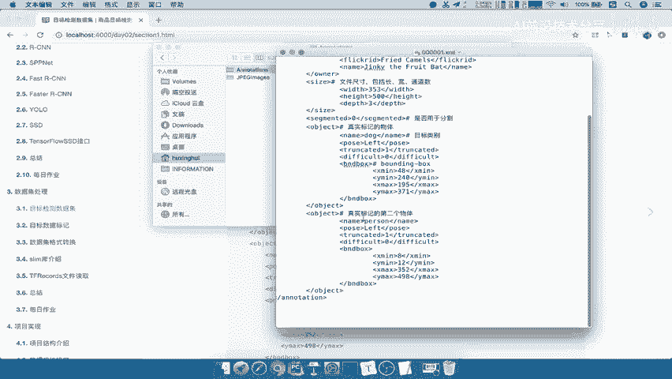

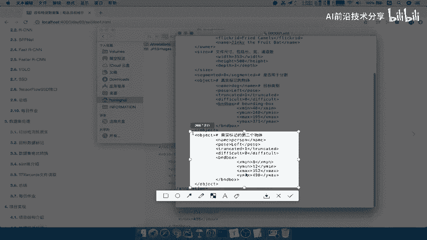

---

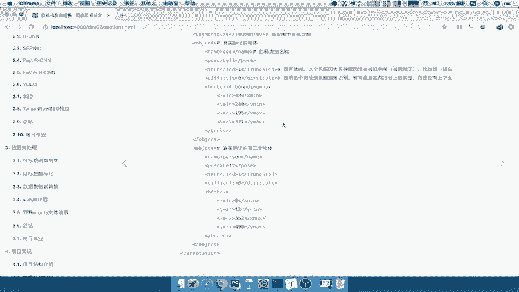

本节课中我们一起学习了目标检测的常用数据集，并深入剖析了PASCAL VOC数据集的目录结构和核心的XML标注格式。理解数据如何组织与标注，是动手构建和训练目标检测模型的第一步。在接下来的课程中，我们将学习如何读取和处理这些数据。