# 课程P37：商品数据集标记 🏷️

在本节课中，我们将学习如何为商品检测项目准备和标记自定义数据集。我们将了解数据标记的必要性，学习使用一个名为 `labelImg` 的图形化标注工具，并亲自动手完成一个商品数据集的标记过程。

## 为什么需要标记数据集？

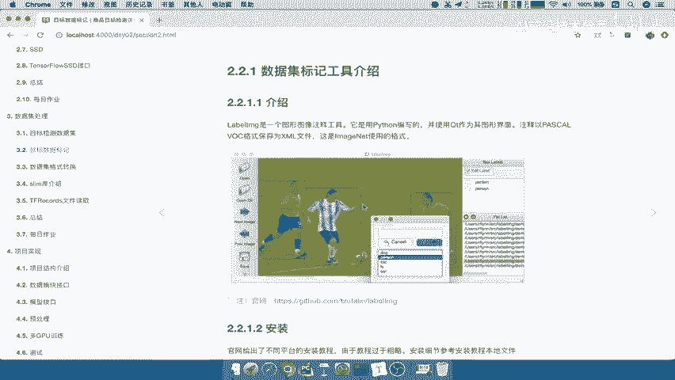

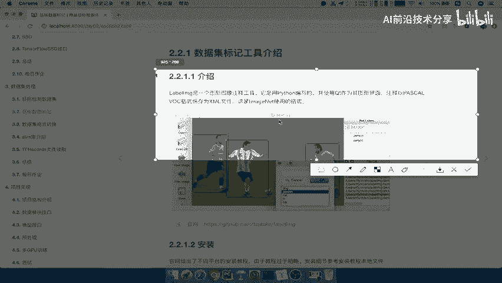

上一节我们介绍了目标检测的基本概念，本节中我们来看看数据准备的第一步：标记。

标记数据集是训练目标检测模型的关键前提，主要原因有以下两点：

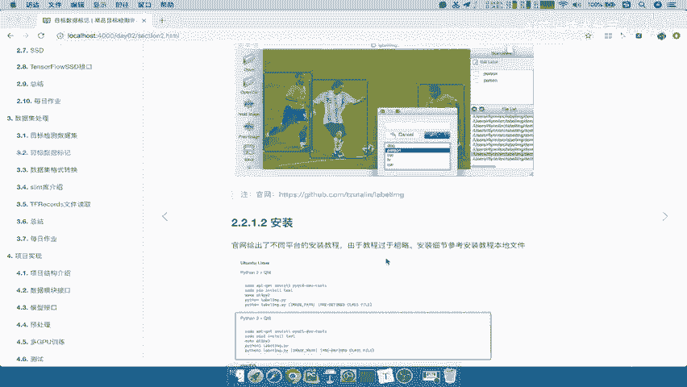

1.  **模型训练的需要**：训练模型需要输入图片以及图片中物体的准确位置和类别信息。这些被标记的物体将作为模型的“目标值”（Ground Truth），用于计算预测边界框（B Box）的损失，例如通过交并比（IOU）来评估预测的准确性。公式可以表示为：`损失 = f(预测框, 真实标记框)`。
2.  **特定场景的数据缺乏**：虽然存在像PASCAL VOC、ImageNet这样的公开数据集，但它们通常涵盖通用场景。在实际商业应用中，例如识别特定商品、公司内部物品或特定品牌时，往往缺乏现成的、已标记的数据集。因此，为特定任务准备自定义数据集是必要的。

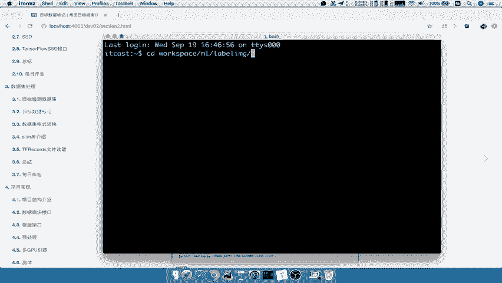

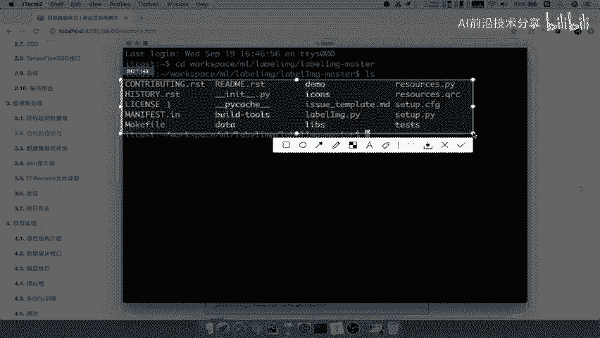

## 标记工具：labelImg介绍

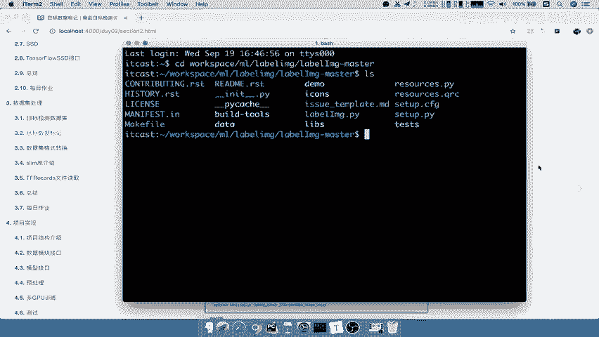

明确了标记的必要性后，我们需要一个高效的工具来完成这项工作。本节将介绍一个常用的开源标注工具——`labelImg`。

`labelImg` 是一个用Python编写、基于Qt图形界面的图像注释工具。它主要将标注结果保存为XML格式，这种格式与PASCAL VOC数据集以及ImageNet比赛使用的格式兼容，但与谷歌的一些数据集格式不同。

以下是关于 `labelImg` 的关键信息：
*   **官方源码**：可以在其GitHub页面找到并安装。
*   **安装说明**：官方提供了Windows、Linux (Ubuntu) 和 Mac OS的安装指南。但由于安装过程中可能遇到依赖问题，建议参考课程资料中提供的更详细的安装PDF文档，里面包含了常见问题的解决方案。

成功安装后，你可以在安装目录下找到 `labelImg.py` 文件，通过运行它来启动标注工具。

## 动手标记商品数据集

了解了工具后，现在我们来实际动手，为我们的商品检测项目创建数据集。这个过程虽然演示性质，但完整还原了数据标记的核心流程。

### 第一步：明确标记需求

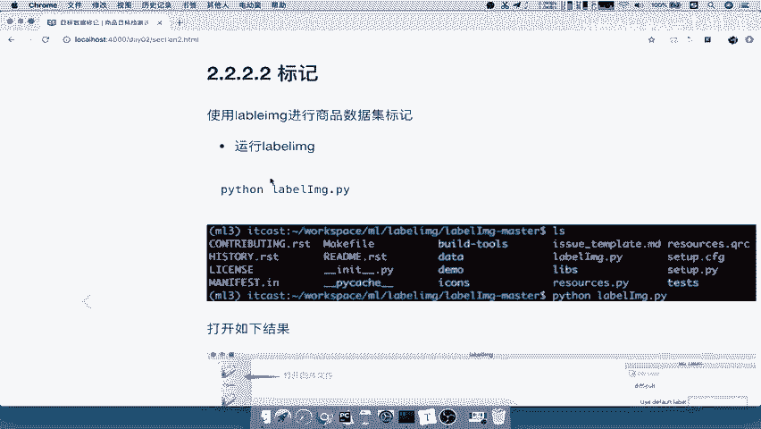

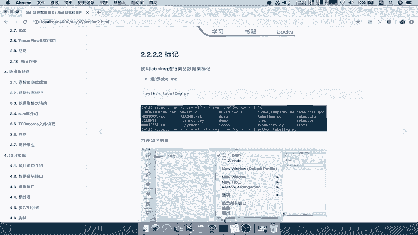

在开始标记前，必须首先明确我们要检测哪些物体（类别）。我们的演示项目将聚焦于以下8个常见商品类别，以便于理解和操作：
*   **服饰类**：衣服 (clothes)、裤子 (pants)、鞋子 (shoes)
*   **科技产品类**：手机 (phone)、手表 (watch)、音箱 (speaker)、电脑 (computer)
*   **学习类**：书籍 (books)

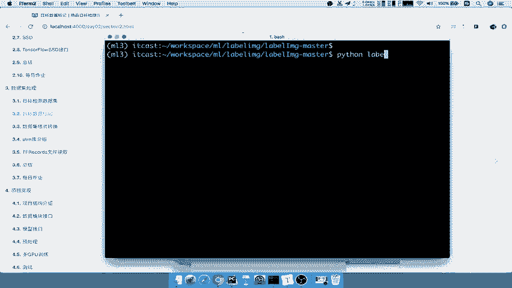

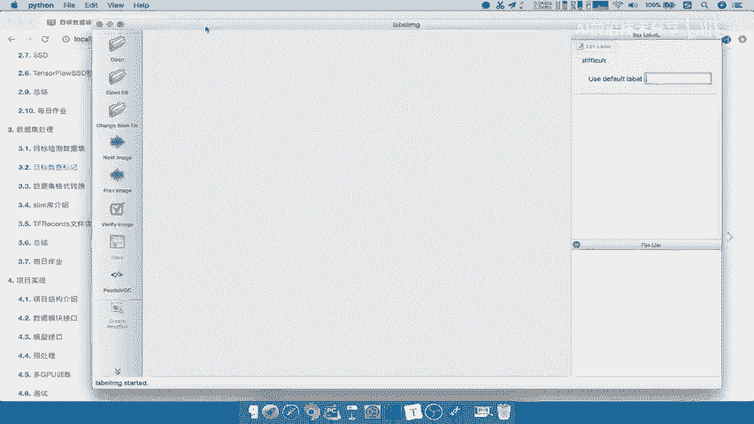

**注意**：在实际项目中，类别定义可以更具体（例如，区分不同品牌的衣服）。本教程为简化流程，使用了较宽泛的类别。

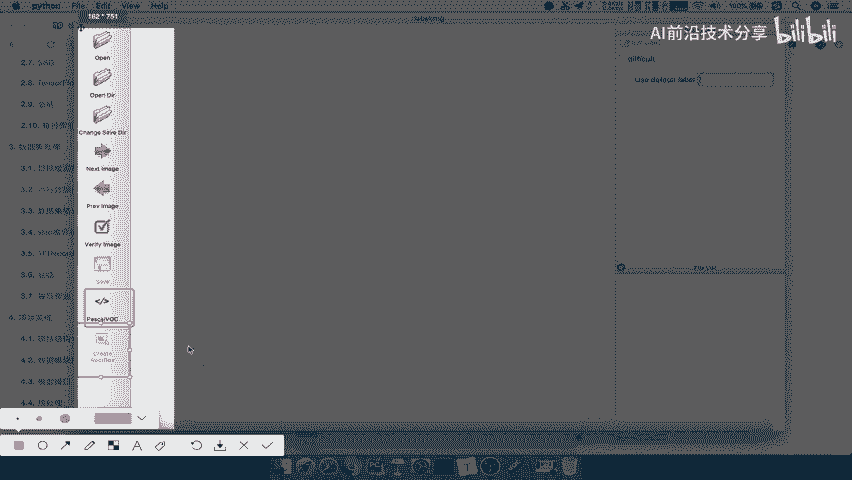

### 第二步：收集与准备图片

根据上述需求，我们已经预先收集好了包含这些商品的图片。在实际工作中，这一步通常涉及从网络爬取或手动下载相关图片。

### 第三步：使用labelImg进行标记

以下是使用 `labelImg` 工具进行标注的步骤：

1.  **运行软件**：在安装 `labelImg` 的虚拟环境中，使用命令 `python labelImg.py` 启动工具。
2.  **界面概览**：工具界面主要包括以下功能按钮：
    *   **Open / Open Dir**: 打开单张图片或整个图片目录。
    *   **Next Image / Prev Image**: 在目录中切换图片。
    *   **Save**: 保存当前图片的标注结果，默认生成PASCAL VOC格式的 `.xml` 文件。
    *   **Change Save Dir**: 更改标注文件的保存目录。
    *   **Create RectBox**: 开始绘制边界框（快捷键 `W`）。
3.  **开始标注**：
    *   打开一张商品图片。
    *   点击 **Create RectBox** 或按 `W` 键。
    *   在目标物体周围拖动鼠标绘制边界框。
    *   在弹出的对话框中，输入该物体的准确类别名称（必须与第一步定义的名称完全一致，例如 `phone`）。
    *   重复此过程，标记图片中所有需要识别的物体。
    *   完成一张图片的标注后，按 `Ctrl + S` 保存。生成的 `.xml` 文件包含了物体类别、边界框坐标 (`xmin, ymin, xmax, ymax`) 和图片尺寸等信息。

**标注示例代码（模拟逻辑）**:
```python
# 伪代码，展示标注文件（XML）中的核心结构
<annotation>
    <filename>example.jpg</filename>
    <size>
        <width>800</width>
        <height>600</height>
    </size>
    <object>
        <name>phone</name> # 类别名称
        <bndbox>
            <xmin>100</xmin> # 边界框左上角x坐标
            <ymin>150</ymin> # 边界框左上角y坐标
            <xmax>300</xmax> # 边界框右下角x坐标
            <ymax>400</ymax> # 边界框右下角y坐标
        </bndbox>
    </object>
    <!-- 更多 object 标签... -->
</annotation>
```

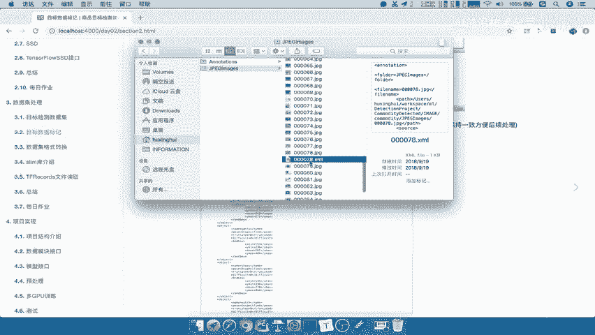

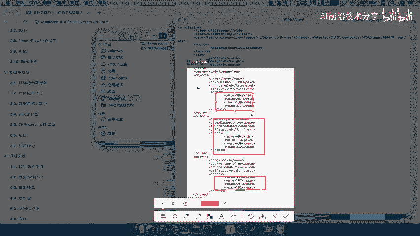

## 总结与思考

本节课中我们一起学习了目标检测中数据准备的核心环节——数据集标记。

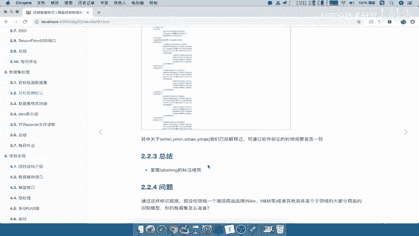

我们首先理解了**为什么需要自定义数据集标记**，然后认识并安装了实用的图形化标注工具 **`labelImg`**，最后通过一个商品检测的示例，完整实践了从**明确需求**、**准备图片**到**使用工具进行标注**的全过程。

记住，数据标记是一项耗时但至关重要的工作。在实际工业场景中，通常由专业团队或通过数据服务平台完成。

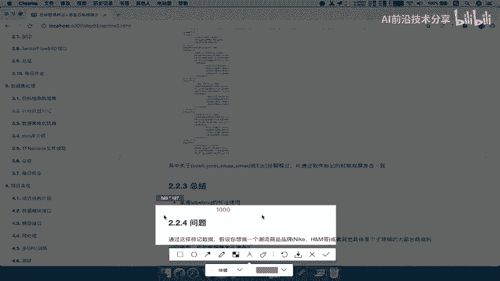

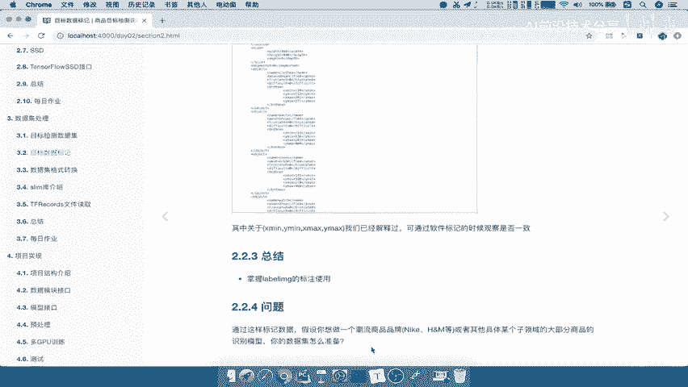

**课后思考**：如果你想开发一个“潮流品牌识别”系统，识别特定品牌的衣服或鞋款，你会如何规划数据标记工作？思路是：1) 确定要识别的具体品牌列表（需求）；2) 收集包含这些品牌的商品图片；3) 使用 `labelImg` 等工具为图片中的品牌标识或商品打上标签。通过更换和扩充这样的数据集，你就可以训练出识别新类别的模型。